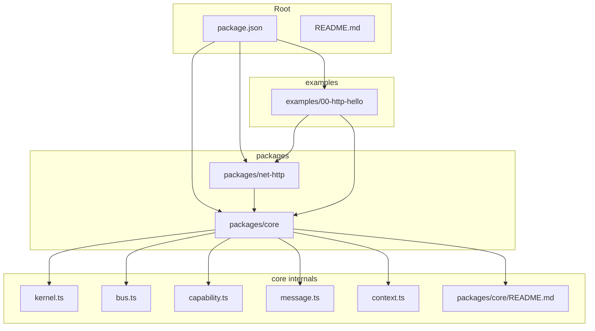
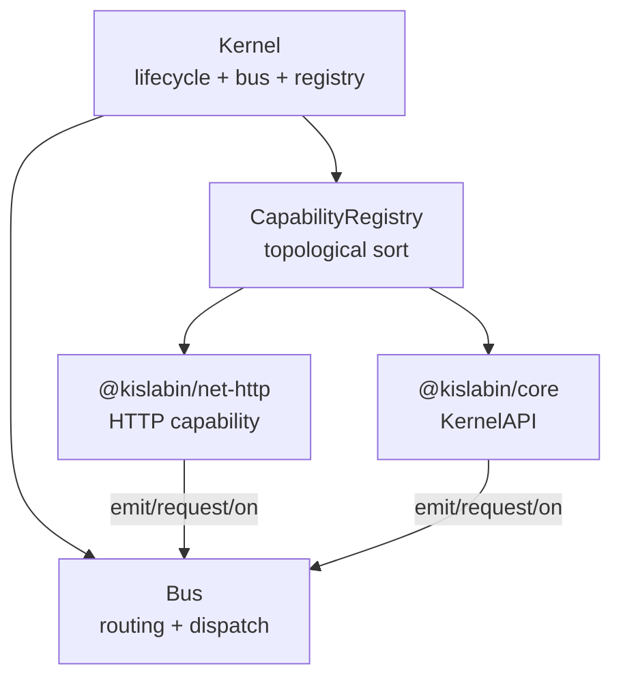
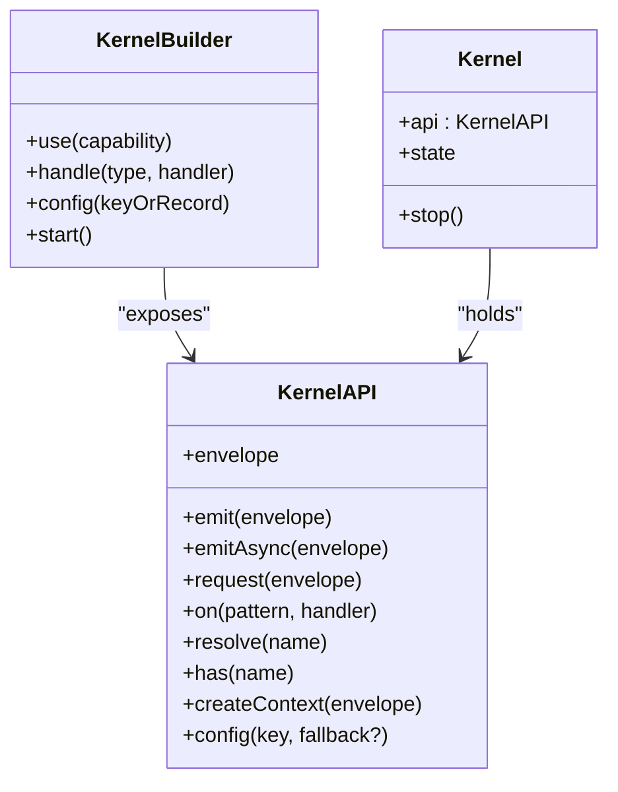
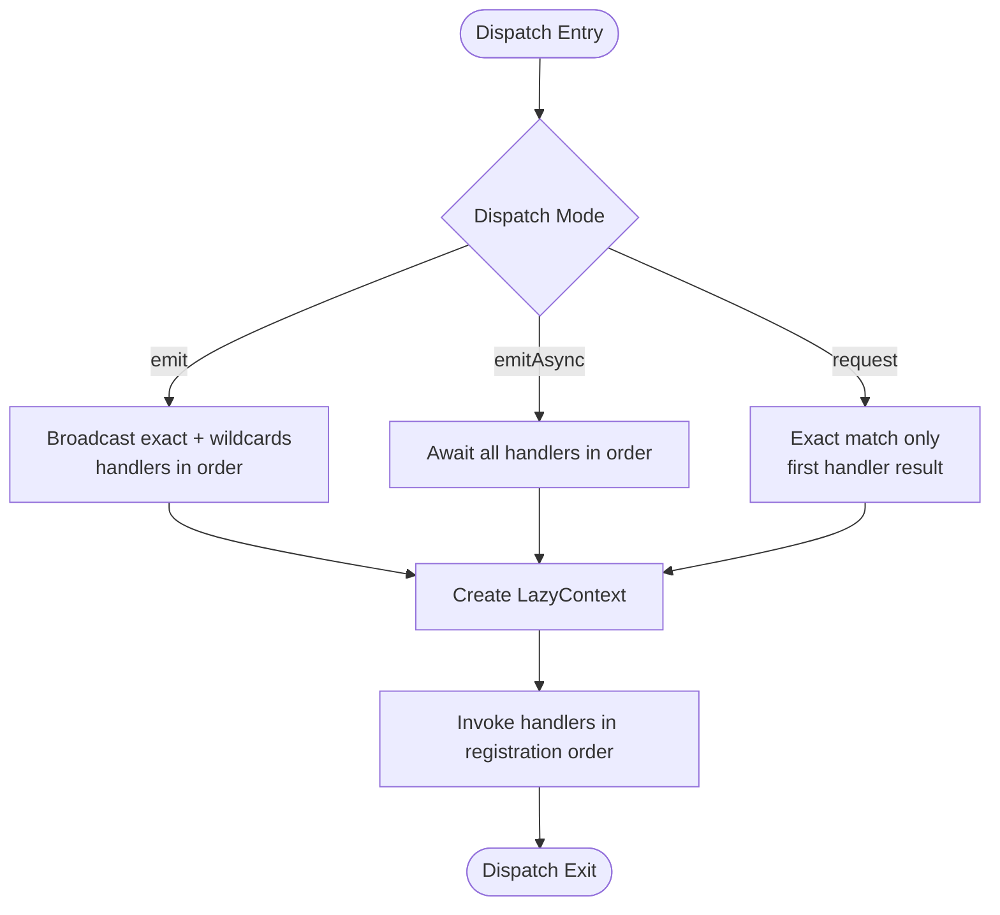
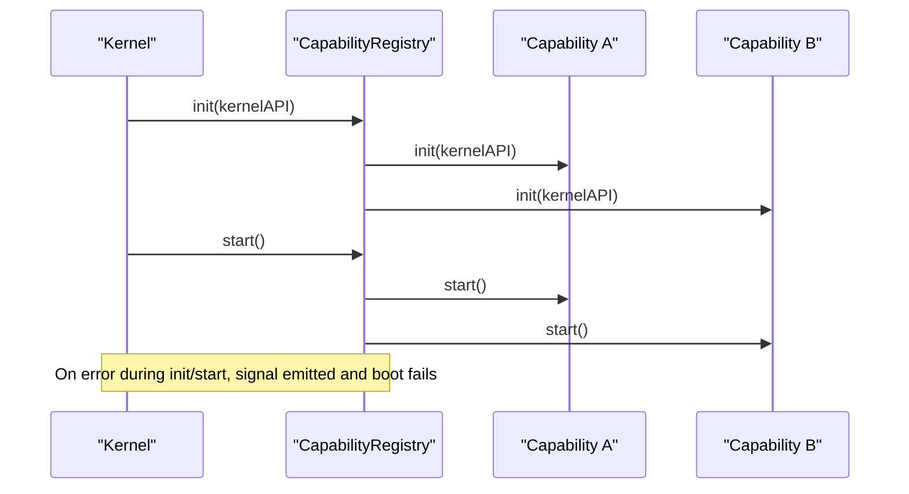
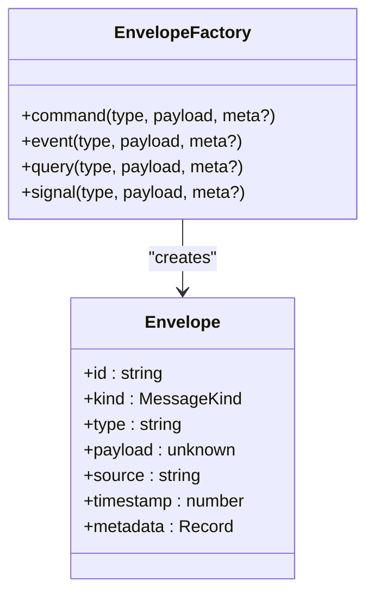
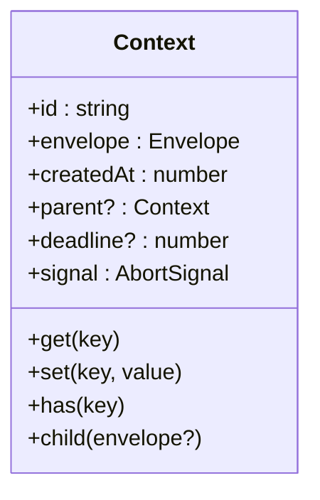
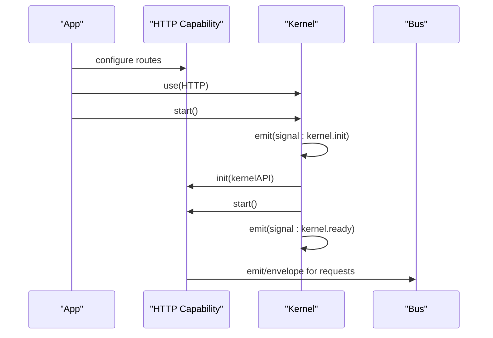
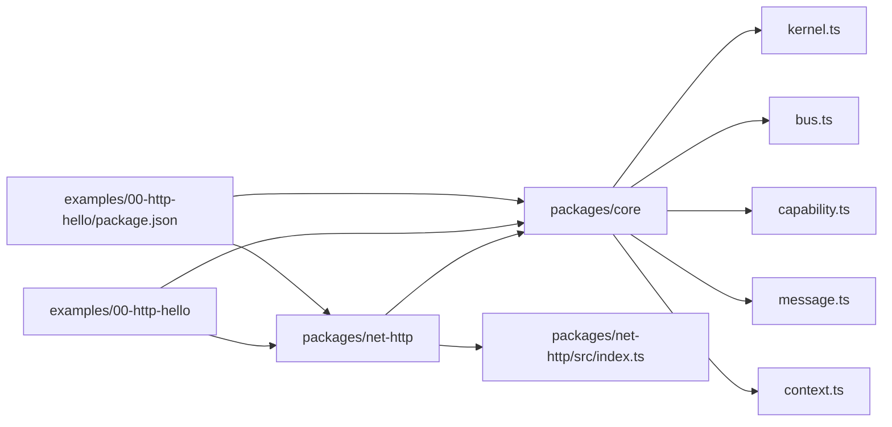
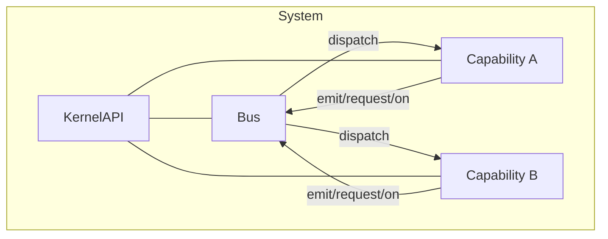

# Architecture & Design

<cite>
**Referenced Files in This Document**
- [README.md](file://README.md)
- [package.json](file://package.json)
- [packages/core/src/kernel.ts](file://packages/core/src/kernel.ts)
- [packages/core/src/bus.ts](file://packages/core/src/bus.ts)
- [packages/core/src/capability.ts](file://packages/core/src/capability.ts)
- [packages/core/src/message.ts](file://packages/core/src/message.ts)
- [packages/core/src/context.ts](file://packages/core/src/context.ts)
- [packages/core/README.md](file://packages/core/README.md)
- [examples/00-http-hello/src/index.ts](file://examples/00-http-hello/src/index.ts)
- [examples/00-http-hello/package.json](file://examples/00-http-hello/package.json)
- [packages/net-http/src/index.ts](file://packages/net-http/src/index.ts)
- [contexts/kislabin-architecture-study.md](file://contexts/kislabin-architecture-study.md)
- [contexts/kislabin-runtime-model.md](file://contexts/kislabin-runtime-model.md)
</cite>

## Table of Contents
1. [Introduction](#introduction)
2. [Project Structure](#project-structure)
3. [Core Components](#core-components)
4. [Architecture Overview](#architecture-overview)
5. [Detailed Component Analysis](#detailed-component-analysis)
6. [Dependency Analysis](#dependency-analysis)
7. [Performance Considerations](#performance-considerations)
8. [Troubleshooting Guide](#troubleshooting-guide)
9. [Conclusion](#conclusion)
10. [Appendices](#appendices)

## Introduction
This document explains the high-level design of kislabin as a microkernel-based system that treats all application concerns as messages routed through a capability bus. It contrasts this approach with traditional framework designs, highlights the actor-like message-driven model, and documents the mental model enabling portability to Go and Rust. The design emphasizes:
- Microkernel: lifecycle orchestration and message routing in a small core
- Capabilities: isolated subsystems communicating via envelopes
- Actor-style semantics: handlers receive envelopes and optional context
- OTP-inspired patterns: lifecycle, supervision, and signals
- Capability isolation and explicit contracts

**Section sources**
- [README.md:1-264](file://README.md#L1-L264)
- [contexts/kislabin-architecture-study.md:1-337](file://contexts/kislabin-architecture-study.md#L1-L337)
- [contexts/kislabin-runtime-model.md:1-694](file://contexts/kislabin-runtime-model.md#L1-L694)

## Project Structure
The repository is organized as a monorepo with a core kernel and optional capabilities. The core provides the kernel, message primitives, bus, capability registry, and context. An HTTP capability demonstrates how transports and protocols are integrated as capabilities.

**Diagram sources**
- [package.json:1-29](file://package.json#L1-L29)
- [packages/core/src/kernel.ts:1-354](file://packages/core/src/kernel.ts#L1-L354)
- [packages/core/src/bus.ts:1-214](file://packages/core/src/bus.ts#L1-L214)
- [packages/core/src/capability.ts:1-241](file://packages/core/src/capability.ts#L1-L241)
- [packages/core/src/message.ts:1-164](file://packages/core/src/message.ts#L1-L164)
- [packages/core/src/context.ts:1-167](file://packages/core/src/context.ts#L1-L167)
- [packages/core/README.md:1-479](file://packages/core/README.md#L1-L479)
- [examples/00-http-hello/src/index.ts:1-12](file://examples/00-http-hello/src/index.ts#L1-L12)
- [examples/00-http-hello/package.json:1-27](file://examples/00-http-hello/package.json#L1-L27)
- [packages/net-http/src/index.ts:1-20](file://packages/net-http/src/index.ts#L1-L20)

**Section sources**
- [README.md:98-142](file://README.md#L98-L142)
- [package.json:1-29](file://package.json#L1-L29)

## Core Components
- Kernel: orchestrates lifecycle, exposes KernelAPI, manages bus and capability registry, and emits lifecycle signals.
- Bus: routes envelopes to handlers by exact match and wildcard patterns; supports emit, emitAsync, and request semantics.
- Capability: an isolated subsystem with lifecycle hooks and explicit dependencies; registers handlers via KernelAPI.
- Message: Envelope carries kind/type/payload/source/timestamp/metadata; aliases for semantic kinds.
- Context: ExecutionContext that flows through handlers, carrying trace, state bag, deadlines, and cancellation.

These components form a minimal core (~300 lines) that is intentionally thin and portable.

**Section sources**
- [packages/core/src/kernel.ts:1-354](file://packages/core/src/kernel.ts#L1-L354)
- [packages/core/src/bus.ts:1-214](file://packages/core/src/bus.ts#L1-L214)
- [packages/core/src/capability.ts:1-241](file://packages/core/src/capability.ts#L1-L241)
- [packages/core/src/message.ts:1-164](file://packages/core/src/message.ts#L1-L164)
- [packages/core/src/context.ts:1-167](file://packages/core/src/context.ts#L1-L167)
- [packages/core/README.md:58-96](file://packages/core/README.md#L58-L96)

## Architecture Overview
Kislabin’s architecture is inspired by operating systems and OTP:
- Microkernel: lifecycle + messaging + context
- Capabilities: isolated subsystems (HTTP, storage, queue, auth) that communicate via the bus
- Message-driven: all events, commands, queries, and signals are envelopes
- Capability isolation: zero implicit coupling; explicit contracts via message types
- Lifecycle supervision: ordered init/start/stop/dispose with dependency-aware topological ordering

**Diagram sources**
- [packages/core/src/kernel.ts:265-354](file://packages/core/src/kernel.ts#L265-L354)
- [packages/core/src/bus.ts:34-206](file://packages/core/src/bus.ts#L34-L206)
- [packages/core/src/capability.ts:115-241](file://packages/core/src/capability.ts#L115-L241)

**Section sources**
- [README.md:39-83](file://README.md#L39-L83)
- [contexts/kislabin-architecture-study.md:53-100](file://contexts/kislabin-architecture-study.md#L53-L100)

## Detailed Component Analysis

### Kernel and KernelAPI
- Responsibilities: manage bus, registry, lifecycle signals, configuration, envelope factory, and context creation.
- KernelAPI acts as the “system call” surface for capabilities.
- Lifecycle: emits signals, invokes capability lifecycle in order, and supports graceful shutdown.

**Diagram sources**
- [packages/core/src/kernel.ts:65-183](file://packages/core/src/kernel.ts#L65-L183)
- [packages/core/src/kernel.ts:265-354](file://packages/core/src/kernel.ts#L265-L354)

**Section sources**
- [packages/core/src/kernel.ts:136-183](file://packages/core/src/kernel.ts#L136-L183)
- [packages/core/src/kernel.ts:314-350](file://packages/core/src/kernel.ts#L314-L350)

### Bus and Message Dispatch
- Supports three dispatch modes:
  - emit: synchronous broadcast (exact + wildcard)
  - emitAsync: asynchronous broadcast (series)
  - request: point-to-point exact-match
- Pattern matching: exact O(1); wildcard O(n) over number of wildcard patterns.
- Context propagation: single LazyContext flows through all handlers in a dispatch.

**Diagram sources**
- [packages/core/src/bus.ts:91-170](file://packages/core/src/bus.ts#L91-L170)
- [packages/core/src/context.ts:106-166](file://packages/core/src/context.ts#L106-L166)

**Section sources**
- [packages/core/src/bus.ts:34-206](file://packages/core/src/bus.ts#L34-L206)
- [packages/core/src/context.ts:22-90](file://packages/core/src/context.ts#L22-L90)

### Capability and CapabilityRegistry
- Capability lifecycle: init → start → stop → dispose; topological ordering enforced.
- Dependencies declared explicitly; circular dependency detection via DFS.
- CapabilityRegistry caches sorted order; stop/dispose run in reverse order.

**Diagram sources**
- [packages/core/src/capability.ts:194-211](file://packages/core/src/capability.ts#L194-L211)
- [packages/core/src/capability.ts:217-239](file://packages/core/src/capability.ts#L217-L239)
- [packages/core/src/kernel.ts:318-328](file://packages/core/src/kernel.ts#L318-L328)

**Section sources**
- [packages/core/src/capability.ts:101-241](file://packages/core/src/capability.ts#L101-L241)
- [packages/core/src/kernel.ts:314-350](file://packages/core/src/kernel.ts#L314-L350)

### Message Primitives and EnvelopeFactory
- Envelope carries id, kind, type, payload, source, timestamp, metadata.
- Semantic aliases: Command, Event, Query, Signal.
- EnvelopeFactory ensures deterministic creation with source and timestamps.

**Diagram sources**
- [packages/core/src/message.ts:21-164](file://packages/core/src/message.ts#L21-L164)

**Section sources**
- [packages/core/src/message.ts:11-164](file://packages/core/src/message.ts#L11-L164)

### Context (ExecutionContext)
- Minimal state bag with get/set/has; trace id, deadline, AbortSignal, parent/child hierarchy.
- Lazy allocation for id and signal to avoid overhead for read-only handlers.

**Diagram sources**
- [packages/core/src/context.ts:22-90](file://packages/core/src/context.ts#L22-L90)
- [packages/core/src/context.ts:106-166](file://packages/core/src/context.ts#L106-L166)

**Section sources**
- [packages/core/src/context.ts:22-90](file://packages/core/src/context.ts#L22-L90)
- [packages/core/src/context.ts:106-166](file://packages/core/src/context.ts#L106-L166)

### HTTP Capability Example
- The HTTP capability integrates via a fluent route definition and is registered into the kernel.
- The example shows a minimal HTTP server using the HTTP capability and kernel bootstrap.

**Diagram sources**
- [examples/00-http-hello/src/index.ts:1-12](file://examples/00-http-hello/src/index.ts#L1-L12)
- [examples/00-http-hello/package.json:15-18](file://examples/00-http-hello/package.json#L15-L18)
- [packages/net-http/src/index.ts:5-6](file://packages/net-http/src/index.ts#L5-L6)
- [packages/core/src/kernel.ts:318-328](file://packages/core/src/kernel.ts#L318-L328)

**Section sources**
- [examples/00-http-hello/src/index.ts:1-12](file://examples/00-http-hello/src/index.ts#L1-L12)
- [examples/00-http-hello/package.json:15-18](file://examples/00-http-hello/package.json#L15-L18)
- [packages/net-http/src/index.ts:5-6](file://packages/net-http/src/index.ts#L5-L6)

## Dependency Analysis
- Core depends on message, bus, capability, and context modules.
- HTTP capability depends on core and exports a public API.
- Examples depend on core and net-http to demonstrate usage.

**Diagram sources**
- [packages/core/src/kernel.ts:21-32](file://packages/core/src/kernel.ts#L21-L32)
- [packages/core/src/bus.ts:20-21](file://packages/core/src/bus.ts#L20-L21)
- [packages/core/src/capability.ts:23-24](file://packages/core/src/capability.ts#L23-L24)
- [packages/core/src/message.ts:9](file://packages/core/src/message.ts#L9)
- [packages/core/src/context.ts:18](file://packages/core/src/context.ts#L18)
- [packages/net-http/src/index.ts:5](file://packages/net-http/src/index.ts#L5)
- [examples/00-http-hello/package.json:15-18](file://examples/00-http-hello/package.json#L15-L18)

**Section sources**
- [package.json:24-27](file://package.json#L24-L27)
- [examples/00-http-hello/package.json:15-18](file://examples/00-http-hello/package.json#L15-L18)

## Performance Considerations
- Dispatch performance:
  - Exact match: O(1) with Map lookup
  - Wildcard matching: O(n) over wildcard patterns (not handlers)
  - Context creation: O(1) with lazy allocations
  - Handler invocation: O(1)
- Synchronous by default: emit is fire-and-forget; use emitAsync/request when needed
- No external dependencies: relies on Bun runtime primitives for UUID and AbortController
- Lifecycle is ordered and deterministic, avoiding concurrency overhead in the core

**Section sources**
- [packages/core/src/bus.ts:11-18](file://packages/core/src/bus.ts#L11-L18)
- [packages/core/src/bus.ts:174-205](file://packages/core/src/bus.ts#L174-L205)
- [packages/core/README.md:410-421](file://packages/core/README.md#L410-L421)

## Troubleshooting Guide
- No handler registered for type: thrown by request() when no exact match exists; indicates missing handler registration or wrong type.
- Circular dependency detected: thrown by CapabilityRegistry during boot; indicates invalid dependency graph.
- Missing required config: thrown by KernelAPI.config when no fallback is provided and key is absent.
- Graceful shutdown: kernel emits stopping/stopped signals; stop runs in reverse order and swallow errors while dispose always executes.

**Section sources**
- [packages/core/src/bus.ts:209-214](file://packages/core/src/bus.ts#L209-L214)
- [packages/core/src/capability.ts:167-169](file://packages/core/src/capability.ts#L167-L169)
- [packages/core/src/kernel.ts:283-287](file://packages/core/src/kernel.ts#L283-L287)
- [packages/core/src/kernel.ts:335-347](file://packages/core/src/kernel.ts#L335-L347)

## Conclusion
Kislabin’s architecture is a principled departure from traditional frameworks:
- It is a microkernel that focuses on lifecycle, messaging, and context
- Capabilities are isolated subsystems that communicate exclusively via envelopes
- The OTP-inspired lifecycle and signals enable robust supervision and observability
- The mental model maps cleanly to Go and Rust, enabling portability without sacrificing performance or clarity

This design favors explicit contracts, deterministic behavior, and message-driven composition—aligning with operating system and OTP philosophies.

**Section sources**
- [README.md:39-83](file://README.md#L39-L83)
- [contexts/kislabin-runtime-model.md:577-600](file://contexts/kislabin-runtime-model.md#L577-L600)

## Appendices

### System Boundaries and Data Flow
- Kernel boundary: KernelAPI is the only surface capabilities may use to interact with the kernel
- Capability boundary: capabilities declare consumes/produces and lifecycle; they do not call each other directly
- Data flow: envelopes propagate through the bus; handlers may mutate context state and produce new envelopes

**Diagram sources**
- [packages/core/src/kernel.ts:65-134](file://packages/core/src/kernel.ts#L65-L134)
- [packages/core/src/bus.ts:34-206](file://packages/core/src/bus.ts#L34-L206)
- [packages/core/src/capability.ts:27-99](file://packages/core/src/capability.ts#L27-L99)

### Scalability and Deployment Patterns
- Horizontal scaling: run multiple instances behind a load balancer; each instance is a separate kernel with its own bus and capabilities
- Vertical scaling: increase capacity by adding more powerful machines; core remains unchanged
- Deployment: no build step; run directly with Bun; capabilities can be swapped without changing the core
- Observability: lifecycle signals and structured events enable monitoring and diagnostics

**Section sources**
- [README.md:168-187](file://README.md#L168-L187)
- [contexts/kislabin-runtime-model.md:224-250](file://contexts/kislabin-runtime-model.md#L224-L250)

### Mental Model for Go and Rust
- TypeScript reference implementation defines the core contract
- Go/Rust implementations mirror the same lifecycle, message shape, and capability boundaries
- The model emphasizes portability and identical mental model across languages

**Section sources**
- [contexts/kislabin-architecture-study.md:289-312](file://contexts/kislabin-architecture-study.md#L289-L312)
- [contexts/kislabin-runtime-model.md:577-600](file://contexts/kislabin-runtime-model.md#L577-L600)