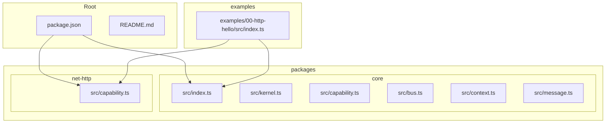
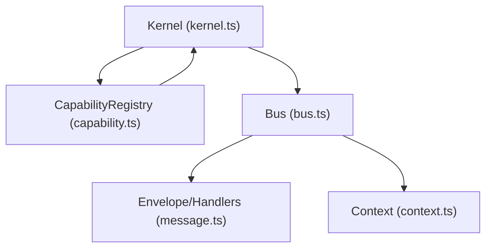
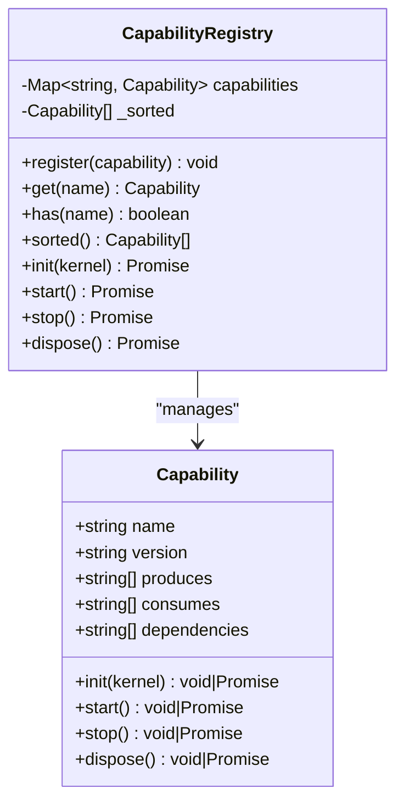
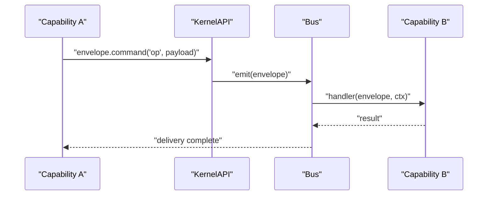
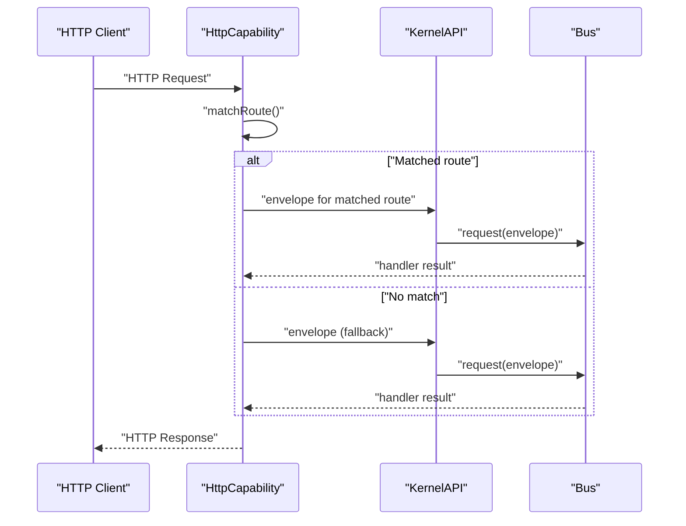
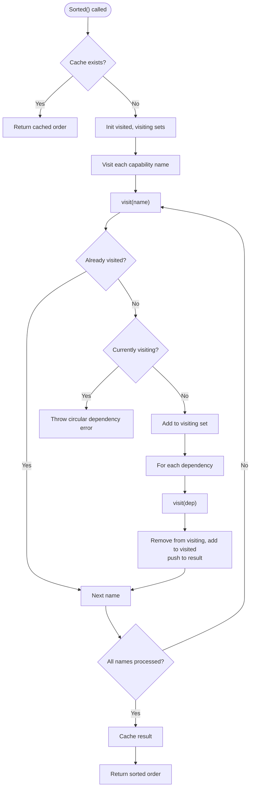

# Capability Development

<cite>
**Referenced Files in This Document**
- [README.md](file://README.md)
- [package.json](file://package.json)
- [packages/core/src/index.ts](file://packages/core/src/index.ts)
- [packages/core/src/kernel.ts](file://packages/core/src/kernel.ts)
- [packages/core/src/capability.ts](file://packages/core/src/capability.ts)
- [packages/core/src/bus.ts](file://packages/core/src/bus.ts)
- [packages/core/src/context.ts](file://packages/core/src/context.ts)
- [packages/core/src/message.ts](file://packages/core/src/message.ts)
- [packages/net-http/src/capability.ts](file://packages/net-http/src/capability.ts)
- [examples/00-http-hello/src/index.ts](file://examples/00-http-hello/src/index.ts)
</cite>

## Table of Contents
1. [Introduction](#introduction)
2. [Project Structure](#project-structure)
3. [Core Components](#core-components)
4. [Architecture Overview](#architecture-overview)
5. [Detailed Component Analysis](#detailed-component-analysis)
6. [Dependency Analysis](#dependency-analysis)
7. [Performance Considerations](#performance-considerations)
8. [Troubleshooting Guide](#troubleshooting-guide)
9. [Conclusion](#conclusion)
10. [Appendices](#appendices)

## Introduction
This document explains how to develop custom capabilities in the kislabin framework. It covers the capability interface, lifecycle phases, dependency management, capability registration order, cross-capability communication via the message bus, and best practices for isolation, error handling, and resource management. It also provides step-by-step examples and templates for common capability patterns, along with testing strategies and integration guidance.

Kislabin is a minimal kernel (~300 lines) that orchestrates isolated capabilities communicating exclusively through messages. Capabilities are autonomous subsystems with explicit lifecycles and optional dependencies. The kernel manages the message bus, capability registry, and lifecycle orchestration.

**Section sources**
- [README.md:1-264](file://README.md#L1-L264)

## Project Structure
The repository is organized as a monorepo with workspaces:
- packages/core: The kernel and messaging primitives
- packages/net-http: An example HTTP capability built on Bun.serve
- examples: Minimal runnable examples demonstrating usage
- Root package.json defines workspaces and TypeScript/Bun tooling

**Diagram sources**
- [package.json:1-29](file://package.json#L1-L29)
- [packages/core/src/index.ts:1-28](file://packages/core/src/index.ts#L1-L28)
- [packages/core/src/kernel.ts:1-354](file://packages/core/src/kernel.ts#L1-L354)
- [packages/core/src/capability.ts:1-241](file://packages/core/src/capability.ts#L1-L241)
- [packages/core/src/bus.ts:1-214](file://packages/core/src/bus.ts#L1-L214)
- [packages/core/src/context.ts:1-167](file://packages/core/src/context.ts#L1-L167)
- [packages/core/src/message.ts:1-164](file://packages/core/src/message.ts#L1-L164)
- [packages/net-http/src/capability.ts:1-223](file://packages/net-http/src/capability.ts#L1-L223)
- [examples/00-http-hello/src/index.ts:1-12](file://examples/00-http-hello/src/index.ts#L1-L12)

**Section sources**
- [package.json:1-29](file://package.json#L1-L29)
- [README.md:100-142](file://README.md#L100-L142)

## Core Components
This section documents the foundational building blocks for capability development.

- Capability interface: Defines the contract for capabilities, including lifecycle hooks and metadata.
- CapabilityRegistry: Manages capability registration, resolves dependency order, and executes lifecycle phases.
- KernelAPI: The capability-facing system interface for emitting messages, registering handlers, resolving other capabilities, and accessing configuration.
- Bus: Central dispatcher for messages supporting broadcast and point-to-point request patterns.
- Context: Execution context flowing through handler chains, enabling shared state, tracing, deadlines, and cancellation.
- Message primitives: Envelope types and factories for commands, events, queries, and signals.

Key exports and types are exposed from the core package entry point.

**Section sources**
- [packages/core/src/capability.ts:28-99](file://packages/core/src/capability.ts#L28-L99)
- [packages/core/src/capability.ts:115-240](file://packages/core/src/capability.ts#L115-L240)
- [packages/core/src/kernel.ts:65-134](file://packages/core/src/kernel.ts#L65-L134)
- [packages/core/src/kernel.ts:159-183](file://packages/core/src/kernel.ts#L159-L183)
- [packages/core/src/kernel.ts:204-245](file://packages/core/src/kernel.ts#L204-L245)
- [packages/core/src/bus.ts:34-206](file://packages/core/src/bus.ts#L34-L206)
- [packages/core/src/context.ts:44-90](file://packages/core/src/context.ts#L44-L90)
- [packages/core/src/context.ts:164-167](file://packages/core/src/context.ts#L164-L167)
- [packages/core/src/message.ts:34-95](file://packages/core/src/message.ts#L34-L95)
- [packages/core/src/message.ts:137-163](file://packages/core/src/message.ts#L137-L163)
- [packages/core/src/index.ts:9-28](file://packages/core/src/index.ts#L9-L28)

## Architecture Overview
The system architecture centers on the kernel orchestrating capabilities through a message bus. Capabilities are isolated and communicate exclusively via envelopes. The kernel exposes a controlled API (KernelAPI) to capabilities, ensuring clean separation of concerns.

**Diagram sources**
- [packages/core/src/kernel.ts:265-353](file://packages/core/src/kernel.ts#L265-L353)
- [packages/core/src/capability.ts:115-240](file://packages/core/src/capability.ts#L115-L240)
- [packages/core/src/bus.ts:34-206](file://packages/core/src/bus.ts#L34-L206)
- [packages/core/src/message.ts:34-95](file://packages/core/src/message.ts#L34-L95)
- [packages/core/src/context.ts:164-167](file://packages/core/src/context.ts#L164-L167)

## Detailed Component Analysis

### Capability Interface and Lifecycle
A capability is an autonomous subsystem with:
- Metadata: name, version, produces/consumes message types, dependencies
- Lifecycle hooks: init, start, stop, dispose
- Isolation: zero coupling; communicates via bus

Lifecycle phases:
- init: register handlers, validate configuration, prepare resources
- start: open connections, begin listening
- stop: drain ongoing work, stop accepting new work
- dispose: release resources; always runs even if stop failed

Dependency management:
- dependencies: array of capability names that must exist before this capability boots
- CapabilityRegistry performs topological sorting and enforces ordering
- Circular dependencies and missing dependencies are detected and reported with full chain for debugging

**Diagram sources**
- [packages/core/src/capability.ts:28-99](file://packages/core/src/capability.ts#L28-L99)
- [packages/core/src/capability.ts:115-240](file://packages/core/src/capability.ts#L115-L240)

**Section sources**
- [packages/core/src/capability.ts:13-22](file://packages/core/src/capability.ts#L13-L22)
- [packages/core/src/capability.ts:61-99](file://packages/core/src/capability.ts#L61-L99)
- [packages/core/src/capability.ts:115-192](file://packages/core/src/capability.ts#L115-L192)

### KernelAPI and Cross-Capability Communication
KernelAPI is the capability-facing system interface:
- emit/emitAsync: broadcast messages (exact match + wildcards)
- request: point-to-point request (exact match only)
- on: subscribe to message patterns (supports wildcards)
- resolve/has: locate other capabilities
- envelope: factory to create typed envelopes with source and metadata
- config: read-only configuration with fail-fast semantics
- createContext: internal context creation for envelopes

Cross-capability communication:
- Capabilities emit envelopes via kernel.envelope.<kind>()
- Handlers subscribe using kernel.api.on() or kernel.handle() during boot
- request() enables RPC-like interactions between capabilities
- Context flows through handler chains, enabling shared state and tracing

**Diagram sources**
- [packages/core/src/kernel.ts:65-134](file://packages/core/src/kernel.ts#L65-L134)
- [packages/core/src/bus.ts:91-136](file://packages/core/src/bus.ts#L91-L136)
- [packages/core/src/message.ts:137-163](file://packages/core/src/message.ts#L137-L163)

**Section sources**
- [packages/core/src/kernel.ts:65-134](file://packages/core/src/kernel.ts#L65-L134)
- [packages/core/src/bus.ts:34-206](file://packages/core/src/bus.ts#L34-L206)
- [packages/core/src/context.ts:44-90](file://packages/core/src/context.ts#L44-L90)

### HTTP Capability Example
The HTTP capability demonstrates a real-world capability integrating with Bun.serve, parsing routes, and translating HTTP requests into envelopes and responses back to HTTP.

Highlights:
- Provides a fluent API to define routes and groups
- Compiles routes during init and serves them during start
- Falls back to kernel.request() for unmatched routes
- Implements lifecycle hooks for graceful stop and resource cleanup

**Diagram sources**
- [packages/net-http/src/capability.ts:102-179](file://packages/net-http/src/capability.ts#L102-L179)
- [packages/net-http/src/capability.ts:182-222](file://packages/net-http/src/capability.ts#L182-L222)
- [packages/core/src/bus.ts:159-170](file://packages/core/src/bus.ts#L159-L170)

**Section sources**
- [packages/net-http/src/capability.ts:14-223](file://packages/net-http/src/capability.ts#L14-L223)
- [examples/00-http-hello/src/index.ts:1-12](file://examples/00-http-hello/src/index.ts#L1-L12)

### Step-by-Step: Creating a Custom Capability
Follow these steps to build a custom capability:

1. Define capability metadata
   - Choose a unique name and version
   - Declare produces/consumes types and dependencies

2. Implement lifecycle hooks
   - init(kernel): register handlers, validate config, prepare resources
   - start(): open connections/listeners
   - stop(): drain ongoing work
   - dispose(): release resources (always runs)

3. Register and order dependencies
   - Add dependent capability names to dependencies
   - The registry ensures boot order and detects cycles/missing deps

4. Communicate via the bus
   - Use kernel.envelope to create typed envelopes
   - Subscribe with kernel.api.on() or kernel.handle() during boot
   - Use kernel.api.request() for RPC-style interactions

5. Handle errors and isolation
   - Keep capability boundaries strict
   - Use stop/dispose to ensure graceful shutdown
   - Avoid leaking external resources

6. Integrate with the kernel
   - Use kernel().use(yourCapability).start()

Example references:
- Capability interface and lifecycle: [packages/core/src/capability.ts:28-99](file://packages/core/src/capability.ts#L28-L99)
- Registry and dependency resolution: [packages/core/src/capability.ts:115-192](file://packages/core/src/capability.ts#L115-L192)
- KernelAPI usage patterns: [packages/core/src/kernel.ts:65-134](file://packages/core/src/kernel.ts#L65-L134)
- HTTP capability as a template: [packages/net-http/src/capability.ts:102-179](file://packages/net-http/src/capability.ts#L102-L179)

**Section sources**
- [packages/core/src/capability.ts:28-99](file://packages/core/src/capability.ts#L28-L99)
- [packages/core/src/capability.ts:115-192](file://packages/core/src/capability.ts#L115-L192)
- [packages/core/src/kernel.ts:65-134](file://packages/core/src/kernel.ts#L65-L134)
- [packages/net-http/src/capability.ts:102-179](file://packages/net-http/src/capability.ts#L102-L179)

### Best Practices for Capability Development
- Isolation
  - Do not import or access other capabilities directly; communicate via envelopes
  - Keep capability state local; use Context for shared state across handlers

- Error handling
  - Fail fast in init; let the kernel abort boot on configuration errors
  - In lifecycle, prefer try/catch around external operations; continue shutdown sequence
  - Use stop to drain and dispose to free resources; both are resilient

- Resource management
  - Open connections in start; close in stop/dispose
  - Avoid blocking operations in hot paths; use async handlers where appropriate

- Configuration
  - Use kernel.config() with fail-fast semantics for required values
  - Provide sensible defaults only when appropriate

- Testing
  - Test handlers by emitting envelopes and asserting outcomes
  - Simulate lifecycle by invoking init/start/stop/dispose in order
  - Mock external services and assert emitted envelopes

- Documentation and examples
  - Follow the HTTP capability as a reference implementation
  - Keep examples minimal and focused

**Section sources**
- [packages/core/src/kernel.ts:159-183](file://packages/core/src/kernel.ts#L159-L183)
- [packages/core/src/bus.ts:91-136](file://packages/core/src/bus.ts#L91-L136)
- [packages/net-http/src/capability.ts:171-179](file://packages/net-http/src/capability.ts#L171-L179)

## Dependency Analysis
The CapabilityRegistry enforces dependency ordering using topological sort (depth-first search). It caches the sorted order and validates:
- Missing dependencies
- Circular dependencies with the full dependency chain

**Diagram sources**
- [packages/core/src/capability.ts:156-192](file://packages/core/src/capability.ts#L156-L192)

**Section sources**
- [packages/core/src/capability.ts:115-192](file://packages/core/src/capability.ts#L115-L192)

## Performance Considerations
- Dispatch performance
  - Exact match lookups are O(1); wildcard fanout is O(n) where n is the number of patterns with wildcards
  - Handlers execute in registration order; avoid heavy synchronous work in hot paths

- Context overhead
  - Lazy allocation: UUID, state bag, and AbortController are created only when accessed
  - Handlers that only read payload incur minimal overhead

- Lifecycle sequencing
  - Topological sort runs once and is cached
  - stop/dispose run in reverse order to minimize downstream impact

- HTTP capability specifics
  - Route compilation occurs during init
  - Bun.serve is used for efficient request handling

**Section sources**
- [packages/core/src/bus.ts:11-19](file://packages/core/src/bus.ts#L11-L19)
- [packages/core/src/context.ts:99-105](file://packages/core/src/context.ts#L99-L105)
- [packages/net-http/src/capability.ts:109-118](file://packages/net-http/src/capability.ts#L109-L118)

## Troubleshooting Guide
Common issues and resolutions:
- Missing configuration
  - Symptom: init fails with a missing config error
  - Resolution: Provide config via kernel().config() before start()

- Missing dependency
  - Symptom: Registry throws a missing dependency error
  - Resolution: Register the dependent capability or adjust dependencies

- Circular dependency
  - Symptom: Registry throws a circular dependency error with the full chain
  - Resolution: Break the cycle by removing or adjusting dependencies

- No handler for request
  - Symptom: request() throws a NoHandlerError
  - Resolution: Register a handler for the exact envelope type or ensure a fallback route/handler exists

- Graceful shutdown failures
  - Symptom: stop/dispose errors during shutdown
  - Resolution: Ensure stop drains work and dispose releases resources; both are resilient and continue the sequence

**Section sources**
- [packages/core/src/kernel.ts:314-353](file://packages/core/src/kernel.ts#L314-L353)
- [packages/core/src/capability.ts:166-170](file://packages/core/src/capability.ts#L166-L170)
- [packages/core/src/bus.ts:209-214](file://packages/core/src/bus.ts#L209-L214)
- [packages/core/src/bus.ts:159-170](file://packages/core/src/bus.ts#L159-L170)

## Conclusion
Kislabin’s capability model provides a robust foundation for building modular, testable, and portable backend systems. By adhering to explicit lifecycles, dependency declarations, and message-driven communication, developers can compose complex applications from small, isolated capabilities. The included HTTP capability and examples demonstrate practical patterns for building and integrating capabilities.

[No sources needed since this section summarizes without analyzing specific files]

## Appendices

### Templates and Boilerplate Patterns
- Minimal capability template
  - Define name, version, dependencies
  - Implement init/start/stop/dispose
  - Use kernel.envelope to produce messages
  - Reference: [packages/core/src/capability.ts:28-99](file://packages/core/src/capability.ts#L28-L99)

- HTTP capability template
  - Fluent route registration
  - Route compilation in init
  - Server lifecycle in start/stop/dispose
  - Reference: [packages/net-http/src/capability.ts:102-179](file://packages/net-http/src/capability.ts#L102-L179)

- Example usage
  - Register capability and start kernel
  - Reference: [examples/00-http-hello/src/index.ts:1-12](file://examples/00-http-hello/src/index.ts#L1-L12)

### Testing Strategies
- Unit tests for handlers
  - Emit envelopes and assert results
  - Use kernel.handle() to register global handlers during tests
  - Reference: [packages/core/src/kernel.ts:204-245](file://packages/core/src/kernel.ts#L204-L245)

- Lifecycle tests
  - Invoke init/start/stop/dispose in order
  - Verify resource acquisition and release
  - Reference: [packages/core/src/capability.ts:194-240](file://packages/core/src/capability.ts#L194-L240)

- Integration tests
  - Start kernel with capabilities and exercise end-to-end flows
  - Validate cross-capability messaging and ordering
  - Reference: [README.md:146-165](file://README.md#L146-L165)