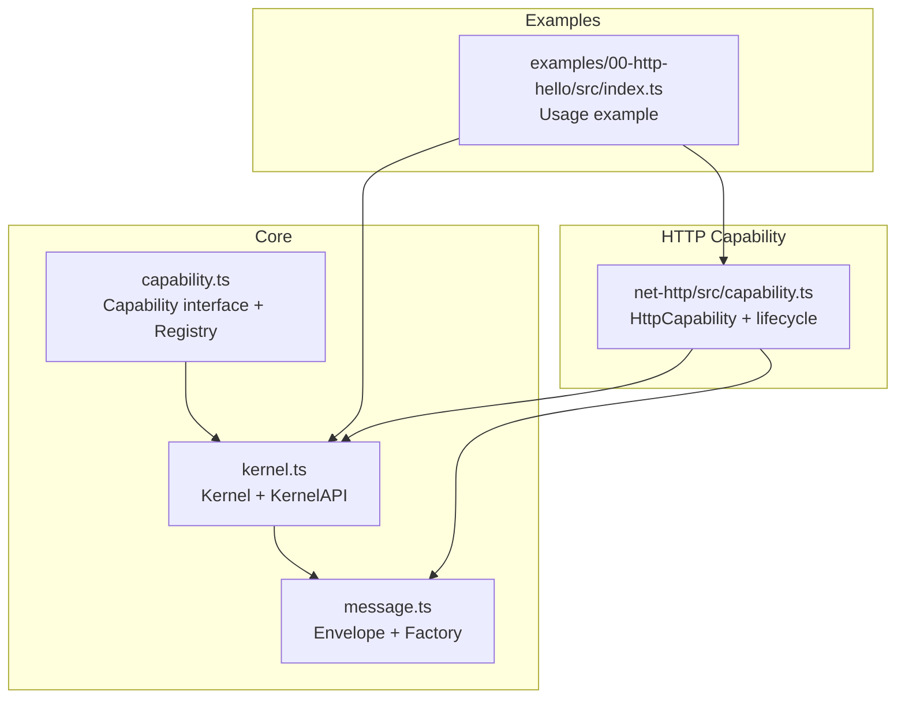
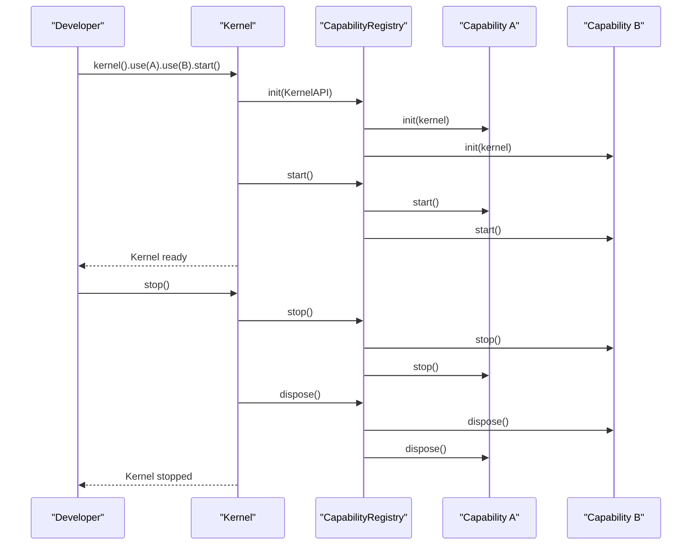
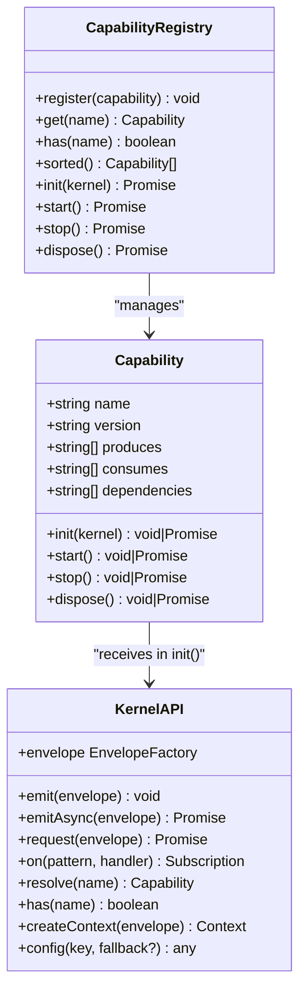
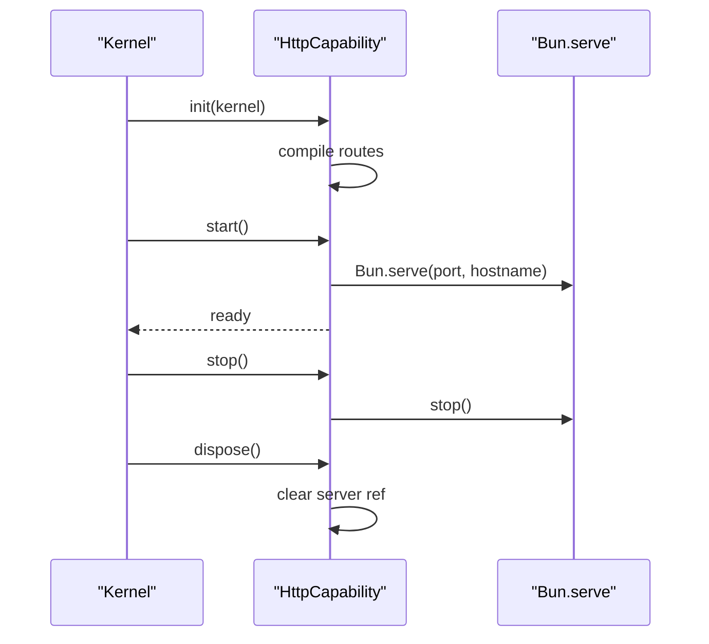
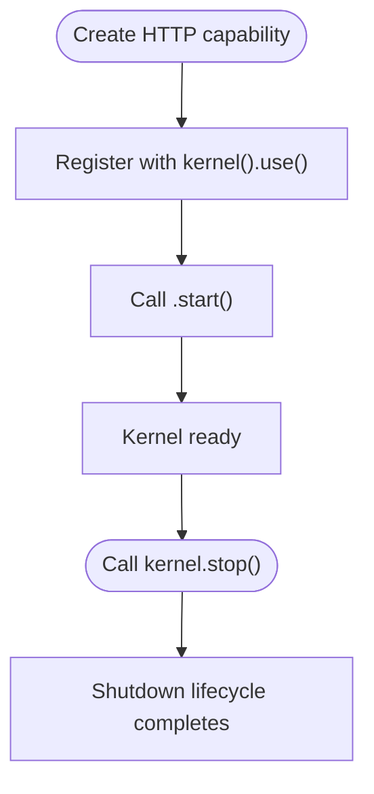
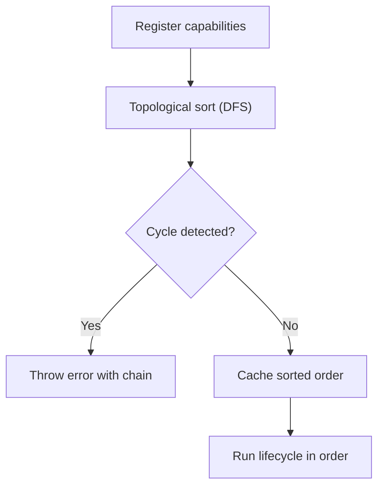

# Capability Interface

<cite>
**Referenced Files in This Document**
- [capability.ts](file://packages/core/src/capability.ts)
- [kernel.ts](file://packages/core/src/kernel.ts)
- [message.ts](file://packages/core/src/message.ts)
- [kislabin-api-contract.ts](file://contexts/kislabin-api-contract.ts)
- [capability.ts](file://packages/net-http/src/capability.ts)
- [index.ts](file://examples/00-http-hello/src/index.ts)
</cite>

## Table of Contents
1. [Introduction](#introduction)
2. [Project Structure](#project-structure)
3. [Core Components](#core-components)
4. [Architecture Overview](#architecture-overview)
5. [Detailed Component Analysis](#detailed-component-analysis)
6. [Dependency Analysis](#dependency-analysis)
7. [Performance Considerations](#performance-considerations)
8. [Troubleshooting Guide](#troubleshooting-guide)
9. [Conclusion](#conclusion)

## Introduction
This document provides comprehensive documentation for the Capability interface in the kislabin framework. It explains the interface contract, lifecycle semantics, and how capabilities integrate with the message bus system. It also covers best practices for naming, versioning, and declaring message types, along with common implementation patterns and anti-patterns.

## Project Structure
The capability system is part of the core kernel and integrates with the message bus and HTTP capability implementation. The following diagram shows the relevant files and their relationships.

**Diagram sources**
- [capability.ts](file://packages/core/src/capability.ts)
- [kernel.ts](file://packages/core/src/kernel.ts)
- [message.ts](file://packages/core/src/message.ts)
- [capability.ts](file://packages/net-http/src/capability.ts)
- [index.ts](file://examples/00-http-hello/src/index.ts)

**Section sources**
- [capability.ts](file://packages/core/src/capability.ts)
- [kernel.ts](file://packages/core/src/kernel.ts)
- [message.ts](file://packages/core/src/message.ts)
- [capability.ts](file://packages/net-http/src/capability.ts)
- [index.ts](file://examples/00-http-hello/src/index.ts)

## Core Components
This section documents the Capability interface contract and its lifecycle methods.

- Interface contract
  - name: Unique identifier used for resolution and existence checks.
  - version: Semantic version string for the capability.
  - produces: Optional array of message types emitted by the capability.
  - consumes: Optional array of message types consumed by the capability.
  - dependencies: Optional array of capability names that must be initialized before this one.

- Lifecycle methods
  - init(kernel): Register handlers, validate configuration, and prepare internal state. Receives KernelAPI bound to the capability’s source.
  - start(): Open connections, begin listening, and activate runtime resources.
  - stop(): Stop accepting new work and drain in-flight operations gracefully.
  - dispose(): Release all resources and close connections. Always executes, even after failures.

- Execution context
  - init receives a KernelAPI instance with an envelope factory pre-bound to the capability’s name. This ensures all envelopes emitted by the capability carry the correct source.
  - start runs after successful init of all dependencies.
  - stop runs in reverse dependency order; failures are swallowed to ensure shutdown proceeds.
  - dispose runs in reverse dependency order; failures are swallowed and always executed.

- Ordering guarantees
  - Topological ordering during initialization and startup.
  - Reverse topological ordering during shutdown and disposal.
  - Fail-fast dependency resolution with cycle detection.

**Section sources**
- [capability.ts](file://packages/core/src/capability.ts)
- [kernel.ts](file://packages/core/src/kernel.ts)
- [kislabin-api-contract.ts](file://contexts/kislabin-api-contract.ts)

## Architecture Overview
The capability lifecycle is orchestrated by the kernel. The kernel manages the bus, maintains a capability registry, and emits lifecycle signals. Capabilities register handlers via KernelAPI and communicate exclusively through messages.

**Diagram sources**
- [kernel.ts](file://packages/core/src/kernel.ts)
- [capability.ts](file://packages/core/src/capability.ts)

## Detailed Component Analysis

### Capability Interface Contract
The Capability interface defines the contract that all subsystems must fulfill. It emphasizes isolation, explicit messaging, and deterministic lifecycle management.

**Diagram sources**
- [capability.ts](file://packages/core/src/capability.ts)
- [kernel.ts](file://packages/core/src/kernel.ts)

**Section sources**
- [capability.ts](file://packages/core/src/capability.ts)
- [kislabin-api-contract.ts](file://contexts/kislabin-api-contract.ts)

### HTTP Capability Implementation
The HTTP capability demonstrates a practical implementation of the Capability lifecycle. It compiles route definitions during init, starts a server in start, drains gracefully in stop, and releases resources in dispose.

**Diagram sources**
- [capability.ts](file://packages/net-http/src/capability.ts)

**Section sources**
- [capability.ts](file://packages/net-http/src/capability.ts)

### Example: Minimal HTTP Capability
This example shows how to register an HTTP capability and a route handler using the kernel builder.

**Diagram sources**
- [index.ts](file://examples/00-http-hello/src/index.ts)

**Section sources**
- [index.ts](file://examples/00-http-hello/src/index.ts)

## Dependency Analysis
The capability registry enforces dependency ordering and detects cycles. It performs a topological sort using depth-first search and caches the result for the lifetime of the kernel.

**Diagram sources**
- [capability.ts](file://packages/core/src/capability.ts)

**Section sources**
- [capability.ts](file://packages/core/src/capability.ts)

## Performance Considerations
- Lifecycle is serial and deterministic, ensuring predictable startup/shutdown behavior.
- The bus supports exact match O(1) and wildcard suffix matching with linear fallback.
- Envelope creation is lightweight and uses deterministic identifiers.

[No sources needed since this section provides general guidance]

## Troubleshooting Guide
Common issues and resolutions:
- Missing dependency: The registry throws an error if a declared dependency is not registered.
- Circular dependency: The registry detects cycles and reports the full chain for debugging.
- Fail-fast configuration: Accessing required configuration without a fallback throws during init/start.
- Graceful shutdown: stop swallows errors to ensure disposal continues; always verify dispose runs by checking logs or metrics.

**Section sources**
- [capability.ts](file://packages/core/src/capability.ts)
- [kernel.ts](file://packages/core/src/kernel.ts)

## Conclusion
The Capability interface provides a minimal yet powerful contract for building isolated subsystems that communicate exclusively through messages. By adhering to the lifecycle phases and leveraging KernelAPI, developers can implement robust, testable, and portable capabilities that integrate seamlessly with the kislabin runtime.