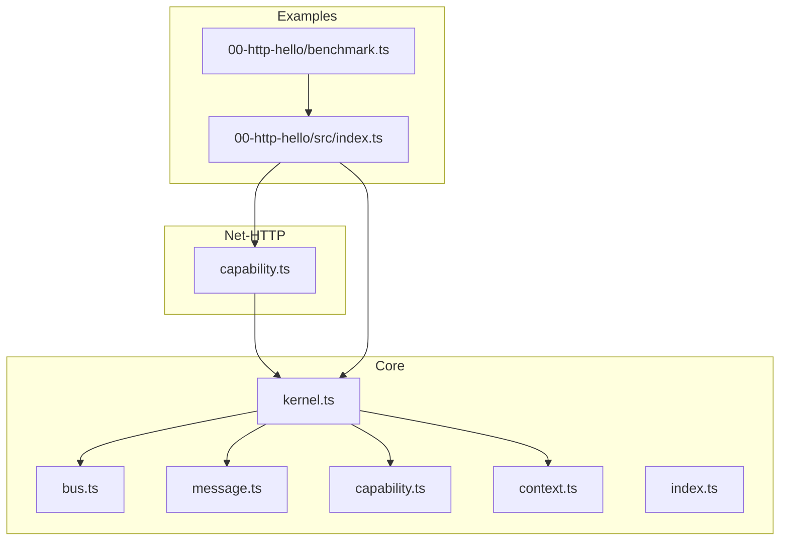
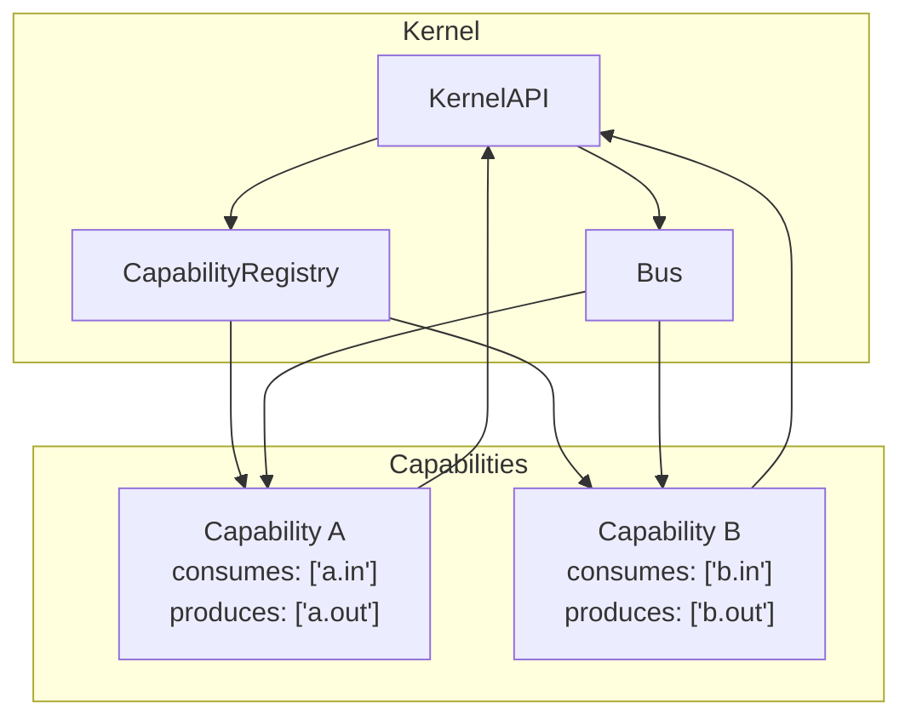
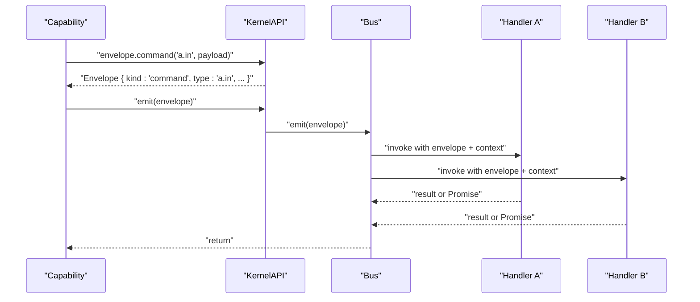
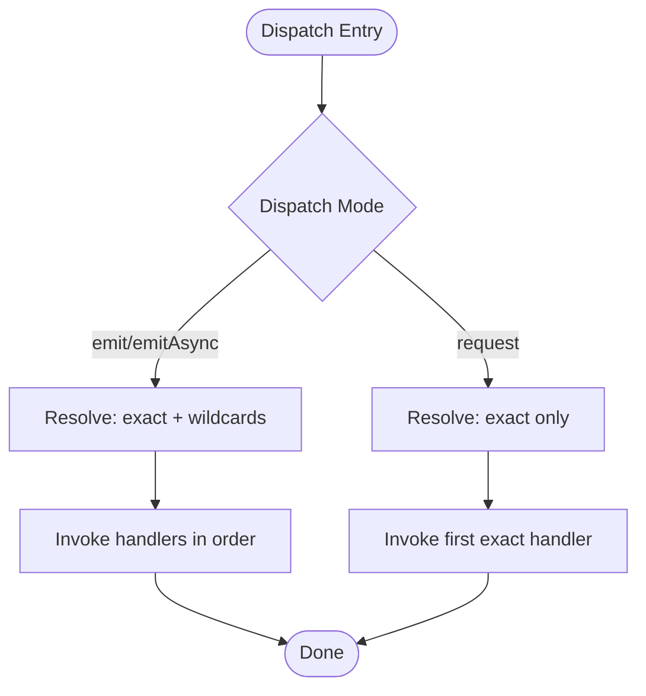
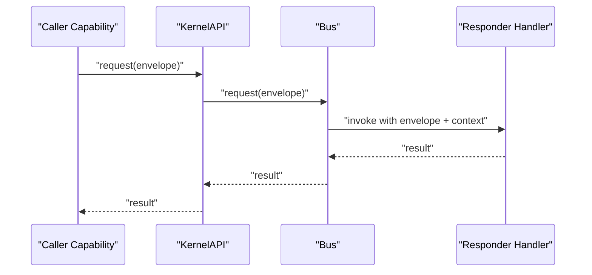
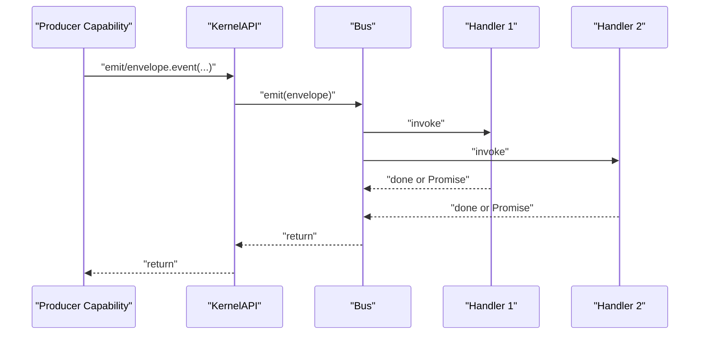
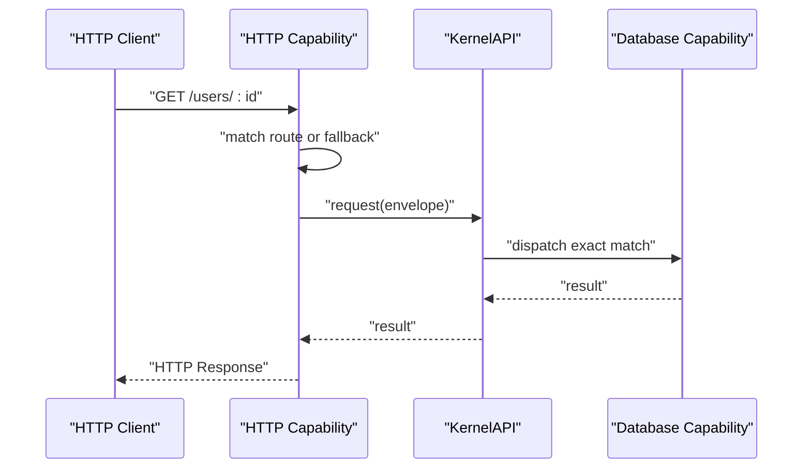
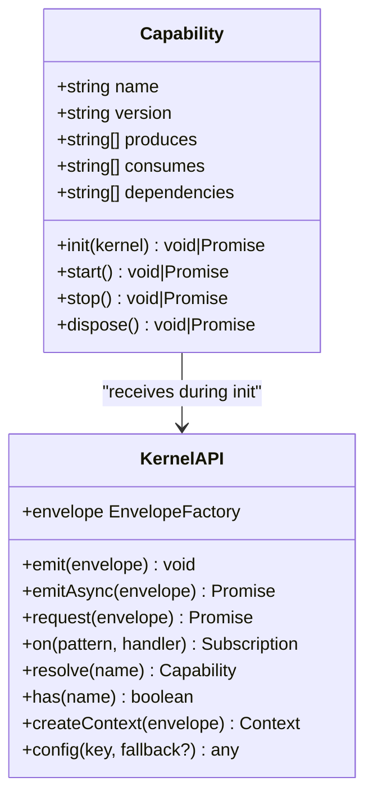
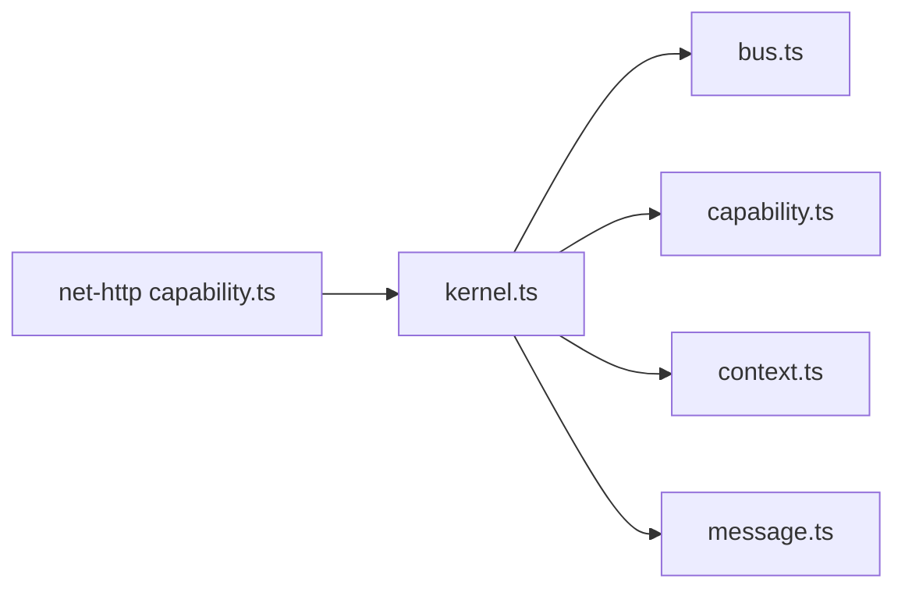
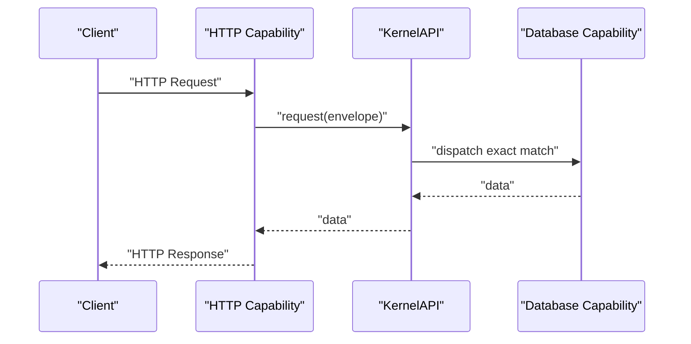

# Cross-Capability Communication

<cite>
**Referenced Files in This Document**
- [README.md](file://README.md)
- [package.json](file://package.json)
- [packages/core/src/index.ts](file://packages/core/src/index.ts)
- [packages/core/src/kernel.ts](file://packages/core/src/kernel.ts)
- [packages/core/src/bus.ts](file://packages/core/src/bus.ts)
- [packages/core/src/message.ts](file://packages/core/src/message.ts)
- [packages/core/src/capability.ts](file://packages/core/src/capability.ts)
- [packages/core/src/context.ts](file://packages/core/src/context.ts)
- [packages/core/README.md](file://packages/core/README.md)
- [packages/net-http/src/capability.ts](file://packages/net-http/src/capability.ts)
- [examples/00-http-hello/src/index.ts](file://examples/00-http-hello/src/index.ts)
- [examples/00-http-hello/benchmark.ts](file://examples/00-http-hello/benchmark.ts)
</cite>

## Table of Contents
1. [Introduction](#introduction)
2. [Project Structure](#project-structure)
3. [Core Components](#core-components)
4. [Architecture Overview](#architecture-overview)
5. [Detailed Component Analysis](#detailed-component-analysis)
6. [Dependency Analysis](#dependency-analysis)
7. [Performance Considerations](#performance-considerations)
8. [Troubleshooting Guide](#troubleshooting-guide)
9. [Conclusion](#conclusion)
10. [Appendices](#appendices)

## Introduction
This document explains cross-capability communication patterns in the kislabin framework. It focuses on how capabilities exchange messages via the kernel’s message bus using consumes and produces declarations, how message envelopes are created and routed, and how handlers are registered and matched. It also covers synchronous request-response and asynchronous event broadcasting, provides inter-capability messaging scenarios (such as HTTP capability interacting with database capabilities), and outlines best practices for message type design, handler registration, error propagation, performance, and debugging.

Kislabin treats everything as messages: HTTP requests, queue jobs, cron ticks, and domain events. Capabilities are isolated subsystems that communicate exclusively through the bus. The kernel orchestrates lifecycle and exposes a minimal KernelAPI for capabilities to emit, subscribe, and request responses.

**Section sources**
- [README.md:13-17](file://README.md#L13-L17)
- [README.md:68-78](file://README.md#L68-L78)
- [packages/core/README.md:17-26](file://packages/core/README.md#L17-L26)

## Project Structure
The repository is organized into:
- Core kernel and primitives under packages/core
- HTTP capability under packages/net-http
- Example applications under examples
- Top-level documentation and configuration

Key modules:
- kernel: orchestrates capabilities, exposes KernelAPI, manages lifecycle
- bus: dispatches envelopes to handlers (broadcast and request)
- message: envelope primitives and semantic kinds
- capability: capability contract and registry
- context: execution context for handlers
- net-http: HTTP capability that translates HTTP requests into envelopes and back

**Diagram sources**
- [packages/core/src/kernel.ts:265-354](file://packages/core/src/kernel.ts#L265-L354)
- [packages/core/src/bus.ts:34-214](file://packages/core/src/bus.ts#L34-L214)
- [packages/core/src/message.ts:11-164](file://packages/core/src/message.ts#L11-L164)
- [packages/core/src/capability.ts:101-241](file://packages/core/src/capability.ts#L101-L241)
- [packages/core/src/context.ts:22-167](file://packages/core/src/context.ts#L22-L167)
- [packages/net-http/src/capability.ts:92-223](file://packages/net-http/src/capability.ts#L92-L223)
- [examples/00-http-hello/src/index.ts:1-12](file://examples/00-http-hello/src/index.ts#L1-L12)

**Section sources**
- [package.json:1-29](file://package.json#L1-L29)
- [README.md:100-142](file://README.md#L100-L142)

## Core Components
This section describes the building blocks used for cross-capability messaging.

- Envelope and kinds
  - Envelope is the universal message primitive with id, kind, type, payload, source, timestamp, and metadata.
  - Kinds: command (intent), event (fact), query (read), signal (system).
  - Aliases: Command<Event<Query<Signal>>] provide semantic typing.

- Handler and subscription
  - Handler signature receives envelope and context, returns sync or Promise.
  - Subscription supports unsubscribe to remove handlers.

- EnvelopeFactory
  - Creates typed envelopes with deterministic id, source, and timestamp.
  - Each capability receives its own factory bound to its name.

- Bus dispatch modes
  - emit: synchronous broadcast (exact + wildcard)
  - emitAsync: asynchronous broadcast (series, waits for all)
  - request: point-to-point exact-match only, returns first handler result

- Context
  - Execution context shared across handlers in a dispatch chain.
  - Provides state bag (get/set/has), trace id, parent/child hierarchy, deadline, and AbortSignal.

- Capability lifecycle and registry
  - Capability declares consumes and produces types.
  - Registry resolves topological order, enforces dependencies, and runs lifecycle phases.

**Section sources**
- [packages/core/src/message.ts:11-164](file://packages/core/src/message.ts#L11-L164)
- [packages/core/src/bus.ts:34-214](file://packages/core/src/bus.ts#L34-L214)
- [packages/core/src/context.ts:22-167](file://packages/core/src/context.ts#L22-L167)
- [packages/core/src/capability.ts:61-99](file://packages/core/src/capability.ts#L61-L99)
- [packages/core/src/capability.ts:101-241](file://packages/core/src/capability.ts#L101-L241)

## Architecture Overview
The kernel initializes capabilities, wires their handler registrations, and exposes KernelAPI. Capabilities produce/consume messages by emitting envelopes and registering handlers. The bus performs pattern matching and dispatch.

**Diagram sources**
- [packages/core/src/kernel.ts:265-354](file://packages/core/src/kernel.ts#L265-L354)
- [packages/core/src/bus.ts:34-214](file://packages/core/src/bus.ts#L34-L214)
- [packages/core/src/capability.ts:101-241](file://packages/core/src/capability.ts#L101-L241)

## Detailed Component Analysis

### Message Envelope Creation and Routing
- EnvelopeFactory creates envelopes with kind/type/payload and auto-populated id/source/timestamp.
- Each capability gets a factory bound to its name, ensuring source attribution.
- Handlers receive envelopes and can inspect kind/type for semantic routing.

**Diagram sources**
- [packages/core/src/message.ts:115-164](file://packages/core/src/message.ts#L115-L164)
- [packages/core/src/bus.ts:91-136](file://packages/core/src/bus.ts#L91-L136)

**Section sources**
- [packages/core/src/message.ts:115-164](file://packages/core/src/message.ts#L115-L164)
- [packages/core/src/bus.ts:91-136](file://packages/core/src/bus.ts#L91-L136)

### Handler Registration and Pattern Matching
- Handlers are registered via KernelAPI.on or Capability.init with patterns:
  - Exact match: 'user.create'
  - Wildcard suffix: 'user.*'
  - Global wildcard: '*'
- Broadcast dispatch executes exact match handlers first, followed by wildcard handlers.
- Request dispatch uses exact match only and returns the first handler’s result.

**Diagram sources**
- [packages/core/src/bus.ts:183-205](file://packages/core/src/bus.ts#L183-L205)
- [packages/core/src/bus.ts:159-170](file://packages/core/src/bus.ts#L159-L170)

**Section sources**
- [packages/core/src/bus.ts:65-78](file://packages/core/src/bus.ts#L65-L78)
- [packages/core/src/bus.ts:183-205](file://packages/core/src/bus.ts#L183-L205)
- [packages/core/src/bus.ts:159-170](file://packages/core/src/bus.ts#L159-L170)

### Synchronous Request-Response Pattern
- Use KernelAPI.request with a query/command envelope to send a point-to-point request.
- The bus resolves exact match handlers and returns the first handler’s result.
- This pattern ensures a single responder and a clear contract for replies.

**Diagram sources**
- [packages/core/src/bus.ts:159-170](file://packages/core/src/bus.ts#L159-L170)
- [packages/core/src/kernel.ts:84-84](file://packages/core/src/kernel.ts#L84-L84)

**Section sources**
- [packages/core/src/bus.ts:159-170](file://packages/core/src/bus.ts#L159-L170)
- [packages/core/src/kernel.ts:84-84](file://packages/core/src/kernel.ts#L84-L84)

### Asynchronous Event Broadcasting
- Use KernelAPI.emit for fire-and-forget synchronous broadcast.
- Use KernelAPI.emitAsync to wait for all handlers to complete.
- Both support exact and wildcard pattern matching; async variant awaits Promises.

**Diagram sources**
- [packages/core/src/bus.ts:91-107](file://packages/core/src/bus.ts#L91-L107)
- [packages/core/src/bus.ts:125-136](file://packages/core/src/bus.ts#L125-L136)

**Section sources**
- [packages/core/src/bus.ts:91-107](file://packages/core/src/bus.ts#L91-L107)
- [packages/core/src/bus.ts:125-136](file://packages/core/src/bus.ts#L125-L136)

### Inter-Capability Messaging Scenarios
- HTTP capability to database capability:
  - HTTP capability builds an envelope for an incoming request and either:
    - Executes a route-defined handler locally, or
    - Falls back to KernelAPI.request to route to registered handlers.
  - Database capability registers handlers for specific commands/queries and returns results.
  - The HTTP capability serializes the result back to HTTP response.

**Diagram sources**
- [packages/net-http/src/capability.ts:128-163](file://packages/net-http/src/capability.ts#L128-L163)
- [packages/core/src/bus.ts:159-170](file://packages/core/src/bus.ts#L159-L170)

**Section sources**
- [packages/net-http/src/capability.ts:128-163](file://packages/net-http/src/capability.ts#L128-L163)
- [packages/core/src/bus.ts:159-170](file://packages/core/src/bus.ts#L159-L170)

### Consumes and Produces Declarations
- Capabilities declare consumes and produces arrays to describe the message types they handle and emit.
- These declarations enable documentation and future tooling around capability contracts.
- During init, capabilities register handlers for their consumes and emit for their produces.

**Diagram sources**
- [packages/core/src/capability.ts:61-99](file://packages/core/src/capability.ts#L61-L99)
- [packages/core/src/kernel.ts:65-134](file://packages/core/src/kernel.ts#L65-L134)

**Section sources**
- [packages/core/src/capability.ts:61-99](file://packages/core/src/capability.ts#L61-L99)

## Dependency Analysis
- Kernel depends on Bus, CapabilityRegistry, Context, and EnvelopeFactory.
- CapabilityRegistry resolves topological order and runs lifecycle phases.
- HTTP capability depends on KernelAPI and uses EnvelopeFactory to translate HTTP to envelopes and back.

**Diagram sources**
- [packages/core/src/kernel.ts:265-354](file://packages/core/src/kernel.ts#L265-L354)
- [packages/core/src/bus.ts:34-214](file://packages/core/src/bus.ts#L34-L214)
- [packages/core/src/capability.ts:101-241](file://packages/core/src/capability.ts#L101-L241)
- [packages/net-http/src/capability.ts:92-223](file://packages/net-http/src/capability.ts#L92-L223)

**Section sources**
- [packages/core/src/kernel.ts:265-354](file://packages/core/src/kernel.ts#L265-L354)
- [packages/core/src/capability.ts:101-241](file://packages/core/src/capability.ts#L101-L241)

## Performance Considerations
- Dispatch complexity:
  - Exact match: O(1)
  - Wildcard resolution: O(n) where n is the number of wildcard patterns (not handlers)
- Context creation and handler invocation are lightweight.
- Use emitAsync when you need to await all handlers; otherwise prefer emit for fire-and-forget.
- Prefer exact match for request() to minimize wildcard overhead.
- Keep handler chains short and avoid heavy work inside hot-path handlers.

**Section sources**
- [packages/core/README.md:410-421](file://packages/core/README.md#L410-L421)
- [packages/core/src/bus.ts:11-14](file://packages/core/src/bus.ts#L11-L14)

## Troubleshooting Guide
- No handler registered for type
  - Symptom: request() throws a NoHandlerError.
  - Action: Register a handler for the exact envelope type or adjust the caller’s type.
- Handler errors
  - emit/emitAsync log handler errors and continue; they do not propagate to callers.
  - request() will surface the error thrown by the handler.
- Lifecycle signals
  - Subscribe to signal:kernel.* messages to observe boot and shutdown progress.
- Debugging tips
  - Use global wildcard handler '*' to log all envelopes.
  - Inspect envelope.kind and envelope.type to confirm routing.
  - Use ctx.get/set to pass tracing context across handlers.

**Section sources**
- [packages/core/src/bus.ts:209-214](file://packages/core/src/bus.ts#L209-L214)
- [packages/core/src/bus.ts:91-107](file://packages/core/src/bus.ts#L91-L107)
- [packages/core/src/bus.ts:159-170](file://packages/core/src/bus.ts#L159-L170)
- [packages/core/README.md:398-407](file://packages/core/README.md#L398-L407)

## Conclusion
Kislabin’s cross-capability communication is built on a small set of primitives: Envelope, Handler, Context, and Bus. Capabilities declare consumes and produces, register handlers for inbound messages, and emit outbound messages. The bus supports both broadcast and request patterns with simple wildcard semantics. This design yields predictable, testable, and portable messaging suitable for building modular backend systems.

[No sources needed since this section summarizes without analyzing specific files]

## Appendices

### Best Practices for Message Type Design
- Use semantic kinds:
  - command for intentful actions
  - event for immutable facts
  - query for read-only operations
  - signal for system lifecycle/control
- Choose expressive type strings (e.g., domain.action) to enable clear wildcard routing.
- Keep payloads small and structured; use metadata for transport-specific attributes.

**Section sources**
- [packages/core/src/message.ts:11-164](file://packages/core/src/message.ts#L11-L164)

### Handler Registration and Unsubscription
- Register handlers early in capability init via kernel.on or kernel.handle.
- Use subscriptions to dynamically remove handlers when no longer needed.
- Prefer exact match for request() and wildcard for observability/logging.

**Section sources**
- [packages/core/src/bus.ts:65-78](file://packages/core/src/bus.ts#L65-L78)
- [packages/core/src/kernel.ts:298-301](file://packages/core/src/kernel.ts#L298-L301)

### Error Propagation Between Capabilities
- emit/emitAsync: errors are logged and do not propagate; use for fire-and-forget.
- request: errors thrown by the responding handler propagate to the caller.
- For robustness, wrap handlers defensively and return structured error responses when appropriate.

**Section sources**
- [packages/core/src/bus.ts:91-107](file://packages/core/src/bus.ts#L91-L107)
- [packages/core/src/bus.ts:159-170](file://packages/core/src/bus.ts#L159-L170)

### Example: HTTP Capability with Database Capability
- HTTP capability:
  - Translates HTTP requests into envelopes and either executes route handlers or delegates to kernel.request.
  - Serializes handler results into HTTP responses.
- Database capability:
  - Registers handlers for specific commands/queries declared in its consumes array.
  - Returns results that HTTP capability serializes.

**Diagram sources**
- [packages/net-http/src/capability.ts:128-163](file://packages/net-http/src/capability.ts#L128-L163)
- [packages/core/src/bus.ts:159-170](file://packages/core/src/bus.ts#L159-L170)

**Section sources**
- [packages/net-http/src/capability.ts:128-163](file://packages/net-http/src/capability.ts#L128-L163)

### Example: Minimal HTTP Hello
- Demonstrates registering a route and starting the kernel with HTTP capability.

**Section sources**
- [examples/00-http-hello/src/index.ts:1-12](file://examples/00-http-hello/src/index.ts#L1-L12)

### Benchmarking Notes
- The example includes a k6 benchmark script to validate performance under load.
- Use it to measure latency and failure rates for HTTP endpoints.

**Section sources**
- [examples/00-http-hello/benchmark.ts:1-20](file://examples/00-http-hello/benchmark.ts#L1-L20)