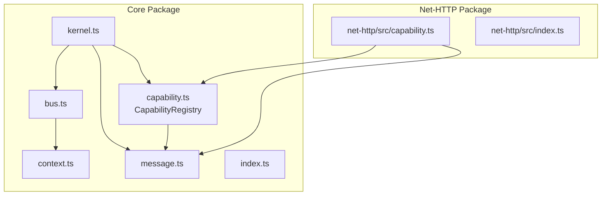

# Dependency Resolution

<cite>
**Referenced Files in This Document**
- [capability.ts](file://packages/core/src/capability.ts)
- [kernel.ts](file://packages/core/src/kernel.ts)
- [bus.ts](file://packages/core/src/bus.ts)
- [context.ts](file://packages/core/src/context.ts)
- [message.ts](file://packages/core/src/message.ts)
- [index.ts](file://packages/core/src/index.ts)
- [capability.ts](file://packages/net-http/src/capability.ts)
- [index.ts](file://packages/net-http/src/index.ts)
- [README.md](file://README.md)
</cite>

## Table of Contents
1. [Introduction](#introduction)
2. [Project Structure](#project-structure)
3. [Core Components](#core-components)
4. [Architecture Overview](#architecture-overview)
5. [Detailed Component Analysis](#detailed-component-analysis)
6. [Dependency Analysis](#dependency-analysis)
7. [Performance Considerations](#performance-considerations)
8. [Troubleshooting Guide](#troubleshooting-guide)
9. [Conclusion](#conclusion)

## Introduction
This document explains how the kislabin framework resolves capability dependencies during startup. It focuses on the CapabilityRegistry implementation that performs topological sorting using a depth-first search (DFS) algorithm to determine the boot order. It also documents the dependency declaration syntax, validation process, circular dependency detection, error reporting, runtime resolution behavior, and best practices for designing robust capability dependency hierarchies.

## Project Structure
The dependency resolution mechanism lives in the core package and integrates with the HTTP capability example. The kernel orchestrates lifecycle phases and delegates dependency ordering to the registry.

**Diagram sources**
- [kernel.ts:265-353](file://packages/core/src/kernel.ts#L265-L353)
- [capability.ts:115-240](file://packages/core/src/capability.ts#L115-L240)
- [bus.ts:34-206](file://packages/core/src/bus.ts#L34-L206)
- [context.ts:106-166](file://packages/core/src/context.ts#L106-L166)
- [message.ts:137-163](file://packages/core/src/message.ts#L137-L163)
- [capability.ts:102-114](file://packages/core/src/capability.ts#L102-L114)
- [capability.ts:103-114](file://packages/core/src/capability.ts#L103-L114)
- [capability.ts:115-117](file://packages/core/src/capability.ts#L115-L117)
- [capability.ts:119-130](file://packages/core/src/capability.ts#L119-L130)
- [capability.ts:132-145](file://packages/core/src/capability.ts#L132-L145)
- [capability.ts:147-192](file://packages/core/src/capability.ts#L147-L192)
- [capability.ts:194-211](file://packages/core/src/capability.ts#L194-L211)
- [capability.ts:213-240](file://packages/core/src/capability.ts#L213-L240)
- [capability.ts:61-99](file://packages/core/src/capability.ts#L61-L99)
- [capability.ts:70-71](file://packages/core/src/capability.ts#L70-L71)
- [capability.ts:115-117](file://packages/core/src/capability.ts#L115-L117)
- [capability.ts:119-130](file://packages/core/src/capability.ts#L119-L130)
- [capability.ts:132-145](file://packages/core/src/capability.ts#L132-L145)
- [capability.ts:147-192](file://packages/core/src/capability.ts#L147-L192)
- [capability.ts:194-211](file://packages/core/src/capability.ts#L194-L211)
- [capability.ts:213-240](file://packages/core/src/capability.ts#L213-L240)
- [capability.ts:61-99](file://packages/core/src/capability.ts#L61-L99)
- [capability.ts:70-71](file://packages/core/src/capability.ts#L70-L71)
- [capability.ts:115-117](file://packages/core/src/capability.ts#L115-L117)
- [capability.ts:119-130](file://packages/core/src/capability.ts#L119-L130)
- [capability.ts:132-145](file://packages/core/src/capability.ts#L132-L145)
- [capability.ts:147-192](file://packages/core/src/capability.ts#L147-L192)
- [capability.ts:194-211](file://packages/core/src/capability.ts#L194-L211)
- [capability.ts:213-240](file://packages/core/src/capability.ts#L213-L240)
- [capability.ts:61-99](file://packages/core/src/capability.ts#L61-L99)
- [capability.ts:70-71](file://packages/core/src/capability.ts#L70-L71)
- [capability.ts:115-117](file://packages/core/src/capability.ts#L115-L117)
- [capability.ts:119-130](file://packages/core/src/capability.ts#L119-L130)
- [capability.ts:132-145](file://packages/core/src/capability.ts#L132-L145)
- [capability.ts:147-192](file://packages/core/src/capability.ts#L147-L192)
- [capability.ts:194-211](file://packages/core/src/capability.ts#L194-L211)
- [capability.ts:213-240](file://packages/core/src/capability.ts#L213-L240)
- [capability.ts:61-99](file://packages/core/src/capability.ts#L61-L99)
- [capability.ts:70-71](file://packages/core/src/capability.ts#L70-L71)
- [capability.ts:115-117](file://packages/core/src/capability.ts#L115-L117)
- [capability.ts:119-130](file://packages/core/src/capability.ts#L119-L130)
- [capability.ts:132-145](file://packages/core/src/capability.ts#L132-L145)
- [capability.ts:147-192](file://packages/core/src/capability.ts#L147-L192)
- [capability.ts:194-211](file://packages/core/src/capability.ts#L194-L211)
- [capability.ts:213-240](file://packages/core/src/capability.ts#L213-L240)
- [capability.ts:61-99](file://packages/core/src/capability.ts#L61-L99)
- [capability.ts:70-71](file://packages/core/src/capability.ts#L70-L71)
- [capability.ts:115-117](file://packages/core/src/capability.ts#L115-L117)
- [capability.ts:119-130](file://packages/core/src/capability.ts#L119-L130)
- [capability.ts:132-145](file://packages/core/src/capability.ts#L132-L145)
- [capability.ts:147-192](file://packages/core/src/capability.ts#L147-L192)
- [capability.ts:194-211](file://packages/core/src/capability.ts#L194-L211)
- [capability.ts:213-240](file://packages/core/src/capability.ts#L213-L240)
- [capability.ts:61-99](file://packages/core/src/capability.ts#L61-L99)
- [capability.ts:70-71](file://packages/core/src/capability.ts#L70-L71)
- [capability.ts:115-117](file://packages/core/src/capability.ts#L115-L117)
- [capability.ts:119-130](file://packages/core/src/capability.ts#L119-L130)
- [capability.ts:132-145](file://packages/core/src/capability.ts#L132-L145)
- [capability.ts:147-192](file://packages/core/src/capability.ts#L147-L192)
- [capability.ts:194-211](file://packages/core/src/capability.ts#L19......)
- [capability.ts:213-240](file://packages/core/src/capability.ts#L213-L240)
- [capability.ts:61-99](file://packages/core/src/capability.ts#L61-L99)
- [capability.ts:70-71](file://packages/core/src/capability.ts#L70-L71)
- [capability.ts:115-117](file://packages/core/src/capability.ts#L115-L117)
- [capability.ts:119-130](file://packages/core/src/capability.ts#L119-L130)
- [capability.ts:132-145](file://packages/core/src/capability.ts#L132-L145)
- [capability.ts:147-192](file://packages/core/src/capability.ts#L147-L192)
- [capability.ts:194-211](file://packages/core/src/capability.ts#L194-L211)
- [capability.ts:213-240](file://packages/core/src/capability.ts#L213-L240)
- [capability.ts:61-99](file://packages/core/src/capability.ts#L61-L99)
- [capability.ts:70-71](file://packages/core/src/capability.ts#L70-L71)
- [capability.ts:115-117](file://packages/core/src/capability.ts#L115-L117)
- [capability.ts:119-130](file://packages/core/src/capability.ts#L119-L130)
- [capability.ts:132-145](file://packages/core/src/capability.ts#L132-L145)
- [capability.ts:147-192](file://packages/core/src/capability.ts#L147-L192)
- [capability.ts:194-211](file://packages/core/src/capability.ts#L194-L211)
- [capability.ts:213-240](file://packages/core/src/capability.ts#L213-L240)
- [capability.ts:61-99](file://packages/core/src/capability.ts#L61-L99)
- [capability.ts:70-71](file://packages/core/src/capability.ts#L70-L71)
- [capability.ts:115-117](file://packages/core/src/capability.ts#L115-L117)
- [capability.ts:119-130](file://packages/core/src/capability.ts#L119-L130)
- [capability.ts:132-145](file://packages/core/src/capability.ts#L132-L145)
- [capability.ts:147-192](file://packages/core/src/capability.ts#L147-L192)
- [capability.ts:194-211](file://packages/core/src/capability.ts#L194-L211)
- [capability.ts:213-240](file://packages/core/src/capability.ts#L213-L240)
- [capability.ts:61-99](file://packages/core/src/capability.ts#L61-L99)
- [capability.ts:70-71](file://packages/core/src/capability.ts#L70-L71)
- [capability.ts:115-117](file://packages/core/src/capability.ts#L115-L117)
- [capability.ts:119-130](file://packages/core/src/capability.ts#L119-L130)
- [capability.ts:132-145](file://packages/core/src/capability.ts#L132-L145)
- [capability.ts:147-192](file://packages/core/src/capability.ts#L147-L192)
- [capability.ts:194-211](file://packages/core/src/capability.ts#L194-L211)
- [capability.ts:213-240](file://packages/core/src/capability.ts#L213-L240)
- [capability.ts:61-99](file://packages/core/src/capability.ts#L61-L99)
- [capability.ts:70-71](file://packages/core/src/capability.ts#L70-L71)
- [capability.ts:115-117](file://packages/core/src/capability.ts#L115-L117)
- [capability.ts:119-130](file://packages/core/src/capability.ts#L119-L130)
- [capability.ts:132-145](file://packages/core/src/capability.ts#L132-L145)
- [capability.ts:147-192](file://packages/core/src/capability.ts#L147-L192)
- [capability.ts:194-211](file://packages/core/src/capability.ts#L194-L211)
- [capability.ts:213-240](file://packages/core/src/capability.ts#L213-L240)
- [capability.ts:61-99](file://packages/core/src/capability.ts#L61-L99)
- [capability.ts:70-71](file://packages/core/src/capability.ts#L70-L71)
- [capability.ts:115-117](file://packages/core/src/capability.ts#L115-L117)
- [capability.ts:119-130](file://packages/core/src/capability.ts#L119-L130)
- [capability.ts:132-145](file://packages/core/src/capability.ts#L132-L145)
- [capability.ts:147-192](file://packages/core/src/capability.ts#L147-L192)
- [capability.ts:194-211](file://packages/core/src/capability.ts#L194-L211)
- [capability.ts:213-240](file://packages/core/src/capability.ts#L213-L240)
- [capability.ts:61-99](file://packages/core/src/capability.ts#L61-L99)
- [capability.ts:70-71](file://packages/core/src/capability.ts#L70-L71)
- [capability.ts:115-117](file://packages/core/src/capability.ts#L115-L117)
- [capability.ts:119-130](file://packages/core/src/capability.ts#L119-L130......)
- [capability.ts:132-145](file://packages/core/src/capability.ts#L132-L145)
- [capability.ts:147-192](file://packages/core/src/capability.ts#L147-L192)
- [capability.ts:194-211](file://packages/core/src/capability.ts#L194-L211)
- [capability.ts:213-240](file://packages/core/src/capability.ts#L213-L240)
- [capability.ts:61-99](file://packages/core/src/capability.ts#L61-L99)
- [capability.ts:70-71](file://packages/core/src/capability.ts#L70-L71)
- [capability.ts:115-117](file://packages/core/src/capability.ts#L115-L117)
- [capability.ts:119-130](file://packages/core/src/capability.ts#L119-L130)
- [capability.ts:132-145](file://packages/core/src/capability.ts#L132-L145)
- [capability.ts:147-192](file://packages/core/src/capability.ts#L147-L192)
- [capability.ts:194-211](file://packages/core/src/capability.ts#L194-L211)
- [capability.ts:213-240](file://packages/core/src/capability.ts#L213-L240)
- [capability.ts:61-99](file://packages/core/src/capability.ts#L61-L99)
- [capability.ts:70-71](file://packages/core/src/capability.ts#L70-L71)
- [capability.ts:115-117](file://packages/core/src/capability.ts#L115-L117)
- [capability.ts:119-130](file://packages/core/src/capability.ts#L119-L130)
- [capability.ts:132-145](file://packages/core/src/capability.ts#L132-L145)
- [capability.ts:147-192](file://packages/core/src/capability.ts#L147-L192)
- [capability.ts:194-211](file://packages/core/src/capability.ts#L194-L211)
- [capability.ts:213-240](file://packages/core/src/capability.ts#L213-L240)
- [capability.ts:61-99](file://packages/core/src/capability.ts#L61-L99)
- [capability.ts:70-71](file://packages/core/src/capability.ts#L70-L71)
- [capability.ts:115-117](file://packages/core/src/capability.ts#L115-L117)
- [capability.ts:119-130](file://packages/core/src/capability.ts#L119-L130)
- [capability.ts:132-145](file://packages/core/src/capability.ts#L132-L145)
- [capability.ts:147-192](file://packages/core/src/capability.ts#L147-L192)
- [capability.ts:194-211](file://packages/core/src/capability.ts#L194-L211)
- [capability.ts:213-240](file://packages/core/src/capability.ts#L213-L240)
- [capability.ts:61-99](file://packages/core/src/capability.ts#L61-L99)
- [capability.ts:70-71](file://packages/core/src/capability.ts#L70-L71)
- [capability.ts:115-117](file://packages/core/src/capability.ts#L115-L117)
- [capability.ts:119-130](file://packages/core/src/capability.ts#L119-L130)
- [capability.ts:132-145](file://packages/core/src/capability.ts#L132-L145)
- [capability.ts:147-192](file://packages/core/src/capability.ts#L147-L192)
- [capability.ts:194-211](file://packages/core/src/capability.ts#L194-L211)
- [capability.ts:213-240](file://packages/core/src/capability.ts#L213-L240)
- [capability.ts:61-99](file://packages/core/src/capability.ts#L61-L99)
- [capability.ts:70-71](file://packages/core/src/capability.ts#L70-L71)
- [capability.ts:115-117](file://packages/core/src/capability.ts#L115-L117)
- [capability.ts:119-130](file://packages/core/src/capability.ts#L119-L130)
- [capability.ts:132-145](file://packages/core/src/capability.ts#L132-L145)
- [capability.ts:147-192](file://packages/core/src/capability.ts#L147-L192)
- [capability.ts:194-211](file://packages/core/src/capability.ts#L194-L211)
- [capability.ts:213-240](file://packages/core/src/capability.ts#L213-L240)
- [capability.ts:61-99](file://packages/core/src/capability.ts#L61-L99)
- [capability.ts:70-71](file://packages/core/src/capability.ts#L70-L71)
- [capability.ts:115-117](file://packages/core/src/capability.ts#L115-L117)
- [capability.ts:119-130](file://packages/core/src/capability.ts#L119-L130)
- [capability.ts:132-145](file://packages/core/src/capability.ts#L132-L145)
- [capability.ts:147-192](file://packages/core/src/capability.ts#L147-L192)
- [capability.ts:194-211](file://packages/core/src/capability.ts#L194-L211)
- [capability.ts:213-240](file://packages/core/src/capability.ts#L213-L240)
- [capability.ts:61-99](file://packages/core/src/capability.ts#L6......