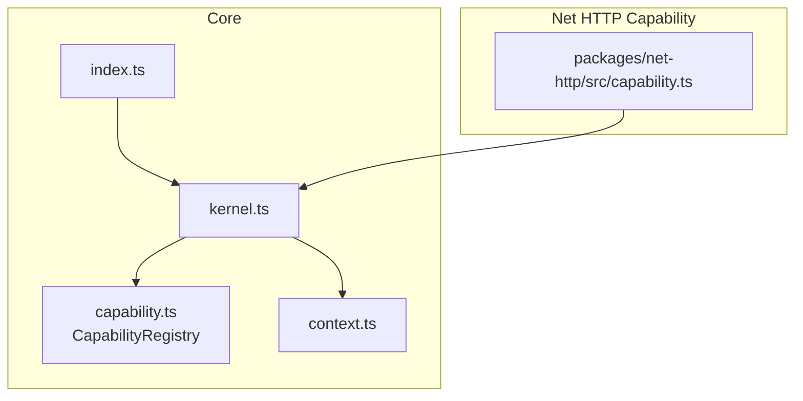
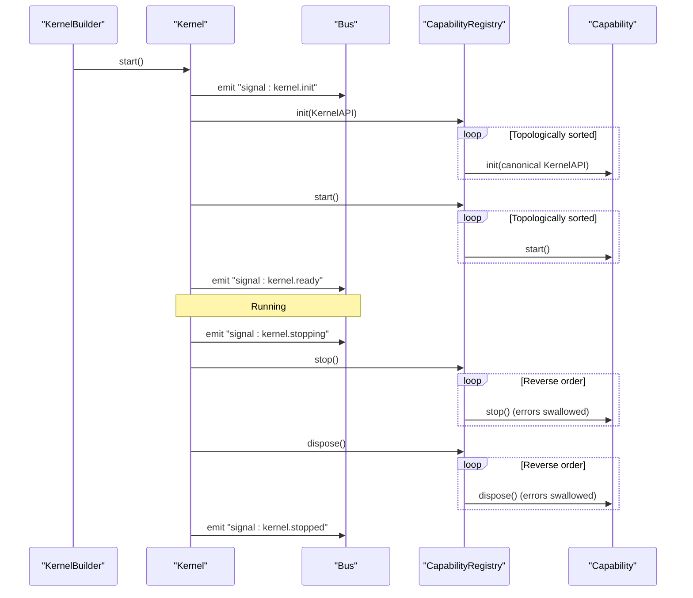
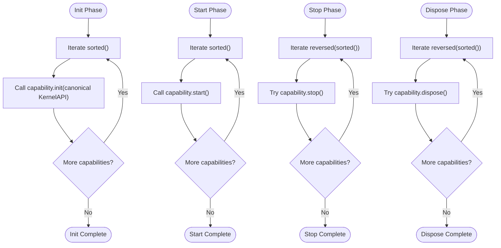
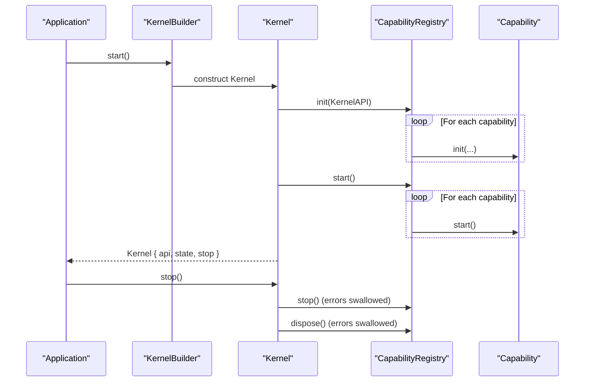
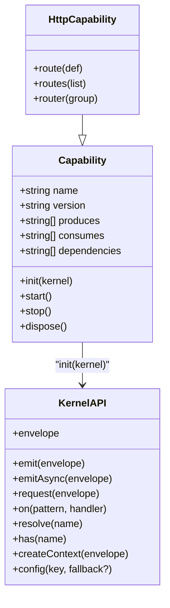
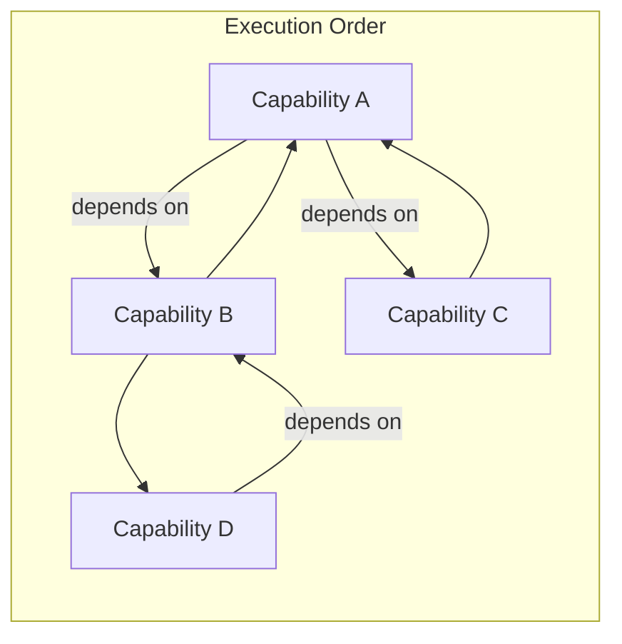

# Lifecycle Management

<cite>
**Referenced Files in This Document**
- [capability.ts](file://packages/core/src/capability.ts)
- [kernel.ts](file://packages/core/src/kernel.ts)
- [index.ts](file://packages/core/src/index.ts)
- [context.ts](file://packages/core/src/context.ts)
- [capability.ts](file://packages/net-http/src/capability.ts)
- [README.md](file://README.md)
</cite>

## Table of Contents
1. [Introduction](#introduction)
2. [Project Structure](#project-structure)
3. [Core Components](#core-components)
4. [Architecture Overview](#architecture-overview)
5. [Detailed Component Analysis](#detailed-component-analysis)
6. [Dependency Analysis](#dependency-analysis)
7. [Performance Considerations](#performance-considerations)
8. [Troubleshooting Guide](#troubleshooting-guide)
9. [Conclusion](#conclusion)

## Introduction
This document explains the capability lifecycle management in the kislabin framework. It covers the four-phase lifecycle (init, start, stop, dispose), execution order, failure handling, and how the CapabilityRegistry orchestrates topological ordering. It also documents the KernelAPI passed to init methods, including handler registration and configuration access, and describes fail-fast behavior during initialization and graceful shutdown procedures. Practical patterns for resource acquisition and release, error handling, logging, and debugging during lifecycle transitions are included, along with the relationship between capability dependencies and lifecycle ordering.

## Project Structure
The lifecycle management spans the core kernel and capability registry, plus a concrete capability example (HTTP). The public API exports the kernel entry point and types.

**Diagram sources**
- [kernel.ts:265-354](file://packages/core/src/kernel.ts#L265-L354)
- [capability.ts:115-240](file://packages/core/src/capability.ts#L115-L240)
- [index.ts:10-28](file://packages/core/src/index.ts#L10-L28)
- [capability.ts:102-223](file://packages/net-http/src/capability.ts#L102-L223)

**Section sources**
- [README.md:100-142](file://README.md#L100-L142)
- [index.ts:10-28](file://packages/core/src/index.ts#L10-L28)

## Core Components
- Capability: Defines the contract for isolated subsystems with lifecycle hooks and optional dependencies.
- CapabilityRegistry: Manages capability registration, topological sorting, and lifecycle execution.
- KernelAPI: The system interface exposed to capabilities during init, enabling handler registration, configuration access, and envelope creation.
- KernelBuilder: Fluent builder used to configure and start the kernel, emitting lifecycle signals.

Key lifecycle phases:
- Init: Register handlers, validate configuration, prepare resources.
- Start: Open connections, begin listening.
- Stop: Drain ongoing work, stop accepting new work.
- Dispose: Release resources; always executes even if stop failed.

Fail-fast and graceful behavior:
- Initialization: Missing dependencies or cycles cause immediate boot failure.
- Shutdown: stop swallows errors and continues; dispose always runs after stop.

**Section sources**
- [capability.ts:28-99](file://packages/core/src/capability.ts#L28-L99)
- [capability.ts:103-240](file://packages/core/src/capability.ts#L103-L240)
- [kernel.ts:36-134](file://packages/core/src/kernel.ts#L36-L134)
- [kernel.ts:136-183](file://packages/core/src/kernel.ts#L136-L183)
- [kernel.ts:204-245](file://packages/core/src/kernel.ts#L204-L245)

## Architecture Overview
The kernel coordinates lifecycle execution and emits signals for observability. The CapabilityRegistry resolves dependency order and ensures deterministic execution.

**Diagram sources**
- [kernel.ts:314-349](file://packages/core/src/kernel.ts#L314-L349)
- [capability.ts:194-239](file://packages/core/src/capability.ts#L194-L239)

## Detailed Component Analysis

### Capability Interface and Lifecycle
- Capability defines name, version, produces/consumes message types, dependencies, and lifecycle hooks.
- Lifecycle phases:
  - init(kernel): register handlers, validate config, prepare resources; fail-fast on error.
  - start(): open connections, begin listening; executed after init.
  - stop(): drain and stop accepting new work; executed in reverse dependency order; errors are swallowed.
  - dispose(): release resources; always executes after stop; errors are swallowed.

Topological ordering:
- sorted() performs a depth-first traversal with visiting/visited sets to detect missing dependencies and cycles.
- The result is cached for the lifetime of the registry.

KernelAPI in init:
- Provides emit/emitAsync/request for messaging.
- on(pattern, handler) registers handlers.
- resolve(name)/has(name) for cross-capability access.
- config(key[, fallback]) for fail-fast or fallback configuration retrieval.
- envelope factory bound to the capability’s source for creating envelopes.

**Section sources**
- [capability.ts:28-99](file://packages/core/src/capability.ts#L28-L99)
- [capability.ts:103-192](file://packages/core/src/capability.ts#L103-L192)
- [kernel.ts:36-134](file://packages/core/src/kernel.ts#L36-L134)

### CapabilityRegistry Execution Flow
- init(kernel): iterates sorted capabilities and invokes init with a KernelAPI bound to the capability’s source.
- start(): iterates sorted capabilities and invokes start.
- stop(): iterates reversed order; catches and suppresses errors.
- dispose(): iterates reversed order; catches and suppresses errors.

**Diagram sources**
- [capability.ts:194-239](file://packages/core/src/capability.ts#L194-L239)

**Section sources**
- [capability.ts:194-239](file://packages/core/src/capability.ts#L194-L239)

### Kernel Lifecycle Orchestration
- KernelBuilder.start() emits "signal:kernel.init", runs registry.init and registry.start, then emits "signal:kernel.ready".
- Kernel.stop() emits "signal:kernel.stopping", runs registry.stop, then registry.dispose, then emits "signal:kernel.stopped".

**Diagram sources**
- [kernel.ts:314-349](file://packages/core/src/kernel.ts#L314-L349)
- [capability.ts:194-239](file://packages/core/src/capability.ts#L194-L239)

**Section sources**
- [kernel.ts:232-244](file://packages/core/src/kernel.ts#L232-L244)
- [kernel.ts:314-349](file://packages/core/src/kernel.ts#L314-L349)

### HTTP Capability Example
The HTTP capability demonstrates lifecycle usage:
- init(): compiles declared routes and prepares handler mappings.
- start(): starts the HTTP server via Bun.serve and logs readiness.
- stop(): stops the server gracefully.
- dispose(): clears server reference.

**Diagram sources**
- [capability.ts:28-99](file://packages/core/src/capability.ts#L28-L99)
- [capability.ts:102-223](file://packages/net-http/src/capability.ts#L102-L223)
- [kernel.ts:36-134](file://packages/core/src/kernel.ts#L36-L134)

**Section sources**
- [capability.ts:102-223](file://packages/net-http/src/capability.ts#L102-L223)

## Dependency Analysis
- Dependencies are declared in the Capability.dependencies array.
- sorted() enforces topological order during init/start and reverse order during stop/dispose.
- Missing dependencies or cycles are detected immediately with descriptive errors.

**Diagram sources**
- [capability.ts:147-192](file://packages/core/src/capability.ts#L147-L192)

**Section sources**
- [capability.ts:147-192](file://packages/core/src/capability.ts#L147-L192)

## Performance Considerations
- Topological sort is computed once and cached, minimizing repeated computation across lifecycle phases.
- Handler registration and envelope creation are lightweight; avoid heavy work in init/start to keep boot fast.
- Use request() for synchronous responses and emitAsync() for fire-and-forget broadcasting to manage throughput.

## Troubleshooting Guide
Common issues and strategies:
- Missing dependency during boot:
  - Symptom: Immediate error indicating a missing dependency.
  - Action: Ensure the dependent capability is registered before the consumer.
- Circular dependency:
  - Symptom: Error reporting a cycle with the full chain.
  - Action: Remove or restructure dependencies to eliminate cycles.
- Initialization failures:
  - Symptom: Boot fails with an error thrown from a capability’s init.
  - Action: Fix configuration access (fail-fast config) or handler registration; review resource preparation.
- Graceful shutdown:
  - Behavior: stop swallows errors and continues; dispose always runs.
  - Action: Implement stop to drain and stop accepting new work; implement dispose to release resources safely.
- Logging and debugging:
  - Use kernel signals to observe lifecycle transitions.
  - Emit capability-specific events via kernel.envelope to track progress.
  - Leverage Context for correlation and tracing across handlers.

**Section sources**
- [capability.ts:153-192](file://packages/core/src/capability.ts#L153-L192)
- [kernel.ts:314-349](file://packages/core/src/kernel.ts#L314-L349)

## Conclusion
Kislabin’s lifecycle management provides explicit, deterministic, and observable control over capability lifecycles. The CapabilityRegistry enforces dependency-aware ordering, while KernelAPI exposes a focused set of capabilities to capabilities during init. Fail-fast initialization and graceful shutdown with defensive disposal ensure robust system behavior. By structuring capabilities around the four-phase lifecycle and leveraging dependency declarations, developers can compose complex systems with predictable startup, operation, and teardown semantics.