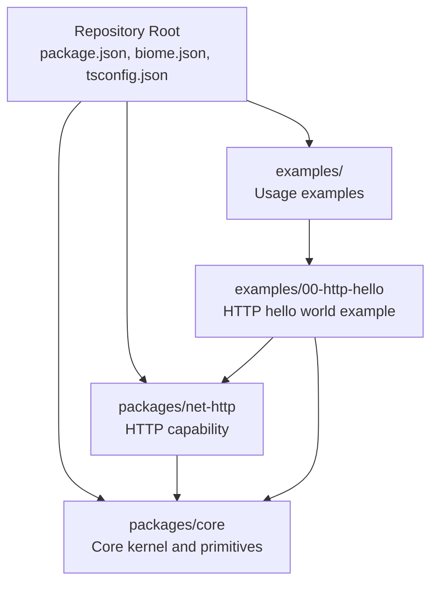
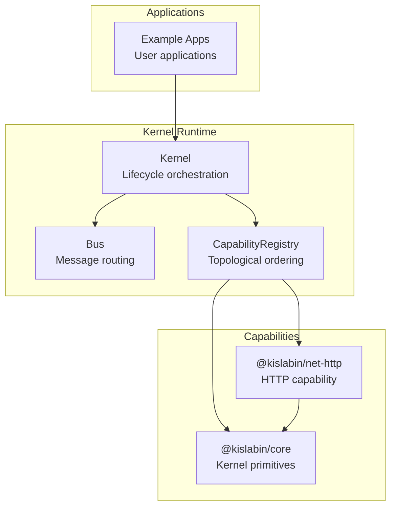
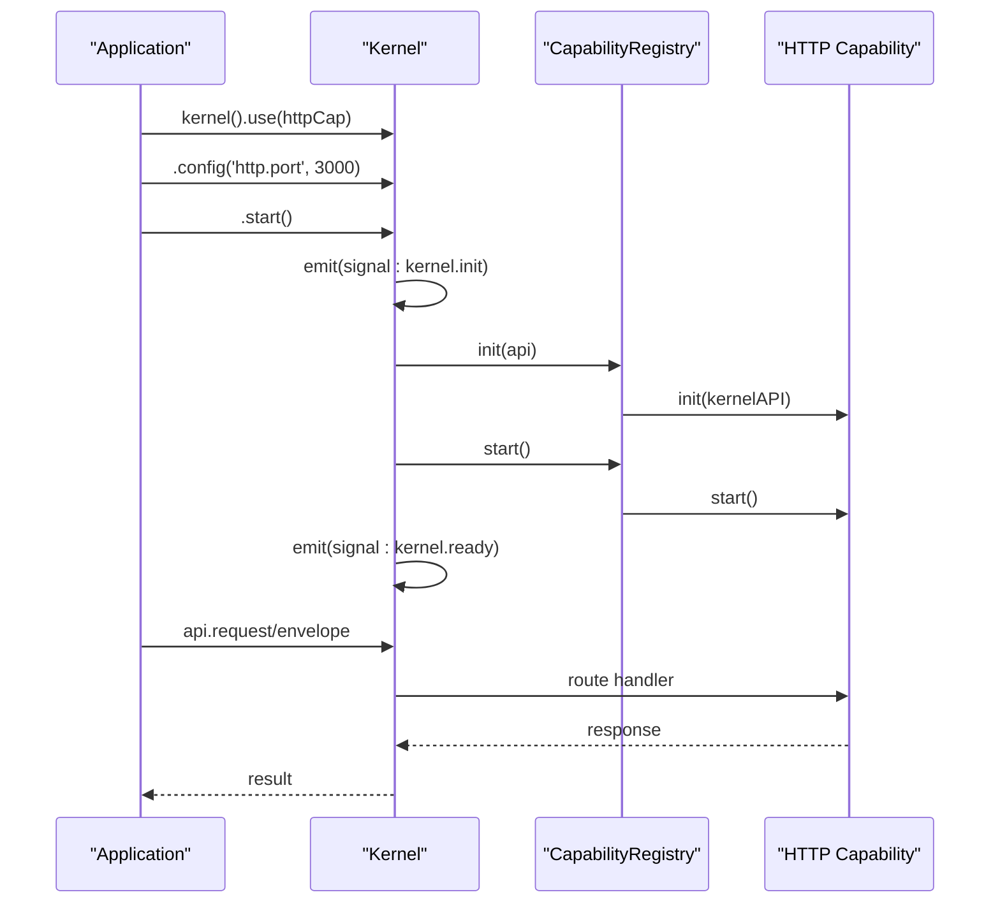
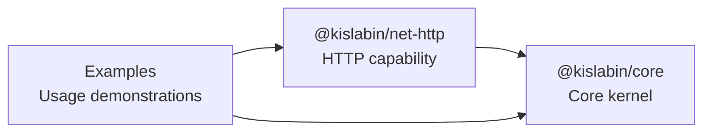

# Contributing & Development

<cite>
**Referenced Files in This Document**
- [README.md](file://README.md)
- [package.json](file://package.json)
- [biome.json](file://biome.json)
- [tsconfig.json](file://tsconfig.json)
- [CLAUDE.md](file://CLAUDE.md)
- [packages/core/README.md](file://packages/core/README.md)
- [packages/core/src/index.ts](file://packages/core/src/index.ts)
- [packages/core/src/kernel.ts](file://packages/core/src/kernel.ts)
- [packages/core/src/bus.ts](file://packages/core/src/bus.ts)
- [examples/00-http-hello/src/index.ts](file://examples/00-http-hello/src/index.ts)
- [packages/net-http/package.json](file://packages/net-http/package.json)
- [packages/net-http/tsconfig.json](file://packages/net-http/tsconfig.json)
</cite>

## Table of Contents
1. [Introduction](#introduction)
2. [Project Structure](#project-structure)
3. [Core Components](#core-components)
4. [Architecture Overview](#architecture-overview)
5. [Development Environment Setup](#development-environment-setup)
6. [Build Processes](#build-processes)
7. [Testing Procedures](#testing-procedures)
8. [Code Standards and Formatting](#code-standards-and-formatting)
9. [Contribution Workflow](#contribution-workflow)
10. [Development Scripts and Commands](#development-scripts-and-commands)
11. [Debugging and Profiling](#debugging-and-profiling)
12. [Extending the Framework](#extending-the-framework)
13. [Dependency Analysis](#dependency-analysis)
14. [Performance Considerations](#performance-considerations)
15. [Troubleshooting Guide](#troubleshooting-guide)
16. [Conclusion](#conclusion)

## Introduction
This document provides comprehensive contributing and development guidance for the kislabin project. It covers environment setup, project structure, build and testing processes, code standards, contribution workflow, development commands, debugging and profiling, and extension guidelines. The project is a minimal kernel for backend applications written in TypeScript, designed to be portable across languages and focused on message-driven capabilities.

## Project Structure
The repository follows a workspace-based monorepo layout with a core package and an HTTP capability package. The core package exposes the kernel API and primitives, while the HTTP capability integrates network I/O as a capability.

**Diagram sources**
- [package.json:1-29](file://package.json#L1-L29)
- [packages/net-http/package.json:1-25](file://packages/net-http/package.json#L1-L25)
- [examples/00-http-hello/src/index.ts:1-12](file://examples/00-http-hello/src/index.ts#L1-L12)

**Section sources**
- [README.md:98-142](file://README.md#L98-L142)
- [package.json:24-27](file://package.json#L24-L27)
- [packages/net-http/package.json:16-18](file://packages/net-http/package.json#L16-L18)

## Core Components
The core package provides the kernel, message primitives, bus, capability registry, and context. These components form the foundation for building capabilities and applications.

Key elements:
- Kernel API and lifecycle management
- Message primitives and envelope factory
- Bus for message routing and dispatch
- Capability registration and lifecycle orchestration
- ExecutionContext for request-scoped state

**Section sources**
- [packages/core/src/index.ts:10-28](file://packages/core/src/index.ts#L10-L28)
- [packages/core/src/kernel.ts:36-183](file://packages/core/src/kernel.ts#L36-L183)
- [packages/core/src/bus.ts:34-206](file://packages/core/src/bus.ts#L34-L206)
- [packages/core/README.md:58-96](file://packages/core/README.md#L58-L96)

## Architecture Overview
Kislabin implements a message-driven architecture where all I/O is encapsulated in capabilities. The kernel manages lifecycle and routing, while capabilities handle domain-specific concerns.

**Diagram sources**
- [packages/core/src/kernel.ts:21-32](file://packages/core/src/kernel.ts#L21-L32)
- [packages/core/src/bus.ts:20-33](file://packages/core/src/bus.ts#L20-L33)
- [packages/net-http/package.json:16-18](file://packages/net-http/package.json#L16-L18)

## Development Environment Setup
Requirements:
- Bun runtime (>= 1.0)
- TypeScript (>= 5.0)
- Git for version control

Installation steps:
1. Install Bun following the official installation guide
2. Clone the repository
3. Install dependencies using the workspace configuration

Verification:
- Run the HTTP hello world example to confirm setup
- Execute type checking to validate TypeScript configuration

**Section sources**
- [README.md:224-235](file://README.md#L224-L235)
- [CLAUDE.md:14-30](file://CLAUDE.md#L14-L30)
- [package.json:18-23](file://package.json#L18-L23)

## Build Processes
The project uses Bun for direct TypeScript execution without a traditional build step. This enables rapid iteration during development.

Build and run flow:
1. Install dependencies with Bun
2. Execute TypeScript files directly with Bun
3. Use TypeScript compiler for type checking
4. Leinster formatting and linting via Biome

Workspace configuration:
- Root package.json defines workspaces for packages and examples
- Individual packages declare their own TypeScript configurations
- HTTP capability depends on the core package via workspace protocol

**Section sources**
- [CLAUDE.md:17-30](file://CLAUDE.md#L17-L30)
- [package.json:24-27](file://package.json#L24-L27)
- [packages/net-http/package.json:16-18](file://packages/net-http/package.json#L16-L18)

## Testing Procedures
Testing approach:
- Use examples as integration tests
- Validate message dispatch and capability lifecycle
- Test error handling scenarios
- Verify HTTP capability behavior

Recommended testing workflow:
1. Run example applications to validate functionality
2. Add new examples for new features
3. Use request/response patterns to validate handlers
4. Test wildcard pattern matching
5. Verify graceful shutdown sequences

**Section sources**
- [packages/core/README.md:101-201](file://packages/core/README.md#L101-L201)
- [examples/00-http-hello/src/index.ts:1-12](file://examples/00-http-hello/src/index.ts#L1-L12)

## Code Standards and Formatting
The project enforces strict code quality using Biome:

Formatting rules:
- Indentation with spaces (indentStyle: "space")
- Maximum line width of 100 characters
- Double quotes for JavaScript strings
- Automatic import organization

Linting rules:
- Linter enabled with recommended ruleset
- Strict TypeScript compilation settings
- VCS integration for automatic formatting

TypeScript configuration:
- ESNext target and module system
- Bundler module resolution
- Strict type checking
- No emit for development

**Section sources**
- [biome.json:13-24](file://biome.json#L13-L24)
- [biome.json:25-35](file://biome.json#L25-L35)
- [tsconfig.json:2-28](file://tsconfig.json#L2-L28)

## Contribution Workflow
Proposed contribution process:

1. Issue creation
   - Search existing issues before filing new ones
   - Provide clear problem statements and reproduction steps
   - Include relevant logs and environment details

2. Development guidelines
   - Follow the kernel philosophy: keep core minimal, move I/O to capabilities
   - Implement changes incrementally and test with hello world examples
   - Respect the API contract and stability tiers

3. Pull request process
   - Fork the repository and create feature branches
   - Include comprehensive examples demonstrating changes
   - Update documentation and README sections as needed
   - Ensure all examples run successfully

4. Code review standards
   - Minimal, testable, and reversible changes
   - Hello world validation before acceptance
   - Clear trade-off explanations for proposed changes
   - Layer-specific impact assessment

**Section sources**
- [CLAUDE.md:81-98](file://CLAUDE.md#L81-L98)
- [README.md:224-235](file://README.md#L224-L235)

## Development Scripts and Commands
Essential development commands:

Basic operations:
- Install dependencies: `bun install`
- Run examples: `bun run packages/examples/00-minimal/index.ts`
- Type checking: `bun run tsc --noEmit`

Direct execution:
- Run core package directly: `bun run packages/core/src/index.ts`
- HTTP hello world: `bun run examples/00-http-hello/src/index.ts`

Workspace management:
- Root package.json defines workspaces for packages and examples
- HTTP capability depends on core via workspace protocol

**Section sources**
- [CLAUDE.md:16-30](file://CLAUDE.md#L16-L30)
- [package.json:24-27](file://package.json#L24-L27)
- [packages/net-http/package.json:16-18](file://packages/net-http/package.json#L16-L18)

## Debugging and Profiling
Debugging techniques:

1. Message flow debugging
   - Use wildcard handlers to intercept all messages
   - Log envelope metadata and payload structure
   - Monitor lifecycle signals for timing analysis

2. Capability lifecycle debugging
   - Register handlers for kernel signals
   - Track initialization order and dependency resolution
   - Verify graceful shutdown sequences

3. Performance profiling
   - Measure handler execution time
   - Profile wildcard pattern matching overhead
   - Monitor context creation costs

4. Error handling
   - Catch and log asynchronous handler errors
   - Use NoHandlerError for missing handlers
   - Implement proper error propagation in capabilities

**Section sources**
- [packages/core/src/bus.ts:91-136](file://packages/core/src/bus.ts#L91-L136)
- [packages/core/src/bus.ts:209-214](file://packages/core/src/bus.ts#L209-L214)
- [packages/core/README.md:398-407](file://packages/core/README.md#L398-L407)

## Extending the Framework
Adding new capabilities:

1. Capability interface
   - Implement init(), start(), stop(), dispose() lifecycle methods
   - Declare dependencies in dependencies array
   - Register handlers via KernelAPI.on()

2. HTTP capability example
   - Package structure follows workspace conventions
   - Depends on @kislabin/core via workspace protocol
   - Exposes route configuration and handler mapping

3. Extension guidelines
   - Keep kernel free of I/O concerns
   - Use exact match for request() operations
   - Support wildcard patterns for observation
   - Implement graceful shutdown procedures

**Diagram sources**
- [packages/core/src/kernel.ts:314-349](file://packages/core/src/kernel.ts#L314-L349)
- [packages/core/src/bus.ts:159-170](file://packages/core/src/bus.ts#L159-L170)
- [examples/00-http-hello/src/index.ts:4-10](file://examples/00-http-hello/src/index.ts#L4-L10)

**Section sources**
- [packages/core/README.md:139-186](file://packages/core/README.md#L139-L186)
- [packages/net-http/package.json:16-18](file://packages/net-http/package.json#L16-L18)
- [examples/00-http-hello/src/index.ts:1-12](file://examples/00-http-hello/src/index.ts#L1-L12)

## Dependency Analysis
Package dependencies and relationships:

**Diagram sources**
- [packages/net-http/package.json:16-18](file://packages/net-http/package.json#L16-L18)
- [examples/00-http-hello/src/index.ts:1-2](file://examples/00-http-hello/src/index.ts#L1-L2)

**Section sources**
- [packages/net-http/package.json:16-18](file://packages/net-http/package.json#L16-L18)
- [examples/00-http-hello/src/index.ts:1-2](file://examples/00-http-hello/src/index.ts#L1-L2)

## Performance Considerations
Performance characteristics and optimization strategies:

Message dispatch performance:
- Exact match: O(1) with ~1μs overhead
- Wildcard matching: O(n) where n = number of wildcard patterns
- Context creation: O(1) with ~1μs overhead
- Handler execution: O(1) with ~1μs overhead

Optimization recommendations:
1. Minimize wildcard patterns to reduce dispatch overhead
2. Use exact match for high-frequency request operations
3. Leverage emitAsync for batch operations requiring completion
4. Implement efficient handler chains with minimal context sharing
5. Monitor lifecycle signals for performance bottlenecks

**Section sources**
- [packages/core/README.md:410-420](file://packages/core/README.md#L410-L420)

## Troubleshooting Guide
Common issues and resolutions:

1. Missing configuration errors
   - Symptom: Kernel throws configuration error during startup
   - Solution: Provide required config values or use fallback defaults

2. Capability dependency cycles
   - Symptom: Boot fails with dependency resolution error
   - Solution: Review capability dependencies and remove cycles

3. Handler not found errors
   - Symptom: NoHandlerError thrown for request operations
   - Solution: Register exact match handler or adjust pattern matching

4. HTTP capability issues
   - Symptom: Port binding failures or route not found
   - Solution: Verify port configuration and route definitions

5. Type checking failures
   - Symptom: TypeScript compilation errors
   - Solution: Run Biome formatter and fix type mismatches

**Section sources**
- [packages/core/src/kernel.ts:283-287](file://packages/core/src/kernel.ts#L283-L287)
- [packages/core/src/bus.ts:159-170](file://packages/core/src/bus.ts#L159-L170)
- [packages/core/src/bus.ts:209-214](file://packages/core/src/bus.ts#L209-L214)

## Conclusion
The kislabin project provides a minimal, message-driven kernel for backend applications with a clear separation between core functionality and capabilities. The development environment is streamlined for rapid iteration using Bun and TypeScript, with strong code quality enforced through Biome. Contributions should focus on extending capabilities while maintaining the kernel's minimal footprint and portability across languages.