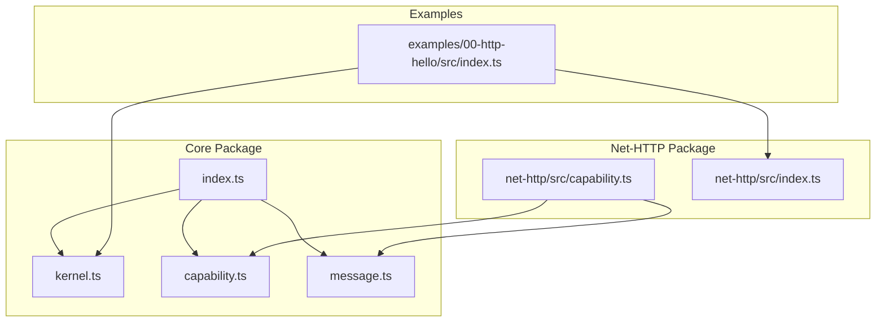
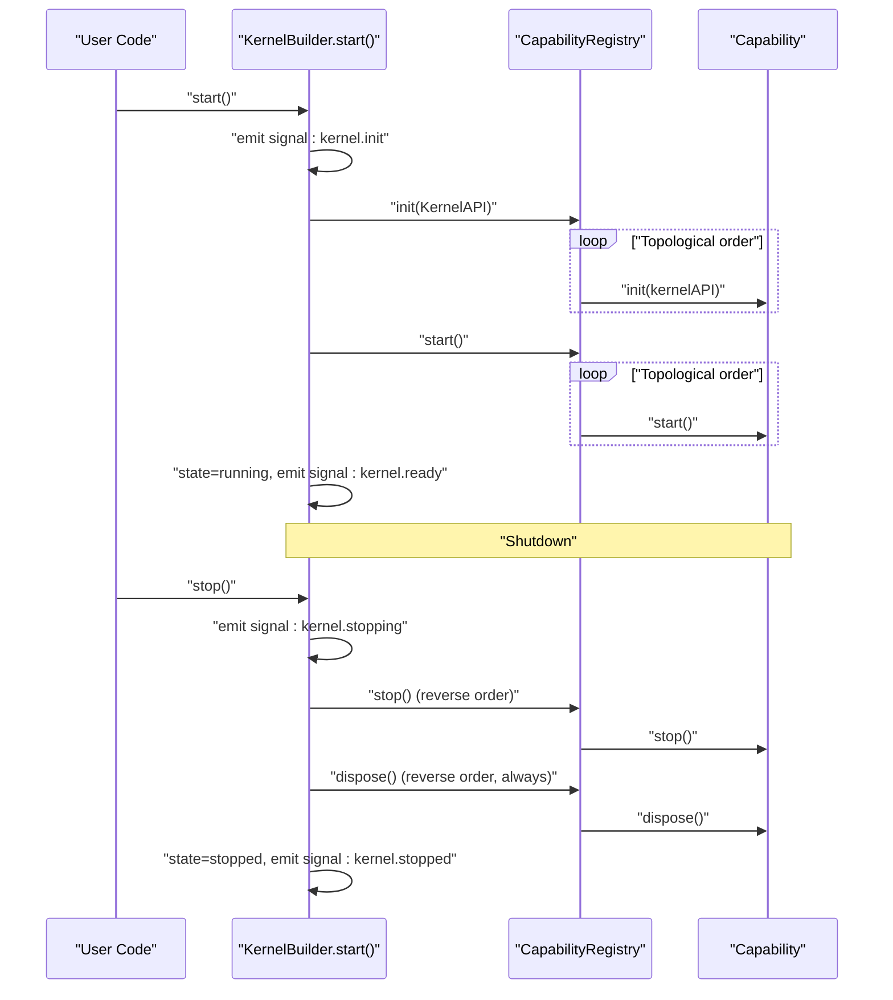
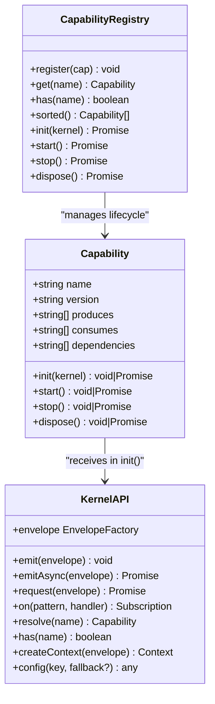
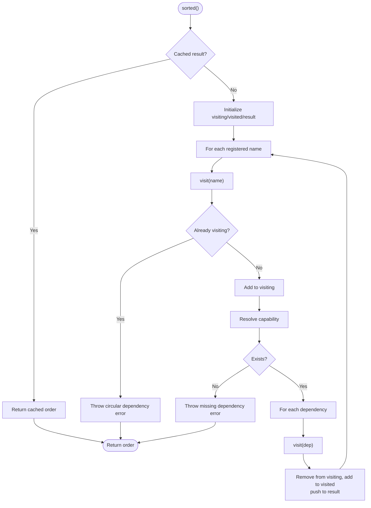
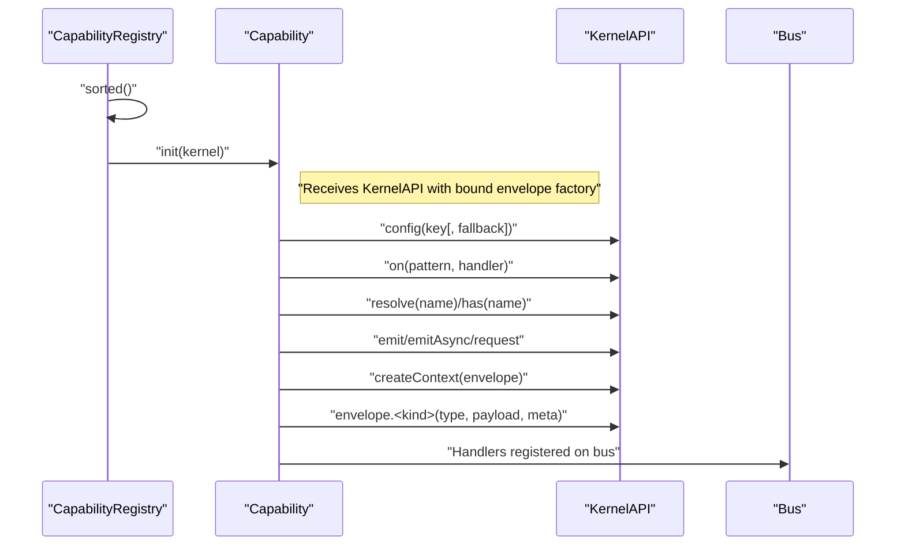
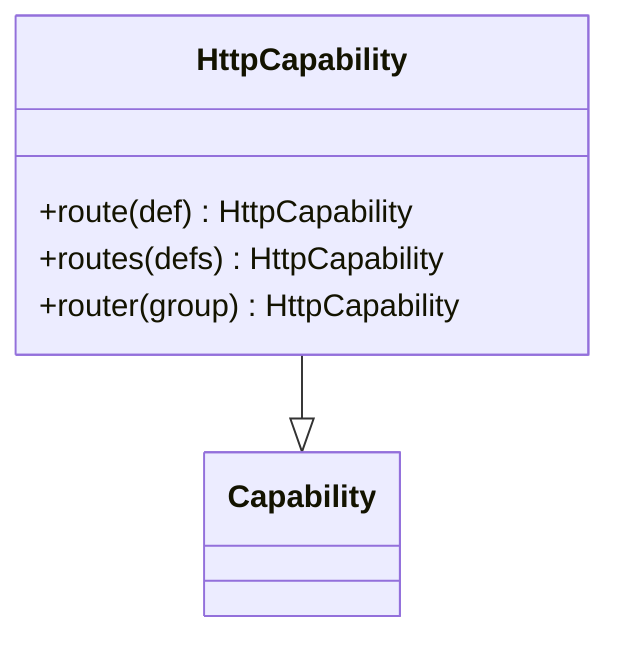
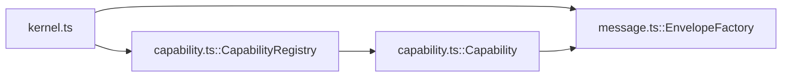

# Capability Interface

<cite>
**Referenced Files in This Document**
- [capability.ts](file://packages/core/src/capability.ts)
- [kernel.ts](file://packages/core/src/kernel.ts)
- [message.ts](file://packages/core/src/message.ts)
- [README.md](file://packages/core/README.md)
- [index.ts](file://packages/core/src/index.ts)
- [capability.ts](file://packages/net-http/src/capability.ts)
- [index.ts](file://packages/net-http/src/index.ts)
- [README.md](file://README.md)
</cite>

## Table of Contents
1. [Introduction](#introduction)
2. [Project Structure](#project-structure)
3. [Core Components](#core-components)
4. [Architecture Overview](#architecture-overview)
5. [Detailed Component Analysis](#detailed-component-analysis)
6. [Dependency Analysis](#dependency-analysis)
7. [Performance Considerations](#performance-considerations)
8. [Troubleshooting Guide](#troubleshooting-guide)
9. [Conclusion](#conclusion)

## Introduction
This document describes the capability interface and lifecycle management in the kislabin kernel. It explains the Capability contract, the four-phase lifecycle (init, start, stop, dispose), dependency management with topological sorting, and the role of KernelAPI in capability initialization. It also covers shutdown sequencing, error handling, isolation, resource management, and best practices for building capabilities.

## Project Structure
The capability system lives in the core package and is complemented by a network HTTP capability implementation. The public API exports the kernel entry point and capability types.

**Diagram sources**
- [kernel.ts:265-354](file://packages/core/src/kernel.ts#L265-L354)
- [capability.ts:1-241](file://packages/core/src/capability.ts#L1-L241)
- [message.ts:1-164](file://packages/core/src/message.ts#L1-L164)
- [index.ts:10-28](file://packages/core/src/index.ts#L10-L28)
- [capability.ts:92-223](file://packages/net-http/src/capability.ts#L92-L223)
- [index.ts:1-20](file://packages/net-http/src/index.ts#L1-L20)
- [index.ts:1-12](file://examples/00-http-hello/src/index.ts#L1-L12)

**Section sources**
- [README.md:100-142](file://README.md#L100-L142)
- [index.ts:10-28](file://packages/core/src/index.ts#L10-L28)
- [index.ts:5-20](file://packages/net-http/src/index.ts#L5-L20)

## Core Components
- Capability interface: Defines the contract for isolated subsystems with lifecycle hooks and dependency declarations.
- CapabilityRegistry: Manages capability registration, topological ordering, and lifecycle execution.
- KernelAPI: The capability-facing system interface passed to init() for registering handlers, emitting messages, resolving dependencies, and reading configuration.
- KernelBuilder and Kernel: Orchestrate lifecycle signals, boot sequence, and graceful shutdown.

Key responsibilities:
- Capability: Owns its own lifecycle and declares dependencies.
- CapabilityRegistry: Validates dependencies, orders capabilities, and executes lifecycle phases.
- Kernel: Emits lifecycle signals, manages state, and coordinates boot/shutdown.

**Section sources**
- [capability.ts:28-99](file://packages/core/src/capability.ts#L28-L99)
- [capability.ts:103-240](file://packages/core/src/capability.ts#L103-L240)
- [kernel.ts:36-134](file://packages/core/src/kernel.ts#L36-L134)
- [kernel.ts:136-183](file://packages/core/src/kernel.ts#L136-L183)
- [kernel.ts:185-245](file://packages/core/src/kernel.ts#L185-L245)

## Architecture Overview
The capability lifecycle is orchestrated by the kernel. During startup, capabilities are initialized in topological order (dependencies first), then started. On shutdown, they are stopped in reverse order (dependents first), followed by disposal in reverse order regardless of previous failures.

**Diagram sources**
- [kernel.ts:314-349](file://packages/core/src/kernel.ts#L314-L349)
- [capability.ts:194-240](file://packages/core/src/capability.ts#L194-L240)

**Section sources**
- [kernel.ts:314-349](file://packages/core/src/kernel.ts#L314-L349)
- [capability.ts:194-240](file://packages/core/src/capability.ts#L194-L240)

## Detailed Component Analysis

### Capability Interface
The Capability interface defines:
- Identity: name, version
- Messaging: produces, consumes (message type descriptors)
- Dependencies: dependencies array
- Lifecycle hooks: init(kernel), start(), stop(), dispose()

Lifecycle phases:
- init: Register handlers, validate configuration, prepare resources. Throws abort boot.
- start: Open connections, begin listening. Executes after all dependencies initialized.
- stop: Stop accepting new work, drain in-flight operations. Executed in reverse order; failures are suppressed to keep shutdown going.
- dispose: Release resources and close connections. Always executed in reverse order, even if stop failed.

**Diagram sources**
- [capability.ts:28-99](file://packages/core/src/capability.ts#L28-L99)
- [kernel.ts:65-134](file://packages/core/src/kernel.ts#L65-L134)
- [capability.ts:103-240](file://packages/core/src/capability.ts#L103-L240)

**Section sources**
- [capability.ts:28-99](file://packages/core/src/capability.ts#L28-L99)
- [capability.ts:103-240](file://packages/core/src/capability.ts#L103-L240)

### CapabilityRegistry and Topological Sorting
- Maintains a map of registered capabilities.
- sorted() performs a depth-first traversal with visiting/visited sets to detect cycles and missing dependencies.
- Caches the sorted order for the lifetime of the registry.
- init(), start(), stop(), and dispose() iterate in the cached order, ensuring deterministic lifecycle execution.

**Diagram sources**
- [capability.ts:156-192](file://packages/core/src/capability.ts#L156-L192)

**Section sources**
- [capability.ts:115-192](file://packages/core/src/capability.ts#L115-L192)

### KernelAPI and Capability Initialization
- KernelAPI is the capability-facing interface exposed to init(kernel).
- It includes messaging operations (emit, emitAsync, request, on), capability resolution (resolve, has), context creation, configuration access, and an envelope factory bound to the capability’s source.
- During init, capabilities receive a KernelAPI whose envelope factory is bound to the capability’s name, ensuring proper source attribution.

**Diagram sources**
- [capability.ts:194-204](file://packages/core/src/capability.ts#L194-L204)
- [kernel.ts:272-290](file://packages/core/src/kernel.ts#L272-L290)
- [message.ts:137-163](file://packages/core/src/message.ts#L137-L163)

**Section sources**
- [kernel.ts:65-134](file://packages/core/src/kernel.ts#L65-L134)
- [capability.ts:194-204](file://packages/core/src/capability.ts#L194-L204)
- [message.ts:137-163](file://packages/core/src/message.ts#L137-L163)

### HTTP Capability Example
The HTTP capability demonstrates a practical implementation of the Capability interface with lifecycle hooks and a fluent API for route registration. It compiles declared routes during init, starts a Bun server in start(), drains gracefully in stop(), and releases resources in dispose().

**Diagram sources**
- [capability.ts:19-23](file://packages/net-http/src/capability.ts#L19-L23)
- [capability.ts:102-179](file://packages/net-http/src/capability.ts#L102-L179)

**Section sources**
- [capability.ts:92-223](file://packages/net-http/src/capability.ts#L92-L223)
- [index.ts:1-20](file://packages/net-http/src/index.ts#L1-L20)

### Practical Examples
- Minimal usage with kernel API and message primitives.
- Capability with dependencies and lifecycle signals.
- HTTP capability usage with route registration.

**Section sources**
- [README.md:39-54](file://packages/core/README.md#L39-L54)
- [README.md:139-187](file://packages/core/README.md#L139-L187)
- [README.md:367-395](file://packages/core/README.md#L367-L395)
- [index.ts:1-12](file://examples/00-http-hello/src/index.ts#L1-L12)

## Dependency Analysis
- CapabilityRegistry depends on Capability definitions and enforces topological ordering.
- Kernel orchestrates registry usage and emits lifecycle signals.
- EnvelopeFactory ensures each capability emits messages with correct source attribution.

**Diagram sources**
- [kernel.ts:265-354](file://packages/core/src/kernel.ts#L265-L354)
- [capability.ts:103-240](file://packages/core/src/capability.ts#L103-L240)
- [message.ts:137-163](file://packages/core/src/message.ts#L137-L163)

**Section sources**
- [kernel.ts:265-354](file://packages/core/src/kernel.ts#L265-L354)
- [capability.ts:103-240](file://packages/core/src/capability.ts#L103-L240)
- [message.ts:137-163](file://packages/core/src/message.ts#L137-L163)

## Performance Considerations
- Topological sort runs once and is cached for the registry lifetime.
- Lifecycle execution is ordered and serial; parallelism is not used to maintain determinism and isolation.
- Envelope creation and handler dispatch are optimized for exact matches and minimal overhead.

**Section sources**
- [capability.ts:156-192](file://packages/core/src/capability.ts#L156-L192)
- [README.md:410-421](file://packages/core/README.md#L410-L421)

## Troubleshooting Guide
Common issues and resolutions:
- Circular dependency detected: The registry throws an error indicating the cycle chain; review dependencies and remove cycles.
- Missing dependency: If a capability declares a dependency that is not registered, an error is thrown; register the missing capability.
- Fail-fast configuration: kernel.api.config(key) without fallback throws if the key is missing; provide a fallback or set the configuration before start().
- Shutdown resilience: stop() failures are suppressed so disposal still runs; ensure disposal handles partial state safely.

**Section sources**
- [capability.ts:166-170](file://packages/core/src/capability.ts#L166-L170)
- [capability.ts:175-176](file://packages/core/src/capability.ts#L175-L176)
- [kernel.ts:283-287](file://packages/core/src/kernel.ts#L283-L287)
- [capability.ts:217-225](file://packages/core/src/capability.ts#L217-L225)
- [capability.ts:231-239](file://packages/core/src/capability.ts#L231-L239)

## Conclusion
The capability interface and lifecycle management provide a robust, deterministic, and observable foundation for building isolated subsystems. Dependencies are explicitly declared and validated via topological sorting, ensuring safe boot order. The KernelAPI offers a focused, capability-centric interface for registration, messaging, and configuration. The four-phase shutdown guarantees graceful resource release, while lifecycle signals enable observability. Following the best practices outlined here will help you build reliable, portable capabilities.