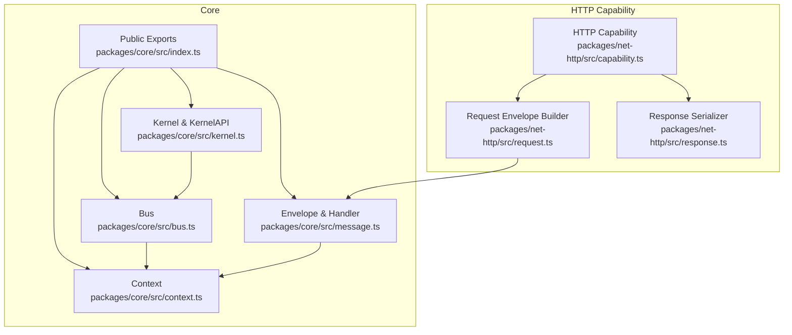
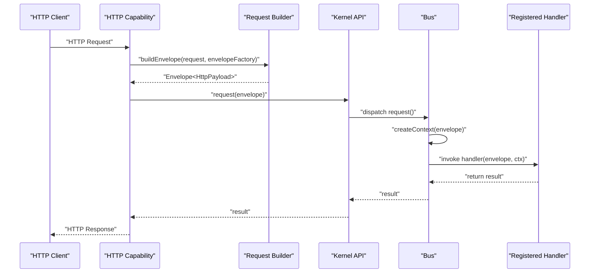
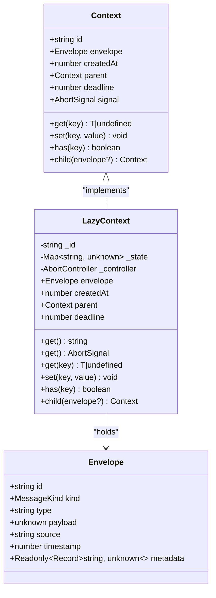
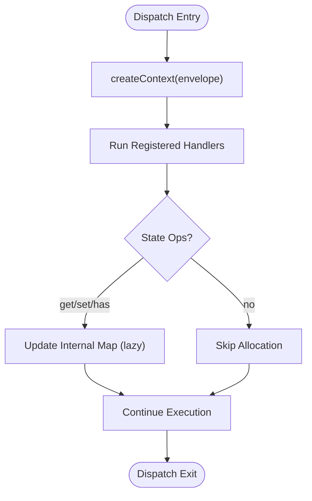
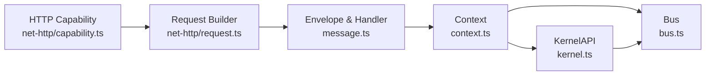

# Context System

<cite>
**Referenced Files in This Document**
- [context.ts](file://packages/core/src/context.ts)
- [message.ts](file://packages/core/src/message.ts)
- [bus.ts](file://packages/core/src/bus.ts)
- [kernel.ts](file://packages/core/src/kernel.ts)
- [index.ts](file://packages/core/src/index.ts)
- [README.md](file://packages/core/README.md)
- [capability.ts](file://packages/core/src/capability.ts)
- [request.ts](file://packages/net-http/src/request.ts)
- [response.ts](file://packages/net-http/src/response.ts)
- [capability.ts](file://packages/net-http/src/capability.ts)
</cite>

## Table of Contents
1. [Introduction](#introduction)
2. [Project Structure](#project-structure)
3. [Core Components](#core-components)
4. [Architecture Overview](#architecture-overview)
5. [Detailed Component Analysis](#detailed-component-analysis)
6. [Dependency Analysis](#dependency-analysis)
7. [Performance Considerations](#performance-considerations)
8. [Troubleshooting Guide](#troubleshooting-guide)
9. [Conclusion](#conclusion)

## Introduction
This document describes the context system used for state management and trace propagation in the kislabin runtime. The Context interface encapsulates execution state that flows through handler chains, enabling:
- Shared state between handlers via a lightweight state bag
- Automatic trace identifiers for correlation
- Optional deadlines and cancellation via AbortSignal
- Parent/child hierarchy for trace propagation across nested operations

The system is designed around minimal allocations and lazy initialization to optimize performance for handlers that only read envelope payloads.

## Project Structure
The context system spans several core modules:
- Context definition and lazy implementation
- Message primitives (Envelope) and handler signatures
- Bus dispatch that creates contexts for each dispatch
- Kernel API exposing context creation and messaging
- HTTP capability integrating request envelopes with context propagation

**Diagram sources**
- [context.ts:1-166](file://packages/core/src/context.ts#L1-L166)
- [message.ts:1-164](file://packages/core/src/message.ts#L1-L164)
- [bus.ts:1-214](file://packages/core/src/bus.ts#L1-L214)
- [kernel.ts:1-354](file://packages/core/src/kernel.ts#L1-L354)
- [index.ts:1-28](file://packages/core/src/index.ts#L1-L28)
- [request.ts:1-37](file://packages/net-http/src/request.ts#L1-L37)
- [response.ts:1-39](file://packages/net-http/src/response.ts#L1-L39)
- [capability.ts:1-223](file://packages/net-http/src/capability.ts#L1-L223)

**Section sources**
- [context.ts:1-166](file://packages/core/src/context.ts#L1-L166)
- [message.ts:1-164](file://packages/core/src/message.ts#L1-L164)
- [bus.ts:1-214](file://packages/core/src/bus.ts#L1-L214)
- [kernel.ts:1-354](file://packages/core/src/kernel.ts#L1-L354)
- [index.ts:1-28](file://packages/core/src/index.ts#L1-L28)

## Core Components
This section documents the Context interface and supporting APIs, focusing on state sharing, trace propagation, deadlines, and lifecycle.

- Context interface
  - Properties: id, envelope, createdAt, parent, deadline, signal
  - Methods: get(key), set(key, value), has(key), child(envelope?)
  - Purpose: carry execution state across handlers and enable tracing and cancellation

- LazyContext implementation
  - Lazy allocation for id, signal, and internal state map
  - Minimal footprint for handlers that only read envelope payloads

- createContext(envelope, parent?)
  - Factory to create a root context for an envelope
  - Used internally by the bus; rarely called directly by capabilities

- KernelAPI.contextFactory
  - Exposes createContext to capabilities and applications via kernel.api.createContext

- Envelope and Handler
  - Envelope carries message semantics, type, payload, source, timestamp, and metadata
  - Handler signature receives envelope and context

**Section sources**
- [context.ts:44-90](file://packages/core/src/context.ts#L44-L90)
- [context.ts:106-149](file://packages/core/src/context.ts#L106-L149)
- [context.ts:164-166](file://packages/core/src/context.ts#L164-L166)
- [kernel.ts:272-290](file://packages/core/src/kernel.ts#L272-L290)
- [message.ts:34-86](file://packages/core/src/message.ts#L34-L86)

## Architecture Overview
The context system integrates with the message bus and kernel to provide execution contexts for each dispatch. The HTTP capability demonstrates how incoming requests are transformed into envelopes and processed through handlers with shared context.

**Diagram sources**
- [capability.ts:120-163](file://packages/net-http/src/capability.ts#L120-L163)
- [request.ts:22-37](file://packages/net-http/src/request.ts#L22-L37)
- [kernel.ts:272-281](file://packages/core/src/kernel.ts#L272-L281)
- [bus.ts:159-170](file://packages/core/src/bus.ts#L159-L170)
- [context.ts:164-166](file://packages/core/src/context.ts#L164-L166)

## Detailed Component Analysis

### Context Interface and Implementation
The Context interface defines the contract for execution state, while LazyContext provides a memory-efficient implementation with lazy initialization.

Key behaviors:
- id: lazily generated UUID v7 on first access
- signal: lazily created AbortController on first access
- state bag: Map allocated on first set()
- parent/child: preserves trace lineage; child contexts inherit deadline but not state

**Diagram sources**
- [context.ts:44-90](file://packages/core/src/context.ts#L44-L90)
- [context.ts:106-149](file://packages/core/src/context.ts#L106-L149)
- [message.ts:34-49](file://packages/core/src/message.ts#L34-L49)

**Section sources**
- [context.ts:44-90](file://packages/core/src/context.ts#L44-L90)
- [context.ts:106-149](file://packages/core/src/context.ts#L106-L149)

### Context Creation and Lifecycle
Contexts are created automatically during dispatch and remain valid for the duration of handler execution. The bus constructs a context for each emit/emitAsync/request invocation.

**Diagram sources**
- [bus.ts:91-107](file://packages/core/src/bus.ts#L91-L107)
- [bus.ts:125-136](file://packages/core/src/bus.ts#L125-L136)
- [bus.ts:159-170](file://packages/core/src/bus.ts#L159-L170)
- [context.ts:164-166](file://packages/core/src/context.ts#L164-L166)

**Section sources**
- [bus.ts:91-107](file://packages/core/src/bus.ts#L91-L107)
- [bus.ts:125-136](file://packages/core/src/bus.ts#L125-L136)
- [bus.ts:159-170](file://packages/core/src/bus.ts#L159-L170)
- [context.ts:164-166](file://packages/core/src/context.ts#L164-L166)

### State Bag Functionality
The state bag enables middleware-like behavior where earlier handlers can store values for later handlers in the same chain. It supports:
- get(key): returns value or undefined
- set(key, value): lazily allocates internal map
- has(key): checks existence

Best practices:
- Use descriptive keys to avoid collisions
- Store only serializable values
- Prefer lightweight values to minimize memory overhead

**Section sources**
- [context.ts:133-144](file://packages/core/src/context.ts#L133-L144)
- [README.md:31-42](file://packages/core/README.md#L31-L42)

### Trace Propagation and Correlation
Each context has a unique id used for correlation across handlers and systems. The parent field enables reconstructing the trace hierarchy for child contexts.

- Root contexts: id generated on first access
- Child contexts: inherit deadline from parent; state bag is separate
- Metadata: Envelope.metadata can carry additional correlation attributes

Note: Distributed tracing beyond the local kernel is not implemented in this codebase; correlation relies on context.id and envelope metadata.

**Section sources**
- [context.ts:123-126](file://packages/core/src/context.ts#L123-L126)
- [context.ts:146-148](file://packages/core/src/context.ts#L146-L148)
- [message.ts:47-48](file://packages/core/src/message.ts#L47-L48)

### Deadline Management and Cancellation
Context supports optional deadlines and cancellation:
- deadline: optional epoch milliseconds; handlers should check and respect it
- signal: AbortSignal; handlers can abort work when aborted is true
- AbortController is lazily created on first access

Usage patterns:
- Set deadline when creating child contexts for timeouts
- Periodically check ctx.signal.aborted in long-running handlers
- Throw when aborted to stop further processing

**Section sources**
- [context.ts:57-65](file://packages/core/src/context.ts#L57-L65)
- [context.ts:128-131](file://packages/core/src/context.ts#L128-L131)
- [context.ts:146-148](file://packages/core/src/context.ts#L146-L148)

### Practical Examples

- Creating a root context
  - Use kernel.api.createContext(envelope) to create a context manually
  - Typically unnecessary since the bus creates contexts automatically

- Sharing state between handlers
  - Store values in middleware; retrieve in downstream handlers
  - Example pattern shown in API reference documentation

- Trace correlation
  - Use ctx.id for correlation logs
  - Propagate envelope.metadata for cross-service correlation

- Deadline enforcement
  - Create child contexts with deadline for timeouts
  - Respect ctx.signal.aborted in async loops

References:
- Manual context creation: [kernel.ts:281-281](file://packages/core/src/kernel.ts#L281-L281)
- State sharing example: [README.md:31-42](file://packages/core/README.md#L31-L42)
- HTTP request envelope creation: [request.ts:29-36](file://packages/net-http/src/request.ts#L29-L36)

**Section sources**
- [kernel.ts:281-281](file://packages/core/src/kernel.ts#L281-L281)
- [README.md:31-42](file://packages/core/README.md#L31-L42)
- [request.ts:29-36](file://packages/net-http/src/request.ts#L29-L36)

## Dependency Analysis
The context system depends on message primitives and is consumed by the bus and kernel. The HTTP capability builds envelopes and invokes the kernel’s request path, which triggers context creation.

**Diagram sources**
- [message.ts:34-86](file://packages/core/src/message.ts#L34-L86)
- [context.ts:1-166](file://packages/core/src/context.ts#L1-L166)
- [bus.ts:1-214](file://packages/core/src/bus.ts#L1-L214)
- [kernel.ts:1-354](file://packages/core/src/kernel.ts#L1-L354)
- [capability.ts:1-223](file://packages/net-http/src/capability.ts#L1-L223)
- [request.ts:1-37](file://packages/net-http/src/request.ts#L1-L37)

**Section sources**
- [message.ts:34-86](file://packages/core/src/message.ts#L34-L86)
- [context.ts:1-166](file://packages/core/src/context.ts#L1-L166)
- [bus.ts:1-214](file://packages/core/src/bus.ts#L1-L214)
- [kernel.ts:1-354](file://packages/core/src/kernel.ts#L1-L354)
- [capability.ts:1-223](file://packages/net-http/src/capability.ts#L1-L223)
- [request.ts:1-37](file://packages/net-http/src/request.ts#L1-L37)

## Performance Considerations
- Lazy allocation minimizes overhead:
  - id: generated only when accessed
  - signal: AbortController created only on first access
  - state bag: Map allocated on first set()
- Handlers reading only envelope payloads incur minimal cost
- Context creation and handler invocation are O(1) operations

Recommendations:
- Avoid storing large objects in the state bag
- Use primitive keys and values for state sharing
- Prefer short-lived contexts to reduce memory retention

**Section sources**
- [context.ts:99-105](file://packages/core/src/context.ts#L99-L105)
- [README.md:411-420](file://packages/core/README.md#L411-L420)

## Troubleshooting Guide
Common issues and resolutions:
- No handler registered for envelope type
  - Symptom: request() throws a specific error
  - Resolution: Register a handler for the exact envelope type

- Unexpected early termination
  - Symptom: Handler exits before completion
  - Cause: ctx.signal.aborted becomes true
  - Resolution: Check aborted flag periodically and exit gracefully

- State not available downstream
  - Symptom: ctx.get() returns undefined
  - Cause: Value stored in a child context or wrong key
  - Resolution: Verify parent/child relationship and key correctness

- Memory growth over time
  - Symptom: Increasing memory usage
  - Cause: Accumulated state in contexts
  - Resolution: Clear state after use or limit context lifetime

**Section sources**
- [bus.ts:159-170](file://packages/core/src/bus.ts#L159-L170)
- [context.ts:128-131](file://packages/core/src/context.ts#L128-L131)
- [context.ts:133-144](file://packages/core/src/context.ts#L133-L144)

## Conclusion
The context system provides a minimal, efficient mechanism for state sharing, trace correlation, and cancellation across handler chains. Its lazy design ensures negligible overhead for simple handlers while enabling powerful patterns like middleware and hierarchical tracing. Integrate contexts naturally with the bus and kernel APIs, and leverage HTTP capability to transform external requests into envelopes processed through your handler chains.