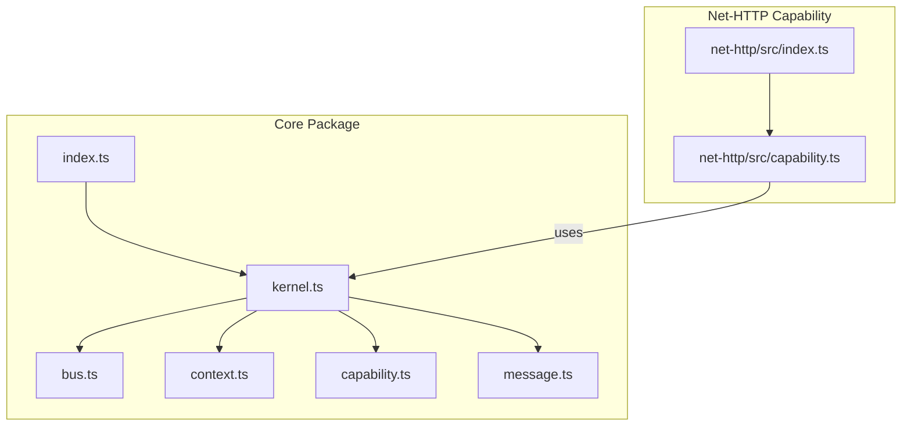
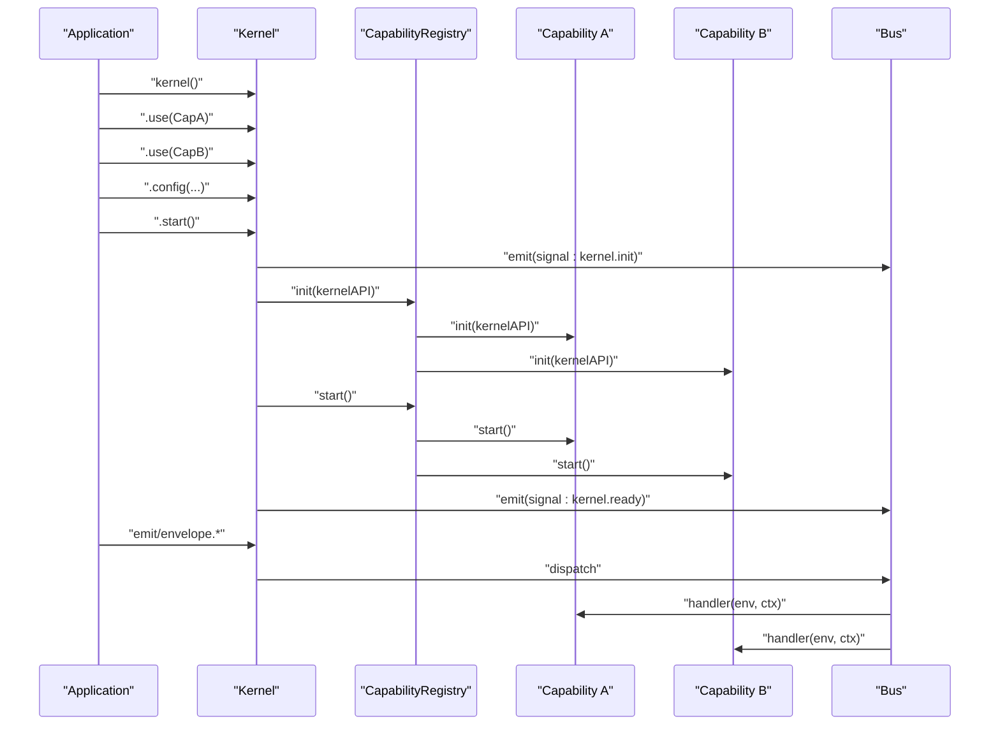
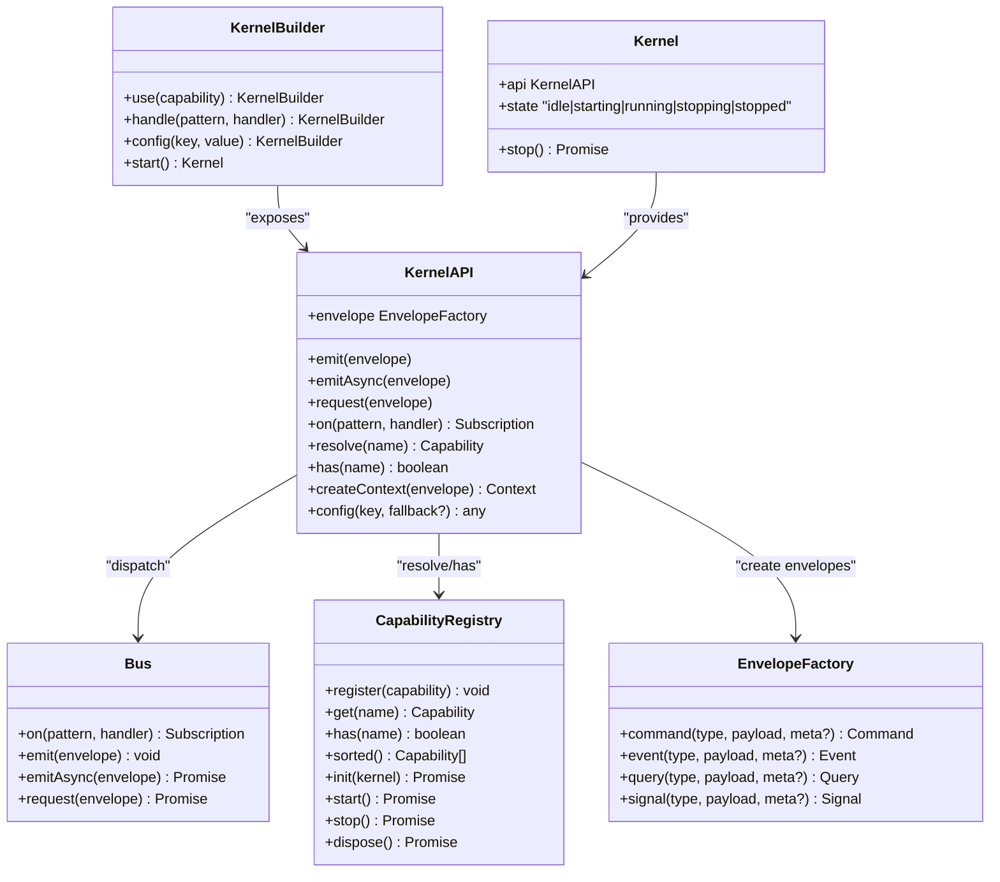

# Core API Reference

<cite>
**Referenced Files in This Document**
- [packages/core/src/index.ts](file://packages/core/src/index.ts)
- [packages/core/src/kernel.ts](file://packages/core/src/kernel.ts)
- [packages/core/src/bus.ts](file://packages/core/src/bus.ts)
- [packages/core/src/context.ts](file://packages/core/src/context.ts)
- [packages/core/src/capability.ts](file://packages/core/src/capability.ts)
- [packages/core/src/message.ts](file://packages/core/src/message.ts)
- [packages/core/README.md](file://packages/core/README.md)
- [packages/net-http/src/capability.ts](file://packages/net-http/src/capability.ts)
- [packages/net-http/src/index.ts](file://packages/net-http/src/index.ts)
</cite>

## Table of Contents
1. [Introduction](#introduction)
2. [Project Structure](#project-structure)
3. [Core Components](#core-components)
4. [Architecture Overview](#architecture-overview)
5. [Detailed Component Analysis](#detailed-component-analysis)
6. [Dependency Analysis](#dependency-analysis)
7. [Performance Considerations](#performance-considerations)
8. [Troubleshooting Guide](#troubleshooting-guide)
9. [Conclusion](#conclusion)
10. [Appendices](#appendices)

## Introduction
This document provides a comprehensive API reference for the core kislabin framework. It covers the kernel factory function, message bus APIs, envelope creation, handler registration and pattern matching, message emission, the context system for state and trace propagation, and the capability interface with lifecycle hooks. It also includes parameter descriptions, return values, usage examples, error handling, performance characteristics, and integration patterns with other components.

## Project Structure
The core runtime is implemented in the @kislabin/core package. The public API surface is minimal and centered around a single kernel factory function and a small set of primitives for messaging, context, and capability lifecycle. The net-http capability demonstrates how transport and other subsystems integrate with the kernel.

**Diagram sources**
- [packages/core/src/index.ts:1-28](file://packages/core/src/index.ts#L1-L28)
- [packages/core/src/kernel.ts:1-354](file://packages/core/src/kernel.ts#L1-L354)
- [packages/core/src/bus.ts:1-214](file://packages/core/src/bus.ts#L1-L214)
- [packages/core/src/context.ts:1-167](file://packages/core/src/context.ts#L1-L167)
- [packages/core/src/capability.ts:1-241](file://packages/core/src/capability.ts#L1-L241)
- [packages/core/src/message.ts:1-164](file://packages/core/src/message.ts#L1-L164)
- [packages/net-http/src/index.ts:1-20](file://packages/net-http/src/index.ts#L1-L20)
- [packages/net-http/src/capability.ts:1-223](file://packages/net-http/src/capability.ts#L1-L223)

**Section sources**
- [packages/core/src/index.ts:1-28](file://packages/core/src/index.ts#L1-L28)
- [packages/core/src/kernel.ts:1-354](file://packages/core/src/kernel.ts#L1-L354)
- [packages/core/README.md:1-479](file://packages/core/README.md#L1-L479)

## Core Components
- Kernel factory and builder: Creates and configures the kernel, manages lifecycle signals, and exposes KernelAPI.
- Message bus: Dispatches envelopes to handlers with support for exact match and wildcard patterns.
- Envelope primitives: Typed message containers with kind discrimination (command, event, query, signal).
- Context system: Execution context with state bag, trace propagation, deadlines, and cancellation.
- Capability interface: Lifecycle-managed subsystems that communicate via the bus.
- HTTP capability: Example capability integrating HTTP transport with the kernel.

**Section sources**
- [packages/core/src/kernel.ts:250-354](file://packages/core/src/kernel.ts#L250-L354)
- [packages/core/src/bus.ts:34-214](file://packages/core/src/bus.ts#L34-L214)
- [packages/core/src/message.ts:21-164](file://packages/core/src/message.ts#L21-L164)
- [packages/core/src/context.ts:22-167](file://packages/core/src/context.ts#L22-L167)
- [packages/core/src/capability.ts:28-241](file://packages/core/src/capability.ts#L28-L241)
- [packages/net-http/src/capability.ts:14-223](file://packages/net-http/src/capability.ts#L14-L223)

## Architecture Overview
The kernel orchestrates capabilities and the message bus. Capabilities register handlers and produce/consume messages. The bus supports three dispatch modes: broadcast emit/emitAsync, and point-to-point request. Context flows through handlers to share state and propagate traces.

**Diagram sources**
- [packages/core/src/kernel.ts:314-350](file://packages/core/src/kernel.ts#L314-L350)
- [packages/core/src/capability.ts:194-240](file://packages/core/src/capability.ts#L194-L240)
- [packages/core/src/bus.ts:91-171](file://packages/core/src/bus.ts#L91-L171)

## Detailed Component Analysis

### Kernel Factory and Builder API
The kernel factory returns a KernelBuilder used to configure capabilities, handlers, and configuration before starting the kernel. After startup, a Kernel instance is returned with KernelAPI and lifecycle controls.

Key methods and behaviors:
- kernel(): Returns a KernelBuilder to configure the kernel.
- KernelBuilder.use(capability): Registers a capability; order resolved via topological sort.
- KernelBuilder.handle(pattern, handler): Registers a handler globally before startup.
- KernelBuilder.config(key, value | record): Sets configuration; supports single key-value or record.
- KernelBuilder.start(): Boots the kernel, emitting lifecycle signals and returning a Kernel.
- Kernel.api.emit(envelope): Broadcast dispatch (fire-and-forget).
- Kernel.api.emitAsync(envelope): Broadcast dispatch awaiting all handlers.
- Kernel.api.request(envelope): Point-to-point request returning first handler result.
- Kernel.api.on(pattern, handler): Registers a handler; returns Subscription with unsubscribe().
- Kernel.api.resolve(name): Resolves a capability by name.
- Kernel.api.has(name): Checks capability existence.
- Kernel.api.createContext(envelope): Creates a root context for an envelope.
- Kernel.api.config(key, fallback?): Reads configuration; throws if missing and no fallback.
- Kernel.api.envelope: EnvelopeFactory bound to the capability’s source.
- Kernel.stop(): Graceful shutdown emitting stopping/stopped signals.

Usage examples:
- Basic handler registration and emission: see [packages/core/README.md:37-55](file://packages/core/README.md#L37-L55).
- Handler with context state: see [packages/core/README.md:101-121](file://packages/core/README.md#L101-L121).
- Wildcard patterns: see [packages/core/README.md:122-138](file://packages/core/README.md#L122-L138).
- Capability with dependencies: see [packages/core/README.md:139-187](file://packages/core/README.md#L139-L187).
- Lifecycle signals: see [packages/core/README.md:188-202](file://packages/core/README.md#L188-L202).

Error handling:
- Missing configuration without fallback throws an error during config read.
- No handler registered for a request emits a NoHandlerError.
- Startup failures emit a signal:kernel.error and abort boot.
- Shutdown swallows stop() errors but always executes dispose().

Performance considerations:
- Exact match dispatch is O(1); wildcard dispatch is O(n) where n is the number of wildcard patterns.
- Context creation and handler invocation are O(1) overhead.

Integration patterns:
- Capabilities receive a KernelAPI with an envelope factory bound to their source.
- Capabilities can register handlers, emit lifecycle signals, and consume/produce messages.

**Section sources**
- [packages/core/src/kernel.ts:250-354](file://packages/core/src/kernel.ts#L250-L354)
- [packages/core/src/bus.ts:91-171](file://packages/core/src/bus.ts#L91-L171)
- [packages/core/src/context.ts:164-167](file://packages/core/src/context.ts#L164-L167)
- [packages/core/src/capability.ts:194-240](file://packages/core/src/capability.ts#L194-L240)
- [packages/core/README.md:205-342](file://packages/core/README.md#L205-L342)

### Message Bus API
The bus handles three dispatch modes:
- emit(envelope): Synchronous broadcast to exact match plus wildcard handlers.
- emitAsync(envelope): Asynchronous broadcast awaiting all handlers.
- request(envelope): Point-to-point exact-match only, returns first handler result.

Pattern matching:
- Exact match: O(1) map lookup.
- Wildcard suffix: pattern ending with '*' matches types with that prefix.
- Wildcard global: '*' matches all types.
- Order: exact match handlers first, then wildcard handlers in registration order.

Handler registration:
- on(pattern, handler): Returns Subscription with unsubscribe().
- Supports multiple handlers per pattern; executed in registration order.

Error handling:
- Handler exceptions are caught and logged; subsequent handlers continue.
- request() throws NoHandlerError if no exact-match handler exists.

Usage examples:
- Emitting events and commands: see [packages/core/README.md:253-276](file://packages/core/README.md#L253-L276).
- Registering handlers: see [packages/core/README.md:277-288](file://packages/core/README.md#L277-L288).

**Section sources**
- [packages/core/src/bus.ts:34-214](file://packages/core/src/bus.ts#L34-L214)

### Envelope Creation and Message Primitives
EnvelopeFactory creates typed envelopes with automatic id, source, and timestamp. Supported kinds:
- command: Imperative intent; may fail.
- event: Past immutable fact.
- query: Read-only operation; no side effects.
- signal: System control and lifecycle messages.

Envelope fields:
- id: UUID v7 (time-ordered).
- kind: Discriminator among command, event, query, signal.
- type: String identifier (supports dot notation).
- payload: Arbitrary data.
- source: Origin capability or handler.
- timestamp: Epoch milliseconds.
- metadata: Read-only record for infrastructure-level attributes.

Aliases:
- Command<T>, Event<T>, Query<T>, Signal<T> provide semantic typing.

Usage examples:
- Creating envelopes: see [packages/core/README.md:324-334](file://packages/core/README.md#L324-L334).
- Using aliases: see [packages/core/src/message.ts:60-64](file://packages/core/src/message.ts#L60-L64).

**Section sources**
- [packages/core/src/message.ts:21-164](file://packages/core/src/message.ts#L21-L164)

### Context System API
Context carries execution state and trace information across handlers:
- id: Unique execution ID (UUID v7).
- envelope: Original envelope that started this execution.
- createdAt: Creation timestamp.
- parent?: Parent context for trace propagation.
- deadline?: Optional deadline timestamp.
- signal: AbortSignal for cancellation (lazy-created).
- get(key)/set(key, value)/has(key): State bag operations (lazy Map).
- child(envelope?): Creates a child context inheriting deadline and parent reference.

Usage examples:
- Sharing state across handlers: see [packages/core/README.md:307-314](file://packages/core/README.md#L307-L314).
- Middleware-style logging: see [packages/core/README.md:122-138](file://packages/core/README.md#L122-L138).

**Section sources**
- [packages/core/src/context.ts:22-167](file://packages/core/src/context.ts#L22-L167)

### Capability Interface and Lifecycle Hooks
Capabilities are autonomous subsystems with explicit lifecycle:
- name, version: Identity and version.
- produces?, consumes?: Message types produced/consumed.
- dependencies?: Names of required capabilities (boot order).
- init(kernel): Initialize, register handlers, validate config.
- start(): Open connections and begin listening.
- stop(): Drain in-flight work gracefully.
- dispose(): Release resources (always runs).

Registry:
- Maintains capability graph, resolves topological order, detects cycles, and enforces lifecycle sequencing.

Usage examples:
- Defining a capability: see [packages/core/README.md:139-187](file://packages/core/README.md#L139-L187).
- HTTP capability integration: see [packages/net-http/src/capability.ts:14-223](file://packages/net-http/src/capability.ts#L14-L223).

**Section sources**
- [packages/core/src/capability.ts:28-241](file://packages/core/src/capability.ts#L28-L241)
- [packages/net-http/src/capability.ts:14-223](file://packages/net-http/src/capability.ts#L14-L223)

### HTTP Capability Integration
The HTTP capability integrates with the kernel to translate HTTP requests into envelopes and responses back to HTTP. It supports:
- Declarative routing with .route(), .routes(), and .router().
- Path parsing and parameter extraction.
- Request envelope building and response serialization.
- Fallback to bus-based handlers via kernel.request().

Lifecycle:
- init(): Compiles routes and prepares handlers.
- start(): Starts Bun.serve and listens on configured host/port.
- stop(): Stops the server.
- dispose(): Clears server reference.

Usage example:
- Minimal HTTP server: see [packages/net-http/src/index.ts:1-20](file://packages/net-http/src/index.ts#L1-L20) and [packages/net-http/src/capability.ts:75-91](file://packages/net-http/src/capability.ts#L75-L91).

**Section sources**
- [packages/net-http/src/capability.ts:74-223](file://packages/net-http/src/capability.ts#L74-L223)
- [packages/net-http/src/index.ts:1-20](file://packages/net-http/src/index.ts#L1-L20)

## Dependency Analysis
The kernel composes the bus, capability registry, and message primitives. The HTTP capability depends on the core kernel and provides HTTP-specific routing and request/response handling.

**Diagram sources**
- [packages/core/src/kernel.ts:65-134](file://packages/core/src/kernel.ts#L65-L134)
- [packages/core/src/kernel.ts:159-183](file://packages/core/src/kernel.ts#L159-L183)
- [packages/core/src/bus.ts:34-214](file://packages/core/src/bus.ts#L34-L214)
- [packages/core/src/capability.ts:115-241](file://packages/core/src/capability.ts#L115-L241)
- [packages/core/src/message.ts:115-164](file://packages/core/src/message.ts#L115-L164)

**Section sources**
- [packages/core/src/kernel.ts:250-354](file://packages/core/src/kernel.ts#L250-L354)
- [packages/core/src/bus.ts:34-214](file://packages/core/src/bus.ts#L34-L214)
- [packages/core/src/capability.ts:115-241](file://packages/core/src/capability.ts#L115-L241)

## Performance Considerations
- Dispatch complexity:
  - Exact match: O(1) with constant-time map lookup.
  - Wildcard matching: O(n) where n is the number of registered wildcard patterns (not total handlers).
- Context creation and lazy allocations minimize overhead for handlers that only read payload.
- Broadcast vs request semantics:
  - emit(): Fire-and-forget synchronous dispatch.
  - emitAsync(): Await all handlers; still serial, not parallelized.
  - request(): Single-result exact-match; useful for RPC-like interactions.

[No sources needed since this section provides general guidance]

## Troubleshooting Guide
Common issues and resolutions:
- No handler registered for request:
  - Symptom: request() throws NoHandlerError.
  - Resolution: Ensure a handler is registered for the exact envelope type.
- Missing configuration:
  - Symptom: config(key) without fallback throws.
  - Resolution: Provide a fallback value or set the configuration before startup.
- Circular dependency in capabilities:
  - Symptom: CapabilityRegistry sorted() throws with a cycle chain.
  - Resolution: Remove or adjust dependencies to form a DAG.
- Handler errors:
  - Behavior: Caught and logged; other handlers continue.
  - Resolution: Add proper error handling inside handlers.
- Graceful shutdown:
  - Ensure stop() is awaited; dispose() always runs after stop completes.

**Section sources**
- [packages/core/src/bus.ts:159-170](file://packages/core/src/bus.ts#L159-L170)
- [packages/core/src/bus.ts:209-214](file://packages/core/src/bus.ts#L209-L214)
- [packages/core/src/capability.ts:156-192](file://packages/core/src/capability.ts#L156-L192)
- [packages/core/src/kernel.ts:335-349](file://packages/core/src/kernel.ts#L335-L349)

## Conclusion
The kislabin core provides a minimal, message-driven runtime with explicit lifecycle management and capability isolation. The kernel factory and builder offer a fluent configuration API, while the bus and envelope primitives enable flexible, typed messaging. The context system supports state sharing and trace propagation, and the capability interface ensures modular, testable subsystems. The HTTP capability demonstrates how transport integrations fit seamlessly into the kernel.

[No sources needed since this section summarizes without analyzing specific files]

## Appendices

### API Quick Reference

- kernel(): Creates a KernelBuilder.
- KernelBuilder.use(capability): Registers a capability.
- KernelBuilder.handle(pattern, handler): Registers a global handler.
- KernelBuilder.config(key, value | record): Sets configuration.
- KernelBuilder.start(): Boots the kernel and returns Kernel.
- Kernel.api.emit(envelope): Broadcast dispatch.
- Kernel.api.emitAsync(envelope): Broadcast dispatch awaiting all handlers.
- Kernel.api.request(envelope): Point-to-point request.
- Kernel.api.on(pattern, handler): Registers handler; returns Subscription.
- Kernel.api.resolve(name): Resolves capability by name.
- Kernel.api.has(name): Checks capability existence.
- Kernel.api.createContext(envelope): Creates root context.
- Kernel.api.config(key, fallback?): Reads configuration.
- Kernel.api.envelope: EnvelopeFactory bound to source.
- Kernel.stop(): Graceful shutdown.

**Section sources**
- [packages/core/src/kernel.ts:250-354](file://packages/core/src/kernel.ts#L250-L354)
- [packages/core/README.md:205-342](file://packages/core/README.md#L205-L342)