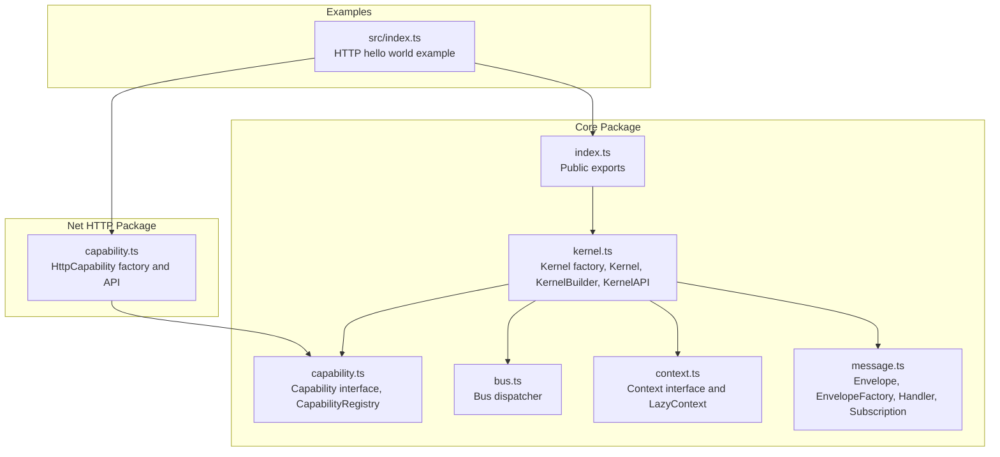
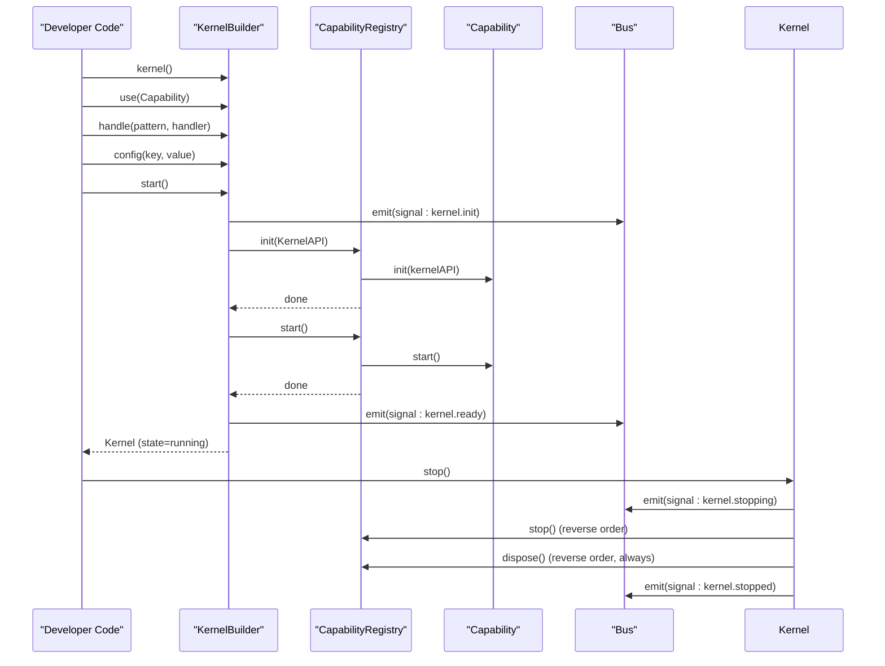
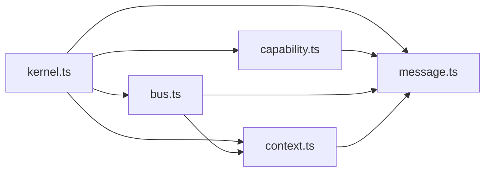

# Kernel API

<cite>
**Referenced Files in This Document**
- [kernel.ts](file://packages/core/src/kernel.ts)
- [index.ts](file://packages/core/src/index.ts)
- [capability.ts](file://packages/core/src/capability.ts)
- [bus.ts](file://packages/core/src/bus.ts)
- [context.ts](file://packages/core/src/context.ts)
- [message.ts](file://packages/core/src/message.ts)
- [README.md](file://packages/core/README.md)
- [package.json](file://packages/core/package.json)
- [capability.ts](file://packages/net-http/src/capability.ts)
- [index.ts](file://examples/00-http-hello/src/index.ts)
</cite>

## Table of Contents
1. [Introduction](#introduction)
2. [Project Structure](#project-structure)
3. [Core Components](#core-components)
4. [Architecture Overview](#architecture-overview)
5. [Detailed Component Analysis](#detailed-component-analysis)
6. [Dependency Analysis](#dependency-analysis)
7. [Performance Considerations](#performance-considerations)
8. [Troubleshooting Guide](#troubleshooting-guide)
9. [Conclusion](#conclusion)

## Introduction
This document provides comprehensive API documentation for the kernel factory function and kernel builder interface in the @kislabin runtime. It explains the kernel() factory function and its fluent builder pattern for configuring and starting the kernel, details the KernelBuilder methods (use(), handle(), config(), and start()), and documents the Kernel interface with its api property, state management, and stop() method. It also covers the KernelAPI methods including emit(), emitAsync(), request(), on(), resolve(), has(), createContext(), config(), and the envelope factory. Practical usage examples, parameter descriptions, return values, error conditions, and common configuration patterns are included.

## Project Structure
The kernel API is implemented in the core package and supported by related modules for messaging, capability lifecycle, and context management. The public entry point exports the kernel factory and related types.

**Diagram sources**
- [kernel.ts:1-354](file://packages/core/src/kernel.ts#L1-L354)
- [capability.ts:1-241](file://packages/core/src/capability.ts#L1-L241)
- [bus.ts:1-214](file://packages/core/src/bus.ts#L1-L214)
- [context.ts:1-167](file://packages/core/src/context.ts#L1-L167)
- [message.ts:1-164](file://packages/core/src/message.ts#L1-L164)
- [index.ts:1-28](file://packages/core/src/index.ts#L1-L28)
- [capability.ts:1-223](file://packages/net-http/src/capability.ts#L1-L223)
- [index.ts:1-12](file://examples/00-http-hello/src/index.ts#L1-L12)

**Section sources**
- [index.ts:1-28](file://packages/core/src/index.ts#L1-L28)
- [README.md:1-479](file://packages/core/README.md#L1-L479)

## Core Components
This section documents the primary APIs: kernel() factory, KernelBuilder, Kernel, and KernelAPI.

- kernel(): Factory function returning a KernelBuilder for configuration and startup.
- KernelBuilder: Fluent builder with methods use(), handle(), config(), and start().
- Kernel: Runtime instance exposing api and state, with stop() for graceful shutdown.
- KernelAPI: Public interface for capabilities to interact with the kernel.

Key implementation references:
- Kernel factory and builder interfaces: [kernel.ts:249-353](file://packages/core/src/kernel.ts#L249-L353)
- Kernel interface and state: [kernel.ts:136-183](file://packages/core/src/kernel.ts#L136-L183)
- KernelAPI interface: [kernel.ts:36-134](file://packages/core/src/kernel.ts#L36-L134)

**Section sources**
- [kernel.ts:36-183](file://packages/core/src/kernel.ts#L36-L183)
- [kernel.ts:249-353](file://packages/core/src/kernel.ts#L249-L353)

## Architecture Overview
The kernel orchestrates capability lifecycle and message routing. The builder configures capabilities, handlers, and configuration before starting. The runtime emits lifecycle signals and exposes KernelAPI for capabilities.

**Diagram sources**
- [kernel.ts:314-349](file://packages/core/src/kernel.ts#L314-L349)
- [capability.ts:194-239](file://packages/core/src/capability.ts#L194-L239)
- [bus.ts:34-206](file://packages/core/src/bus.ts#L34-L206)

## Detailed Component Analysis

### kernel() Factory Function
- Purpose: Entry point to create a KernelBuilder for configuring and starting the kernel.
- Returns: KernelBuilder instance.
- Typical usage: Chain use(), handle(), config(), then start().

Behavior highlights:
- Initializes internal bus, capability registry, config store, and envelope factory.
- Exposes KernelAPI with emit(), emitAsync(), request(), on(), resolve(), has(), createContext(), config(), and envelope factory.
- start() transitions state from idle → starting → running, emitting lifecycle signals.

References:
- Factory definition: [kernel.ts:249-265](file://packages/core/src/kernel.ts#L249-L265)
- Implementation: [kernel.ts:265-353](file://packages/core/src/kernel.ts#L265-L353)

**Section sources**
- [kernel.ts:249-353](file://packages/core/src/kernel.ts#L249-L353)

### KernelBuilder Methods

- use(capability)
  - Description: Registers a capability. Capabilities are initialized in topological order (dependencies first).
  - Parameters:
    - capability: Implements Capability interface.
  - Returns: KernelBuilder (for chaining).
  - Errors: Throws if capability name is duplicated or dependency is missing/circular.
  - References: [kernel.ts:292-296](file://packages/core/src/kernel.ts#L292-L296), [capability.ts:119-130](file://packages/core/src/capability.ts#L119-L130)

- handle(pattern, handler)
  - Description: Registers a global handler for a message pattern (supports wildcards). Equivalent to calling kernel.api.on() before boot.
  - Parameters:
    - pattern: String supporting exact match, wildcard suffix ('user.*'), and global wildcard ('*').
    - handler: Function with signature (envelope, context) => result | Promise<result>.
  - Returns: KernelBuilder (for chaining).
  - References: [kernel.ts:298-301](file://packages/core/src/kernel.ts#L298-L301), [bus.ts:65-78](file://packages/core/src/bus.ts#L65-L78)

- config(key, value) or config(record)
  - Description: Sets configuration values. Accepts either a key/value pair or a record of multiple keys.
  - Parameters:
    - key: string (or record)
    - value: unknown (when key is string)
    - record: Record<string, unknown> (alternative overload)
  - Returns: KernelBuilder (for chaining).
  - References: [kernel.ts:303-312](file://packages/core/src/kernel.ts#L303-L312)

- start()
  - Description: Boots the kernel. Emits lifecycle signals and runs capability lifecycle in order.
  - Returns: Promise<Kernel> (runtime instance).
  - Errors:
    - Throws if any capability init/start fails.
    - Throws on missing dependencies or circular dependencies during topological sort.
  - Lifecycle:
    - Emits signal:kernel.init
    - capability.init(kernelAPI) in topological order
    - capability.start() in topological order
    - Emits signal:kernel.ready
  - References: [kernel.ts:314-329](file://packages/core/src/kernel.ts#L314-L329), [capability.ts:156-211](file://packages/core/src/capability.ts#L156-L211)

**Section sources**
- [kernel.ts:204-245](file://packages/core/src/kernel.ts#L204-L245)
- [capability.ts:119-211](file://packages/core/src/capability.ts#L119-L211)

### Kernel Interface
- Properties:
  - api: KernelAPI instance for interacting with the kernel.
  - state: Enumerated state with transitions: idle → starting → running → stopping → stopped.
- Methods:
  - stop(): Promise<void> — graceful shutdown sequence:
    - Emits signal:kernel.stopping
    - Calls capability.stop() in reverse order (errors swallowed)
    - Calls capability.dispose() in reverse order (always executes)
    - Emits signal:kernel.stopped
- References: [kernel.ts:136-183](file://packages/core/src/kernel.ts#L136-L183)

**Section sources**
- [kernel.ts:136-183](file://packages/core/src/kernel.ts#L136-L183)

### KernelAPI Methods

- emit(envelope)
  - Description: Broadcast emission (fire-and-forget). Executes handlers synchronously; async results are ignored.
  - Parameters: envelope: Envelope<T>
  - Returns: void
  - References: [kernel.ts:272-274](file://packages/core/src/kernel.ts#L272-L274), [bus.ts:91-107](file://packages/core/src/bus.ts#L91-L107)

- emitAsync(envelope)
  - Description: Broadcast emission awaiting all handlers. Handlers execute in series.
  - Parameters: envelope: Envelope<T>
  - Returns: Promise<void>
  - References: [kernel.ts:274-275](file://packages/core/src/kernel.ts#L274-L275), [bus.ts:125-136](file://packages/core/src/bus.ts#L125-L136)

- request(envelope)
  - Description: Point-to-point dispatch (exact match only). Returns result from the first handler.
  - Parameters: envelope: Envelope<T>
  - Returns: Promise<T>
  - Errors: Throws NoHandlerError if no exact match exists.
  - References: [kernel.ts:275-276](file://packages/core/src/kernel.ts#L275-L276), [bus.ts:159-170](file://packages/core/src/bus.ts#L159-L170), [bus.ts:209-214](file://packages/core/src/bus.ts#L209-L214)

- on(pattern, handler)
  - Description: Subscribe to messages by pattern. Supports '*', 'prefix*', and exact match.
  - Parameters:
    - pattern: string
    - handler: Handler<TIn, TOut>
  - Returns: Subscription with unsubscribe()
  - References: [kernel.ts:276-277](file://packages/core/src/kernel.ts#L276-L277), [bus.ts:65-78](file://packages/core/src/bus.ts#L65-L78)

- resolve(name)
  - Description: Resolve a capability by name.
  - Parameters: name: string
  - Returns: Capability
  - Errors: Throws if capability not found.
  - References: [kernel.ts:278-279](file://packages/core/src/kernel.ts#L278-L279), [capability.ts:136-140](file://packages/core/src/capability.ts#L136-L140)

- has(name)
  - Description: Check if a capability is registered.
  - Parameters: name: string
  - Returns: boolean
  - References: [kernel.ts:279-279](file://packages/core/src/kernel.ts#L279-L279), [capability.ts:143-145](file://packages/core/src/capability.ts#L143-L145)

- createContext(envelope)
  - Description: Create a root context for an envelope.
  - Parameters: envelope: Envelope<T>
  - Returns: Context
  - References: [kernel.ts:281-281](file://packages/core/src/kernel.ts#L281-L281), [context.ts:164-166](file://packages/core/src/context.ts#L164-L166)

- config(key, fallback?)
  - Description: Read configuration. Fail-fast if no fallback and key missing.
  - Parameters:
    - key: string
    - fallback?: T
  - Returns: T
  - Errors: Throws if key missing and no fallback provided.
  - References: [kernel.ts:283-287](file://packages/core/src/kernel.ts#L283-L287)

- envelope
  - Description: Envelope factory bound to the source (capability name). Creates command, event, query, signal envelopes with auto-generated id, source, and timestamp.
  - Methods: command(type, payload, meta?), event(type, payload, meta?), query(type, payload, meta?), signal(type, payload, meta?)
  - References: [kernel.ts:289-289](file://packages/core/src/kernel.ts#L289-L289), [message.ts:115-163](file://packages/core/src/message.ts#L115-L163)

**Section sources**
- [kernel.ts:65-134](file://packages/core/src/kernel.ts#L65-L134)
- [bus.ts:34-206](file://packages/core/src/bus.ts#L34-L206)
- [context.ts:22-90](file://packages/core/src/context.ts#L22-L90)
- [message.ts:97-163](file://packages/core/src/message.ts#L97-L163)

### Envelope and Messaging Primitives
- Envelope<T>: Universal message primitive with id, kind, type, payload, source, timestamp, and metadata.
- MessageKind: "command" | "event" | "query" | "signal"
- Aliases: Command<T>, Event<T>, Query<T>, Signal<T>
- Handler: (envelope, context) => result | Promise<result>
- Subscription: { unsubscribe(): void }
- EnvelopeFactory: Factory for creating typed envelopes with auto-populated fields.

References:
- Envelope and kinds: [message.ts:21-64](file://packages/core/src/message.ts#L21-L64)
- Handler and Subscription: [message.ts:66-95](file://packages/core/src/message.ts#L66-L95)
- EnvelopeFactory: [message.ts:97-163](file://packages/core/src/message.ts#L97-L163)

**Section sources**
- [message.ts:21-163](file://packages/core/src/message.ts#L21-L163)

### Context Management
- Context: Execution context flowing through handler chains, carrying state bag, trace id, envelope reference, deadline, and AbortSignal.
- LazyContext: Implementation with lazy allocation for id, signal, and state map.
- createContext(): Factory to create contexts.

References:
- Context interface: [context.ts:22-90](file://packages/core/src/context.ts#L22-L90)
- LazyContext implementation: [context.ts:106-149](file://packages/core/src/context.ts#L106-L149)
- Factory: [context.ts:164-166](file://packages/core/src/context.ts#L164-L166)

**Section sources**
- [context.ts:22-166](file://packages/core/src/context.ts#L22-L166)

### Capability Lifecycle and Registry
- Capability: Autonomous subsystem with lifecycle (init → start → stop → dispose), dependencies, and declared produces/consumes types.
- CapabilityRegistry: Manages capability registration, topological sorting, and lifecycle execution with cycle detection and missing dependency validation.

References:
- Capability interface: [capability.ts:28-99](file://packages/core/src/capability.ts#L28-L99)
- Registry: [capability.ts:115-241](file://packages/core/src/capability.ts#L115-L241)

**Section sources**
- [capability.ts:28-241](file://packages/core/src/capability.ts#L28-L241)

### Practical Usage Examples

- Minimal kernel with handler and event emission:
  - See: [README.md:37-55](file://packages/core/README.md#L37-L55)

- Basic handler example:
  - See: [README.md:101-120](file://packages/core/README.md#L101-L120)

- Wildcard patterns:
  - See: [README.md:122-137](file://packages/core/README.md#L122-L137)

- Capability with dependencies:
  - See: [README.md:139-186](file://packages/core/README.md#L139-L186)

- Lifecycle signals:
  - See: [README.md:188-201](file://packages/core/README.md#L188-L201)

- HTTP capability usage:
  - See: [index.ts:1-12](file://examples/00-http-hello/src/index.ts#L1-L12)
  - HTTP capability factory: [capability.ts:75-91](file://packages/net-http/src/capability.ts#L75-L91)

**Section sources**
- [README.md:37-201](file://packages/core/README.md#L37-L201)
- [index.ts:1-12](file://examples/00-http-hello/src/index.ts#L1-L12)
- [capability.ts:75-91](file://packages/net-http/src/capability.ts#L75-L91)

## Dependency Analysis
The kernel composes several modules with clear boundaries:
- kernel.ts depends on bus.ts, capability.ts, context.ts, and message.ts.
- capability.ts depends on kernel.ts (KernelAPI) and message.ts (EnvelopeFactory).
- bus.ts depends on context.ts and message.ts.
- context.ts depends on message.ts.
- message.ts is foundational and standalone.

**Diagram sources**
- [kernel.ts:21-32](file://packages/core/src/kernel.ts#L21-L32)
- [capability.ts:23-24](file://packages/core/src/capability.ts#L23-L24)
- [bus.ts:20-21](file://packages/core/src/bus.ts#L20-L21)
- [context.ts:18](file://packages/core/src/context.ts#L18)
- [message.ts:9](file://packages/core/src/message.ts#L9)

**Section sources**
- [kernel.ts:21-32](file://packages/core/src/kernel.ts#L21-L32)
- [capability.ts:23-24](file://packages/core/src/capability.ts#L23-L24)
- [bus.ts:20-21](file://packages/core/src/bus.ts#L20-L21)
- [context.ts:18](file://packages/core/src/context.ts#L18)
- [message.ts:9](file://packages/core/src/message.ts#L9)

## Performance Considerations
- Dispatch performance characteristics:
  - Exact match: O(1)
  - Wildcard: O(n) where n is the number of wildcard patterns (not number of handlers)
  - Context creation: O(1)
  - Handler call: O(1)
- Emission modes:
  - emit(): synchronous broadcast (fire-and-forget)
  - emitAsync(): waits for all handlers to complete (series)
  - request(): exact match only, returns first handler result
- Context is lazy: minimal overhead for handlers that only read payload.

References:
- Performance table: [README.md:410-420](file://packages/core/README.md#L410-L420)
- Dispatch behavior: [bus.ts:80-170](file://packages/core/src/bus.ts#L80-L170)

**Section sources**
- [README.md:410-420](file://packages/core/README.md#L410-L420)
- [bus.ts:80-170](file://packages/core/src/bus.ts#L80-L170)

## Troubleshooting Guide
Common errors and conditions:
- NoHandlerError: Thrown when request() has no exact match.
  - Reference: [bus.ts:209-214](file://packages/core/src/bus.ts#L209-L214)
- Missing required configuration: config(key) without fallback throws.
  - Reference: [kernel.ts:283-287](file://packages/core/src/kernel.ts#L283-L287)
- Capability registration conflicts: Duplicate names throw.
  - Reference: [capability.ts:124-128](file://packages/core/src/capability.ts#L124-L128)
- Circular or missing dependencies: Topological sort detects and reports.
  - Reference: [capability.ts:166-170](file://packages/core/src/capability.ts#L166-L170), [capability.ts:175](file://packages/core/src/capability.ts#L175)

Operational tips:
- Use handle('*') for global logging or interceptors.
- Prefer emitAsync() when you need to await all handlers.
- Use request() for RPC-style interactions requiring a single responder.
- Validate configuration early in capability.init() using config() with fallbacks where appropriate.

**Section sources**
- [bus.ts:209-214](file://packages/core/src/bus.ts#L209-L214)
- [kernel.ts:283-287](file://packages/core/src/kernel.ts#L283-L287)
- [capability.ts:124-170](file://packages/core/src/capability.ts#L124-L170)

## Conclusion
The @kislabin kernel provides a minimal, message-driven runtime with a clean fluent builder API for configuration and lifecycle control. KernelAPI offers a focused set of primitives for capabilities to interact with the system, while the bus and context modules enable efficient, observable message passing. The capability registry enforces disciplined lifecycle management and dependency ordering. Together, these components support portable, testable, and observable backend applications.