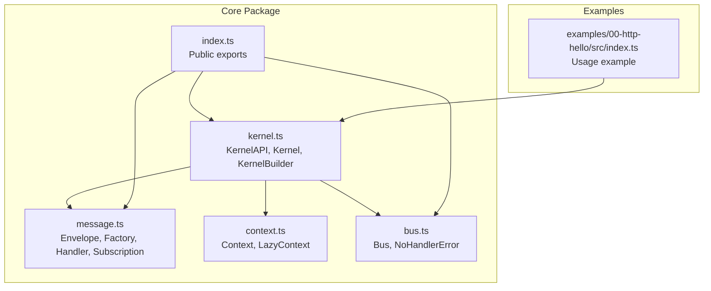
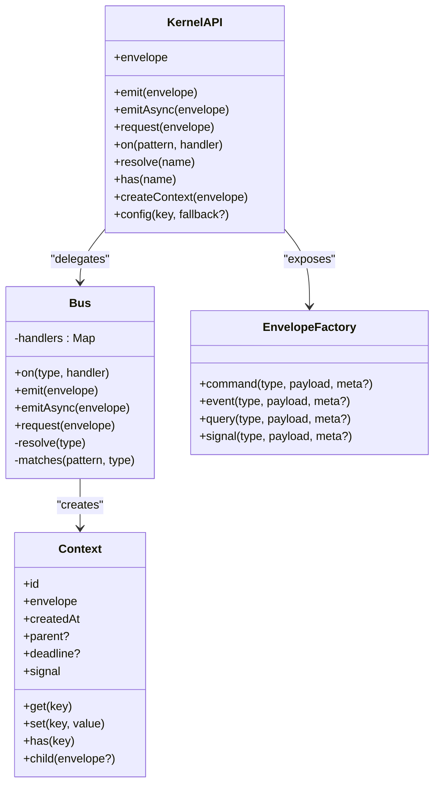
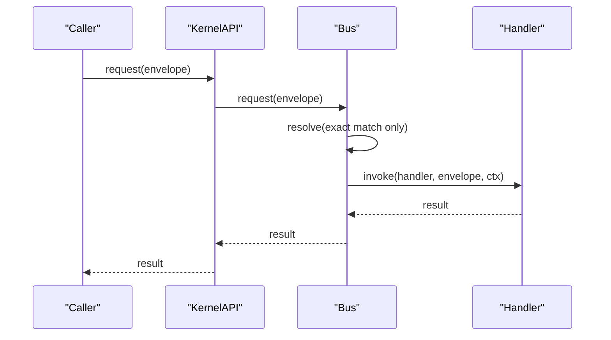
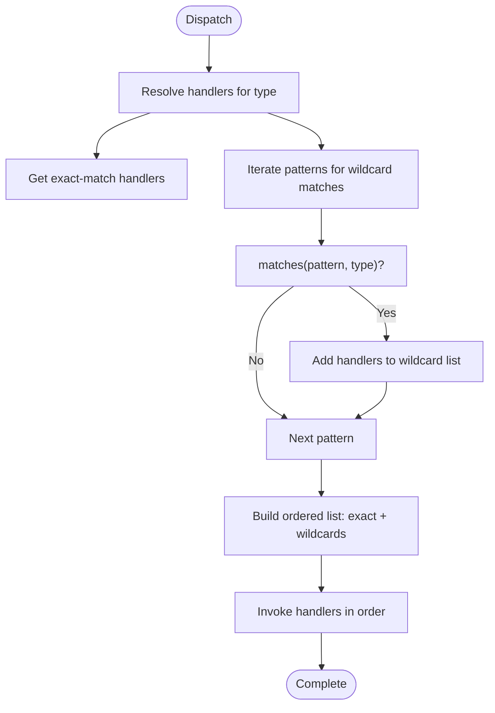
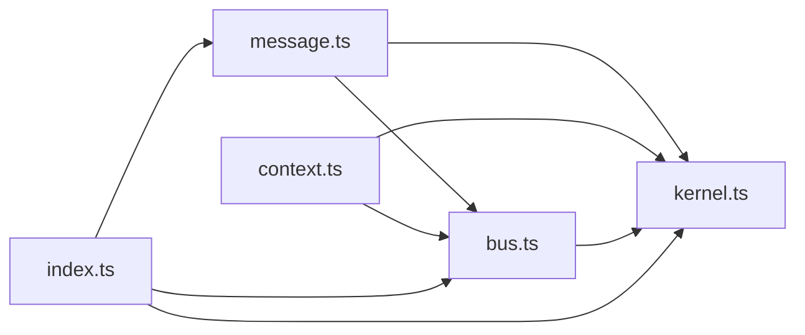

# Message System

<cite>
**Referenced Files in This Document**
- [README.md](file://README.md)
- [packages/core/src/message.ts](file://packages/core/src/message.ts)
- [packages/core/src/bus.ts](file://packages/core/src/bus.ts)
- [packages/core/src/kernel.ts](file://packages/core/src/kernel.ts)
- [packages/core/src/context.ts](file://packages/core/src/context.ts)
- [packages/core/src/index.ts](file://packages/core/src/index.ts)
- [examples/00-http-hello/src/index.ts](file://examples/00-http-hello/src/index.ts)
</cite>

## Table of Contents
1. [Introduction](#introduction)
2. [Project Structure](#project-structure)
3. [Core Components](#core-components)
4. [Architecture Overview](#architecture-overview)
5. [Detailed Component Analysis](#detailed-component-analysis)
6. [Dependency Analysis](#dependency-analysis)
7. [Performance Considerations](#performance-considerations)
8. [Troubleshooting Guide](#troubleshooting-guide)
9. [Conclusion](#conclusion)
10. [Appendices](#appendices)

## Introduction
This document provides comprehensive API documentation for the message system used by the kernel. It covers envelope creation, handler registration, pattern matching, and the Bus API. It also documents the Envelope interface, EnvelopeFactory methods, Handler and HandlerRegistration systems, Subscription interface, and the KernelAPI surface for emitting messages and registering handlers. Practical examples demonstrate envelope creation, handler registration, message emission, and pattern-based routing. Guidance on error handling, performance characteristics, and advanced messaging patterns is included.

## Project Structure
The message system is implemented in the core package and exposed via the public API. The kernel orchestrates capabilities and exposes a KernelAPI that delegates to the Bus for message dispatch. Context is created automatically during dispatch to support middleware-style chaining and shared state.

**Diagram sources**
- [packages/core/src/kernel.ts:265-354](file://packages/core/src/kernel.ts#L265-L354)
- [packages/core/src/bus.ts:1-214](file://packages/core/src/bus.ts#L1-L214)
- [packages/core/src/message.ts:1-164](file://packages/core/src/message.ts#L1-L164)
- [packages/core/src/context.ts:1-167](file://packages/core/src/context.ts#L1-L167)
- [packages/core/src/index.ts:1-28](file://packages/core/src/index.ts#L1-L28)
- [examples/00-http-hello/src/index.ts:1-12](file://examples/00-http-hello/src/index.ts#L1-L12)

**Section sources**
- [README.md:100-142](file://README.md#L100-L142)
- [packages/core/src/index.ts:1-28](file://packages/core/src/index.ts#L1-L28)

## Core Components
This section documents the foundational types and factories used across the message system.

- Envelope: The universal message primitive carrying type, kind, payload, identifiers, source, timestamp, and metadata.
- MessageKind: Discriminator separating command, event, query, and signal semantics.
- Command, Event, Query, Signal: Type-level aliases for Envelope with enforced kind.
- Handler: Function signature for processing envelopes with optional asynchronous return and a shared Context.
- Subscription: Contract returned by handler registration to enable unsubscription.
- EnvelopeFactory: Factory for creating typed envelopes with automatic id, source, and timestamp.
- KernelAPI: Public interface exposed to capabilities for emitting, requesting, registering handlers, and accessing the envelope factory.

Key implementation references:
- Envelope and MessageKind: [packages/core/src/message.ts:11-49](file://packages/core/src/message.ts#L11-L49)
- Semantic aliases: [packages/core/src/message.ts:60-63](file://packages/core/src/message.ts#L60-L63)
- Handler and Subscription: [packages/core/src/message.ts:65-95](file://packages/core/src/message.ts#L65-L95)
- EnvelopeFactory and creation: [packages/core/src/message.ts:97-163](file://packages/core/src/message.ts#L97-L163)
- KernelAPI surface: [packages/core/src/kernel.ts:65-134](file://packages/core/src/kernel.ts#L65-L134)

**Section sources**
- [packages/core/src/message.ts:11-163](file://packages/core/src/message.ts#L11-L163)
- [packages/core/src/kernel.ts:65-134](file://packages/core/src/kernel.ts#L65-L134)

## Architecture Overview
The kernel composes a Bus for message routing and a Capability registry for lifecycle management. KernelAPI delegates emit, emitAsync, request, and on to the Bus. Context is created per dispatch and flows through all handlers in the resolved chain.

**Diagram sources**
- [packages/core/src/kernel.ts:65-134](file://packages/core/src/kernel.ts#L65-L134)
- [packages/core/src/bus.ts:34-206](file://packages/core/src/bus.ts#L34-L206)
- [packages/core/src/message.ts:97-163](file://packages/core/src/message.ts#L97-L163)
- [packages/core/src/context.ts:44-90](file://packages/core/src/context.ts#L44-L90)

## Detailed Component Analysis

### Envelope and EnvelopeFactory
- Envelope properties:
  - id: UUID v7 for ordering by creation time.
  - kind: MessageKind discriminator.
  - type: String identifier for routing and pattern matching.
  - payload: Typed data.
  - source: Originating capability or handler name.
  - timestamp: Epoch milliseconds.
  - metadata: Readonly record for infrastructure-level attributes.
- EnvelopeFactory methods:
  - command(type, payload, meta?): Creates a command envelope.
  - event(type, payload, meta?): Creates an event envelope.
  - query(type, payload, meta?): Creates a query envelope.
  - signal(type, payload, meta?): Creates a signal envelope.
- Implementation details:
  - Automatic id generation via UUID v7.
  - Automatic timestamp population.
  - Source is bound by the factory creator (capability name).
  - Metadata is stored as a readonly record.

References:
- Envelope interface: [packages/core/src/message.ts:34-49](file://packages/core/src/message.ts#L34-L49)
- Semantic aliases: [packages/core/src/message.ts:60-63](file://packages/core/src/message.ts#L60-L63)
- Factory contract and creation: [packages/core/src/message.ts:97-163](file://packages/core/src/message.ts#L97-L163)

**Section sources**
- [packages/core/src/message.ts:21-163](file://packages/core/src/message.ts#L21-L163)

### Handler and HandlerRegistration
- Handler signature:
  - Accepts an Envelope and a Context.
  - Can be synchronous or asynchronous.
  - May return a value or void.
- HandlerRegistration:
  - Registration returns a Subscription with unsubscribe().
  - Multiple handlers can be registered for the same pattern; they execute in registration order.
- Unsubscription:
  - Removes a specific handler from the pattern’s list.
  - Deletes the pattern entry if the list becomes empty.

References:
- Handler and Subscription: [packages/core/src/message.ts:65-95](file://packages/core/src/message.ts#L65-L95)
- Registration and unregistration: [packages/core/src/bus.ts:65-78](file://packages/core/src/bus.ts#L65-L78)

**Section sources**
- [packages/core/src/message.ts:65-95](file://packages/core/src/message.ts#L65-L95)
- [packages/core/src/bus.ts:65-78](file://packages/core/src/bus.ts#L65-L78)

### Pattern Matching and Dispatch Modes
- Supported patterns:
  - Exact match: 'user.create'
  - Wildcard suffix: 'user.*'
  - Global wildcard: '*'
- Dispatch modes:
  - emit(): Broadcast dispatch; handlers run synchronously; async results are fire-and-forget.
  - emitAsync(): Broadcast dispatch; waits for all handlers to complete.
  - request(): Point-to-point dispatch; exact match only; returns the first handler’s result.
- Resolution order:
  - For broadcast, exact-match handlers run first, followed by wildcard handlers in registration order.
- Pattern matching algorithm:
  - '*' matches any type.
  - 'prefix*' matches any type that starts with the given prefix.
  - Non-wildcard patterns are treated as exact matches.

References:
- Dispatch APIs and behavior: [packages/core/src/bus.ts:91-170](file://packages/core/src/bus.ts#L91-L170)
- Resolution and matching: [packages/core/src/bus.ts:183-205](file://packages/core/src/bus.ts#L183-L205)

**Section sources**
- [packages/core/src/bus.ts:7-205](file://packages/core/src/bus.ts#L7-L205)

### Context and Middleware Chain
- Context carries:
  - Unique execution id for tracing and correlation.
  - Reference to the originating envelope.
  - Creation timestamp.
  - Optional parent context for trace propagation.
  - Optional deadline and AbortSignal for cancellation.
  - A lazy state bag (get/set/has) for sharing data across handlers.
- Behavior:
  - Created automatically per dispatch.
  - Shared across all handlers in the chain.
  - Child contexts inherit envelope reference and deadline but start with an empty state bag.

References:
- Context interface and lazy implementation: [packages/core/src/context.ts:44-166](file://packages/core/src/context.ts#L44-L166)

**Section sources**
- [packages/core/src/context.ts:22-166](file://packages/core/src/context.ts#L22-L166)

### KernelAPI and Bus Integration
- KernelAPI exposes:
  - emit, emitAsync, request, on, resolve, has, createContext, config, and envelope.
- Kernel delegates:
  - emit → bus.emit
  - emitAsync → bus.emitAsync
  - request → bus.request
  - on → bus.on
- The envelope factory is capability-bound and pre-filled with source.

References:
- KernelAPI contract: [packages/core/src/kernel.ts:65-134](file://packages/core/src/kernel.ts#L65-L134)
- Kernel implementation wiring: [packages/core/src/kernel.ts:272-290](file://packages/core/src/kernel.ts#L272-L290)

**Section sources**
- [packages/core/src/kernel.ts:65-134](file://packages/core/src/kernel.ts#L65-L134)
- [packages/core/src/kernel.ts:272-290](file://packages/core/src/kernel.ts#L272-L290)

### Sequence: Request-Response Flow

**Diagram sources**
- [packages/core/src/bus.ts:159-170](file://packages/core/src/bus.ts#L159-L170)
- [packages/core/src/kernel.ts:272-276](file://packages/core/src/kernel.ts#L272-L276)

### Flowchart: Pattern Matching

**Diagram sources**
- [packages/core/src/bus.ts:183-205](file://packages/core/src/bus.ts#L183-L205)

## Dependency Analysis
The core module composes three primary modules:
- message.ts defines primitives and factories.
- bus.ts implements routing and dispatch.
- kernel.ts wires the system and exposes KernelAPI.
- context.ts provides execution context.
- index.ts re-exports public types and entry points.

**Diagram sources**
- [packages/core/src/message.ts:1-164](file://packages/core/src/message.ts#L1-L164)
- [packages/core/src/bus.ts:1-214](file://packages/core/src/bus.ts#L1-L214)
- [packages/core/src/kernel.ts:1-354](file://packages/core/src/kernel.ts#L1-L354)
- [packages/core/src/context.ts:1-167](file://packages/core/src/context.ts#L1-L167)
- [packages/core/src/index.ts:1-28](file://packages/core/src/index.ts#L1-L28)

**Section sources**
- [packages/core/src/index.ts:1-28](file://packages/core/src/index.ts#L1-L28)
- [packages/core/src/kernel.ts:265-354](file://packages/core/src/kernel.ts#L265-L354)

## Performance Considerations
- Exact match lookup is O(1) via Map.
- Wildcard resolution is O(n) over registered patterns (not handlers), where n is the number of patterns ending with '*'.
- Broadcast dispatch runs handlers sequentially; use emitAsync when you need to wait for completion.
- request() returns immediately after the first handler completes; it does not wait for others.
- Context is lazily allocated; handlers that only read payload incur minimal overhead.
- Asynchronous handlers in emit() are fire-and-forget; use emitAsync() to await completion.

[No sources needed since this section provides general guidance]

## Troubleshooting Guide
Common issues and resolutions:
- No handler registered for a type:
  - request() throws a NoHandlerError when no exact match exists.
  - Verify handler registration and pattern correctness.
- Fire-and-forget behavior with emit():
  - If you expect to await async work, use emitAsync() instead.
- Logging and error isolation:
  - Bus catches and logs handler errors; subsequent handlers continue.
- Subscription cleanup:
  - Always unsubscribe when handlers are no longer needed to prevent memory leaks.

References:
- NoHandlerError definition: [packages/core/src/bus.ts:209-214](file://packages/core/src/bus.ts#L209-L214)
- Error logging in emit/emitAsync: [packages/core/src/bus.ts:96-106](file://packages/core/src/bus.ts#L96-L106)

**Section sources**
- [packages/core/src/bus.ts:91-107](file://packages/core/src/bus.ts#L91-L107)
- [packages/core/src/bus.ts:209-214](file://packages/core/src/bus.ts#L209-L214)

## Conclusion
The message system provides a minimal, robust foundation for kernel-driven capabilities. Envelopes carry rich metadata and semantic meaning, while the Bus offers flexible dispatch modes and pattern-based routing. KernelAPI exposes a concise surface for capabilities to emit, request, and register handlers. Context enables middleware-style composition and shared state. The design emphasizes simplicity, performance, and portability.

[No sources needed since this section summarizes without analyzing specific files]

## Appendices

### API Reference: Envelope
- Properties:
  - id: string (UUID v7)
  - kind: "command" | "event" | "query" | "signal"
  - type: string
  - payload: T
  - source: string
  - timestamp: number (epoch ms)
  - metadata: Readonly<Record<string, unknown>>
- Usage:
  - Construct via EnvelopeFactory methods; avoid manual construction.

References:
- [packages/core/src/message.ts:34-49](file://packages/core/src/message.ts#L34-L49)

**Section sources**
- [packages/core/src/message.ts:21-49](file://packages/core/src/message.ts#L21-L49)

### API Reference: EnvelopeFactory
- Methods:
  - command(type, payload, meta?): Command<T>
  - event(type, payload, meta?): Event<T>
  - query(type, payload, meta?): Query<T>
  - signal(type, payload, meta?): Signal<T>
- Notes:
  - Automatically sets id, source, timestamp.
  - Source is bound by the factory instance.

References:
- [packages/core/src/message.ts:115-163](file://packages/core/src/message.ts#L115-L163)

**Section sources**
- [packages/core/src/message.ts:97-163](file://packages/core/src/message.ts#L97-L163)

### API Reference: Handler and Subscription
- Handler: (envelope: Envelope<TIn>, ctx: Context) => TOut | Promise<TOut>
- Subscription: { unsubscribe(): void }
- Registration:
  - bus.on(pattern, handler) returns Subscription
  - Supports multiple handlers per pattern

References:
- [packages/core/src/message.ts:65-95](file://packages/core/src/message.ts#L65-L95)
- [packages/core/src/bus.ts:65-78](file://packages/core/src/bus.ts#L65-L78)

**Section sources**
- [packages/core/src/message.ts:65-95](file://packages/core/src/message.ts#L65-L95)
- [packages/core/src/bus.ts:65-78](file://packages/core/src/bus.ts#L65-L78)

### API Reference: Bus
- Methods:
  - on(pattern, handler): Subscription
  - emit(envelope): void
  - emitAsync(envelope): Promise<void>
  - request(envelope): Promise<T>
- Pattern matching:
  - '*', 'prefix*', exact match
- Error:
  - request() throws NoHandlerError when no exact match exists

References:
- [packages/core/src/bus.ts:34-206](file://packages/core/src/bus.ts#L34-L206)

**Section sources**
- [packages/core/src/bus.ts:34-206](file://packages/core/src/bus.ts#L34-L206)

### API Reference: KernelAPI
- Methods:
  - emit(envelope), emitAsync(envelope), request(envelope)
  - on(pattern, handler), resolve(name), has(name)
  - createContext(envelope), config(key, fallback?), envelope
- Notes:
  - envelope is capability-bound; source is set automatically

References:
- [packages/core/src/kernel.ts:65-134](file://packages/core/src/kernel.ts#L65-L134)

**Section sources**
- [packages/core/src/kernel.ts:65-134](file://packages/core/src/kernel.ts#L65-L134)

### Example: Envelope Creation and Emission
- Create a command envelope via the capability-bound factory.
- Emit it via kernel.api.emit or kernel.api.request depending on intent.
- Register a handler using kernel.api.on with a pattern.

References:
- Hello world example usage: [README.md:20-35](file://README.md#L20-L35)
- HTTP example integration: [examples/00-http-hello/src/index.ts:1-12](file://examples/00-http-hello/src/index.ts#L1-L12)

**Section sources**
- [README.md:20-35](file://README.md#L20-L35)
- [examples/00-http-hello/src/index.ts:1-12](file://examples/00-http-hello/src/index.ts#L1-L12)

### Advanced Messaging Patterns
- Global interceptor: Register on('*') to observe all messages.
- Prefix-based routing: Use on('user.*') to capture related events.
- Request-response: Use request() for point-to-point communication expecting a single responder.
- Middleware chaining: Use ctx.get/set to pass data between handlers.

References:
- Pattern examples and behavior: [packages/core/src/bus.ts:43-63](file://packages/core/src/bus.ts#L43-L63)
- Context sharing: [packages/core/src/context.ts:26-27](file://packages/core/src/context.ts#L26-L27)

**Section sources**
- [packages/core/src/bus.ts:43-63](file://packages/core/src/bus.ts#L43-L63)
- [packages/core/src/context.ts:26-27](file://packages/core/src/context.ts#L26-L27)