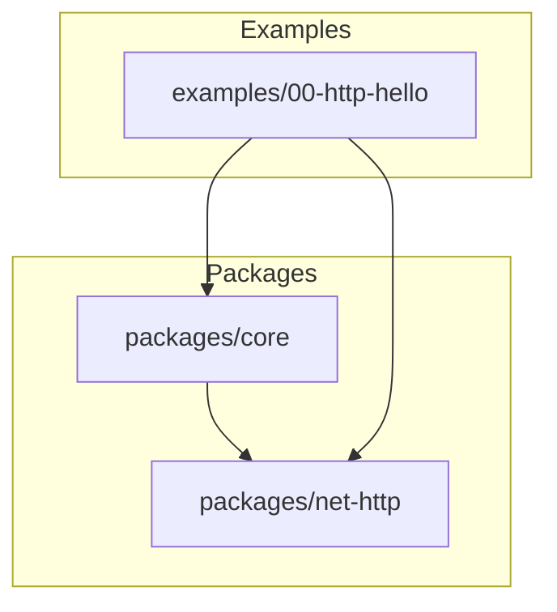
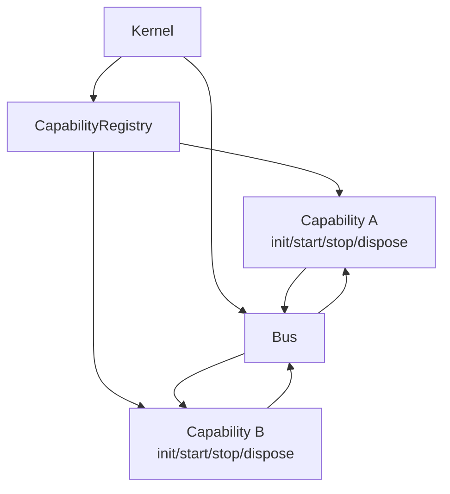
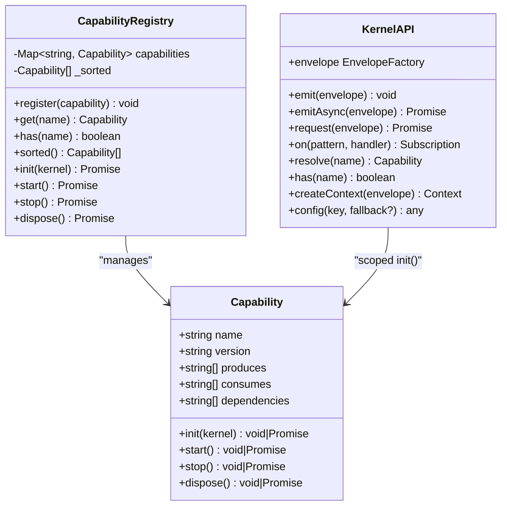
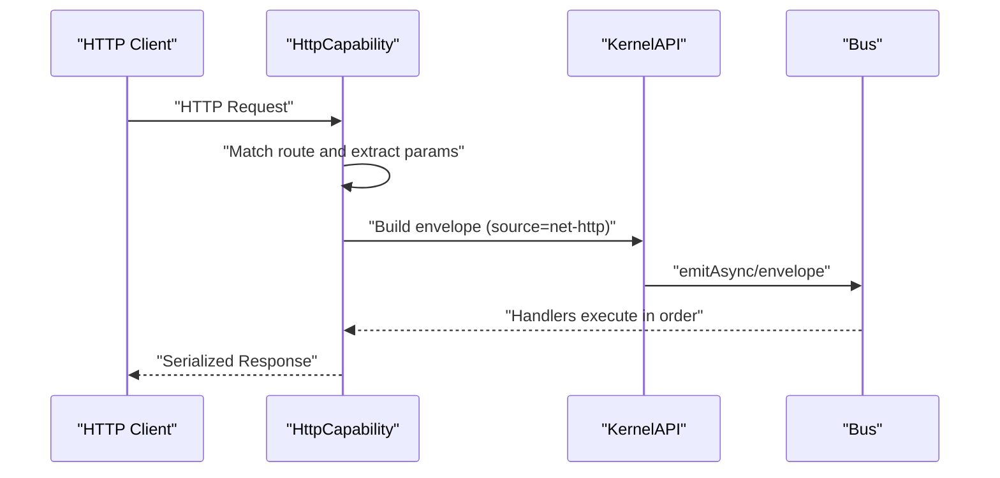
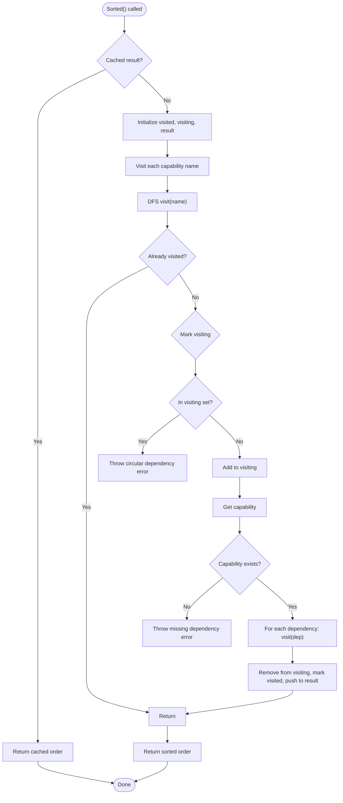
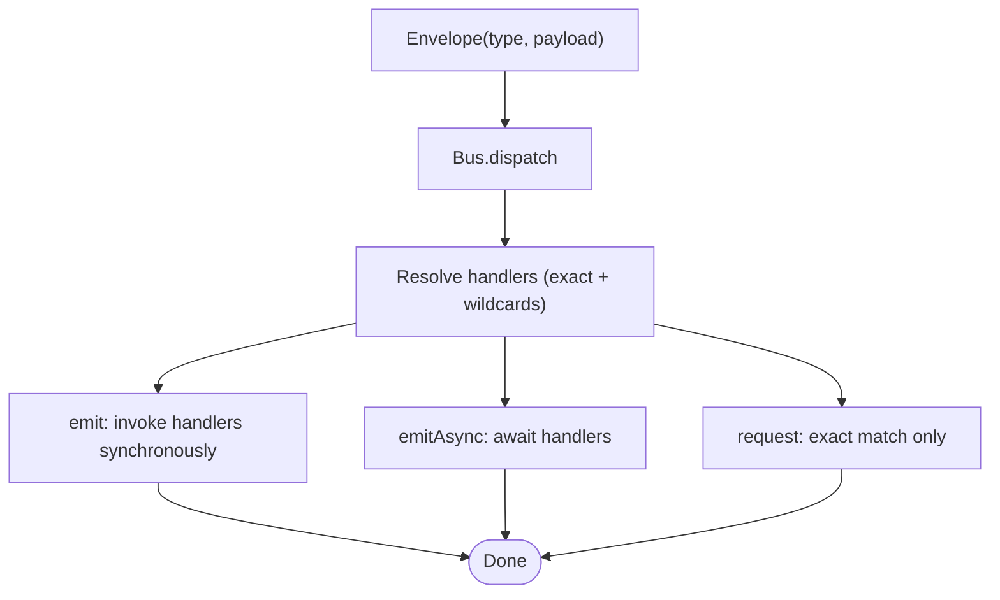
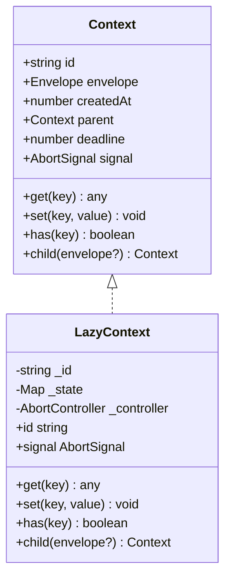
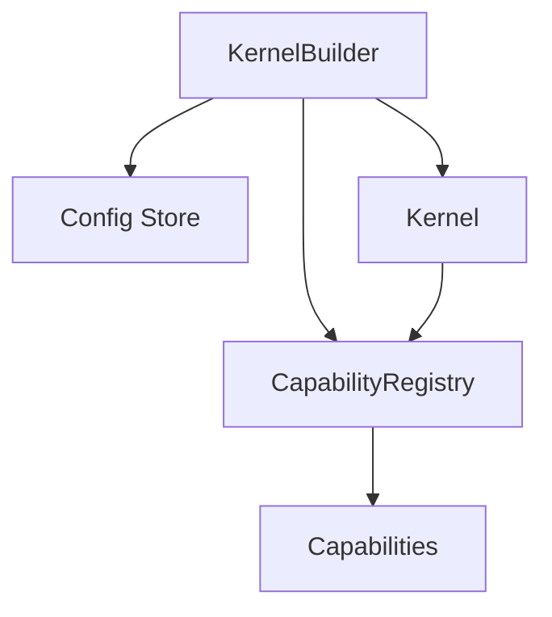

# Capability Pattern

<cite>
**Referenced Files in This Document**
- [README.md](file://README.md)
- [package.json](file://package.json)
- [packages/core/src/index.ts](file://packages/core/src/index.ts)
- [packages/core/src/kernel.ts](file://packages/core/src/kernel.ts)
- [packages/core/src/capability.ts](file://packages/core/src/capability.ts)
- [packages/core/src/bus.ts](file://packages/core/src/bus.ts)
- [packages/core/src/context.ts](file://packages/core/src/context.ts)
- [packages/core/src/message.ts](file://packages/core/src/message.ts)
- [packages/core/README.md](file://packages/core/README.md)
- [packages/net-http/src/capability.ts](file://packages/net-http/src/capability.ts)
- [examples/00-http-hello/src/index.ts](file://examples/00-http-hello/src/index.ts)
- [contexts/kislabin-architecture.md](file://contexts/kislabin-architecture.md)
- [contexts/kislabin-runtime-model.md](file://contexts/kislabin-runtime-model.md)
</cite>

## Table of Contents
1. [Introduction](#introduction)
2. [Project Structure](#project-structure)
3. [Core Components](#core-components)
4. [Architecture Overview](#architecture-overview)
5. [Detailed Component Analysis](#detailed-component-analysis)
6. [Dependency Analysis](#dependency-analysis)
7. [Performance Considerations](#performance-considerations)
8. [Troubleshooting Guide](#troubleshooting-guide)
9. [Conclusion](#conclusion)
10. [Appendices](#appendices)

## Introduction
This document explains the capability pattern implemented by the system, where isolated subsystems (capabilities) communicate exclusively via the message bus. It covers the capability interface and lifecycle, dependency management, isolation guarantees, and practical examples for building and composing capabilities. The goal is to help both newcomers and experienced developers understand how to implement modular, testable, and extensible subsystems that remain independent while collaborating through well-defined message contracts.

## Project Structure
The repository is organized as a monorepo with a core runtime and optional capabilities:
- packages/core: minimal kernel exposing lifecycle, message bus, and capability registry
- packages/net-http: HTTP capability demonstrating a full subsystem
- examples: runnable examples showcasing capability usage
- contexts and docs: conceptual and architectural material

**Diagram sources**
- [package.json:1-29](file://package.json#L1-L29)
- [README.md:100-142](file://README.md#L100-L142)

**Section sources**
- [README.md:98-142](file://README.md#L98-L142)
- [package.json:1-29](file://package.json#L1-L29)

## Core Components
This section introduces the foundational primitives that enable the capability pattern.

- Kernel and KernelAPI
  - The kernel orchestrates lifecycle and exposes KernelAPI to capabilities.
  - KernelAPI provides message emission, request/response, subscription, capability resolution, configuration, and envelope creation.
  - The kernel manages state transitions and emits lifecycle signals.

- Capability and CapabilityRegistry
  - Capability defines a subsystem with lifecycle hooks (init, start, stop, dispose) and declares consumes/produces message types plus dependencies.
  - CapabilityRegistry performs topological sorting of capabilities based on declared dependencies, detects cycles, and caches the sorted order.

- Message primitives and Bus
  - Envelope is the universal message type with kind (command, event, query, signal), type, payload, source, timestamp, and metadata.
  - Bus dispatches messages to handlers with exact match and wildcard support, and supports synchronous emit, asynchronous emitAsync, and request-response semantics.

- Context
  - ExecutionContext flows through handler chains, enabling shared state, tracing, deadlines, and cancellation.

- HTTP Capability (net-http)
  - Demonstrates a full capability that integrates with the kernel’s lifecycle and message bus, translating HTTP requests into envelopes and responses back to HTTP.

**Section sources**
- [packages/core/src/kernel.ts:36-134](file://packages/core/src/kernel.ts#L36-L134)
- [packages/core/src/kernel.ts:159-183](file://packages/core/src/kernel.ts#L159-L183)
- [packages/core/src/kernel.ts:204-245](file://packages/core/src/kernel.ts#L204-L245)
- [packages/core/src/capability.ts:61-99](file://packages/core/src/capability.ts#L61-L99)
- [packages/core/src/capability.ts:115-240](file://packages/core/src/capability.ts#L115-L240)
- [packages/core/src/message.ts:21-87](file://packages/core/src/message.ts#L21-L87)
- [packages/core/src/bus.ts:34-206](file://packages/core/src/bus.ts#L34-L206)
- [packages/core/src/context.ts:22-90](file://packages/core/src/context.ts#L22-L90)
- [packages/net-http/src/capability.ts:102-179](file://packages/net-http/src/capability.ts#L102-L179)

## Architecture Overview
The capability pattern enforces isolation by design: capabilities cannot directly access each other’s internals. They interact exclusively through the message bus using typed envelopes. The kernel coordinates lifecycle and dependency ordering, ensuring capabilities start and stop in the correct order.

**Diagram sources**
- [packages/core/src/kernel.ts:265-354](file://packages/core/src/kernel.ts#L265-L354)
- [packages/core/src/capability.ts:115-240](file://packages/core/src/capability.ts#L115-L240)
- [packages/core/src/bus.ts:34-206](file://packages/core/src/bus.ts#L34-L206)

## Detailed Component Analysis

### Capability Interface and Lifecycle
- Lifecycle stages
  - init: validate configuration, register handlers, prepare resources. Fail-fast on errors.
  - start: open connections, begin listening, publish readiness signals.
  - stop: drain work, stop accepting new tasks (order reversed for shutdown).
  - dispose: always run to release resources and close connections.

- Dependency management
  - capabilities declare dependencies by name; the registry resolves a deterministic topological order and prevents cycles.
  - During init, each capability receives a KernelAPI bound to its own source, ensuring envelopes emitted by the capability carry the correct source.

- Isolation guarantees
  - Capabilities receive a scoped KernelAPI with a dedicated envelope factory; they cannot bypass the kernel to reach other capabilities.
  - Communication is message-driven; no direct function calls or shared state between capabilities.

**Diagram sources**
- [packages/core/src/capability.ts:61-99](file://packages/core/src/capability.ts#L61-L99)
- [packages/core/src/capability.ts:115-240](file://packages/core/src/capability.ts#L115-L240)
- [packages/core/src/kernel.ts:65-134](file://packages/core/src/kernel.ts#L65-L134)

**Section sources**
- [packages/core/src/capability.ts:61-99](file://packages/core/src/capability.ts#L61-L99)
- [packages/core/src/capability.ts:115-240](file://packages/core/src/capability.ts#L115-L240)
- [packages/core/src/kernel.ts:65-134](file://packages/core/src/kernel.ts#L65-L134)

### HTTP Capability Example
The HTTP capability demonstrates a complete subsystem:
- Declares routes with path patterns, optional beforeLoad guards, loaders, and method-specific handlers.
- Integrates with the kernel during init and start, binding to a server and translating HTTP requests to envelopes.
- Emits responses via serialization helpers and handles errors consistently.

**Diagram sources**
- [packages/net-http/src/capability.ts:102-179](file://packages/net-http/src/capability.ts#L102-L179)
- [packages/core/src/kernel.ts:272-290](file://packages/core/src/kernel.ts#L272-L290)
- [packages/core/src/bus.ts:91-136](file://packages/core/src/bus.ts#L91-L136)

**Section sources**
- [packages/net-http/src/capability.ts:102-179](file://packages/net-http/src/capability.ts#L102-L179)
- [examples/00-http-hello/src/index.ts:1-12](file://examples/00-http-hello/src/index.ts#L1-L12)

### Dependency Resolution and Ordering
The registry performs a depth-first topological sort to compute the correct startup/shutdown order:
- Validates that all declared dependencies exist.
- Detects cycles and reports the dependency chain causing the cycle.
- Caches the sorted order for the lifetime of the kernel.

**Diagram sources**
- [packages/core/src/capability.ts:156-192](file://packages/core/src/capability.ts#L156-L192)

**Section sources**
- [packages/core/src/capability.ts:156-192](file://packages/core/src/capability.ts#L156-L192)

### Message Bus and Dispatch Semantics
- emit: synchronous broadcast to exact match and wildcard handlers; async handlers are fire-and-forget.
- emitAsync: waits for all handlers to complete; still ordered and serial.
- request: exact-match only, returns the first handler’s result; throws if none registered.
- Pattern matching: exact, wildcard suffix (e.g., user.*), and global wildcard (*).

**Diagram sources**
- [packages/core/src/bus.ts:91-170](file://packages/core/src/bus.ts#L91-L170)

**Section sources**
- [packages/core/src/bus.ts:34-206](file://packages/core/src/bus.ts#L34-L206)

### Context Propagation
- LazyContext provides a lightweight execution context with:
  - Unique trace ID generation
  - Optional AbortSignal and deadline
  - Shared state via get/set/has
  - Child context creation for trace propagation

**Diagram sources**
- [packages/core/src/context.ts:44-90](file://packages/core/src/context.ts#L44-L90)
- [packages/core/src/context.ts:106-149](file://packages/core/src/context.ts#L106-L149)

**Section sources**
- [packages/core/src/context.ts:22-90](file://packages/core/src/context.ts#L22-L90)
- [packages/core/src/context.ts:106-149](file://packages/core/src/context.ts#L106-L149)

### Implementing a Custom Capability
Steps to implement a capability:
1. Define capability metadata: name, version, produces/consumes types, dependencies.
2. Implement lifecycle hooks:
   - init: read configuration, register handlers, validate prerequisites.
   - start: open connections/resources, begin listening.
   - stop: drain work gracefully.
   - dispose: always release resources.
3. Use kernel.envelope to create envelopes with the capability’s source automatically filled.
4. Register the capability with the kernel builder and start the kernel.

Example references:
- Minimal capability example with lifecycle and dependency declaration
- HTTP capability showing route registration and server integration

**Section sources**
- [packages/core/README.md:139-186](file://packages/core/README.md#L139-L186)
- [packages/net-http/src/capability.ts:102-179](file://packages/net-http/src/capability.ts#L102-L179)

### Handling Lifecycle Events
- The kernel emits lifecycle signals:
  - signal:kernel.init before capabilities start
  - signal:kernel.ready after all capabilities are running
  - signal:kernel.stopping before shutdown begins
  - signal:kernel.stopped after shutdown completes
  - signal:kernel.error on unhandled errors during boot
- Capabilities can listen to these signals to coordinate behavior and observability.

**Section sources**
- [packages/core/src/kernel.ts:314-350](file://packages/core/src/kernel.ts#L314-L350)
- [packages/core/README.md:385-394](file://packages/core/README.md#L385-L394)

## Dependency Analysis
The capability pattern relies on a directed acyclic graph (DAG) of dependencies resolved at boot time. The kernel builder composes capabilities and configuration, then starts the system in a deterministic order.

**Diagram sources**
- [packages/core/src/kernel.ts:204-245](file://packages/core/src/kernel.ts#L204-L245)
- [packages/core/src/capability.ts:115-240](file://packages/core/src/capability.ts#L115-L240)

**Section sources**
- [packages/core/src/kernel.ts:204-245](file://packages/core/src/kernel.ts#L204-L245)
- [packages/core/src/capability.ts:115-240](file://packages/core/src/capability.ts#L115-L240)

## Performance Considerations
- Dispatch performance
  - Exact match: O(1) with hash map lookup
  - Wildcard matching: O(n) where n is the number of wildcard patterns (not number of handlers)
- Context creation is lazy and minimal overhead
- Handlers are invoked synchronously by default for emit, and serially for emitAsync and request
- These characteristics support high-throughput, low-latency messaging within the process boundary

**Section sources**
- [packages/core/src/bus.ts:174-205](file://packages/core/src/bus.ts#L174-L205)
- [packages/core/README.md:410-421](file://packages/core/README.md#L410-L421)

## Troubleshooting Guide
Common issues and resolutions:
- Missing dependency during boot
  - Symptom: error indicating a missing dependency
  - Action: ensure the dependency is registered before the dependent capability
- Circular dependency detected
  - Symptom: error reporting a cycle with the dependency chain
  - Action: remove or restructure the dependency graph so it becomes a DAG
- No handler registered for request
  - Symptom: NoHandlerError thrown
  - Action: register an exact-match handler for the requested type
- Capability fails to start or stop
  - Symptom: graceful handling with stop swallowing errors and dispose always executing
  - Action: inspect capability logs and ensure proper resource cleanup in dispose

**Section sources**
- [packages/core/src/capability.ts:166-170](file://packages/core/src/capability.ts#L166-L170)
- [packages/core/src/bus.ts:209-214](file://packages/core/src/bus.ts#L209-L214)
- [packages/core/src/capability.ts:217-239](file://packages/core/src/capability.ts#L217-L239)

## Conclusion
The capability pattern provides a robust foundation for building modular, testable, and extensible subsystems. By enforcing isolation through the message bus and deterministic lifecycle management, the system achieves strong decoupling, predictable ordering, and portability across languages. The HTTP capability exemplifies how complex functionality can be encapsulated while remaining independent and composable.

## Appendices

### Practical Examples Index
- Minimal capability with lifecycle and dependency declaration
- HTTP capability usage with route definition and server start
- Kernel lifecycle signals and configuration injection

**Section sources**
- [packages/core/README.md:139-201](file://packages/core/README.md#L139-L201)
- [examples/00-http-hello/src/index.ts:1-12](file://examples/00-http-hello/src/index.ts#L1-L12)

### Architectural Context
- Microkernel runtime concept and OTP-like behaviors
- Actor model mapping and cross-capability communication via the message bus
- Observability as system-owned journal versus traditional logging

**Section sources**
- [contexts/kislabin-architecture.md:148-182](file://contexts/kislabin-architecture.md#L148-L182)
- [contexts/kislabin-architecture.md:230-274](file://contexts/kislabin-architecture.md#L230-L274)
- [contexts/kislabin-runtime-model.md:112-173](file://contexts/kislabin-runtime-model.md#L112-L173)