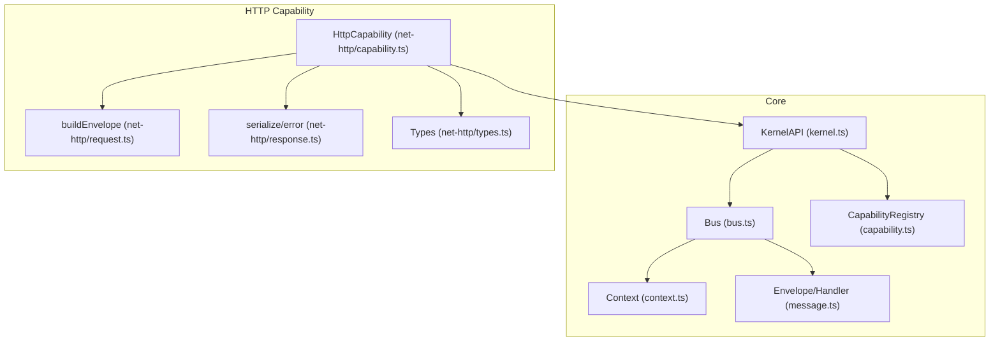
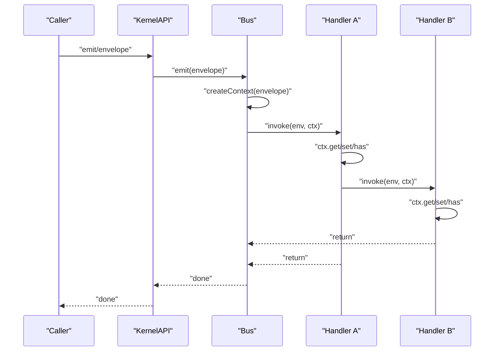
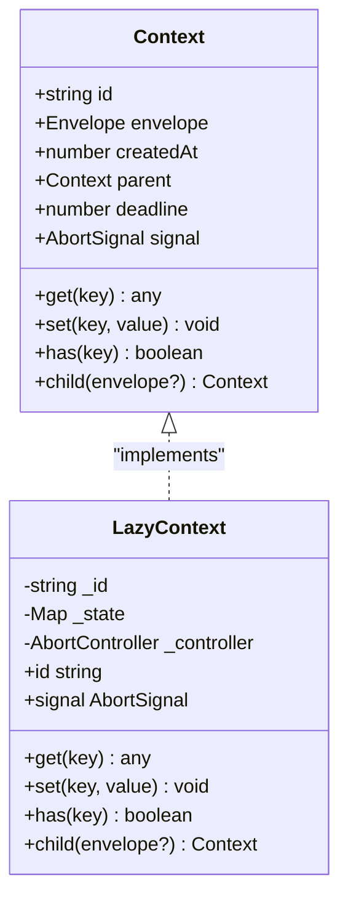
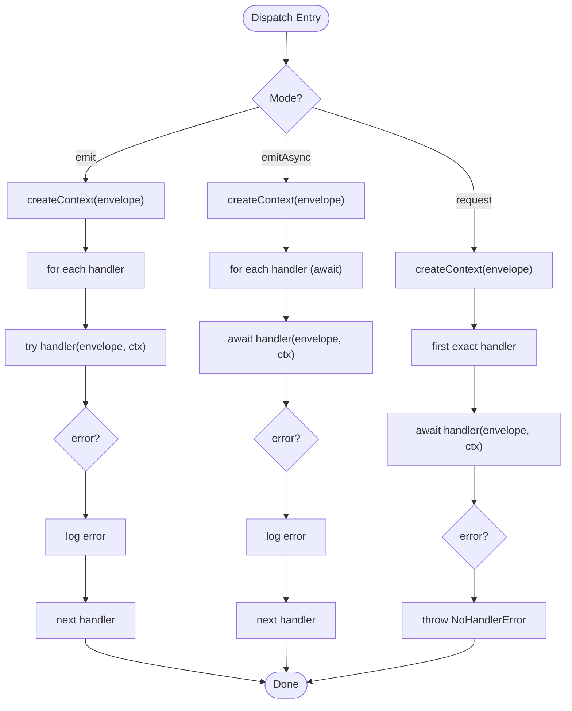
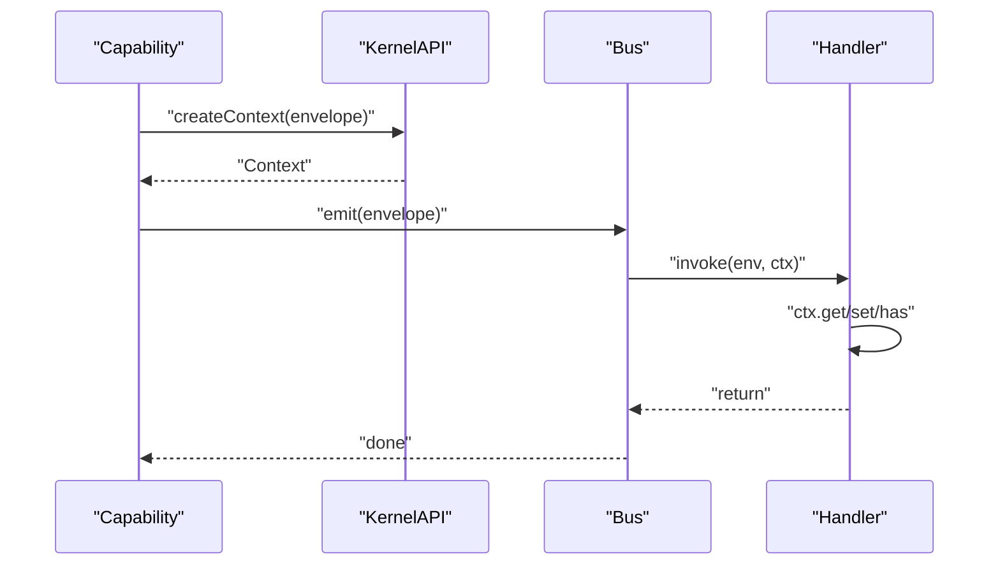
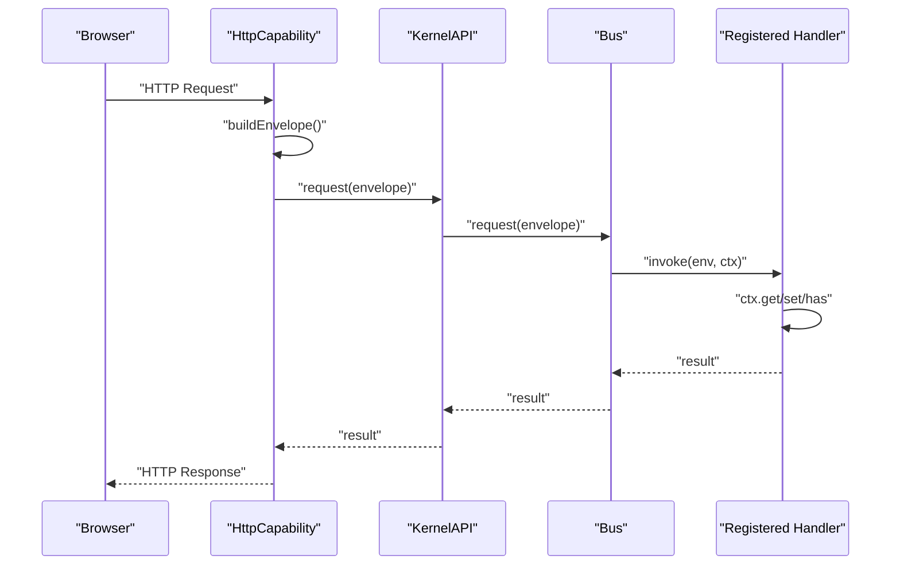
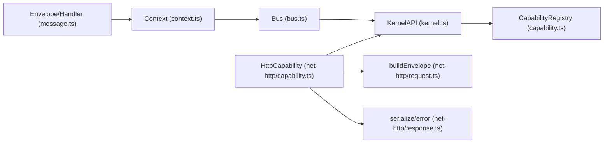

# Context System

<cite>
**Referenced Files in This Document**
- [context.ts](file://packages/core/src/context.ts)
- [bus.ts](file://packages/core/src/bus.ts)
- [kernel.ts](file://packages/core/src/kernel.ts)
- [message.ts](file://packages/core/src/message.ts)
- [capability.ts](file://packages/core/src/capability.ts)
- [index.ts](file://packages/core/src/index.ts)
- [capability.ts](file://packages/net-http/src/capability.ts)
- [request.ts](file://packages/net-http/src/request.ts)
- [response.ts](file://packages/net-http/src/response.ts)
- [types.ts](file://packages/net-http/src/types.ts)
- [README.md](file://README.md)
</cite>

## Table of Contents
1. [Introduction](#introduction)
2. [Project Structure](#project-structure)
3. [Core Components](#core-components)
4. [Architecture Overview](#architecture-overview)
5. [Detailed Component Analysis](#detailed-component-analysis)
6. [Dependency Analysis](#dependency-analysis)
7. [Performance Considerations](#performance-considerations)
8. [Troubleshooting Guide](#troubleshooting-guide)
9. [Conclusion](#conclusion)

## Introduction
This document explains the context propagation system that powers shared state and execution tracking across handlers and capabilities. It covers:
- Context structure: trace identifiers, shared state bags, deadlines, and cancellation
- Automatic creation for incoming envelopes and manual construction for internal operations
- State sharing between handlers while maintaining isolation
- Trace propagation across capability boundaries
- Practical examples of accessing context, passing data between related operations, and implementing timeout-aware operations
- Inheritance patterns, cleanup, and best practices to avoid context pollution
- Integration with the message bus for cross-capability communication

## Project Structure
The context system lives in the core package and integrates with the HTTP capability to demonstrate end-to-end usage. The kernel exposes a public API that capabilities use to emit messages, register handlers, and create contexts. The HTTP capability translates HTTP requests into envelopes and coordinates with the kernel’s bus.

**Diagram sources**
- [kernel.ts:272-290](file://packages/core/src/kernel.ts#L272-L290)
- [bus.ts:34-206](file://packages/core/src/bus.ts#L34-L206)
- [context.ts:44-166](file://packages/core/src/context.ts#L44-L166)
- [message.ts:34-86](file://packages/core/src/message.ts#L34-L86)
- [capability.ts:115-240](file://packages/core/src/capability.ts#L115-L240)
- [capability.ts:102-179](file://packages/net-http/src/capability.ts#L102-L179)
- [request.ts:22-37](file://packages/net-http/src/request.ts#L22-L37)
- [response.ts:8-38](file://packages/net-http/src/response.ts#L8-L38)
- [types.ts:16-112](file://packages/net-http/src/types.ts#L16-L112)

**Section sources**
- [README.md:100-142](file://README.md#L100-L142)
- [kernel.ts:265-353](file://packages/core/src/kernel.ts#L265-L353)
- [capability.ts:101-240](file://packages/core/src/capability.ts#L101-L240)

## Core Components
- Context: carries execution state, trace/correlation ID, optional deadline, cancellation signal, and a shared state bag. It supports parent-child hierarchy for trace propagation.
- Bus: creates a fresh context per envelope and passes it to all matching handlers in a chain.
- KernelAPI: exposes emit/emitAsync/request/on plus a factory to create contexts manually.
- Envelope: the unit of communication with kind, type, payload, source, timestamp, and metadata.
- Capability: autonomous subsystems that communicate via the bus and can create their own contexts when needed.

Key behaviors:
- Context is lazily allocated: only when accessed (id generation, state bag creation, AbortController initialization)
- Handlers receive the same context instance across the chain, enabling shared state via get/set/has
- Parent-child relationship preserves trace lineage and deadline inheritance

**Section sources**
- [context.ts:22-166](file://packages/core/src/context.ts#L22-L166)
- [bus.ts:34-171](file://packages/core/src/bus.ts#L34-L171)
- [kernel.ts:65-134](file://packages/core/src/kernel.ts#L65-L134)
- [message.ts:21-86](file://packages/core/src/message.ts#L21-L86)
- [capability.ts:27-99](file://packages/core/src/capability.ts#L27-L99)

## Architecture Overview
The context system ensures that every message dispatch flows through a single Context instance. The bus creates the context and injects it into each handler in the chain. Capabilities can also create contexts manually for internal operations.

**Diagram sources**
- [bus.ts:91-107](file://packages/core/src/bus.ts#L91-L107)
- [bus.ts:125-136](file://packages/core/src/bus.ts#L125-L136)
- [bus.ts:159-170](file://packages/core/src/bus.ts#L159-L170)
- [kernel.ts:272-290](file://packages/core/src/kernel.ts#L272-L290)

## Detailed Component Analysis

### Context API and Implementation
Context defines:
- Unique execution identifier (trace/correlation)
- Reference to the originating envelope
- Creation timestamp
- Optional parent context for trace propagation
- Optional deadline (epoch ms)
- AbortSignal for cooperative cancellation
- Shared state bag with get/set/has
- Child context creation with isolated state

Implementation details:
- Lazy allocation for id, signal, and state bag
- Child contexts inherit envelope and deadline but start with an empty state bag
- Parent pointer enables reconstructing the trace chain

**Diagram sources**
- [context.ts:44-166](file://packages/core/src/context.ts#L44-L166)

**Section sources**
- [context.ts:22-166](file://packages/core/src/context.ts#L22-L166)

### Bus Dispatch and Context Creation
The bus creates a single Context per envelope and passes it to all handlers in the chain. It supports:
- emit: synchronous broadcast (fire-and-forget promises)
- emitAsync: asynchronous broadcast (waits for all handlers)
- request: point-to-point exact-match dispatch

Error handling:
- Handler exceptions are caught and logged; dispatch continues
- request throws a typed error when no handler is registered

**Diagram sources**
- [bus.ts:91-107](file://packages/core/src/bus.ts#L91-L107)
- [bus.ts:125-136](file://packages/core/src/bus.ts#L125-L136)
- [bus.ts:159-170](file://packages/core/src/bus.ts#L159-L170)
- [bus.ts:209-214](file://packages/core/src/bus.ts#L209-L214)

**Section sources**
- [bus.ts:34-206](file://packages/core/src/bus.ts#L34-L206)

### KernelAPI and Manual Context Construction
KernelAPI exposes:
- emit, emitAsync, request, on
- resolve/capability lookup
- config access
- envelope factory bound to the capability’s source
- Manual context creation via createContext(envelope)

Manual contexts are useful for internal operations that need to:
- Share state across a subset of handlers
- Propagate trace across capability boundaries
- Respect deadlines and cancellation semantics

**Diagram sources**
- [kernel.ts:272-290](file://packages/core/src/kernel.ts#L272-L290)
- [kernel.ts:102-106](file://packages/core/src/kernel.ts#L102-L106)
- [bus.ts:91-107](file://packages/core/src/bus.ts#L91-L107)

**Section sources**
- [kernel.ts:65-134](file://packages/core/src/kernel.ts#L65-L134)
- [kernel.ts:272-290](file://packages/core/src/kernel.ts#L272-L290)

### HTTP Capability Integration and Trace Propagation
The HTTP capability demonstrates end-to-end context usage:
- Translates HTTP requests into envelopes using a capability-bound envelope factory
- Executes route handlers or falls back to kernel.request
- Uses the same context across handlers for shared state and trace propagation

**Diagram sources**
- [capability.ts:102-179](file://packages/net-http/src/capability.ts#L102-L179)
- [request.ts:22-37](file://packages/net-http/src/request.ts#L22-L37)
- [response.ts:8-38](file://packages/net-http/src/response.ts#L8-L38)
- [kernel.ts:272-290](file://packages/core/src/kernel.ts#L272-L290)
- [bus.ts:159-170](file://packages/core/src/bus.ts#L159-L170)

**Section sources**
- [capability.ts:102-179](file://packages/net-http/src/capability.ts#L102-L179)
- [request.ts:22-37](file://packages/net-http/src/request.ts#L22-L37)
- [response.ts:8-38](file://packages/net-http/src/response.ts#L8-L38)

### State Sharing Mechanisms
Handlers can share information using the context’s state bag:
- Use ctx.set(key, value) to store data
- Use ctx.get(key) to retrieve
- Use ctx.has(key) to check existence
- Child contexts start with an empty state bag, ensuring isolation

Best practices:
- Use descriptive keys to avoid collisions
- Keep shared state minimal and immutable when possible
- Prefer child contexts for sub-operations that need isolated state

**Section sources**
- [context.ts:67-89](file://packages/core/src/context.ts#L67-L89)
- [bus.ts:91-107](file://packages/core/src/bus.ts#L91-L107)
- [bus.ts:125-136](file://packages/core/src/bus.ts#L125-L136)

### Trace Propagation Across Capabilities
Trace propagation relies on:
- Context.id as the unique execution identifier
- Context.parent to reconstruct the trace chain
- Context.deadline inherited by child contexts
- Envelope.metadata for transport-level trace/correlation IDs

Patterns:
- When creating a child context, pass the current envelope to preserve the original envelope while allowing new handlers to set their own state
- Use ctx.parent to walk up the trace chain for logging or observability

**Section sources**
- [context.ts:44-89](file://packages/core/src/context.ts#L44-L89)
- [message.ts:47-48](file://packages/core/src/message.ts#L47-L48)
- [capability.ts:196-201](file://packages/core/src/capability.ts#L196-L201)

### Timeout-Aware Operations
Timeouts are managed via:
- Optional deadline field on Context
- AbortSignal for cooperative cancellation
- Handlers should periodically check ctx.signal.aborted and ctx.deadline

Recommended approach:
- Compute deadline from envelope metadata or configuration
- Respect ctx.deadline and abort early if exceeded
- Use ctx.signal to propagate cancellation to downstream operations

**Section sources**
- [context.ts:57-65](file://packages/core/src/context.ts#L57-L65)
- [bus.ts:159-170](file://packages/core/src/bus.ts#L159-L170)

### Context Inheritance Patterns and Cleanup
Inheritance:
- Child contexts inherit envelope and deadline from parent
- Child contexts do not inherit state bag; they start empty
- Use ctx.child(envelope?) to create a child context

Cleanup:
- Contexts are short-lived and tied to a single dispatch
- No explicit dispose method; memory is reclaimed after handlers finish
- Avoid storing long-lived references in the state bag

**Section sources**
- [context.ts:82-89](file://packages/core/src/context.ts#L82-L89)
- [context.ts:146-148](file://packages/core/src/context.ts#L146-L148)

### Best Practices to Avoid Context Pollution
- Keep shared state minimal and scoped
- Use child contexts for sub-operations requiring isolation
- Avoid storing mutable references in the state bag
- Prefer immutable data structures for shared state
- Use descriptive keys and namespaces to prevent collisions

**Section sources**
- [context.ts:67-89](file://packages/core/src/context.ts#L67-L89)
- [context.ts:82-89](file://packages/core/src/context.ts#L82-L89)

## Dependency Analysis
The context system is a core dependency for handlers and capabilities. The bus depends on the context factory, and the kernel exposes both the bus and the context factory to capabilities.

**Diagram sources**
- [message.ts:34-86](file://packages/core/src/message.ts#L34-L86)
- [context.ts:164-166](file://packages/core/src/context.ts#L164-L166)
- [bus.ts:20-21](file://packages/core/src/bus.ts#L20-L21)
- [kernel.ts:272-290](file://packages/core/src/kernel.ts#L272-L290)
- [capability.ts:115-240](file://packages/core/src/capability.ts#L115-L240)
- [capability.ts:102-179](file://packages/net-http/src/capability.ts#L102-L179)
- [request.ts:22-37](file://packages/net-http/src/request.ts#L22-L37)
- [response.ts:8-38](file://packages/net-http/src/response.ts#L8-L38)

**Section sources**
- [index.ts:10-27](file://packages/core/src/index.ts#L10-L27)
- [kernel.ts:265-353](file://packages/core/src/kernel.ts#L265-L353)

## Performance Considerations
- Lazy allocation minimizes overhead for handlers that only read envelope payloads
- Context instances are short-lived and tied to a single dispatch
- Using child contexts avoids copying large state bags
- Avoid heavy allocations in the state bag; prefer small, immutable values

[No sources needed since this section provides general guidance]

## Troubleshooting Guide
Common issues and resolutions:
- No handler registered for a type during request: thrown as a typed error by the bus
- Asynchronous handler errors: caught and logged; dispatch continues
- Need to stop work early: check ctx.signal.aborted and ctx.deadline to abort gracefully

**Section sources**
- [bus.ts:209-214](file://packages/core/src/bus.ts#L209-L214)
- [bus.ts:97-106](file://packages/core/src/bus.ts#L97-L106)
- [context.ts:60-65](file://packages/core/src/context.ts#L60-L65)

## Conclusion
The context system provides a lightweight, efficient mechanism for shared state, trace propagation, and cancellation across handlers and capabilities. By leveraging lazy allocation, parent-child inheritance, and a simple state bag, it enables clean separation of concerns while supporting complex cross-capability workflows. Following the best practices outlined here ensures predictable behavior, maintainable code, and robust observability.