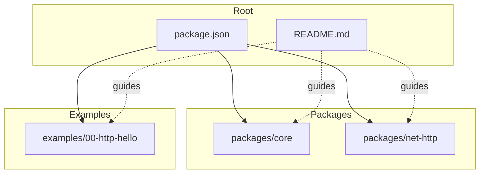
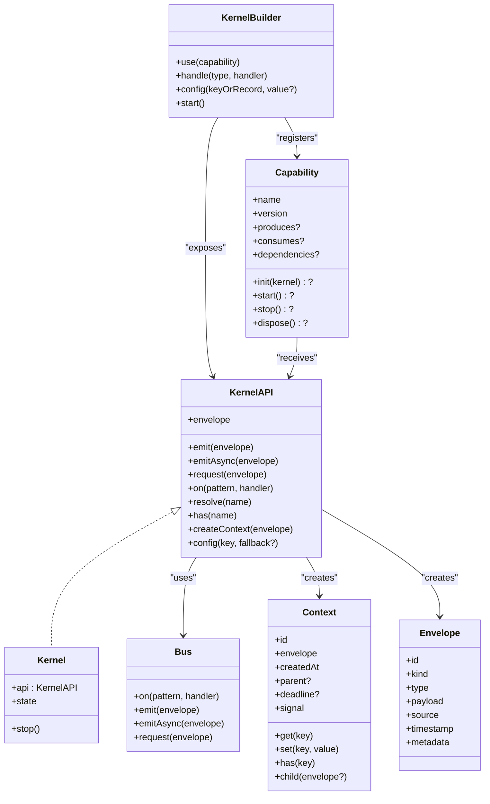
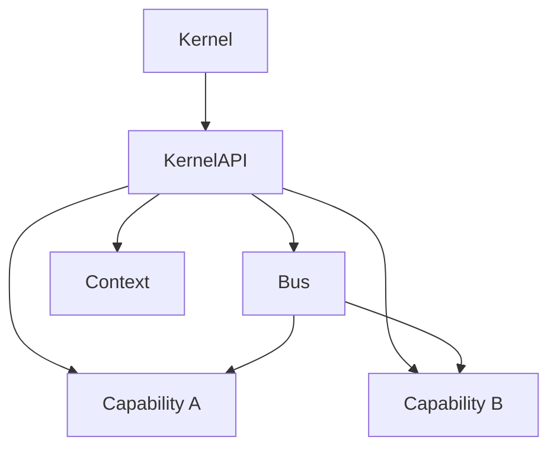
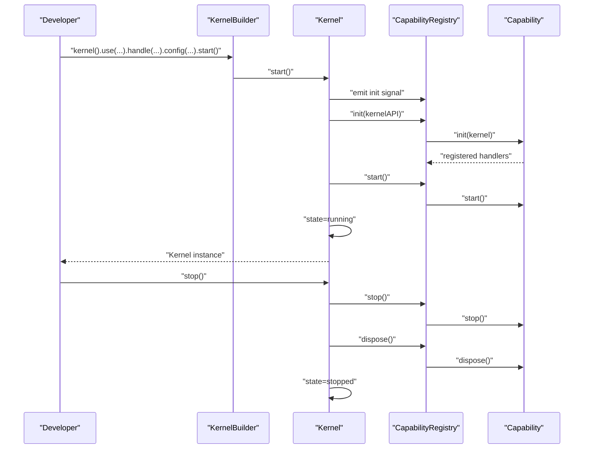
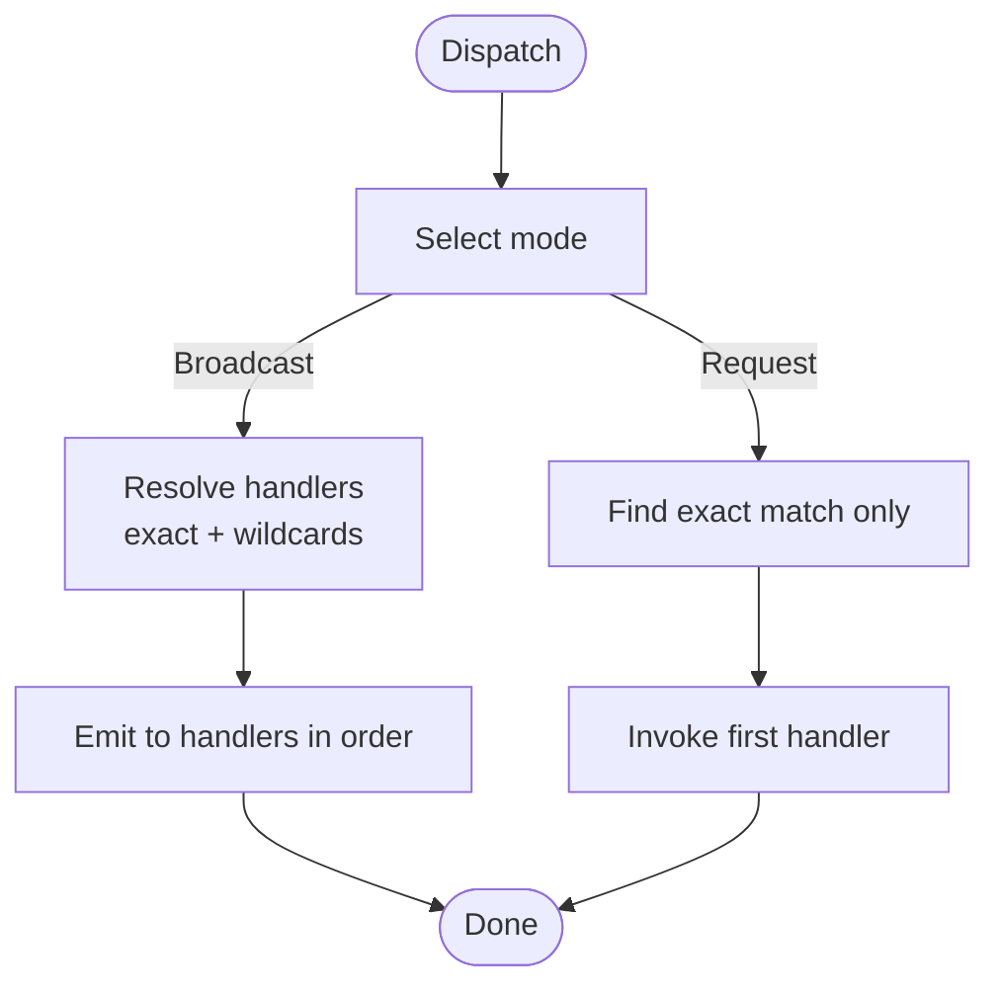
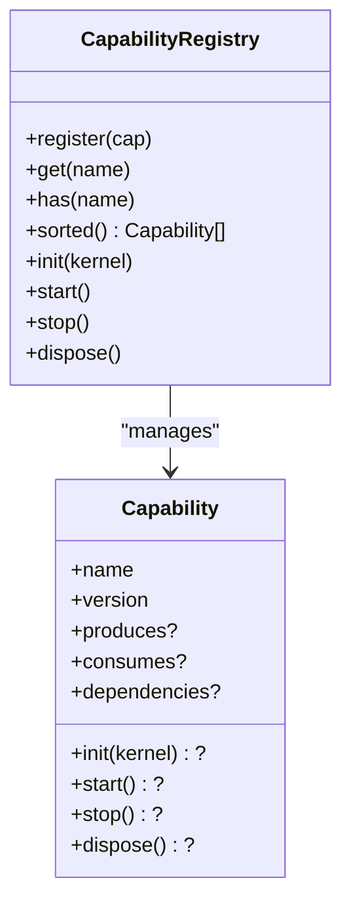
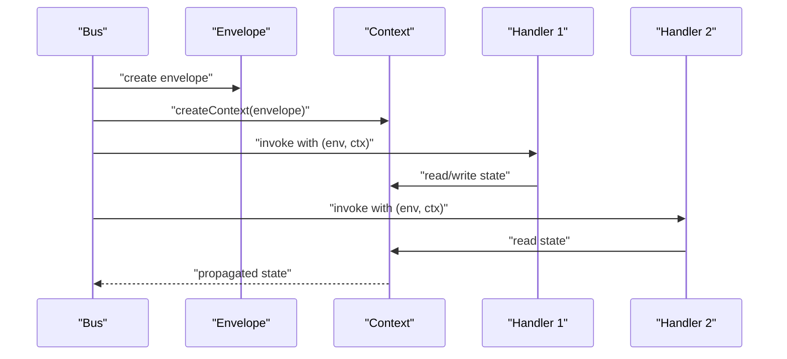
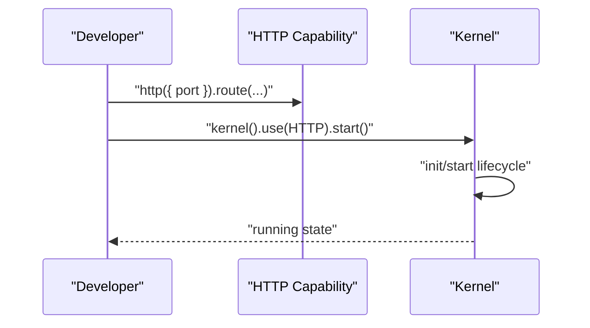
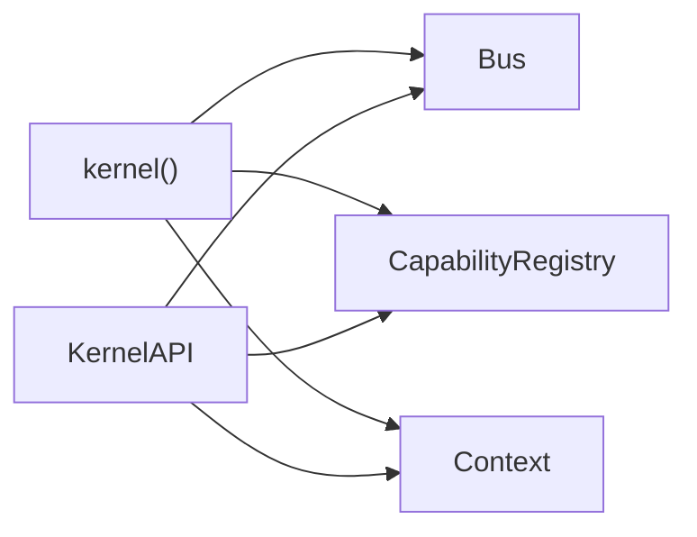

# Core Concepts

<cite>
**Referenced Files in This Document**
- [README.md](file://README.md)
- [package.json](file://package.json)
- [packages/core/src/index.ts](file://packages/core/src/index.ts)
- [packages/core/src/kernel.ts](file://packages/core/src/kernel.ts)
- [packages/core/src/message.ts](file://packages/core/src/message.ts)
- [packages/core/src/context.ts](file://packages/core/src/context.ts)
- [packages/core/src/bus.ts](file://packages/core/src/bus.ts)
- [packages/core/src/capability.ts](file://packages/core/src/capability.ts)
- [examples/00-http-hello/src/index.ts](file://examples/00-http-hello/src/index.ts)
</cite>

## Table of Contents
1. [Introduction](#introduction)
2. [Project Structure](#project-structure)
3. [Core Components](#core-components)
4. [Architecture Overview](#architecture-overview)
5. [Detailed Component Analysis](#detailed-component-analysis)
6. [Dependency Analysis](#dependency-analysis)
7. [Performance Considerations](#performance-considerations)
8. [Troubleshooting Guide](#troubleshooting-guide)
9. [Conclusion](#conclusion)

## Introduction
This document explains the fundamental concepts of the kislabin framework. It presents the kernel as a minimal microkernel system, distinct from traditional frameworks by keeping the core extremely small and focused. The system is message-driven: everything is modeled as messages flowing through a central bus. Capabilities are isolated subsystems that communicate exclusively via messages. The lifecycle is explicit and ordered, with startup and shutdown phases. Context propagation enables shared state and execution tracking across handlers.

These concepts are validated by the project’s README and the core implementation in the packages/core module.

**Section sources**
- [README.md:11-83](file://README.md#L11-L83)

## Project Structure
The repository is organized as a monorepo with workspaces:
- packages/core: the kernel and primitives (messages, bus, context, capabilities)
- packages/net-http: an HTTP capability example
- examples: runnable examples demonstrating usage
- docs and contexts: conceptual and roadmap documentation

**Diagram sources**
- [package.json:1-29](file://package.json#L1-L29)
- [README.md:100-142](file://README.md#L100-L142)

**Section sources**
- [package.json:24-27](file://package.json#L24-L27)
- [README.md:100-142](file://README.md#L100-L142)

## Core Components
This section introduces the building blocks that underpin the kislabin model.

- Kernel and KernelAPI: the central orchestrator exposing a strict API surface for capabilities to interact with the system.
- Message primitives: Envelope and semantic kinds (command, event, query, signal) form the universal unit of communication.
- Bus: a message dispatcher implementing broadcast and request patterns with wildcard support.
- Context: a lightweight execution context carrying shared state, tracing, deadlines, and cancellation.
- Capability and CapabilityRegistry: the contract for isolated subsystems and their lifecycle orchestration.

**Diagram sources**
- [packages/core/src/kernel.ts:65-183](file://packages/core/src/kernel.ts#L65-L183)
- [packages/core/src/kernel.ts:204-245](file://packages/core/src/kernel.ts#L204-L245)
- [packages/core/src/message.ts:34-49](file://packages/core/src/message.ts#L34-L49)
- [packages/core/src/bus.ts:34-33](file://packages/core/src/bus.ts#L34-L33)
- [packages/core/src/context.ts:44-90](file://packages/core/src/context.ts#L44-L90)
- [packages/core/src/capability.ts:61-99](file://packages/core/src/capability.ts#L61-L99)

**Section sources**
- [packages/core/src/index.ts:10-28](file://packages/core/src/index.ts#L10-L28)
- [packages/core/src/kernel.ts:65-183](file://packages/core/src/kernel.ts#L65-L183)
- [packages/core/src/message.ts:11-64](file://packages/core/src/message.ts#L11-L64)
- [packages/core/src/bus.ts:34-33](file://packages/core/src/bus.ts#L34-L33)
- [packages/core/src/context.ts:22-90](file://packages/core/src/context.ts#L22-L90)
- [packages/core/src/capability.ts:28-99](file://packages/core/src/capability.ts#L28-L99)

## Architecture Overview
Kislabin’s architecture is a microkernel system:
- Kernel: minimal core managing lifecycle and the message bus.
- Bus: routes messages to handlers based on patterns.
- Context: flows with each dispatch to share state and execution metadata.
- Capabilities: isolated subsystems that register handlers and optionally participate in lifecycle phases.

**Diagram sources**
- [packages/core/src/kernel.ts:265-354](file://packages/core/src/kernel.ts#L265-L354)
- [packages/core/src/bus.ts:34-33](file://packages/core/src/bus.ts#L34-L33)
- [packages/core/src/context.ts:164-167](file://packages/core/src/context.ts#L164-L167)
- [packages/core/src/capability.ts:61-99](file://packages/core/src/capability.ts#L61-L99)

## Detailed Component Analysis

### Kernel and Lifecycle Management
The kernel exposes a builder pattern to configure capabilities, handlers, and configuration, then starts the system. The lifecycle is explicit:
- Init phase: capabilities initialize with KernelAPI and register handlers.
- Start phase: capabilities open connections and begin listening.
- Running state: ready for message dispatch.
- Stop/dispose phases: graceful shutdown with reverse order execution.

**Diagram sources**
- [packages/core/src/kernel.ts:314-350](file://packages/core/src/kernel.ts#L314-L350)
- [packages/core/src/capability.ts:194-240](file://packages/core/src/capability.ts#L194-L240)

**Section sources**
- [packages/core/src/kernel.ts:136-183](file://packages/core/src/kernel.ts#L136-L183)
- [packages/core/src/kernel.ts:204-245](file://packages/core/src/kernel.ts#L204-L245)
- [packages/core/src/capability.ts:101-114](file://packages/core/src/capability.ts#L101-L114)

### Message-Driven Design and Envelope Model
All communication is message-based. Envelopes carry kind, type, payload, source, timestamp, and metadata. The bus supports:
- Broadcast emission (emit/emitAsync) with exact match plus wildcard patterns.
- Point-to-point request (request) returning the first handler’s result.

**Diagram sources**
- [packages/core/src/bus.ts:80-171](file://packages/core/src/bus.ts#L80-L171)
- [packages/core/src/message.ts:11-64](file://packages/core/src/message.ts#L11-L64)

**Section sources**
- [packages/core/src/message.ts:21-64](file://packages/core/src/message.ts#L21-L64)
- [packages/core/src/bus.ts:34-33](file://packages/core/src/bus.ts#L34-L33)

### Capability Pattern and Isolation
Capabilities are autonomous units with optional lifecycle hooks. They declare consumed and produced message types and explicit dependencies. The registry enforces a deterministic initialization order and handles graceful shutdown in reverse order.

**Diagram sources**
- [packages/core/src/capability.ts:61-99](file://packages/core/src/capability.ts#L61-L99)
- [packages/core/src/capability.ts:115-241](file://packages/core/src/capability.ts#L115-L241)

**Section sources**
- [packages/core/src/capability.ts:28-99](file://packages/core/src/capability.ts#L28-L99)
- [packages/core/src/capability.ts:101-114](file://packages/core/src/capability.ts#L101-L114)

### Context Propagation and Execution Tracking
Context carries execution metadata and shared state across handlers:
- Unique execution ID for tracing and correlation.
- Parent-child hierarchy enabling trace propagation.
- Deadline and AbortSignal for timeouts and cancellation.
- Lazy allocation of state bag and controller to minimize overhead.

**Diagram sources**
- [packages/core/src/context.ts:164-167](file://packages/core/src/context.ts#L164-L167)
- [packages/core/src/bus.ts:91-107](file://packages/core/src/bus.ts#L91-L107)

**Section sources**
- [packages/core/src/context.ts:22-90](file://packages/core/src/context.ts#L22-L90)
- [packages/core/src/context.ts:92-167](file://packages/core/src/context.ts#L92-L167)

### Practical Example: HTTP Capability
The HTTP example demonstrates how a capability integrates with the kernel to expose routes and start the server.

**Diagram sources**
- [examples/00-http-hello/src/index.ts:1-12](file://examples/00-http-hello/src/index.ts#L1-L12)

**Section sources**
- [examples/00-http-hello/src/index.ts:1-12](file://examples/00-http-hello/src/index.ts#L1-L12)

## Dependency Analysis
The kernel composes three core collaborators: Bus, CapabilityRegistry, and Context. The public API is exposed via KernelAPI, which delegates to these collaborators.

**Diagram sources**
- [packages/core/src/kernel.ts:265-354](file://packages/core/src/kernel.ts#L265-L354)
- [packages/core/src/bus.ts:34-33](file://packages/core/src/bus.ts#L34-L33)
- [packages/core/src/capability.ts:115-241](file://packages/core/src/capability.ts#L115-L241)
- [packages/core/src/context.ts:164-167](file://packages/core/src/context.ts#L164-L167)

**Section sources**
- [packages/core/src/kernel.ts:21-32](file://packages/core/src/kernel.ts#L21-L32)
- [packages/core/src/index.ts:10-28](file://packages/core/src/index.ts#L10-L28)

## Performance Considerations
- Dispatch cost: O(1) for exact match and O(n) for wildcard expansion, where n is the number of patterns with wildcards, not handlers.
- Asynchronous handlers: emitAsync waits for completion; emit ignores returned promises to avoid blocking.
- Lazy context: minimizes allocations for handlers that only read payload.
- Topological ordering: capability lifecycle runs once and is cached, avoiding repeated graph traversal.

[No sources needed since this section provides general guidance]

## Troubleshooting Guide
Common issues and diagnostics:
- No handler registered for a type: request() throws a dedicated error when no exact match exists.
- Missing configuration: kernel.config() without fallback raises an error.
- Circular dependencies or missing dependencies: CapabilityRegistry detects cycles and missing nodes during sorted() computation.
- Graceful shutdown: stop() swallows errors while continuing lifecycle; dispose() always executes.

**Section sources**
- [packages/core/src/bus.ts:209-214](file://packages/core/src/bus.ts#L209-L214)
- [packages/core/src/kernel.ts:283-287](file://packages/core/src/kernel.ts#L283-L287)
- [packages/core/src/capability.ts:156-192](file://packages/core/src/capability.ts#L156-L192)
- [packages/core/src/capability.ts:217-239](file://packages/core/src/capability.ts#L217-L239)

## Conclusion
Kislabin’s core model is a minimal microkernel that treats all interactions as messages routed by a central bus. Capabilities remain isolated and communicate exclusively via envelopes. The lifecycle is explicit and ordered, and context propagation enables shared state and execution tracking. This design yields a portable, testable, and observable system that aligns with the philosophy described in the project’s README.

[No sources needed since this section summarizes without analyzing specific files]