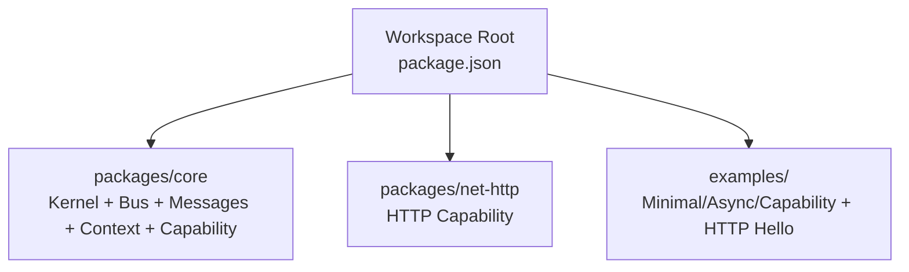
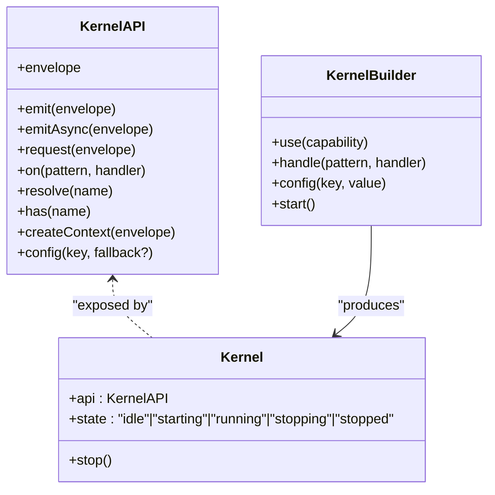
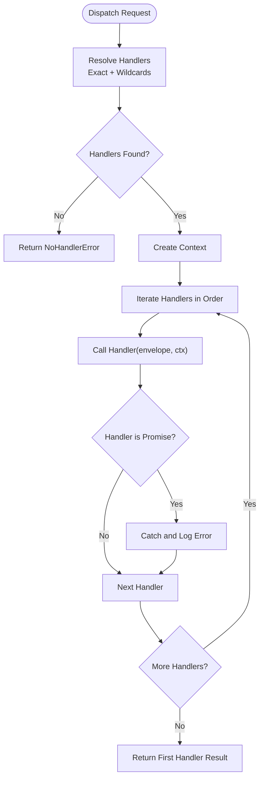
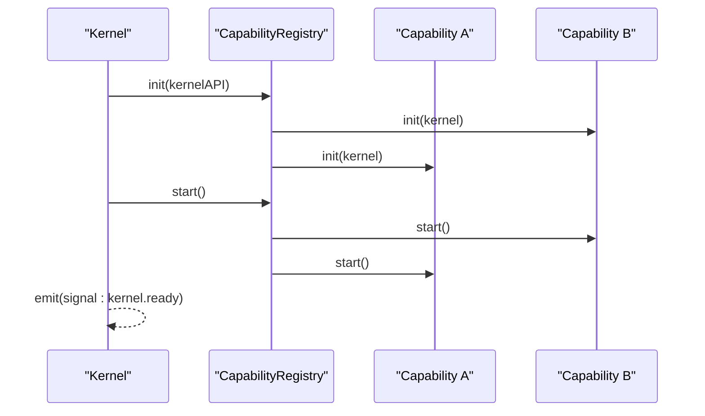
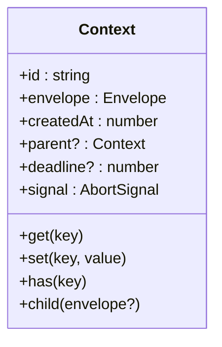
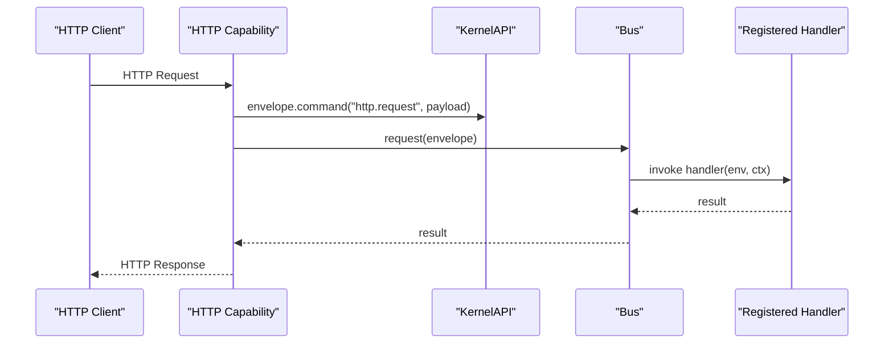
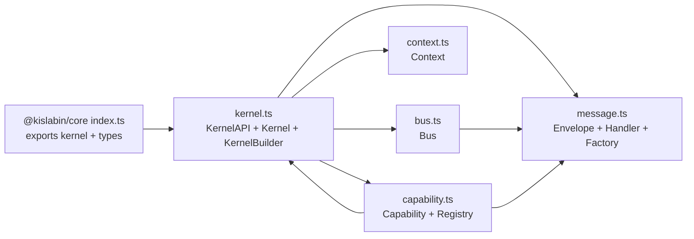

# Kernel Architecture

<cite>
**Referenced Files in This Document**
- [README.md](file://README.md)
- [CLAUDE.md](file://CLAUDE.md)
- [package.json](file://package.json)
- [packages/core/src/index.ts](file://packages/core/src/index.ts)
- [packages/core/src/kernel.ts](file://packages/core/src/kernel.ts)
- [packages/core/src/bus.ts](file://packages/core/src/bus.ts)
- [packages/core/src/capability.ts](file://packages/core/src/capability.ts)
- [packages/core/src/message.ts](file://packages/core/src/message.ts)
- [packages/core/src/context.ts](file://packages/core/src/context.ts)
- [packages/core/README.md](file://packages/core/README.md)
- [contexts/kislabin-api-contract.ts](file://contexts/kislabin-api-contract.ts)
- [packages/net-http/src/capability.ts](file://packages/net-http/src/capability.ts)
- [examples/00-http-hello/src/index.ts](file://examples/00-http-hello/src/index.ts)
</cite>

## Table of Contents
1. [Introduction](#introduction)
2. [Project Structure](#project-structure)
3. [Core Components](#core-components)
4. [Architecture Overview](#architecture-overview)
5. [Detailed Component Analysis](#detailed-component-analysis)
6. [Dependency Analysis](#dependency-analysis)
7. [Performance Considerations](#performance-considerations)
8. [Troubleshooting Guide](#troubleshooting-guide)
9. [Conclusion](#conclusion)
10. [Appendices](#appendices)

## Introduction
This document explains the kernel architecture as a microkernel system. The kernel is the central orchestrator that manages capabilities and lifecycle without embedding technology-specific concerns such as HTTP, databases, or authentication. Instead, these become isolated capabilities that communicate exclusively through the message bus. The kernel's responsibilities include message bus management, capability registry, lifecycle execution order, and system signaling. The kernel deliberately avoids knowledge of external systems, ensuring portability and separation of concerns.

## Project Structure
The repository is organized as a Bun workspace with packages for the core kernel and optional capabilities. The core provides the foundational primitives and orchestration, while capabilities (e.g., HTTP) are separate packages that integrate via the kernel’s public API.



**Diagram sources**
- [package.json:1-29](file://package.json#L1-L29)
- [README.md:100-142](file://README.md#L100-L142)

**Section sources**
- [README.md:100-142](file://README.md#L100-L142)
- [package.json:1-29](file://package.json#L1-L29)

## Core Components
The kernel’s core is intentionally minimal (~300 lines) and focused on orchestration:

- Message primitives: Envelope, MessageKind, and typed aliases (Command, Event, Query, Signal)
- Handler and Subscription types
- Context (ExecutionContext) with lazy allocation and trace propagation
- Bus for message routing (emit, emitAsync, request) with wildcard support
- Capability interface and registry with topological lifecycle ordering
- KernelAPI exposing system calls to capabilities
- KernelBuilder for ergonomic configuration and startup

These components form a message-driven runtime where everything is a message and capabilities are isolated subsystems.

**Section sources**
- [packages/core/src/message.ts:1-164](file://packages/core/src/message.ts#L1-L164)
- [packages/core/src/context.ts:1-167](file://packages/core/src/context.ts#L1-L167)
- [packages/core/src/bus.ts:1-214](file://packages/core/src/bus.ts#L1-L214)
- [packages/core/src/capability.ts:1-241](file://packages/core/src/capability.ts#L1-L241)
- [packages/core/src/kernel.ts:1-354](file://packages/core/src/kernel.ts#L1-L354)
- [packages/core/src/index.ts:1-28](file://packages/core/src/index.ts#L1-L28)

## Architecture Overview
The kernel acts as a central hub connecting capabilities through the message bus. Capabilities register handlers, produce/consume messages, and manage their own lifecycle. The kernel enforces strict separation: it knows only how to route messages, manage lifecycle, and emit system signals—never the specifics of transport or storage.

```mermaid
graph TB
subgraph "Kernel Space"
KAPI["KernelAPI<br/>System Calls"]
Bus["Bus<br/>emit/emitAsync/request"]
Reg["CapabilityRegistry<br/>Topological Sort"]
State["Kernel State<br/>idle/starting/running/stopping/stopped"]
end
subgraph "Capability Space"
CapA["Capability A<br/>init/start/stop/dispose"]
CapB["Capability B<br/>init/start/stop/dispose"]
CapC["Capability C<br/>init/start/stop/dispose"]
end
KAPI --> Bus
KAPI --> Reg
KAPI --> State
Bus <- --> CapA
Bus <- --> CapB
Bus <- --> CapC
Reg --> CapA
Reg --> CapB
Reg --> CapC
```

**Diagram sources**
- [packages/core/src/kernel.ts:65-134](file://packages/core/src/kernel.ts#L65-L134)
- [packages/core/src/bus.ts:34-34](file://packages/core/src/bus.ts#L34-L34)
- [packages/core/src/capability.ts:115-241](file://packages/core/src/capability.ts#L115-L241)

Key architectural principles:
- Everything is a message: commands, events, queries, and signals unify all I/O.
- Capabilities are isolated and communicate only via the bus.
- Lifecycle is serial and deterministic: init/start in topological order; stop/dispose in reverse.
- System signals are emitted automatically for observability.

**Section sources**
- [README.md:61-83](file://README.md#L61-L83)
- [CLAUDE.md:32-69](file://CLAUDE.md#L32-L69)
- [packages/core/README.md:17-26](file://packages/core/README.md#L17-L26)

## Detailed Component Analysis

### Kernel and KernelAPI
The kernel exposes a minimal public API (KernelAPI) that capabilities use to interact with the system. It provides:
- Message emission: emit (fire-and-forget), emitAsync (wait for completion), request (point-to-point)
- Handler registration: on(pattern, handler) returning a Subscription
- Capability resolution: resolve(name) and has(name)
- Context creation and configuration access
- EnvelopeFactory bound to the capability’s source

The kernel manages lifecycle signals and transitions the system state through startup and shutdown sequences.



**Diagram sources**
- [packages/core/src/kernel.ts:65-183](file://packages/core/src/kernel.ts#L65-L183)

**Section sources**
- [packages/core/src/kernel.ts:65-183](file://packages/core/src/kernel.ts#L65-L183)
- [packages/core/src/kernel.ts:265-354](file://packages/core/src/kernel.ts#L265-L354)

### Bus and Message Routing
The Bus routes Envelopes to handlers based on pattern matching:
- Exact match O(1) via Map
- Wildcard suffix matching (e.g., user.*) with linear scan over registered wildcard patterns
- Three dispatch modes:
  - emit: synchronous broadcast
  - emitAsync: asynchronous broadcast with serial waits
  - request: exact-match point-to-point with first-handler result

Handlers receive the Envelope and a shared Context that flows through the handler chain.



**Diagram sources**
- [packages/core/src/bus.ts:159-170](file://packages/core/src/bus.ts#L159-L170)
- [packages/core/src/bus.ts:183-205](file://packages/core/src/bus.ts#L183-L205)

**Section sources**
- [packages/core/src/bus.ts:34-214](file://packages/core/src/bus.ts#L34-L214)
- [packages/core/src/message.ts:115-164](file://packages/core/src/message.ts#L115-L164)

### Capability and Registry
Capabilities are autonomous subsystems with lifecycle phases:
- init: register handlers, validate config, prepare resources
- start: open connections, begin listening
- stop: drain work, stop accepting new tasks
- dispose: always run to free resources

The CapabilityRegistry performs topological sorting to ensure dependencies are initialized before dependents and stopped in reverse order during shutdown.



**Diagram sources**
- [packages/core/src/capability.ts:194-211](file://packages/core/src/capability.ts#L194-L211)
- [packages/core/src/kernel.ts:314-329](file://packages/core/src/kernel.ts#L314-L329)

**Section sources**
- [packages/core/src/capability.ts:115-241](file://packages/core/src/capability.ts#L115-L241)
- [packages/core/src/kernel.ts:314-329](file://packages/core/src/kernel.ts#L314-L329)

### Context (ExecutionContext)
Context carries execution state across handlers:
- Unique execution ID for tracing and correlation
- Lazy allocation for ID and AbortSignal
- State bag (get/set/has) for middleware/handler collaboration
- Optional deadline and AbortSignal for cancellation
- Parent/child hierarchy for trace propagation



**Diagram sources**
- [packages/core/src/context.ts:44-90](file://packages/core/src/context.ts#L44-L90)

**Section sources**
- [packages/core/src/context.ts:94-167](file://packages/core/src/context.ts#L94-L167)

### HTTP Capability Example
The HTTP capability demonstrates the microkernel philosophy: it translates HTTP requests into messages and responses back to HTTP, without the kernel needing to know HTTP specifics.



**Diagram sources**
- [packages/net-http/src/capability.ts:120-164](file://packages/net-http/src/capability.ts#L120-L164)
- [examples/00-http-hello/src/index.ts:1-12](file://examples/00-http-hello/src/index.ts#L1-L12)

**Section sources**
- [packages/net-http/src/capability.ts:102-179](file://packages/net-http/src/capability.ts#L102-L179)
- [examples/00-http-hello/src/index.ts:1-12](file://examples/00-http-hello/src/index.ts#L1-L12)

## Dependency Analysis
The kernel maintains low coupling and clear boundaries:
- Core depends only on TypeScript built-ins and Bun runtime (UUID generation)
- Capabilities depend on core types and APIs but not on each other
- Registry enforces dependency constraints via topological sort



**Diagram sources**
- [packages/core/src/index.ts:10-28](file://packages/core/src/index.ts#L10-L28)
- [packages/core/src/kernel.ts:21-32](file://packages/core/src/kernel.ts#L21-L32)
- [packages/core/src/bus.ts:20-21](file://packages/core/src/bus.ts#L20-L21)
- [packages/core/src/capability.ts:23-24](file://packages/core/src/capability.ts#L23-L24)
- [packages/core/src/message.ts:9-9](file://packages/core/src/message.ts#L9-L9)
- [packages/core/src/context.ts:18-18](file://packages/core/src/context.ts#L18-L18)

**Section sources**
- [packages/core/src/index.ts:10-28](file://packages/core/src/index.ts#L10-L28)
- [packages/core/src/kernel.ts:21-32](file://packages/core/src/kernel.ts#L21-L32)
- [packages/core/src/bus.ts:20-21](file://packages/core/src/bus.ts#L20-L21)
- [packages/core/src/capability.ts:23-24](file://packages/core/src/capability.ts#L23-L24)
- [packages/core/src/message.ts:9-9](file://packages/core/src/message.ts#L9-L9)
- [packages/core/src/context.ts:18-18](file://packages/core/src/context.ts#L18-L18)

## Performance Considerations
- Exact match dispatch is O(1) via Map lookup; wildcard matching is O(n) over wildcard patterns (not handlers)
- Context creation is lazy and lightweight; handlers that only read payload incur minimal overhead
- Serial lifecycle ensures deterministic behavior and predictable resource usage
- Fire-and-forget emit minimizes latency for broadcast scenarios

**Section sources**
- [packages/core/src/bus.ts:11-18](file://packages/core/src/bus.ts#L11-L18)
- [packages/core/README.md:410-421](file://packages/core/README.md#L410-L421)

## Troubleshooting Guide
Common issues and remedies:
- No handler registered for a type: request() throws a specific error; use emit()/emitAsync() for broadcast or register a handler
- Missing required configuration: config() without fallback throws at boot; provide defaults or move to optional usage
- Circular dependencies or missing dependencies: registry detects cycles and missing nodes during sorted() computation
- Graceful shutdown: ensure stop() drains work and dispose() always releases resources

Operational signals:
- signal:kernel.init, signal:kernel.ready, signal:kernel.stopping, signal:kernel.stopped, signal:kernel.error

**Section sources**
- [packages/core/src/bus.ts:209-214](file://packages/core/src/bus.ts#L209-L214)
- [packages/core/src/capability.ts:156-192](file://packages/core/src/capability.ts#L156-L192)
- [packages/core/README.md:398-407](file://packages/core/README.md#L398-L407)

## Conclusion
The kernel architecture embodies a microkernel philosophy: a tiny, message-driven core that orchestrates isolated capabilities through a shared bus. By avoiding technology-specific knowledge, the system remains portable, testable, and maintainable. Capabilities encapsulate domain concerns, while the kernel guarantees deterministic lifecycle, robust signaling, and clean separation of responsibilities.

## Appendices

### Conceptual Examples Demonstrating Microkernel Philosophy
- Hello World with kernel and capability: demonstrates minimal bootstrap and capability registration
- Same handler across transports: HTTP and queue both produce the same command, consumed by identical handlers
- Custom capability (logger): capability listens to all messages and logs them without kernel involvement
- Capability with dependencies: auth capability depends on store; kernel ensures correct initialization order

**Section sources**
- [README.md:20-36](file://README.md#L20-L36)
- [contexts/kislabin-api-contract.ts:333-453](file://contexts/kislabin-api-contract.ts#L333-L453)

### Kernel Responsibilities vs. Limitations
Responsibilities:
- Manage message bus (emit, emitAsync, request)
- Maintain capability registry and enforce lifecycle order
- Emit system signals for observability
- Provide KernelAPI as the sole interface for capabilities

Limitations (by design):
- Does not know HTTP, databases, queues, auth, or other transports
- No DI container, decorators, reflection, or global state
- No external dependencies beyond Bun runtime and TypeScript built-ins

**Section sources**
- [packages/core/src/kernel.ts:7-19](file://packages/core/src/kernel.ts#L7-L19)
- [CLAUDE.md:61-69](file://CLAUDE.md#L61-L69)
- [contexts/kislabin-api-contract.ts:498-522](file://contexts/kislabin-api-contract.ts#L498-L522)