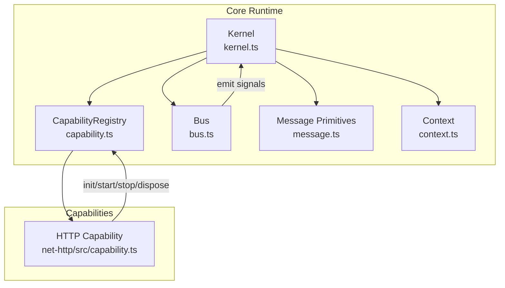
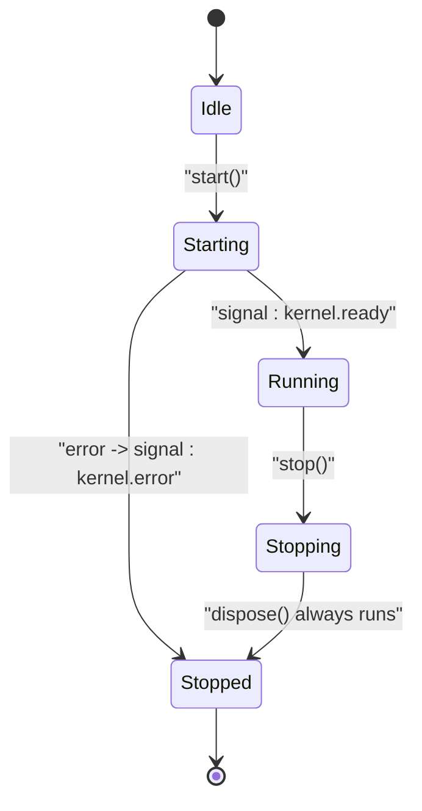
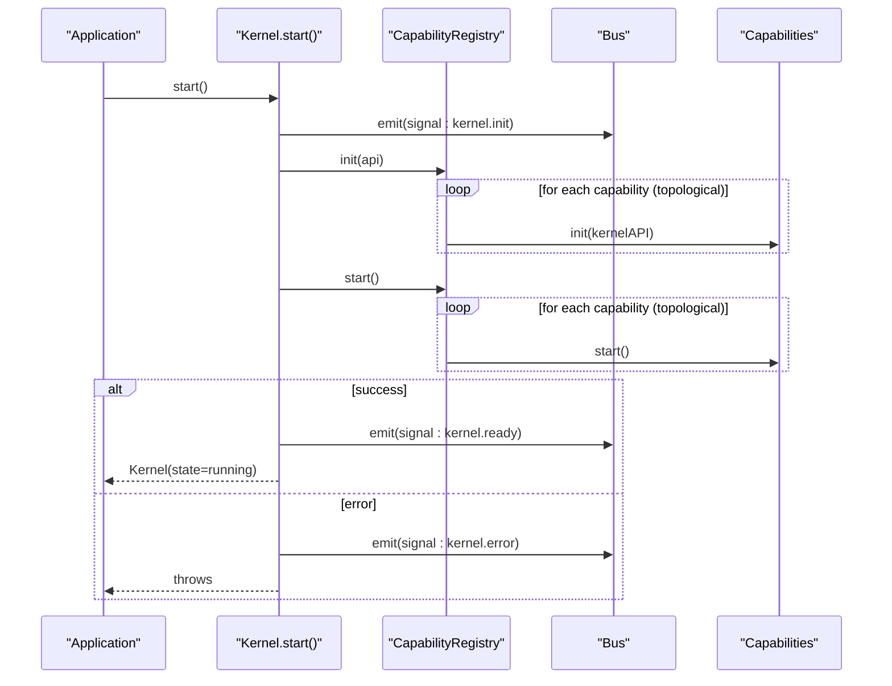
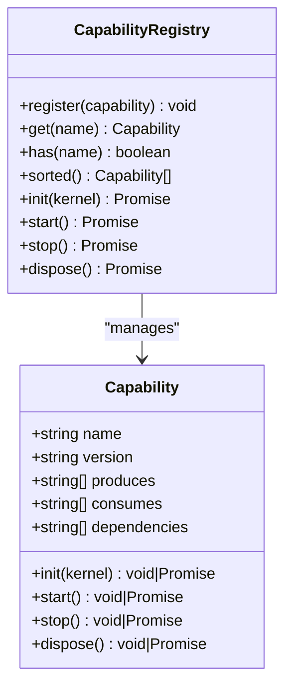
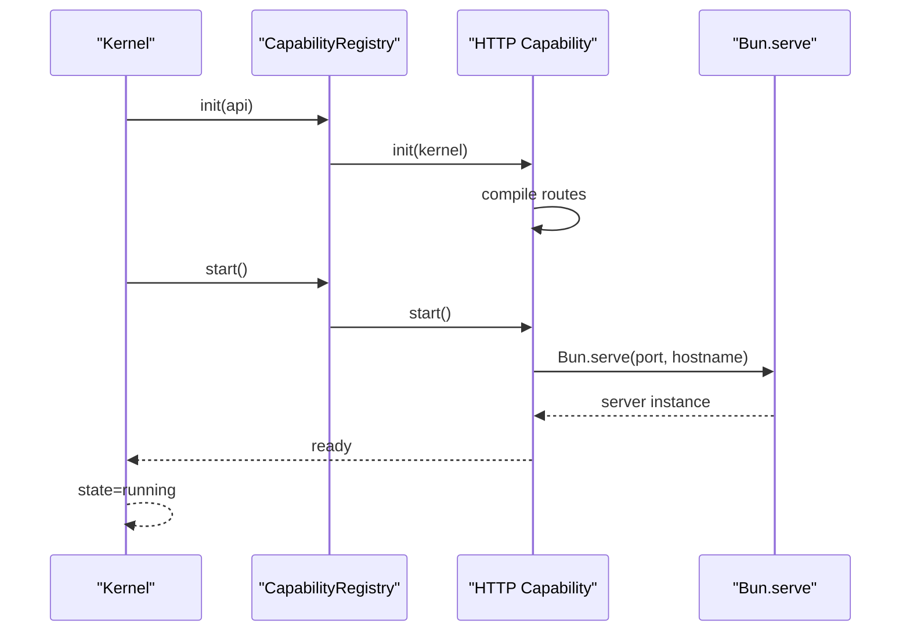
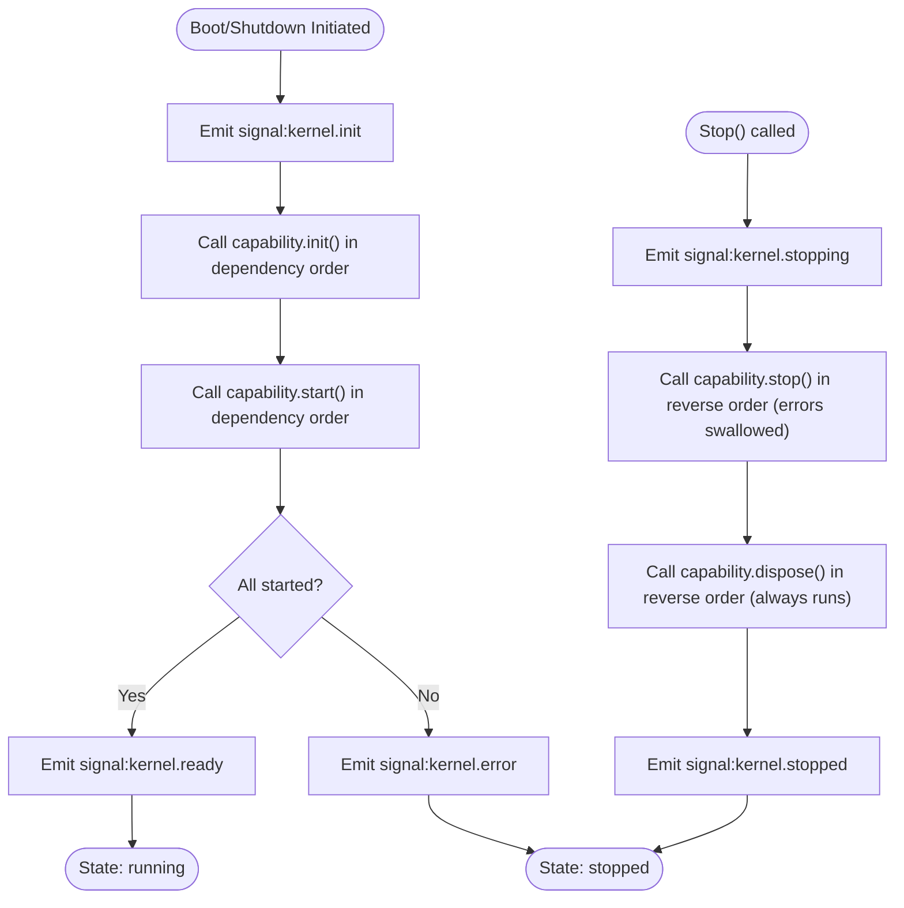
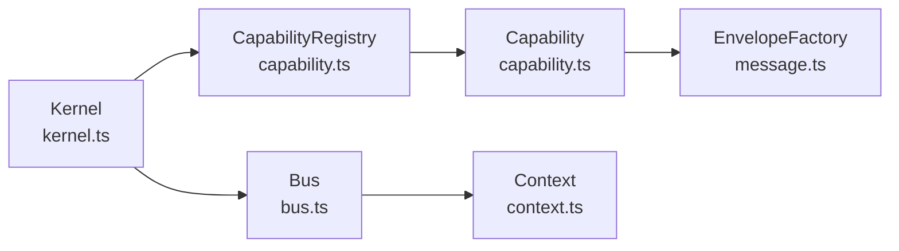

# Lifecycle Management

<cite>
**Referenced Files in This Document**
- [kernel.ts](file://packages/core/src/kernel.ts)
- [capability.ts](file://packages/core/src/capability.ts)
- [bus.ts](file://packages/core/src/bus.ts)
- [message.ts](file://packages/core/src/message.ts)
- [context.ts](file://packages/core/src/context.ts)
- [index.ts](file://packages/core/src/index.ts)
- [README.md](file://packages/core/README.md)
- [capability.ts](file://packages/net-http/src/capability.ts)
- [index.ts](file://examples/00-http-hello/src/index.ts)
</cite>

## Table of Contents
1. [Introduction](#introduction)
2. [Project Structure](#project-structure)
3. [Core Components](#core-components)
4. [Architecture Overview](#architecture-overview)
5. [Detailed Component Analysis](#detailed-component-analysis)
6. [Dependency Analysis](#dependency-analysis)
7. [Performance Considerations](#performance-considerations)
8. [Troubleshooting Guide](#troubleshooting-guide)
9. [Conclusion](#conclusion)

## Introduction
This document explains the explicit four-phase lifecycle management system implemented by the kernel: init, start, stop, and dispose. It details kernel state transitions from idle through starting, running, stopping, and stopped, and documents the boot and shutdown sequences. It also covers the signal system for observability, how capabilities react to lifecycle events, and provides practical guidance for implementing lifecycle hooks, handling startup failures, coordinating complex shutdown procedures, and managing resources responsibly across all lifecycle phases.

## Project Structure
The lifecycle system spans several core modules:
- Kernel and builder orchestrate lifecycle phases and state transitions
- Capability defines the lifecycle contract and registry manages ordering
- Bus and message primitives enable lifecycle signals and capability communication
- Context provides execution context for handlers
- Example HTTP capability demonstrates lifecycle usage in practice

**Diagram sources**
- [kernel.ts:265-353](file://packages/core/src/kernel.ts#L265-L353)
- [capability.ts:115-240](file://packages/core/src/capability.ts#L115-L240)
- [bus.ts:34-206](file://packages/core/src/bus.ts#L34-L206)
- [message.ts:34-163](file://packages/core/src/message.ts#L34-L163)
- [context.ts:106-166](file://packages/core/src/context.ts#L106-L166)
- [capability.ts:102-198](file://packages/net-http/src/capability.ts#L102-L198)

**Section sources**
- [kernel.ts:265-353](file://packages/core/src/kernel.ts#L265-L353)
- [capability.ts:115-240](file://packages/core/src/capability.ts#L115-L240)
- [bus.ts:34-206](file://packages/core/src/bus.ts#L34-L206)
- [message.ts:34-163](file://packages/core/src/message.ts#L34-L163)
- [context.ts:106-166](file://packages/core/src/context.ts#L106-L166)
- [capability.ts:102-198](file://packages/net-http/src/capability.ts#L102-L198)

## Core Components
- Kernel and KernelBuilder manage lifecycle phases, state, and signals
- Capability defines the lifecycle contract (init, start, stop, dispose)
- CapabilityRegistry resolves dependency order and executes lifecycle phases
- Bus and EnvelopeFactory emit lifecycle signals and support capability messaging
- Context carries execution state and cancellation across handlers

Key responsibilities:
- Kernel orchestrates boot and shutdown, emitting lifecycle signals
- Registry enforces topological ordering and reverse ordering for shutdown
- Capability exposes lifecycle hooks for resource management
- Signals enable observability and external reactions to lifecycle events

**Section sources**
- [kernel.ts:159-183](file://packages/core/src/kernel.ts#L159-L183)
- [capability.ts:61-99](file://packages/core/src/capability.ts#L61-L99)
- [capability.ts:115-240](file://packages/core/src/capability.ts#L115-L240)
- [bus.ts:34-206](file://packages/core/src/bus.ts#L34-L206)
- [message.ts:115-163](file://packages/core/src/message.ts#L115-L163)
- [context.ts:44-90](file://packages/core/src/context.ts#L44-L90)

## Architecture Overview
The lifecycle system is designed around explicit, ordered phases with deterministic signals and strict shutdown guarantees.

**Diagram sources**
- [kernel.ts:314-349](file://packages/core/src/kernel.ts#L314-L349)
- [capability.ts:217-239](file://packages/core/src/capability.ts#L217-L239)

## Detailed Component Analysis

### Kernel Lifecycle Orchestration
The KernelBuilder.start() sequence:
1. Sets state to "starting"
2. Emits "signal:kernel.init"
3. Calls CapabilityRegistry.init() and CapabilityRegistry.start() in dependency order
4. On success: sets state to "running" and emits "signal:kernel.ready"
5. On failure: emits "signal:kernel.error" and rethrows

The Kernel.stop() sequence:
1. Sets state to "stopping"
2. Emits "signal:kernel.stopping"
3. Executes CapabilityRegistry.stop() in reverse dependency order (errors are swallowed)
4. Executes CapabilityRegistry.dispose() in reverse dependency order (errors are swallowed)
5. Sets state to "stopped" and emits "signal:kernel.stopped"

**Diagram sources**
- [kernel.ts:314-328](file://packages/core/src/kernel.ts#L314-L328)
- [capability.ts:194-211](file://packages/core/src/capability.ts#L194-L211)

**Section sources**
- [kernel.ts:314-349](file://packages/core/src/kernel.ts#L314-L349)
- [capability.ts:194-211](file://packages/core/src/capability.ts#L194-L211)

### Capability Lifecycle Contract
Each Capability may implement:
- init(kernel): register handlers, validate config, prepare resources
- start(): open connections, begin accepting work
- stop(): stop accepting new work, drain in-flight operations
- dispose(): release resources; always executes even if stop failed

Ordering:
- Boot: topological order (dependencies first)
- Shutdown: reverse topological order (dependents before dependencies)
- Dispose: always runs after stop, regardless of errors

**Diagram sources**
- [capability.ts:61-99](file://packages/core/src/capability.ts#L61-L99)
- [capability.ts:115-240](file://packages/core/src/capability.ts#L115-L240)

**Section sources**
- [capability.ts:61-99](file://packages/core/src/capability.ts#L61-L99)
- [capability.ts:194-239](file://packages/core/src/capability.ts#L194-L239)

### HTTP Capability Lifecycle Example
The HTTP capability demonstrates lifecycle usage:
- init(): compiles route definitions into patterns and handlers
- start(): launches Bun.serve and logs readiness
- stop(): stops the server gracefully
- dispose(): clears server reference

**Diagram sources**
- [capability.ts:102-179](file://packages/net-http/src/capability.ts#L102-L179)
- [kernel.ts:314-328](file://packages/core/src/kernel.ts#L314-L328)

**Section sources**
- [capability.ts:102-179](file://packages/net-http/src/capability.ts#L102-L179)
- [index.ts:1-12](file://examples/00-http-hello/src/index.ts#L1-L12)

### Signal System for Observability
The kernel emits lifecycle signals that capabilities and external observers can subscribe to:
- signal:kernel.init: emitted before capability init/start
- signal:kernel.ready: emitted when all capabilities are running
- signal:kernel.stopping: emitted at shutdown start
- signal:kernel.stopped: emitted when shutdown completes
- signal:kernel.error: emitted on boot-time errors

Handlers can react to these signals for monitoring, metrics, or orchestration.

**Diagram sources**
- [kernel.ts:319-328](file://packages/core/src/kernel.ts#L319-L328)
- [kernel.ts:335-347](file://packages/core/src/kernel.ts#L335-L347)
- [capability.ts:217-239](file://packages/core/src/capability.ts#L217-L239)

**Section sources**
- [kernel.ts:319-328](file://packages/core/src/kernel.ts#L319-L328)
- [kernel.ts:335-347](file://packages/core/src/kernel.ts#L335-L347)
- [README.md:398-407](file://packages/core/README.md#L398-L407)

### Practical Examples and Best Practices

- Implementing lifecycle hooks in custom capabilities:
  - Use init() to validate required configuration via kernel.config() and register handlers
  - Use start() to open connections or begin accepting work
  - Use stop() to gracefully stop accepting new work and drain in-flight operations
  - Use dispose() to free resources; it must never fail the shutdown

- Handling startup failures:
  - Throw from init() or start() to abort boot
  - The kernel emits signal:kernel.error and prevents state advancement to running
  - React with handlers subscribed to signal:kernel.error for diagnostics

- Coordinating complex shutdown procedures:
  - stop() should be idempotent and non-blocking; delegate draining to lower layers
  - dispose() must release all resources and be retried if needed
  - The kernel ensures dispose() runs even if stop() fails

- Resource management and cleanup:
  - Keep init() minimal and deterministic
  - Keep start() lightweight and fast
  - Keep stop() focused on graceful termination
  - Keep dispose() robust and resilient to partial states

**Section sources**
- [capability.ts:77-98](file://packages/core/src/capability.ts#L77-L98)
- [capability.ts:217-239](file://packages/core/src/capability.ts#L217-L239)
- [README.md:398-407](file://packages/core/README.md#L398-L407)

## Dependency Analysis
The kernel depends on the bus and registry to coordinate lifecycle execution. The registry depends on capability definitions and enforces topological ordering. Capabilities depend on the kernel API for configuration and messaging.

**Diagram sources**
- [kernel.ts:21-32](file://packages/core/src/kernel.ts#L21-L32)
- [capability.ts:23-24](file://packages/core/src/capability.ts#L23-L24)
- [message.ts:137-163](file://packages/core/src/message.ts#L137-L163)
- [bus.ts:20-21](file://packages/core/src/bus.ts#L20-L21)
- [context.ts:18-19](file://packages/core/src/context.ts#L18-L19)

**Section sources**
- [kernel.ts:21-32](file://packages/core/src/kernel.ts#L21-L32)
- [capability.ts:23-24](file://packages/core/src/capability.ts#L23-L24)
- [message.ts:137-163](file://packages/core/src/message.ts#L137-L163)
- [bus.ts:20-21](file://packages/core/src/bus.ts#L20-L21)
- [context.ts:18-19](file://packages/core/src/context.ts#L18-L19)

## Performance Considerations
- Lifecycle phases are executed serially to guarantee deterministic behavior and simplify debugging
- Topological sorting is computed once and cached for the lifetime of the kernel
- Signal emissions are synchronous broadcasts; avoid heavy work inside signal handlers
- Use emitAsync() when you need to wait for handlers but still want ordered execution

[No sources needed since this section provides general guidance]

## Troubleshooting Guide
Common issues and resolutions:
- Circular dependencies: Detected during sorted() computation; fix capability dependencies
- Missing dependencies: Throws during boot; ensure all dependencies are registered before start()
- Startup failures: init() or start() errors abort boot; inspect signal:kernel.error payload
- Shutdown hangs: Ensure stop() drains in-flight work and dispose() releases resources
- Signal handlers not firing: Verify subscriptions are registered before start()

**Section sources**
- [capability.ts:156-192](file://packages/core/src/capability.ts#L156-L192)
- [kernel.ts:322-325](file://packages/core/src/kernel.ts#L322-L325)
- [bus.ts:91-136](file://packages/core/src/bus.ts#L91-L136)

## Conclusion
The lifecycle management system provides a robust, observable, and deterministic foundation for capability-based applications. By enforcing explicit phases, dependency-aware ordering, and guaranteed disposal, it enables safe, predictable operation and graceful shutdown. The signal system offers rich observability, while the capability contract encourages disciplined resource management across all phases.