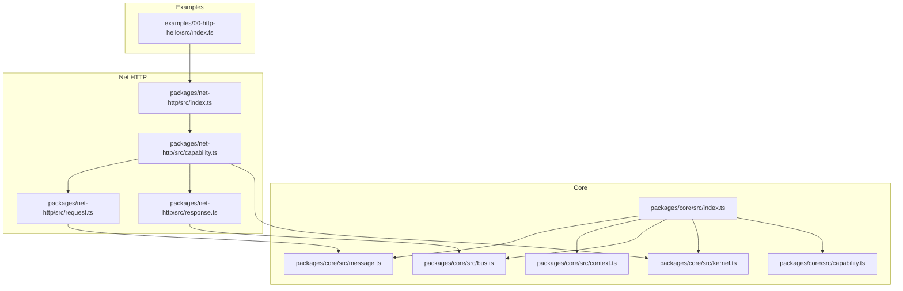
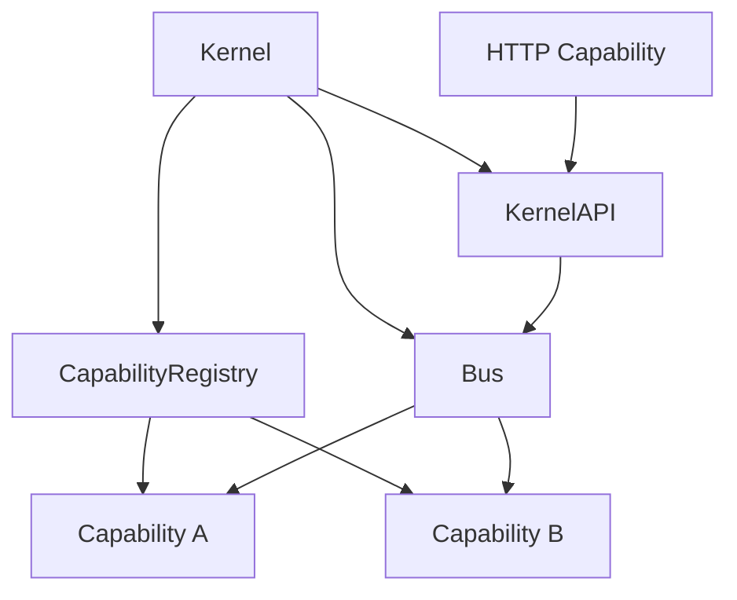
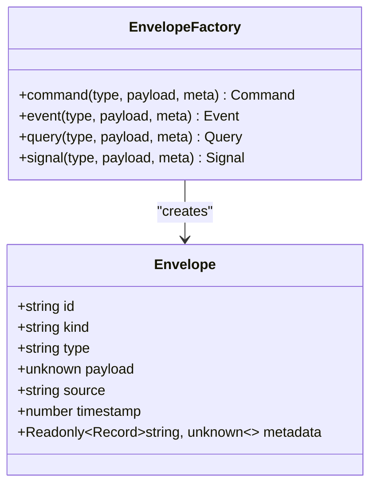
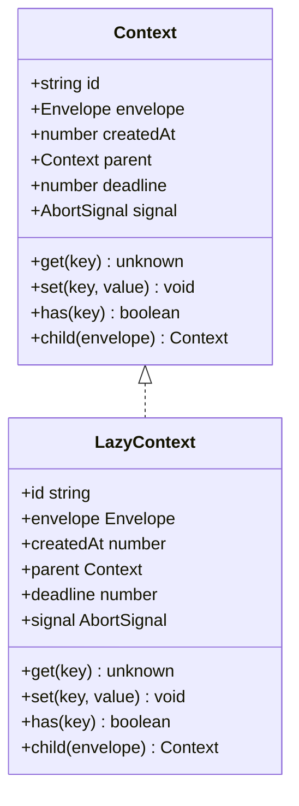
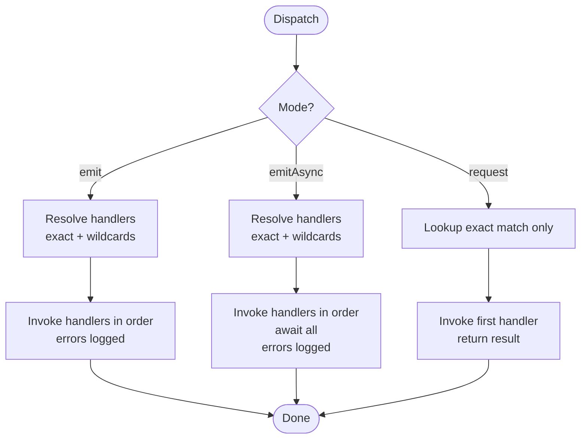
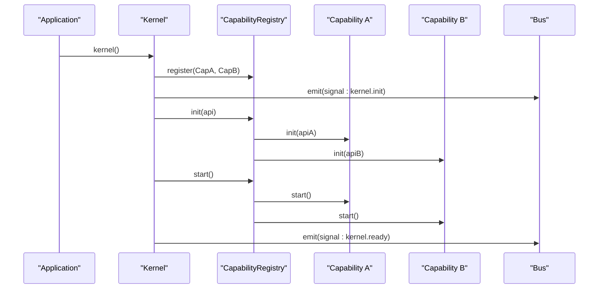
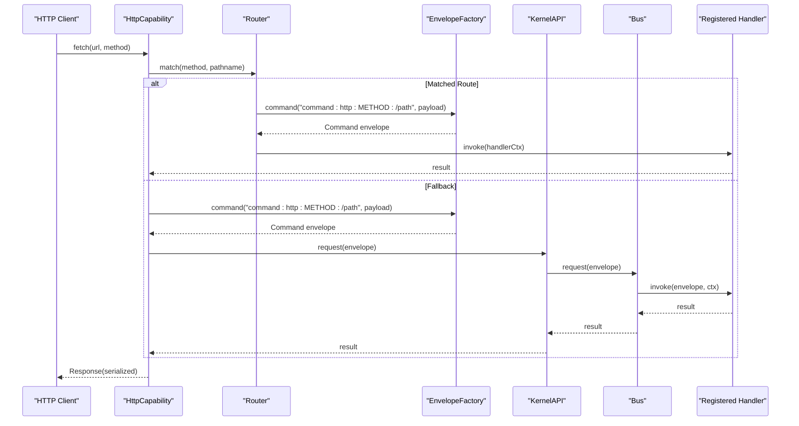
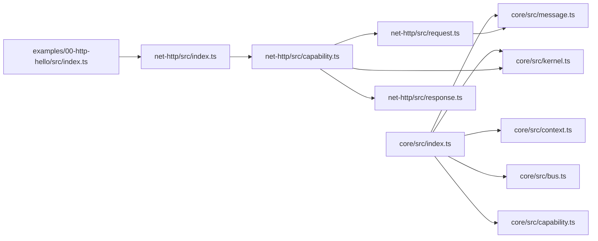

# Message-Driven Design

<cite>
**Referenced Files in This Document**
- [README.md](file://README.md)
- [package.json](file://package.json)
- [packages/core/src/index.ts](file://packages/core/src/index.ts)
- [packages/core/src/message.ts](file://packages/core/src/message.ts)
- [packages/core/src/context.ts](file://packages/core/src/context.ts)
- [packages/core/src/bus.ts](file://packages/core/src/bus.ts)
- [packages/core/src/kernel.ts](file://packages/core/src/kernel.ts)
- [packages/core/src/capability.ts](file://packages/core/src/capability.ts)
- [packages/net-http/src/index.ts](file://packages/net-http/src/index.ts)
- [packages/net-http/src/capability.ts](file://packages/net-http/src/capability.ts)
- [packages/net-http/src/request.ts](file://packages/net-http/src/request.ts)
- [packages/net-http/src/response.ts](file://packages/net-http/src/response.ts)
- [examples/00-http-hello/src/index.ts](file://examples/00-http-hello/src/index.ts)
</cite>

## Table of Contents
1. [Introduction](#introduction)
2. [Project Structure](#project-structure)
3. [Core Components](#core-components)
4. [Architecture Overview](#architecture-overview)
5. [Detailed Component Analysis](#detailed-component-analysis)
6. [Dependency Analysis](#dependency-analysis)
7. [Performance Considerations](#performance-considerations)
8. [Troubleshooting Guide](#troubleshooting-guide)
9. [Conclusion](#conclusion)
10. [Appendices](#appendices)

## Introduction
This document explains the message-driven design of kislabin, where all interactions—HTTP requests, internal operations, and domain events—are modeled as typed messages flowing through a central bus. The kernel orchestrates lifecycle and routing, while capabilities remain isolated subsystems that communicate exclusively via envelopes. The universal envelope carries metadata such as identifiers, timestamps, and source tracking, enabling loose coupling, unified routing, and observability.

Key goals:
- Treat everything as messages: commands, events, queries, and signals.
- Provide a single envelope factory that injects consistent metadata.
- Enable flexible routing with exact match and wildcard patterns.
- Support synchronous broadcast, asynchronous broadcast, and point-to-point request/response.
- Achieve testability, observability, and extensibility through a minimal core.

**Section sources**
- [README.md: 68–83:68-83](file://README.md#L68-L83)
- [README.md: 191–199:191-199](file://README.md#L191-L199)

## Project Structure
The repository is organized around a small core package and a network HTTP capability. The core defines the message primitives, bus, kernel, context, and capability registry. The HTTP capability translates HTTP requests into envelopes and returns handler results as HTTP responses.

**Diagram sources**
- [packages/core/src/index.ts: 10–28:10-28](file://packages/core/src/index.ts#L10-L28)
- [packages/net-http/src/index.ts: 5–20:5-20](file://packages/net-http/src/index.ts#L5-L20)
- [examples/00-http-hello/src/index.ts: 1–12:1-12](file://examples/00-http-hello/src/index.ts#L1-L12)

**Section sources**
- [README.md: 100–142:100-142](file://README.md#L100-L142)
- [package.json: 1–29:1-29](file://package.json#L1-L29)

## Core Components
- Envelope: The universal message wrapper carrying id, kind, type, payload, source, timestamp, and metadata.
- EnvelopeFactory: Creates typed envelopes with auto-generated ids, timestamps, and source tracking.
- Context: Execution context shared across handlers during a dispatch, supporting state bag, tracing, deadlines, and cancellation.
- Bus: Central dispatcher supporting broadcast emission (sync/async) and point-to-point request with wildcard-free exact matching.
- Kernel: Orchestrates lifecycle, exposes KernelAPI, and manages capability registry.
- Capability: Autonomous subsystem with lifecycle hooks and explicit dependencies.
- HTTP Capability: Converts HTTP requests to envelopes and serializes handler results to HTTP responses.

Benefits:
- Loose coupling: Components interact only via envelopes.
- Unified communication: All operations are envelopes.
- Flexible routing: Exact match plus wildcard suffix patterns.
- Observability: Metadata and lifecycle signals enable journaling and tracing.
- Extensibility: New capabilities plug in via the kernel’s capability registry.

**Section sources**
- [packages/core/src/message.ts: 11–164:11-164](file://packages/core/src/message.ts#L11-L164)
- [packages/core/src/context.ts: 22–167:22-167](file://packages/core/src/context.ts#L22-L167)
- [packages/core/src/bus.ts: 24–214:24-214](file://packages/core/src/bus.ts#L24-L214)
- [packages/core/src/kernel.ts: 36–354:36-354](file://packages/core/src/kernel.ts#L36-L354)
- [packages/core/src/capability.ts: 28–241:28-241](file://packages/core/src/capability.ts#L28-L241)

## Architecture Overview
The kernel initializes capabilities, emits lifecycle signals, and exposes KernelAPI for emitting, subscribing, requesting, and creating envelopes. The bus routes envelopes to handlers based on type patterns. The HTTP capability builds envelopes from HTTP requests and returns serialized results.

**Diagram sources**
- [packages/core/src/kernel.ts: 265–354:265-354](file://packages/core/src/kernel.ts#L265-L354)
- [packages/core/src/capability.ts: 194–241:194-241](file://packages/core/src/capability.ts#L194-L241)
- [packages/core/src/bus.ts: 34–214:34-214](file://packages/core/src/bus.ts#L34-L214)

## Detailed Component Analysis

### Envelope and EnvelopeFactory
- Envelope structure: id, kind, type, payload, source, timestamp, metadata.
- Types: Command, Event, Query, Signal are semantic aliases over the same envelope shape.
- EnvelopeFactory: Generates deterministic ids, timestamps, and sets source. Provides methods for each kind.

**Diagram sources**
- [packages/core/src/message.ts: 34–164:34-164](file://packages/core/src/message.ts#L34-L164)

**Section sources**
- [packages/core/src/message.ts: 11–164:11-164](file://packages/core/src/message.ts#L11-L164)

### Context and Lazy Allocation
- Context flows through all handlers in a dispatch chain.
- Lazy allocation avoids overhead for handlers that only read payload.
- Supports state bag, trace propagation, deadlines, and cancellation.

**Diagram sources**
- [packages/core/src/context.ts: 44–167:44-167](file://packages/core/src/context.ts#L44-L167)

**Section sources**
- [packages/core/src/context.ts: 22–167:22-167](file://packages/core/src/context.ts#L22-L167)

### Bus Routing and Dispatch Modes
- Broadcast emission: emit (fire-and-forget) and emitAsync (wait for completion).
- Point-to-point request: exact match only, throws if no handler.
- Pattern matching: exact match O(1) and wildcard suffix O(n) by number of patterns.
- Error handling: logged and swallowed per handler; async errors caught separately.

**Diagram sources**
- [packages/core/src/bus.ts: 80–171:80-171](file://packages/core/src/bus.ts#L80-L171)

**Section sources**
- [packages/core/src/bus.ts: 24–214:24-214](file://packages/core/src/bus.ts#L24-L214)

### Kernel and Capability Registry
- KernelAPI exposes emit, emitAsync, request, on, resolve, has, createContext, config, and envelope factory.
- Kernel manages lifecycle: init, start, ready, stopping, stopped, and stop/dispose sequences.
- CapabilityRegistry enforces topological ordering, detects cycles, and runs lifecycle hooks.

**Diagram sources**
- [packages/core/src/kernel.ts: 265–354:265-354](file://packages/core/src/kernel.ts#L265-L354)
- [packages/core/src/capability.ts: 194–241:194-241](file://packages/core/src/capability.ts#L194-L241)

**Section sources**
- [packages/core/src/kernel.ts: 36–354:36-354](file://packages/core/src/kernel.ts#L36-L354)
- [packages/core/src/capability.ts: 101–241:101-241](file://packages/core/src/capability.ts#L101-L241)

### HTTP Capability: From HTTP Request to Envelope
- The HTTP capability compiles declared routes and falls back to bus-based routing.
- buildEnvelope transforms Request into a Command envelope with method, path, headers, body, and raw reference.
- Responses are serialized or mapped to appropriate HTTP status codes, with special handling for NoHandlerError.

**Diagram sources**
- [packages/net-http/src/capability.ts: 120–164:120-164](file://packages/net-http/src/capability.ts#L120-L164)
- [packages/net-http/src/request.ts: 22–37:22-37](file://packages/net-http/src/request.ts#L22-L37)
- [packages/net-http/src/response.ts: 8–39:8-39](file://packages/net-http/src/response.ts#L8-L39)
- [packages/core/src/bus.ts: 159–170:159-170](file://packages/core/src/bus.ts#L159-L170)

**Section sources**
- [packages/net-http/src/capability.ts: 14–223:14-223](file://packages/net-http/src/capability.ts#L14-L223)
- [packages/net-http/src/request.ts: 1–37:1-37](file://packages/net-http/src/request.ts#L1-L37)
- [packages/net-http/src/response.ts: 1–39:1-39](file://packages/net-http/src/response.ts#L1-L39)

### Practical Examples

- Minimal HTTP Hello:
  - Declares a GET route and starts the kernel with the HTTP capability.
  - Demonstrates route registration and server startup.

  **Section sources**
  - [examples/00-http-hello/src/index.ts: 1–12:1-12](file://examples/00-http-hello/src/index.ts#L1-L12)

- Internal operation as an envelope:
  - The kernel’s public API exposes envelope factory bound to the kernel source.
  - Handlers can emit events or signals by creating envelopes and emitting them.

  **Section sources**
  - [packages/core/src/kernel.ts: 269–290:269-290](file://packages/core/src/kernel.ts#L269-L290)

- Pattern matching and routing:
  - Global wildcard handlers receive all envelopes.
  - Prefix wildcard handlers receive envelopes whose type starts with the given prefix.

  **Section sources**
  - [packages/core/src/bus.ts: 43–78:43-78](file://packages/core/src/bus.ts#L43-L78)

### Benefits for Testing, Observability, and Extensibility
- Testing: Envelopes replace HTTP fixtures; handlers are pure functions receiving envelopes and returning results. Use KernelAPI to emit envelopes and assert outcomes.
- Observability: Envelope metadata (id, source, timestamp) and lifecycle signals enable journaling and tracing. Context supports trace propagation and deadlines.
- Extensibility: New capabilities plug in via the capability registry with explicit dependencies. They emit and consume envelopes without tight coupling.

**Section sources**
- [README.md: 39–58:39-58](file://README.md#L39-L58)
- [packages/core/src/context.ts: 10–17:10-17](file://packages/core/src/context.ts#L10-L17)
- [packages/core/src/kernel.ts: 14–20:14-20](file://packages/core/src/kernel.ts#L14-L20)

## Dependency Analysis
The core exports the public API surface and re-exports types. The HTTP capability depends on the core envelope factory and integrates with Bun.serve. The example demonstrates usage of the HTTP capability with the core kernel.

**Diagram sources**
- [packages/core/src/index.ts: 10–28:10-28](file://packages/core/src/index.ts#L10-L28)
- [packages/net-http/src/index.ts: 5–20:5-20](file://packages/net-http/src/index.ts#L5-L20)
- [examples/00-http-hello/src/index.ts: 1–12:1-12](file://examples/00-http-hello/src/index.ts#L1-L12)

**Section sources**
- [packages/core/src/index.ts: 10–28:10-28](file://packages/core/src/index.ts#L10-L28)
- [packages/net-http/src/index.ts: 5–20:5-20](file://packages/net-http/src/index.ts#L5-L20)

## Performance Considerations
- Dispatch complexity:
  - Exact match O(1) via Map lookup.
  - Wildcard resolution O(n) by number of patterns, not total handlers.
- Asynchronous handlers:
  - emit ignores returned Promises; use emitAsync to wait for completion.
  - request waits for the first exact-match handler.
- Context lazy allocation minimizes overhead for read-only handlers.

[No sources needed since this section provides general guidance]

## Troubleshooting Guide
- NoHandlerError: Thrown by request when no exact-match handler is registered. Ensure the handler is registered for the exact envelope type.
- Async handler errors: Logged and not propagated; check logs for handler-specific errors.
- HTTP 404/500: Occur when no handler matches (404) or when an error occurs (500). Custom error handling can be provided via the HTTP capability configuration.

**Section sources**
- [packages/core/src/bus.ts: 159–170:159-170](file://packages/core/src/bus.ts#L159-L170)
- [packages/net-http/src/response.ts: 21–39:21-39](file://packages/net-http/src/response.ts#L21-L39)

## Conclusion
Kislabin’s message-driven design centers on a universal envelope wrapping all operations as commands, events, queries, and signals. The kernel and bus provide explicit lifecycle and routing, while the envelope factory ensures consistent metadata. Capabilities remain isolated and communicate solely via envelopes, enabling loose coupling, unified messaging, flexible routing, strong observability, and straightforward testing and extension.

[No sources needed since this section summarizes without analyzing specific files]

## Appendices

### Message Types and Semantics
- Command: Imperative action intent; may fail; emitted via envelope.command.
- Event: Past-tense fact; immutable notification; emitted via envelope.event.
- Query: Read-only request; no side effects; emitted via envelope.query.
- Signal: System lifecycle or control messages; emitted via envelope.signal.

**Section sources**
- [packages/core/src/message.ts: 12–18:12-18](file://packages/core/src/message.ts#L12-L18)

### Envelope Creation and Metadata
- Automatic fields: id (UUID v7), timestamp (epoch ms), source (capability or kernel).
- Manual fields: type (semantic identifier), payload (operation data), metadata (trace, correlation, auth claims).

**Section sources**
- [packages/core/src/message.ts: 34–49:34-49](file://packages/core/src/message.ts#L34-L49)
- [packages/core/src/message.ts: 137–164:137-164](file://packages/core/src/message.ts#L137-L164)