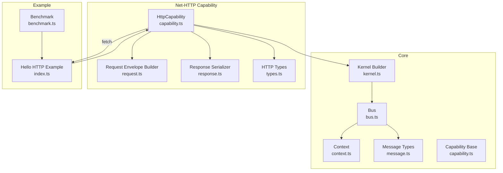
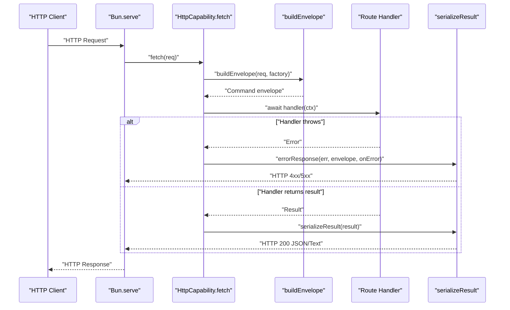
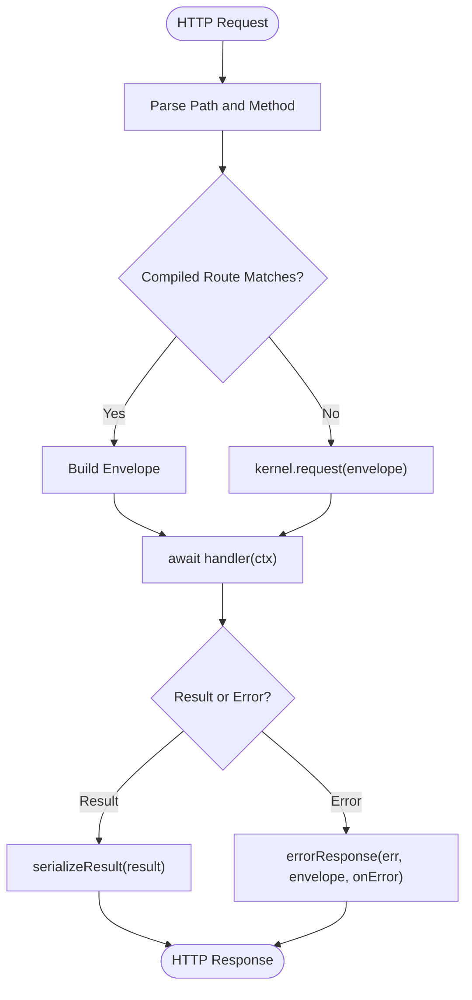
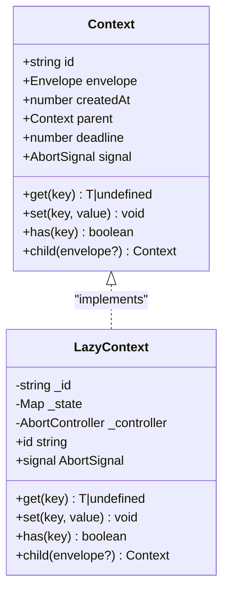
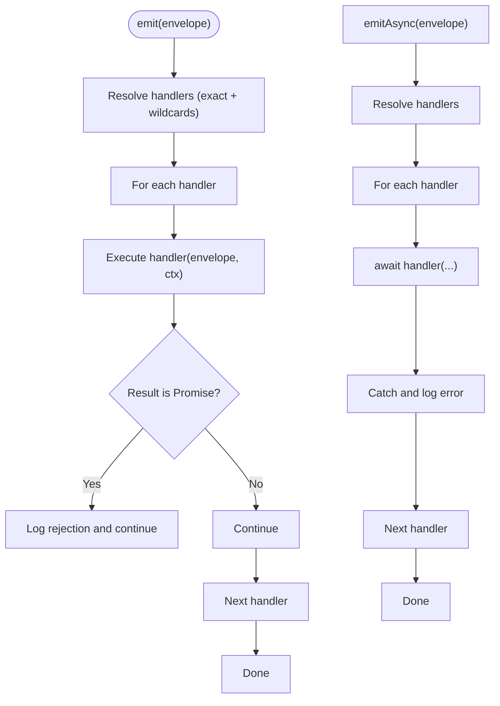
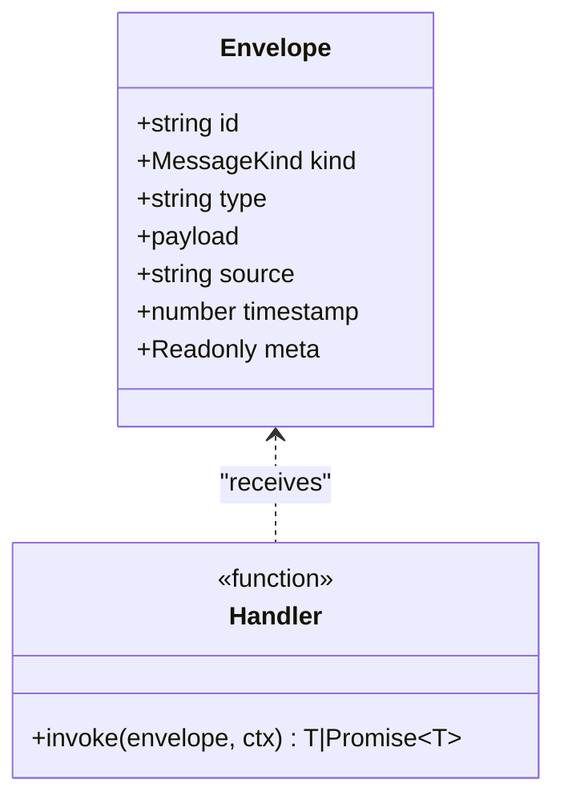
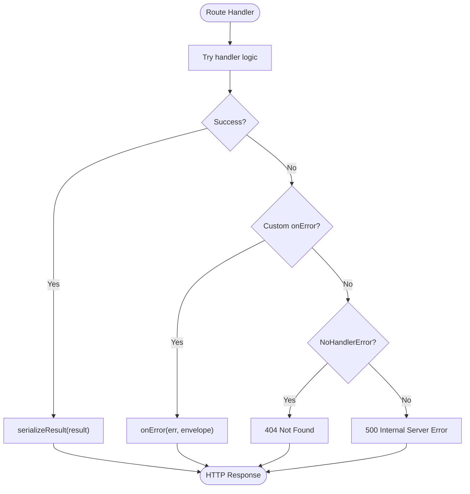
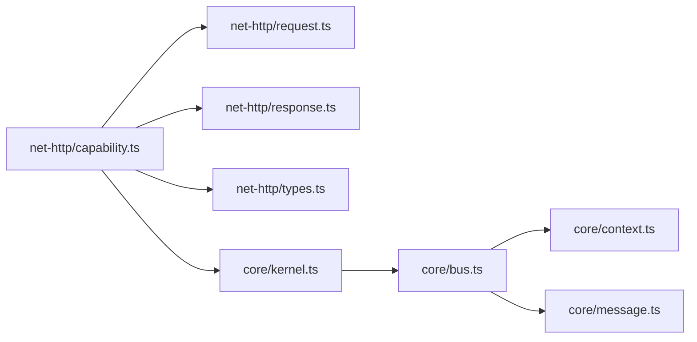

# Async Operations Tutorial

<cite>
**Referenced Files in This Document**
- [README.md](file://README.md)
- [package.json](file://package.json)
- [kernel.ts](file://packages/core/src/kernel.ts)
- [bus.ts](file://packages/core/src/bus.ts)
- [context.ts](file://packages/core/src/context.ts)
- [message.ts](file://packages/core/src/message.ts)
- [capability.ts](file://packages/core/src/capability.ts)
- [capability.ts](file://packages/net-http/src/capability.ts)
- [request.ts](file://packages/net-http/src/request.ts)
- [response.ts](file://packages/net-http/src/response.ts)
- [types.ts](file://packages/net-http/src/types.ts)
- [index.ts](file://examples/00-http-hello/src/index.ts)
- [benchmark.ts](file://examples/00-http-hello/benchmark.ts)
</cite>

## Table of Contents
1. [Introduction](#introduction)
2. [Project Structure](#project-structure)
3. [Core Components](#core-components)
4. [Architecture Overview](#architecture-overview)
5. [Detailed Component Analysis](#detailed-component-analysis)
6. [Dependency Analysis](#dependency-analysis)
7. [Performance Considerations](#performance-considerations)
8. [Troubleshooting Guide](#troubleshooting-guide)
9. [Conclusion](#conclusion)

## Introduction
This tutorial focuses on asynchronous operation handling in kislabin. It demonstrates promise-based handlers, async/await patterns, and robust error handling in HTTP routes. You will learn how to compose handlers that perform database operations, external API calls, and file I/O while managing timeouts, cancellations, and resource cleanup. We also cover concurrency patterns, proper error propagation, and performance best practices for async code within the framework.

## Project Structure
Kislabin is organized around a minimal core and pluggable capabilities. The HTTP capability integrates with Bun’s server runtime and translates HTTP requests into messages that flow through the kernel’s message bus. Handlers can be synchronous or asynchronous, and the bus supports both fire-and-forget emission and ordered async emission.

**Diagram sources**
- [kernel.ts:265-353](file://packages/core/src/kernel.ts#L265-L353)
- [bus.ts:34-206](file://packages/core/src/bus.ts#L34-L206)
- [context.ts:106-166](file://packages/core/src/context.ts#L106-L166)
- [message.ts:34-163](file://packages/core/src/message.ts#L34-L163)
- [capability.ts:1-120](file://packages/core/src/capability.ts#L1-L120)
- [capability.ts:102-179](file://packages/net-http/src/capability.ts#L102-L179)
- [request.ts:22-37](file://packages/net-http/src/request.ts#L22-L37)
- [response.ts:8-38](file://packages/net-http/src/response.ts#L8-L38)
- [types.ts:5-194](file://packages/net-http/src/types.ts#L5-L194)
- [index.ts:1-12](file://examples/00-http-hello/src/index.ts#L1-L12)
- [benchmark.ts:1-20](file://examples/00-http-hello/benchmark.ts#L1-L20)

**Section sources**
- [README.md:100-142](file://README.md#L100-L142)
- [package.json:1-29](file://package.json#L1-L29)

## Core Components
- Kernel and KernelAPI: orchestrate lifecycle, expose messaging APIs, and manage configuration.
- Bus: dispatches messages to handlers, supports broadcast and request-response semantics.
- Context: immutable execution context with lazy allocations, deadlines, and AbortSignal for cancellation.
- Message primitives: Envelope, Handler, and EnvelopeFactory define the contract for all messages.
- Capability base: standardized lifecycle for capabilities.
- Net-HTTP capability: translates HTTP requests to envelopes and serializes handler results to HTTP responses.

Key async-related responsibilities:
- Handlers can be sync or async; the bus awaits promises when using emitAsync and logs unhandled rejections for fire-and-forget emit.
- Context provides deadline and AbortSignal for cooperative cancellation.
- HTTP capability uses async/await in fetch and delegates error handling to response serialization.

**Section sources**
- [kernel.ts:65-134](file://packages/core/src/kernel.ts#L65-L134)
- [bus.ts:91-170](file://packages/core/src/bus.ts#L91-L170)
- [context.ts:44-90](file://packages/core/src/context.ts#L44-L90)
- [message.ts:83-86](file://packages/core/src/message.ts#L83-L86)
- [capability.ts:1-120](file://packages/core/src/capability.ts#L1-L120)

## Architecture Overview
The HTTP capability integrates with Bun.serve and converts incoming requests into envelopes. Handlers receive a context that may carry deadlines and cancellation signals. Results are serialized to HTTP responses, and errors are normalized.

**Diagram sources**
- [capability.ts:128-163](file://packages/net-http/src/capability.ts#L128-L163)
- [request.ts:22-37](file://packages/net-http/src/request.ts#L22-L37)
- [response.ts:21-38](file://packages/net-http/src/response.ts#L21-L38)
- [types.ts:87-112](file://packages/net-http/src/types.ts#L87-L112)

## Detailed Component Analysis

### HTTP Capability and Async Handlers
The HTTP capability compiles route definitions into a pattern-matching engine and executes async handlers. It builds an envelope from the request, invokes the matched handler, and serializes the result or error.

- Route registration: routes are declared and compiled during init; fetch-time matching uses a simple path parser.
- Handler execution: handlers are awaited; errors are caught and mapped to HTTP responses.
- Fallback routing: if no route matches, the capability delegates to kernel.request for bus-based handlers.

**Diagram sources**
- [capability.ts:128-163](file://packages/net-http/src/capability.ts#L128-L163)
- [request.ts:22-37](file://packages/net-http/src/request.ts#L22-L37)
- [response.ts:8-38](file://packages/net-http/src/response.ts#L8-L38)

**Section sources**
- [capability.ts:92-222](file://packages/net-http/src/capability.ts#L92-L222)
- [request.ts:10-20](file://packages/net-http/src/request.ts#L10-L20)
- [response.ts:21-38](file://packages/net-http/src/response.ts#L21-L38)
- [types.ts:28-61](file://packages/net-http/src/types.ts#L28-L61)

### Context and Cancellation
Context provides:
- Immutable identity and creation timestamp.
- Optional deadline and AbortSignal for cooperative cancellation.
- Lazy state bag and child context creation for trace propagation.

**Diagram sources**
- [context.ts:44-90](file://packages/core/src/context.ts#L44-L90)
- [context.ts:106-149](file://packages/core/src/context.ts#L106-L149)

**Section sources**
- [context.ts:106-166](file://packages/core/src/context.ts#L106-L166)

### Bus Dispatch and Async Behavior
The bus supports three dispatch modes:
- emit: synchronous broadcast; async handler promises are ignored (fire-and-forget) with error logging.
- emitAsync: waits for all handlers to complete; handlers run in order.
- request: point-to-point exact-match; returns the first handler’s result.

**Diagram sources**
- [bus.ts:91-136](file://packages/core/src/bus.ts#L91-L136)

**Section sources**
- [bus.ts:91-170](file://packages/core/src/bus.ts#L91-L170)

### Message Contracts and Handler Signatures
All communication is envelope-based. Handlers accept an envelope and a context, and may return synchronously or asynchronously.

**Diagram sources**
- [message.ts:34-86](file://packages/core/src/message.ts#L34-L86)

**Section sources**
- [message.ts:11-163](file://packages/core/src/message.ts#L11-L163)

### Timeout Management and Cancellation Patterns
- Deadline and AbortSignal: set via context; handlers should periodically check ctx.deadline and ctx.signal.aborted to abort work early.
- Cooperative cancellation: handlers should avoid blocking operations; use async I/O and pass AbortSignal to APIs that support it.
- Resource cleanup: ensure cleanup occurs after cancellation or completion; consider wrapping long-running tasks with structured cleanup logic.

Best practices:
- Respect ctx.deadline and ctx.signal in loops and long-running tasks.
- Prefer async I/O and avoid CPU-bound work in handlers.
- Use ctx.child() to create child contexts for subtasks and propagate cancellation.

**Section sources**
- [context.ts:57-65](file://packages/core/src/context.ts#L57-L65)
- [context.ts:123-131](file://packages/core/src/context.ts#L123-L131)

### Error Handling in HTTP Routes
- Route handlers: wrap in try/catch; return serialized error responses.
- Global error handler: configure onError in HttpConfig to customize error mapping.
- Not found: NoHandlerError is handled by returning 404.

**Diagram sources**
- [capability.ts:147-162](file://packages/net-http/src/capability.ts#L147-L162)
- [response.ts:21-38](file://packages/net-http/src/response.ts#L21-L38)

**Section sources**
- [types.ts:11-14](file://packages/net-http/src/types.ts#L11-L14)
- [response.ts:32-37](file://packages/net-http/src/response.ts#L32-L37)

### Concurrent Operations and Proper Error Propagation
- Concurrency: use Promise.all for independent operations; ensure each branch handles its own errors to prevent silent failures.
- Error propagation: propagate meaningful errors up so the HTTP capability can map them to appropriate HTTP status codes.
- Backpressure: avoid spawning unlimited concurrent tasks; consider batching or rate-limiting.

Note: The current HTTP capability executes a single route handler per request. For multiple concurrent operations inside a handler, use Promise-based patterns and ensure proper error handling per branch.

**Section sources**
- [capability.ts:147-152](file://packages/net-http/src/capability.ts#L147-L152)

### Practical Examples in the Repository
- Minimal HTTP route: demonstrates registering a GET route with parameter extraction and returning a JSON response.
- Benchmark: validates performance under load using k6.

**Section sources**
- [index.ts:1-12](file://examples/00-http-hello/src/index.ts#L1-L12)
- [benchmark.ts:1-20](file://examples/00-http-hello/benchmark.ts#L1-L20)

## Dependency Analysis
The HTTP capability depends on the core kernel and message bus. It constructs envelopes from requests and serializes handler results. The bus manages handler registration and dispatch, while context provides execution metadata.

**Diagram sources**
- [capability.ts:102-179](file://packages/net-http/src/capability.ts#L102-L179)
- [request.ts:22-37](file://packages/net-http/src/request.ts#L22-L37)
- [response.ts:8-19](file://packages/net-http/src/response.ts#L8-L19)
- [types.ts:5-194](file://packages/net-http/src/types.ts#L5-L194)
- [kernel.ts:265-353](file://packages/core/src/kernel.ts#L265-L353)
- [bus.ts:34-206](file://packages/core/src/bus.ts#L34-L206)
- [context.ts:106-166](file://packages/core/src/context.ts#L106-L166)
- [message.ts:34-163](file://packages/core/src/message.ts#L34-L163)

**Section sources**
- [capability.ts:102-179](file://packages/net-http/src/capability.ts#L102-L179)
- [kernel.ts:265-353](file://packages/core/src/kernel.ts#L265-L353)

## Performance Considerations
- Prefer async I/O: avoid blocking operations in handlers; use Bun-native async APIs.
- Minimize allocations: lazy context avoids allocations for handlers that only read payload.
- Keep handlers small: delegate heavy work to services or other capabilities.
- Use request-scoped context: leverage ctx.set/get for lightweight cross-handler state sharing.
- Avoid unnecessary concurrency: batch independent operations and handle errors per branch.
- Monitor latency: the example benchmark targets p95 latency; tune handler logic accordingly.

[No sources needed since this section provides general guidance]

## Troubleshooting Guide
Common issues and remedies:
- No handler registered: request() throws NoHandlerError; ensure route registration or bus handler registration is correct.
- Unhandled promise rejections: emit ignores async rejections; use emitAsync to wait and observe errors.
- Unexpected 500 errors: verify custom onError handler logic and ensure errors are properly typed.
- Timeouts: set ctx.deadline and check ctx.signal periodically in long-running handlers.
- Resource leaks: ensure cleanup in finally blocks or after cancellation.

**Section sources**
- [bus.ts:98-105](file://packages/core/src/bus.ts#L98-L105)
- [bus.ts:129-135](file://packages/core/src/bus.ts#L129-L135)
- [response.ts:32-37](file://packages/net-http/src/response.ts#L32-L37)

## Conclusion
Kislabin’s async model centers on message-first design, envelope-based communication, and capability-driven lifecycle. HTTP handlers can be synchronous or asynchronous, with clear patterns for error handling, cancellation, and resource management. By leveraging Context deadlines and AbortSignals, composing concurrent operations safely, and following the provided best practices, you can build responsive and resilient async applications.