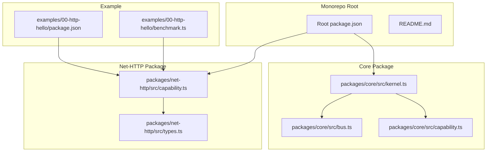
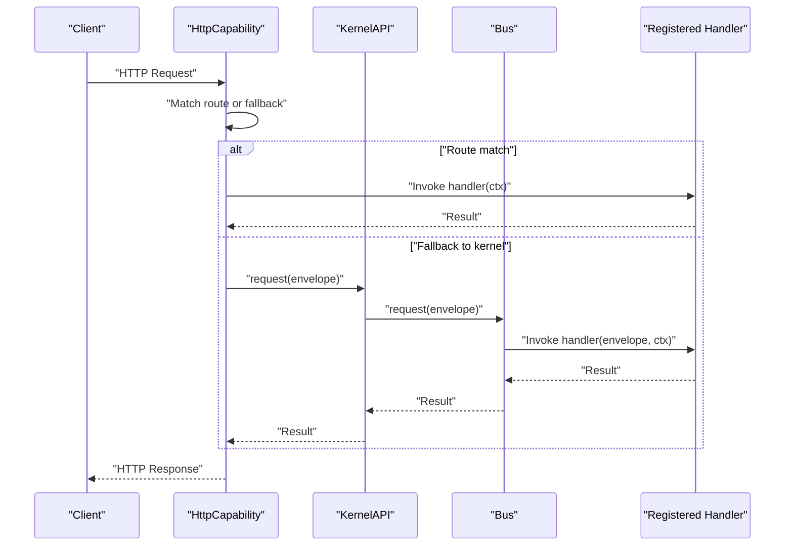
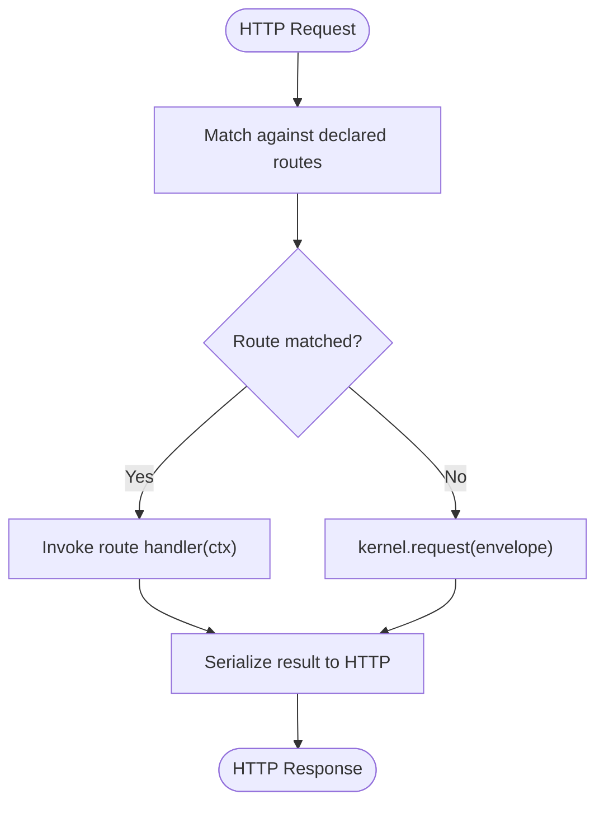
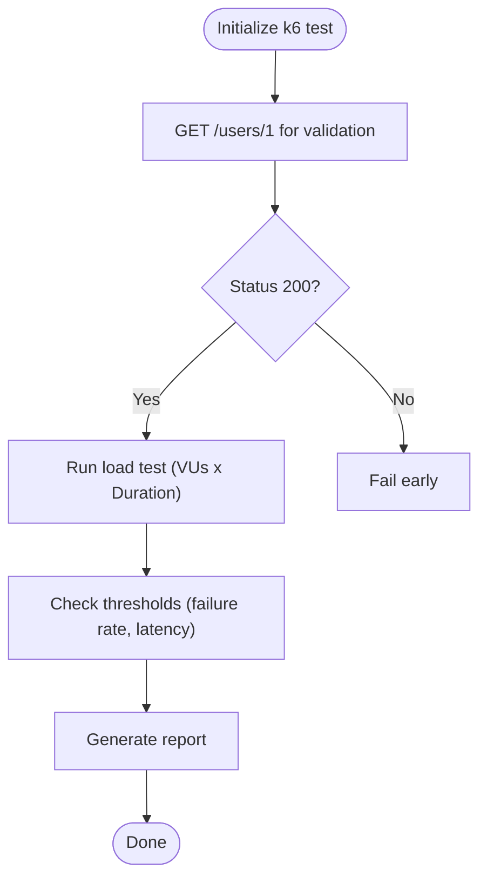
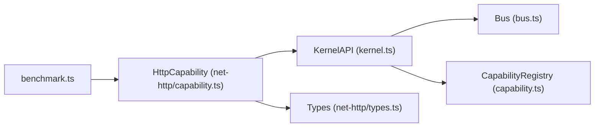

# Benchmarking and Performance Testing

<cite>
**Referenced Files in This Document**
- [README.md](file://README.md)
- [benchmark.ts](file://examples/00-http-hello/benchmark.ts)
- [package.json](file://examples/00-http-hello/package.json)
- [kernel.ts](file://packages/core/src/kernel.ts)
- [bus.ts](file://packages/core/src/bus.ts)
- [capability.ts](file://packages/core/src/capability.ts)
- [capability.ts](file://packages/net-http/src/capability.ts)
- [types.ts](file://packages/net-http/src/types.ts)
- [package.json](file://package.json)
</cite>

## Table of Contents
1. [Introduction](#introduction)
2. [Project Structure](#project-structure)
3. [Core Components](#core-components)
4. [Architecture Overview](#architecture-overview)
5. [Detailed Component Analysis](#detailed-component-analysis)
6. [Dependency Analysis](#dependency-analysis)
7. [Performance Considerations](#performance-considerations)
8. [Troubleshooting Guide](#troubleshooting-guide)
9. [Conclusion](#conclusion)
10. [Appendices](#appendices)

## Introduction
This document explains how to benchmark and performance-test applications built with kislabin. It covers how to use the included benchmark script, how to run load tests against HTTP endpoints, and how to measure latency, throughput, and error rates. It also provides guidance on identifying bottlenecks, optimizing performance, and planning capacity for production deployments. The examples leverage the k6 tool and the HTTP capability that integrates with Bun’s native HTTP server.

## Project Structure
Kislabin is organized as a monorepo with a core kernel and an HTTP capability. The benchmarking example is provided under the HTTP hello example, which demonstrates how to run k6-based load tests against a local HTTP endpoint exposed by the HTTP capability.

**Diagram sources**
- [kernel.ts:1-354](file://packages/core/src/kernel.ts#L1-L354)
- [bus.ts:1-214](file://packages/core/src/bus.ts#L1-L214)
- [capability.ts:1-241](file://packages/core/src/capability.ts#L1-L241)
- [capability.ts:1-223](file://packages/net-http/src/capability.ts#L1-L223)
- [types.ts:1-194](file://packages/net-http/src/types.ts#L1-L194)
- [benchmark.ts:1-20](file://examples/00-http-hello/benchmark.ts#L1-L20)
- [package.json:1-27](file://examples/00-http-hello/package.json#L1-L27)
- [package.json:1-29](file://package.json#L1-L29)

**Section sources**
- [README.md:100-142](file://README.md#L100-L142)
- [package.json:24-27](file://package.json#L24-L27)

## Core Components
- Kernel: Central orchestrator that manages capabilities, messages, and lifecycle. It exposes a KernelAPI for capabilities to register handlers, emit events, and request responses.
- Bus: Message dispatcher that routes envelopes to registered handlers. Supports exact-match and wildcard subscriptions, and synchronous/asynchronous broadcasts.
- Capability: Autonomous subsystem contract with lifecycle hooks (init/start/stop/dispose). The HTTP capability integrates with Bun.serve and translates HTTP requests into messages and responses back to HTTP.
- HTTP Capability: Provides a fluent API to define routes, compile patterns, and handle requests. It supports method-specific handlers and a fallback to kernel-based routing via request().

These components form the foundation for performance testing because:
- The HTTP capability exposes a real HTTP server that can be load-tested.
- The kernel and bus enable measuring end-to-end latency and throughput across handlers.
- The lifecycle hooks allow controlled startup/shutdown for accurate measurements.

**Section sources**
- [kernel.ts:65-134](file://packages/core/src/kernel.ts#L65-L134)
- [bus.ts:34-206](file://packages/core/src/bus.ts#L34-L206)
- [capability.ts:61-99](file://packages/core/src/capability.ts#L61-L99)
- [capability.ts:102-179](file://packages/net-http/src/capability.ts#L102-L179)

## Architecture Overview
The HTTP capability integrates with Bun.serve and participates in the kernel lifecycle. Requests are matched against declared routes or fall back to kernel.request() for message-based routing. Responses are serialized back to HTTP.

**Diagram sources**
- [capability.ts:120-163](file://packages/net-http/src/capability.ts#L120-L163)
- [kernel.ts:84-91](file://packages/core/src/kernel.ts#L84-L91)
- [bus.ts:159-170](file://packages/core/src/bus.ts#L159-L170)

## Detailed Component Analysis

### HTTP Capability and Load Testing
The HTTP capability starts a Bun.serve server and handles requests either via declared routes or via kernel.request() for message-based routing. This makes it straightforward to expose endpoints for k6 load tests.

Key aspects for performance testing:
- Route compilation and matching: Declared routes are parsed and matched against incoming requests. This enables deterministic latency measurements for specific endpoints.
- Fallback to kernel.request(): Allows testing message-driven handlers that are not bound to HTTP routes.
- Error handling: Errors are captured and mapped to appropriate HTTP responses, enabling accurate failure rate metrics.

**Diagram sources**
- [capability.ts:128-163](file://packages/net-http/src/capability.ts#L128-L163)

**Section sources**
- [capability.ts:92-179](file://packages/net-http/src/capability.ts#L92-L179)
- [types.ts:46-61](file://packages/net-http/src/types.ts#L46-L61)

### Benchmark Script Usage
The example includes a k6 script that defines concurrency, duration, and thresholds for latency and failure rates. It performs an initial GET to validate the endpoint and then runs the load test.

Recommended usage steps:
- Start the application with the HTTP capability configured to listen on a known port.
- Run the k6 script pointing to the target endpoint.
- Review k6 reports for p50/p90/p95 latency, throughput (requests/second), and failure rates.

Thresholds in the example:
- Maximum 1% failure rate for HTTP requests.
- 95th percentile latency below a specified threshold.

**Diagram sources**
- [benchmark.ts:1-20](file://examples/00-http-hello/benchmark.ts#L1-L20)

**Section sources**
- [benchmark.ts:4-11](file://examples/00-http-hello/benchmark.ts#L4-L11)
- [benchmark.ts:13-19](file://examples/00-http-hello/benchmark.ts#L13-L19)

### Measuring Latency, Throughput, and Memory
- Latency: Track p50/p90/p95/p99 latency and HTTP request duration metrics from k6. These reflect end-to-end latency across the HTTP capability, kernel bus, and handlers.
- Throughput: Measure requests per second during the test duration to understand capacity limits.
- Failure rate: Monitor http_req_failed to detect errors under load.
- Memory: Use OS-level tools (e.g., top, ps, bun’s built-in metrics) to observe RSS and heap usage during tests. For Bun-specific metrics, consult Bun’s runtime profiling capabilities.

Note: The repository does not include built-in memory profiling hooks. Use external tools to correlate memory usage with latency spikes.

**Section sources**
- [benchmark.ts:7-10](file://examples/00-http-hello/benchmark.ts#L7-L10)

### Identifying Bottlenecks and Optimizing Performance
Common bottleneck areas in kislabin applications:
- Handler complexity: Long-running handlers increase latency and reduce throughput. Offload CPU-heavy tasks to background jobs or separate capabilities.
- Synchronous dispatch: emit() ignores promises; use emitAsync() when you need to wait for completion. For request(), the first exact-match handler responds; ensure minimal handler chains.
- Route matching overhead: Prefer fewer, well-defined routes with static segments where possible.
- Kernel bus contention: Too many wildcard subscribers can slow down broadcasts. Limit wildcard usage to essential observability handlers.

Optimization strategies:
- Decompose handlers: Split heavy logic into smaller handlers or capabilities.
- Use caching: Cache expensive computations or database queries.
- Asynchronous processing: Use emitAsync() for side effects and avoid blocking request().
- Tune concurrency: Adjust k6 VUs and duration to find saturation points.

**Section sources**
- [bus.ts:91-107](file://packages/core/src/bus.ts#L91-L107)
- [bus.ts:125-136](file://packages/core/src/bus.ts#L125-L136)
- [bus.ts:159-170](file://packages/core/src/bus.ts#L159-L170)

### Production Monitoring and Scaling Considerations
- Health checks: Expose a lightweight endpoint (e.g., GET /health) for readiness/liveness probes.
- Horizontal scaling: Run multiple instances behind a load balancer; ensure stateless handlers.
- Vertical scaling: Increase CPU/memory resources based on observed latency and failure rate trends.
- Observability: Use kernel lifecycle signals and bus handlers to emit structured logs/journal entries for performance insights.

[No sources needed since this section provides general guidance]

### Stress Testing and Capacity Planning
Stress testing approach:
- Start with moderate VUs and ramp up gradually until latency exceeds thresholds or failure rate rises above acceptable limits.
- Record p95 latency and throughput at each step to build a capacity curve.
- Plan headroom: Target p95 latency below the threshold used in tests to account for traffic variability.

Capacity planning:
- Determine maximum VUs that keep failure rate under 1% and p95 latency within SLA.
- Factor in horizontal scaling to meet peak demand.
- Monitor resource utilization (CPU, memory, network) alongside application metrics.

[No sources needed since this section provides general guidance]

## Dependency Analysis
The HTTP capability depends on the core kernel and bus to translate HTTP requests into messages and back. The example benchmark script depends on the HTTP capability being reachable at a fixed endpoint.

**Diagram sources**
- [kernel.ts:272-290](file://packages/core/src/kernel.ts#L272-L290)
- [bus.ts:34-78](file://packages/core/src/bus.ts#L34-L78)
- [capability.ts:115-145](file://packages/core/src/capability.ts#L115-L145)
- [capability.ts:102-118](file://packages/net-http/src/capability.ts#L102-L118)
- [types.ts:5-9](file://packages/net-http/src/types.ts#L5-L9)
- [benchmark.ts:1-20](file://examples/00-http-hello/benchmark.ts#L1-L20)

**Section sources**
- [kernel.ts:265-353](file://packages/core/src/kernel.ts#L265-L353)
- [capability.ts:194-240](file://packages/core/src/capability.ts#L194-L240)
- [capability.ts:102-179](file://packages/net-http/src/capability.ts#L102-L179)

## Performance Considerations
- Keep handlers fast and stateless to maximize throughput.
- Use emitAsync() for side effects and avoid blocking the request thread.
- Minimize wildcard subscriptions to reduce broadcast overhead.
- Prefer explicit route patterns over broad wildcards for predictable latency.
- Monitor resource usage during load tests and adjust instance count or specs accordingly.

[No sources needed since this section provides general guidance]

## Troubleshooting Guide
- Endpoint not reachable: Verify the HTTP capability is started and listening on the expected port/host.
- High failure rates: Inspect error responses and handler exceptions; confirm thresholds are realistic.
- Latency spikes: Profile handlers and database/network calls; consider caching and offloading work.
- Memory growth: Use external tools to monitor RSS and GC behavior; investigate long-lived closures or caches.

**Section sources**
- [capability.ts:120-179](file://packages/net-http/src/capability.ts#L120-L179)
- [benchmark.ts:7-10](file://examples/00-http-hello/benchmark.ts#L7-L10)

## Conclusion
Kislabin’s HTTP capability and kernel bus provide a solid foundation for performance testing. By combining k6 load tests with careful handler design and observability, teams can measure latency, throughput, and reliability, identify bottlenecks, and plan capacity effectively. Use the example benchmark script as a starting point and evolve thresholds and concurrency based on measured outcomes.

[No sources needed since this section summarizes without analyzing specific files]

## Appendices

### Example Commands and Setup
- Install dependencies and run the example HTTP application using the workspace configuration.
- Start the HTTP capability and run the k6 benchmark script against the local endpoint.

**Section sources**
- [package.json:24-27](file://package.json#L24-L27)
- [package.json:15-26](file://examples/00-http-hello/package.json#L15-L26)