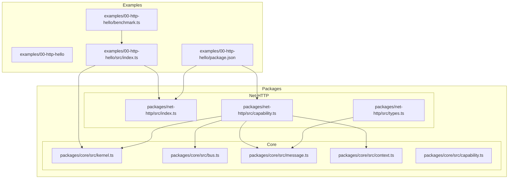
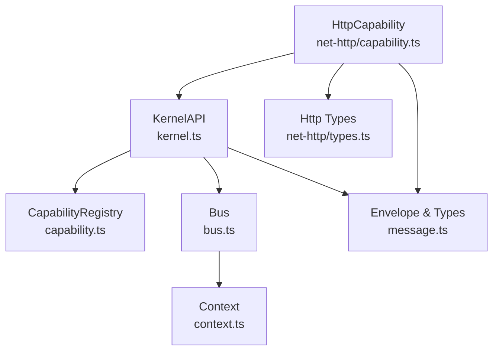
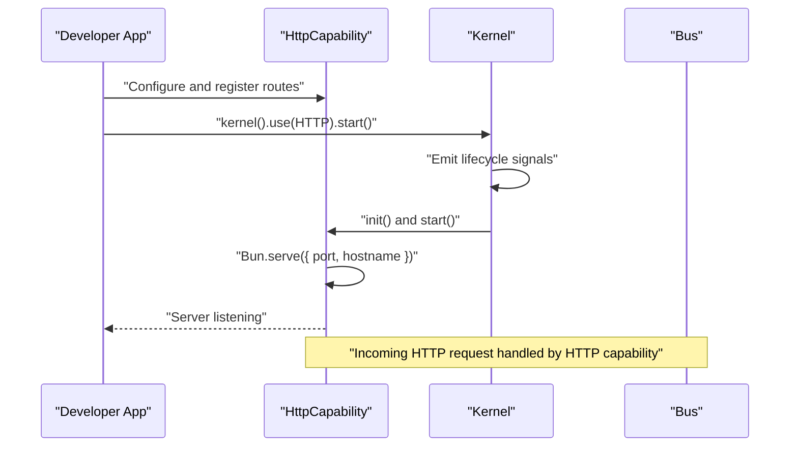
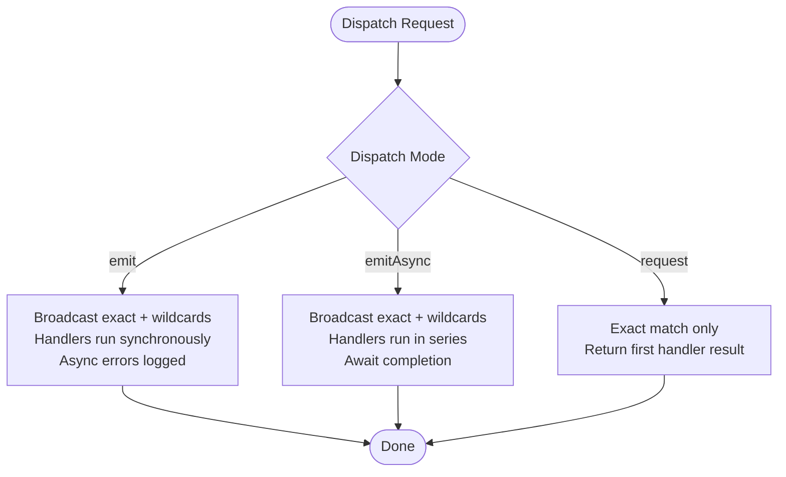
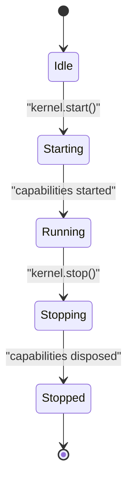
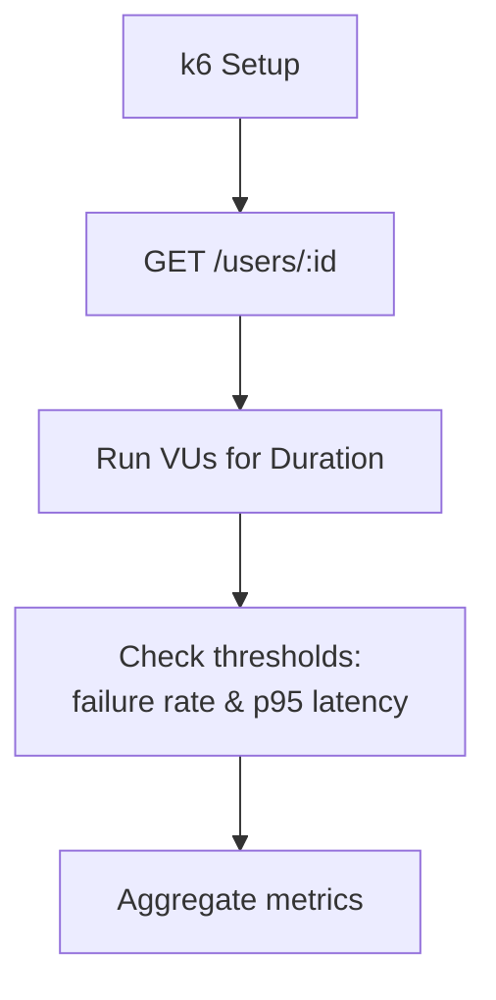
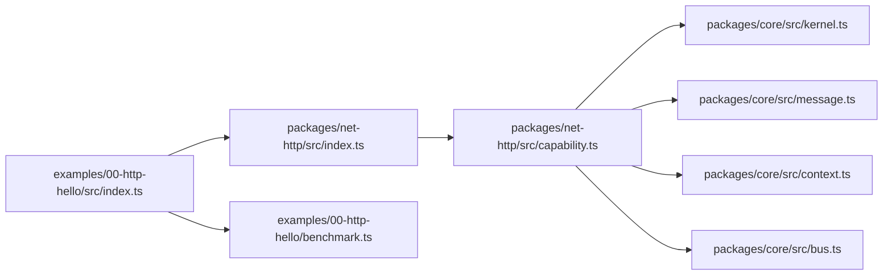

# Examples & Tutorials

<cite>
**Referenced Files in This Document**
- [README.md](file://README.md)
- [index.ts](file://examples/00-http-hello/src/index.ts)
- [benchmark.ts](file://examples/00-http-hello/benchmark.ts)
- [package.json](file://examples/00-http-hello/package.json)
- [kernel.ts](file://packages/core/src/kernel.ts)
- [capability.ts](file://packages/core/src/capability.ts)
- [bus.ts](file://packages/core/src/bus.ts)
- [context.ts](file://packages/core/src/context.ts)
- [message.ts](file://packages/core/src/message.ts)
- [capability.ts](file://packages/net-http/src/capability.ts)
- [types.ts](file://packages/net-http/src/types.ts)
- [index.ts](file://packages/net-http/src/index.ts)
</cite>

## Table of Contents
1. [Introduction](#introduction)
2. [Project Structure](#project-structure)
3. [Core Components](#core-components)
4. [Architecture Overview](#architecture-overview)
5. [Detailed Component Analysis](#detailed-component-analysis)
6. [Dependency Analysis](#dependency-analysis)
7. [Performance Considerations](#performance-considerations)
8. [Troubleshooting Guide](#troubleshooting-guide)
9. [Conclusion](#conclusion)
10. [Appendices](#appendices)

## Introduction
This document provides practical tutorials and examples for the kislabin framework, focusing on:
- HTTP hello world example with detailed explanation of each component
- Async operation patterns using promise handling and request/response
- Capability lifecycle examples demonstrating initialization and cleanup
- Benchmarking techniques and performance measurement approaches
- Common patterns and anti-patterns observed in real-world usage
- Troubleshooting guides for common issues and debugging techniques
- Migration examples from other frameworks and comparison exercises

Kislabin is a minimal kernel that treats everything as messages and organizes capabilities as isolated subsystems communicating via a message bus. It emphasizes explicit lifecycle, optional dependency injection, and portability.

## Project Structure
The repository is organized into:
- Core kernel and messaging primitives
- HTTP capability built on Bun.serve
- Example applications demonstrating practical usage

**Diagram sources**
- [index.ts:1-12](file://examples/00-http-hello/src/index.ts#L1-L12)
- [benchmark.ts:1-20](file://examples/00-http-hello/benchmark.ts#L1-L20)
- [package.json:1-27](file://examples/00-http-hello/package.json#L1-L27)
- [kernel.ts:265-354](file://packages/core/src/kernel.ts#L265-L354)
- [capability.ts:115-241](file://packages/core/src/capability.ts#L115-L241)
- [bus.ts:34-214](file://packages/core/src/bus.ts#L34-L214)
- [context.ts:22-167](file://packages/core/src/context.ts#L22-L167)
- [message.ts:11-164](file://packages/core/src/message.ts#L11-L164)
- [capability.ts:92-223](file://packages/net-http/src/capability.ts#L92-L223)
- [types.ts:1-194](file://packages/net-http/src/types.ts#L1-L194)
- [index.ts:1-20](file://packages/net-http/src/index.ts#L1-L20)

**Section sources**
- [README.md:100-142](file://README.md#L100-L142)
- [index.ts:1-12](file://examples/00-http-hello/src/index.ts#L1-L12)
- [benchmark.ts:1-20](file://examples/00-http-hello/benchmark.ts#L1-L20)
- [package.json:1-27](file://examples/00-http-hello/package.json#L1-L27)
- [kernel.ts:265-354](file://packages/core/src/kernel.ts#L265-L354)
- [capability.ts:115-241](file://packages/core/src/capability.ts#L115-L241)
- [bus.ts:34-214](file://packages/core/src/bus.ts#L34-L214)
- [context.ts:22-167](file://packages/core/src/context.ts#L22-L167)
- [message.ts:11-164](file://packages/core/src/message.ts#L11-L164)
- [capability.ts:92-223](file://packages/net-http/src/capability.ts#L92-L223)
- [types.ts:1-194](file://packages/net-http/src/types.ts#L1-L194)
- [index.ts:1-20](file://packages/net-http/src/index.ts#L1-L20)

## Core Components
This section introduces the foundational building blocks of kislabin and how they work together.

- Kernel and KernelAPI: The central orchestrator managing capabilities, configuration, and lifecycle signals.
- Capability: An isolated subsystem with lifecycle hooks (init/start/stop/dispose) and declared dependencies.
- Bus: Message dispatcher supporting broadcast and request-response semantics.
- Context: Execution context flowing through handler chains, carrying trace and cancellation support.
- Message primitives: Envelope, kinds (command/event/query/signal), and typed aliases.

Key responsibilities and behaviors:
- Kernel manages capability registration, lifecycle orchestration, and emits lifecycle signals.
- CapabilityRegistry enforces topological ordering and detects missing dependencies or cycles.
- Bus supports exact-match and wildcard subscriptions, with separate APIs for emit/emitAsync/request.
- Context provides lazy allocation and shared state across handlers, plus cancellation and tracing.

**Section sources**
- [kernel.ts:65-134](file://packages/core/src/kernel.ts#L65-L134)
- [kernel.ts:159-183](file://packages/core/src/kernel.ts#L159-L183)
- [kernel.ts:204-245](file://packages/core/src/kernel.ts#L204-L245)
- [capability.ts:61-99](file://packages/core/src/capability.ts#L61-L99)
- [capability.ts:115-241](file://packages/core/src/capability.ts#L115-L241)
- [bus.ts:34-214](file://packages/core/src/bus.ts#L34-L214)
- [context.ts:22-90](file://packages/core/src/context.ts#L22-L90)
- [message.ts:11-86](file://packages/core/src/message.ts#L11-L86)

## Architecture Overview
The system architecture centers around the kernel, capabilities, and the message bus. HTTP is implemented as a capability that translates HTTP requests into envelopes and routes them to handlers.

**Diagram sources**
- [kernel.ts:265-354](file://packages/core/src/kernel.ts#L265-L354)
- [capability.ts:115-241](file://packages/core/src/capability.ts#L115-L241)
- [bus.ts:34-214](file://packages/core/src/bus.ts#L34-L214)
- [context.ts:22-167](file://packages/core/src/context.ts#L22-L167)
- [message.ts:11-164](file://packages/core/src/message.ts#L11-L164)
- [capability.ts:92-223](file://packages/net-http/src/capability.ts#L92-L223)
- [types.ts:1-194](file://packages/net-http/src/types.ts#L1-L194)

## Detailed Component Analysis

### HTTP Hello World Tutorial
This tutorial demonstrates a minimal HTTP endpoint using the HTTP capability and kernel.

Steps:
1. Import the HTTP capability and kernel.
2. Configure the HTTP capability with port and optional hostname.
3. Define a route with a path pattern and handlers keyed by HTTP method.
4. Register the HTTP capability with the kernel and start the system.

**Diagram sources**
- [index.ts:1-12](file://examples/00-http-hello/src/index.ts#L1-L12)
- [capability.ts:92-223](file://packages/net-http/src/capability.ts#L92-L223)
- [kernel.ts:314-350](file://packages/core/src/kernel.ts#L314-L350)

What happens under the hood:
- The HTTP capability compiles declared routes during init and stores them for fast matching at runtime.
- On startup, it starts a Bun server and registers a fetch handler.
- For matched routes, it builds an envelope and invokes the handler, serializing the result.
- For unmatched routes, it falls back to kernel.request, enabling message-driven routing.

**Section sources**
- [index.ts:1-12](file://examples/00-http-hello/src/index.ts#L1-L12)
- [capability.ts:92-223](file://packages/net-http/src/capability.ts#L92-L223)
- [kernel.ts:314-350](file://packages/core/src/kernel.ts#L314-L350)

### Async Operation Examples: Promise Handling and Request/Response
Kislabin supports three primary dispatch modes:
- emit: Fire-and-forget broadcast; async promises are ignored after invocation.
- emitAsync: Broadcast that waits for all handlers to complete; handlers run in series.
- request: Point-to-point request that returns the first handler’s result; wildcards are not supported.

**Diagram sources**
- [bus.ts:91-170](file://packages/core/src/bus.ts#L91-L170)

Best practices:
- Use emitAsync when you need to ensure all subscribers finish processing before proceeding.
- Use request for RPC-style interactions where a single handler must respond.
- Avoid relying on returned promises from emit; use emitAsync if you need to observe completion.

**Section sources**
- [bus.ts:91-170](file://packages/core/src/bus.ts#L91-L170)

### Capability Lifecycle Examples: Initialization and Cleanup
The HTTP capability demonstrates the full lifecycle:
- init: Compile routes and prepare internal structures.
- start: Start the Bun server and listen for requests.
- stop: Stop accepting new connections gracefully.
- dispose: Release resources and reset state.

**Diagram sources**
- [kernel.ts:314-350](file://packages/core/src/kernel.ts#L314-L350)
- [capability.ts:106-179](file://packages/net-http/src/capability.ts#L106-L179)

Lifecycle guarantees:
- init runs before start and throws on failure.
- stop runs in reverse order; failures are swallowed to continue shutdown.
- dispose runs in reverse order and always executes, ensuring resource cleanup.

**Section sources**
- [kernel.ts:314-350](file://packages/core/src/kernel.ts#L314-L350)
- [capability.ts:106-179](file://packages/net-http/src/capability.ts#L106-L179)

### Benchmarking Techniques and Performance Measurement
The example includes a k6 script to measure throughput and latency under load.

Key aspects:
- Configure virtual users and duration.
- Set thresholds for failure rate and p95 latency.
- Warm up the server with a setup request.
- Serialize responses consistently to avoid serialization overhead skew.

**Diagram sources**
- [benchmark.ts:1-20](file://examples/00-http-hello/benchmark.ts#L1-L20)

Recommendations:
- Use consistent request shapes and payloads.
- Monitor both CPU and memory; adjust VU count accordingly.
- Separate warmup from measurement to avoid cold-start effects.

**Section sources**
- [benchmark.ts:1-20](file://examples/00-http-hello/benchmark.ts#L1-L20)

### Common Patterns and Anti-Patterns
Patterns:
- Message-first design: Treat HTTP requests as envelopes and route via kernel handlers for decoupling.
- Explicit lifecycle: Always define init/start/stop/dispose for capabilities.
- Context sharing: Use ctx.set/get to pass data between middleware and handlers.
- Envelope factories: Use kernel.envelope helpers to create typed envelopes with correct source and timestamps.

Anti-patterns:
- Ignoring async completion: Using emit for operations requiring completion; prefer emitAsync.
- Wildcards in request: Using wildcard patterns with request; request requires exact match.
- Blocking handlers: Long-running work in handlers; offload to queues or background jobs.
- Hard-coding ports: Read configuration via kernel.config to keep capabilities portable.

**Section sources**
- [bus.ts:91-170](file://packages/core/src/bus.ts#L91-L170)
- [context.ts:22-90](file://packages/core/src/context.ts#L22-L90)
- [message.ts:11-86](file://packages/core/src/message.ts#L11-L86)

### Troubleshooting Guide
Common issues and resolutions:
- No handler registered for envelope type: Ensure handlers are registered before emitting or that routes are compiled in init.
- Circular dependencies in capabilities: Review dependencies and remove cycles; the registry detects and reports them.
- Missing configuration: Use kernel.config(key, fallback) to provide defaults or fail fast with clear errors.
- Graceful shutdown: Implement stop/dispose in capabilities to drain and release resources; rely on kernel.stop to enforce ordering.
- HTTP server binding errors: Verify port availability and hostname settings; the HTTP capability logs listening info on start.

Debugging techniques:
- Subscribe to lifecycle signals to trace state transitions.
- Use ctx.signal to propagate cancellation and detect slow handlers.
- Log envelope IDs and correlation IDs for end-to-end tracing.

**Section sources**
- [bus.ts:209-214](file://packages/core/src/bus.ts#L209-L214)
- [capability.ts:156-192](file://packages/core/src/capability.ts#L156-L192)
- [kernel.ts:314-350](file://packages/core/src/kernel.ts#L314-L350)
- [context.ts:22-90](file://packages/core/src/context.ts#L22-L90)

### Migration Examples and Comparison Exercises
Migration from traditional frameworks:
- From NestJS/Fastify to kislabin:
  - Replace decorators with message handlers and envelope factories.
  - Move HTTP routes to declarative route definitions or kernel handlers.
  - Replace DI with optional configuration via kernel.config and capability init.
  - Embrace explicit lifecycle and signal-based observability.

Comparison highlights:
- Core size: kislabin (~300 lines) vs NestJS (~30k LOC).
- Message-first: kislabin supports message-driven patterns natively.
- Lifecycle: kislabin provides explicit lifecycle with ordered start/stop.
- DI: Optional in kislabin; required in NestJS.
- Portability: kislabin’s mental model maps to Go/Rust.

**Section sources**
- [README.md:191-200](file://README.md#L191-L200)
- [README.md:224-236](file://README.md#L224-L236)

## Dependency Analysis
The HTTP capability depends on core primitives for envelopes, context, and bus. The example application depends on both core and net-http packages.

**Diagram sources**
- [index.ts:1-12](file://examples/00-http-hello/src/index.ts#L1-L12)
- [index.ts:1-20](file://packages/net-http/src/index.ts#L1-L20)
- [capability.ts:92-223](file://packages/net-http/src/capability.ts#L92-L223)
- [kernel.ts:265-354](file://packages/core/src/kernel.ts#L265-L354)
- [message.ts:11-164](file://packages/core/src/message.ts#L11-L164)
- [context.ts:22-167](file://packages/core/src/context.ts#L22-L167)
- [bus.ts:34-214](file://packages/core/src/bus.ts#L34-L214)
- [benchmark.ts:1-20](file://examples/00-http-hello/benchmark.ts#L1-L20)

**Section sources**
- [package.json:15-26](file://examples/00-http-hello/package.json#L15-L26)
- [capability.ts:92-223](file://packages/net-http/src/capability.ts#L92-L223)
- [kernel.ts:265-354](file://packages/core/src/kernel.ts#L265-L354)

## Performance Considerations
- Use emitAsync judiciously; it runs handlers in series and awaits all completions.
- Prefer request for lightweight RPC-like interactions to minimize overhead.
- Keep handlers synchronous when possible; defer heavy work to background jobs.
- Monitor envelope creation costs; reuse envelopes and avoid unnecessary allocations.
- Tune VU counts and thresholds in k6 to reflect realistic traffic patterns.

[No sources needed since this section provides general guidance]

## Troubleshooting Guide
- If handlers appear to be ignored, verify that the envelope type matches registrations and that wildcards are not used with request.
- If startup fails, check capability dependencies and ensure init completes without throwing.
- If shutdown hangs, confirm stop/dispose implementations and resource release.

**Section sources**
- [bus.ts:209-214](file://packages/core/src/bus.ts#L209-L214)
- [capability.ts:156-192](file://packages/core/src/capability.ts#L156-L192)
- [kernel.ts:314-350](file://packages/core/src/kernel.ts#L314-L350)

## Conclusion
Kislabin offers a minimal, message-driven kernel with explicit lifecycle and capability isolation. The HTTP hello world example showcases how to compose capabilities with the kernel, while async dispatch modes and lifecycle hooks enable robust, testable systems. Benchmarking and troubleshooting practices help maintain performance and reliability. Migration from conventional frameworks hinges on embracing message-first design and explicit lifecycle management.

[No sources needed since this section summarizes without analyzing specific files]

## Appendices
- Example commands to run the HTTP hello world and benchmarks are documented in the repository README.
- The HTTP capability exposes a fluent API for registering routes and groups, enabling modular routing.

**Section sources**
- [README.md:229-236](file://README.md#L229-L236)
- [capability.ts:182-222](file://packages/net-http/src/capability.ts#L182-L222)