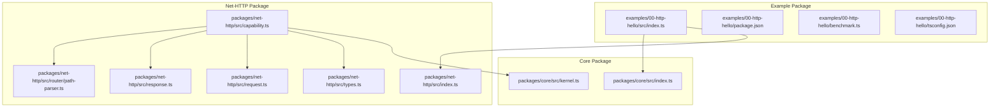
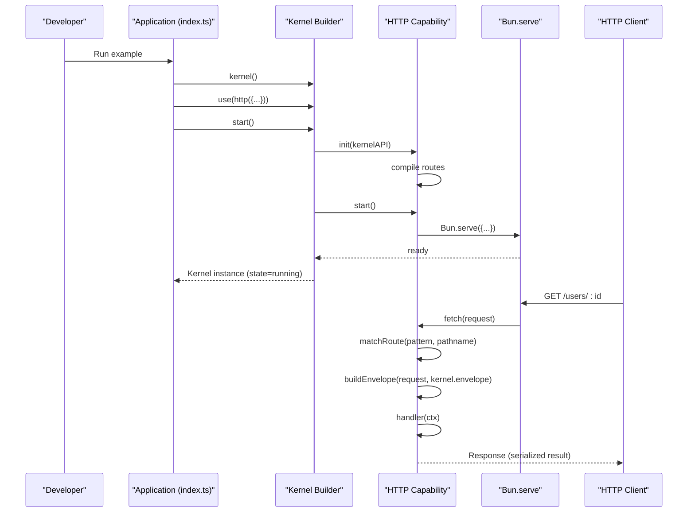
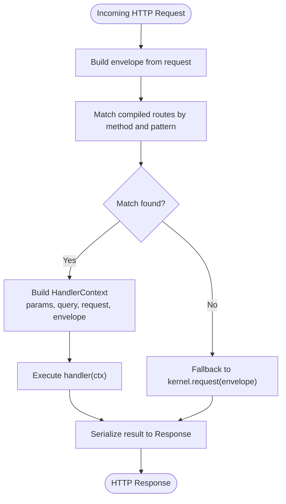
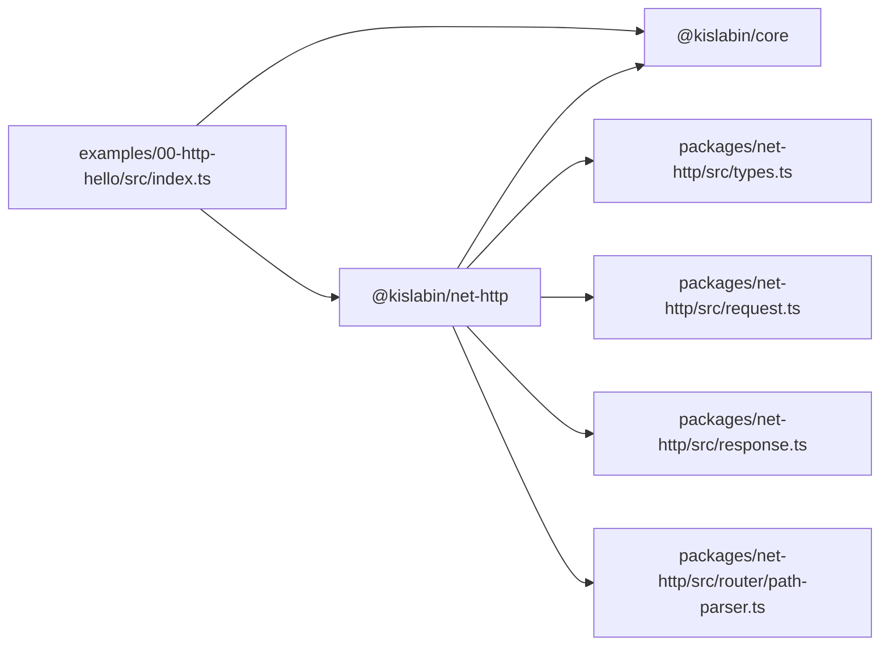

# Hello World Example

<cite>
**Referenced Files in This Document**
- [index.ts](file://examples/00-http-hello/src/index.ts)
- [package.json](file://examples/00-http-hello/package.json)
- [benchmark.ts](file://examples/00-http-hello/benchmark.ts)
- [tsconfig.json](file://examples/00-http-hello/tsconfig.json)
- [index.ts](file://packages/core/src/index.ts)
- [kernel.ts](file://packages/core/src/kernel.ts)
- [index.ts](file://packages/net-http/src/index.ts)
- [capability.ts](file://packages/net-http/src/capability.ts)
- [types.ts](file://packages/net-http/src/types.ts)
- [path-parser.ts](file://packages/net-http/src/router/path-parser.ts)
- [request.ts](file://packages/net-http/src/request.ts)
- [response.ts](file://packages/net-http/src/response.ts)
</cite>

## Table of Contents
1. [Introduction](#introduction)
2. [Project Structure](#project-structure)
3. [Core Components](#core-components)
4. [Architecture Overview](#architecture-overview)
5. [Detailed Component Analysis](#detailed-component-analysis)
6. [Dependency Analysis](#dependency-analysis)
7. [Performance Considerations](#performance-considerations)
8. [Troubleshooting Guide](#troubleshooting-guide)
9. [Conclusion](#conclusion)
10. [Appendices](#appendices)

## Introduction
This tutorial explains the HTTP Hello World example in the kislabin framework. It walks through each line of the example, detailing imports, the http() factory function, route definition syntax, parameter handling, and kernel initialization. You will learn how to run the example locally, test the endpoint, and extend it with variations. The guide also covers performance testing, troubleshooting common setup issues, and adapting the example for different use cases.

## Project Structure
The example is organized as a standalone example package with a minimal TypeScript entry point and supporting configuration files. It depends on the core framework and the HTTP capability package.

**Diagram sources**
- [index.ts:1-12](file://examples/00-http-hello/src/index.ts#L1-L12)
- [package.json:1-27](file://examples/00-http-hello/package.json#L1-L27)
- [benchmark.ts:1-20](file://examples/00-http-hello/benchmark.ts#L1-L20)
- [tsconfig.json:1-5](file://examples/00-http-hello/tsconfig.json#L1-L5)
- [index.ts:1-28](file://packages/core/src/index.ts#L1-L28)
- [kernel.ts:1-354](file://packages/core/src/kernel.ts#L1-L354)
- [index.ts:1-20](file://packages/net-http/src/index.ts#L1-L20)
- [capability.ts:1-223](file://packages/net-http/src/capability.ts#L1-L223)
- [types.ts:1-194](file://packages/net-http/src/types.ts#L1-L194)
- [path-parser.ts:1-213](file://packages/net-http/src/router/path-parser.ts#L1-L213)
- [request.ts:1-37](file://packages/net-http/src/request.ts#L1-L37)
- [response.ts:1-39](file://packages/net-http/src/response.ts#L1-L39)

**Section sources**
- [index.ts:1-12](file://examples/00-http-hello/src/index.ts#L1-L12)
- [package.json:1-27](file://examples/00-http-hello/package.json#L1-L27)
- [tsconfig.json:1-5](file://examples/00-http-hello/tsconfig.json#L1-L5)

## Core Components
This section explains the essential building blocks used by the Hello World example.

- Core kernel and capability system
  - The core exposes a kernel() entry point and capability interfaces. The kernel manages lifecycle, configuration, and message bus interactions.
  - See [kernel.ts:265-354](file://packages/core/src/kernel.ts#L265-L354) for the builder API and [index.ts:10-28](file://packages/core/src/index.ts#L10-L28) for exports.

- HTTP capability
  - The HTTP capability wraps Bun.serve and translates HTTP requests into framework messages and responses back to HTTP.
  - See [capability.ts:92-223](file://packages/net-http/src/capability.ts#L92-L223) for the http() factory and route registration APIs.

- Request and response mapping
  - Requests are parsed into envelopes with typed payloads, and handler results are serialized to HTTP responses.
  - See [request.ts:22-37](file://packages/net-http/src/request.ts#L22-L37) and [response.ts:8-39](file://packages/net-http/src/response.ts#L8-L39).

- Path parsing and route matching
  - Routes support static segments, parameters, optional segments, and wildcards. Patterns are validated and normalized.
  - See [path-parser.ts:80-83](file://packages/net-http/src/router/path-parser.ts#L80-L83) and [path-parser.ts:166-176](file://packages/net-http/src/router/path-parser.ts#L166-L176).

**Section sources**
- [kernel.ts:265-354](file://packages/core/src/kernel.ts#L265-L354)
- [index.ts:10-28](file://packages/core/src/index.ts#L10-L28)
- [capability.ts:92-223](file://packages/net-http/src/capability.ts#L92-L223)
- [request.ts:22-37](file://packages/net-http/src/request.ts#L22-L37)
- [response.ts:8-39](file://packages/net-http/src/response.ts#L8-L39)
- [path-parser.ts:80-83](file://packages/net-http/src/router/path-parser.ts#L80-L83)
- [path-parser.ts:166-176](file://packages/net-http/src/router/path-parser.ts#L166-L176)

## Architecture Overview
The Hello World example initializes a kernel, registers the HTTP capability, defines a single route, and starts the server. The HTTP capability intercepts incoming requests, matches them against declared routes, and executes handlers.

**Diagram sources**
- [index.ts:1-12](file://examples/00-http-hello/src/index.ts#L1-L12)
- [capability.ts:120-169](file://packages/net-http/src/capability.ts#L120-L169)
- [kernel.ts:314-349](file://packages/core/src/kernel.ts#L314-L349)
- [request.ts:22-37](file://packages/net-http/src/request.ts#L22-L37)
- [response.ts:8-19](file://packages/net-http/src/response.ts#L8-L19)

## Detailed Component Analysis

### Line-by-Line Explanation of the Hello World Example
- Import statements
  - Imports the kernel factory from the core package and the http capability factory from the net-http package.
  - See [index.ts:1-2](file://examples/00-http-hello/src/index.ts#L1-L2).

- HTTP capability creation
  - Creates an HTTP capability configured to listen on port 3000. The http() factory returns a capability with fluent route registration methods.
  - See [capability.ts:92-92](file://packages/net-http/src/capability.ts#L92-L92) and [capability.ts:102-118](file://packages/net-http/src/capability.ts#L102-L118).

- Route definition
  - Declares a single route with a path pattern containing a parameter. The handlers object maps HTTP methods to handler functions. The get handler receives a context with extracted params and returns an object that includes the captured id.
  - See [index.ts:5-10](file://examples/00-http-hello/src/index.ts#L5-L10) and [types.ts:46-61](file://packages/net-http/src/types.ts#L46-L61).

- Kernel initialization and startup
  - Uses the kernel builder to register the HTTP capability and start the system. The kernel orchestrates capability initialization and startup, emitting lifecycle signals.
  - See [index.ts](file://examples/00-http-hello/src/index.ts#L12) and [kernel.ts:314-349](file://packages/core/src/kernel.ts#L314-L349).

**Section sources**
- [index.ts:1-12](file://examples/00-http-hello/src/index.ts#L1-L12)
- [capability.ts:92-118](file://packages/net-http/src/capability.ts#L92-L118)
- [types.ts:46-61](file://packages/net-http/src/types.ts#L46-L61)
- [kernel.ts:314-349](file://packages/core/src/kernel.ts#L314-L349)

### HTTP Capability API and Route Syntax
- http() factory
  - Accepts configuration such as port and hostname. Returns an HttpCapability instance with route(), routes(), and router() methods for registering routes.
  - See [capability.ts:92-223](file://packages/net-http/src/capability.ts#L92-L223) and [types.ts:5-9](file://packages/net-http/src/types.ts#L5-L9).

- RouteDefinition structure
  - path: supports static segments, parameters (:param), optional segments (:param?), and wildcards (*).
  - handlers: maps HTTP methods to handler functions or objects with beforeLoad and handler.
  - beforeLoad: optional guards/middleware executed before handlers.
  - loader/search: optional data-fetching and query-parameter parsing hooks.
  - See [types.ts:28-61](file://packages/net-http/src/types.ts#L28-L61) and [types.ts:72-83](file://packages/net-http/src/types.ts#L72-L83).

- Parameter handling
  - Parameters are extracted from the path during route matching and passed to handlers via the context.params object.
  - See [capability.ts:139-145](file://packages/net-http/src/capability.ts#L139-L145) and [path-parser.ts:97-122](file://packages/net-http/src/router/path-parser.ts#L97-L122).

**Diagram sources**
- [capability.ts:128-163](file://packages/net-http/src/capability.ts#L128-L163)
- [request.ts:22-37](file://packages/net-http/src/request.ts#L22-L37)
- [response.ts:8-19](file://packages/net-http/src/response.ts#L8-L19)

**Section sources**
- [capability.ts:92-223](file://packages/net-http/src/capability.ts#L92-L223)
- [types.ts:5-9](file://packages/net-http/src/types.ts#L5-L9)
- [types.ts:28-61](file://packages/net-http/src/types.ts#L28-L61)
- [types.ts:72-83](file://packages/net-http/src/types.ts#L72-L83)
- [path-parser.ts:97-122](file://packages/net-http/src/router/path-parser.ts#L97-L122)

### Running Locally and Testing the Endpoint
- Start the example
  - Install dependencies and run the example using your preferred Node/Bun runtime. The example listens on port 3000.
  - See [package.json:15-25](file://examples/00-http-hello/package.json#L15-L25).

- Test the endpoint
  - Send a GET request to the route defined in the example. The handler returns an object that includes the captured id from the path.
  - Example request: GET http://localhost:3000/users/123
  - See [index.ts:5-10](file://examples/00-http-hello/src/index.ts#L5-L10).

- Performance testing
  - The example includes a k6 benchmark script that validates the endpoint under load with thresholds for failure rate and latency.
  - See [benchmark.ts:1-20](file://examples/00-http-hello/benchmark.ts#L1-L20).

**Section sources**
- [package.json:15-25](file://examples/00-http-hello/package.json#L15-L25)
- [index.ts:5-10](file://examples/00-http-hello/src/index.ts#L5-L10)
- [benchmark.ts:1-20](file://examples/00-http-hello/benchmark.ts#L1-L20)

### Variations and Extensions
- Add more routes
  - Register additional routes using the fluent API. You can define multiple handlers per route and combine static and parameterized paths.
  - See [capability.ts:190-201](file://packages/net-http/src/capability.ts#L190-L201).

- Use RouterGroup for shared prefixes and guards
  - Group related routes with a common prefix and shared beforeLoad functions.
  - See [capability.ts:209-220](file://packages/net-http/src/capability.ts#L209-L220) and [types.ts:189-193](file://packages/net-http/src/types.ts#L189-L193).

- Parameter and query handling
  - Access path parameters via context.params and query parameters via context.query (URLSearchParams).
  - See [capability.ts:139-145](file://packages/net-http/src/capability.ts#L139-L145) and [types.ts:94-112](file://packages/net-http/src/types.ts#L94-L112).

- Body parsing and content types
  - The request parser handles JSON and text bodies for methods that support payloads.
  - See [request.ts:10-20](file://packages/net-http/src/request.ts#L10-L20).

- Error handling
  - Customize error responses with a global onError handler or rely on default behavior for not found and internal server errors.
  - See [response.ts:21-38](file://packages/net-http/src/response.ts#L21-L38) and [types.ts:11-14](file://packages/net-http/src/types.ts#L11-L14).

**Section sources**
- [capability.ts:190-220](file://packages/net-http/src/capability.ts#L190-L220)
- [types.ts:189-193](file://packages/net-http/src/types.ts#L189-L193)
- [capability.ts:139-145](file://packages/net-http/src/capability.ts#L139-L145)
- [types.ts:94-112](file://packages/net-http/src/types.ts#L94-L112)
- [request.ts:10-20](file://packages/net-http/src/request.ts#L10-L20)
- [response.ts:21-38](file://packages/net-http/src/response.ts#L21-L38)
- [types.ts:11-14](file://packages/net-http/src/types.ts#L11-L14)

## Dependency Analysis
The example depends on the core framework and the HTTP capability. The HTTP capability depends on the core kernel API and implements request/response mapping and routing.

**Diagram sources**
- [index.ts:1-2](file://examples/00-http-hello/src/index.ts#L1-L2)
- [package.json:15-18](file://examples/00-http-hello/package.json#L15-L18)
- [index.ts:5-6](file://packages/net-http/src/index.ts#L5-L6)
- [capability.ts:8-12](file://packages/net-http/src/capability.ts#L8-L12)

**Section sources**
- [index.ts:1-2](file://examples/00-http-hello/src/index.ts#L1-L2)
- [package.json:15-18](file://examples/00-http-hello/package.json#L15-L18)
- [index.ts:5-6](file://packages/net-http/src/index.ts#L5-L6)
- [capability.ts:8-12](file://packages/net-http/src/capability.ts#L8-L12)

## Performance Considerations
- Benchmarking
  - Use the included k6 script to validate endpoint behavior under load. Adjust VUs, duration, and thresholds to match your target SLAs.
  - See [benchmark.ts:4-11](file://examples/00-http-hello/benchmark.ts#L4-L11).

- Route complexity
  - Keep path patterns simple to minimize matching overhead. Prefer static paths when possible and avoid excessive wildcards.

- Handler efficiency
  - Ensure handlers return quickly. Offload heavy work to background tasks or external services.

[No sources needed since this section provides general guidance]

## Troubleshooting Guide
- Port already in use
  - Change the port in the http() configuration or stop the conflicting service.
  - See [capability.ts:124-126](file://packages/net-http/src/capability.ts#L124-L126).

- Missing dependencies
  - Ensure the example dependencies are installed and the workspace is built so local packages resolve correctly.
  - See [package.json:15-18](file://examples/00-http-hello/package.json#L15-L18).

- Not found responses
  - Verify the route method and path match the request. The HTTP capability falls back to the kernel bus; ensure a matching handler exists if expecting bus-based routing.
  - See [capability.ts:155-162](file://packages/net-http/src/capability.ts#L155-L162).

- Runtime errors
  - The HTTP capability serializes unhandled errors to a generic internal server error response. Add an onError handler to customize error responses.
  - See [response.ts:21-38](file://packages/net-http/src/response.ts#L21-L38).

**Section sources**
- [capability.ts:124-126](file://packages/net-http/src/capability.ts#L124-L126)
- [package.json:15-18](file://examples/00-http-hello/package.json#L15-L18)
- [capability.ts:155-162](file://packages/net-http/src/capability.ts#L155-L162)
- [response.ts:21-38](file://packages/net-http/src/response.ts#L21-L38)

## Conclusion
The Hello World example demonstrates how to initialize a kernel, register the HTTP capability, define a parameterized route, and serve responses. By understanding the http() factory, route syntax, parameter handling, and kernel lifecycle, you can extend the example with additional routes, groups, guards, loaders, and error handling strategies. Use the included benchmark script to validate performance and adapt the example for production scenarios.

[No sources needed since this section summarizes without analyzing specific files]

## Appendices

### Appendix A: Example Configuration Reference
- Example package configuration
  - Dependencies include the core and net-http packages. Development dependencies include TypeScript types for Bun and k6.
  - See [package.json:15-25](file://examples/00-http-hello/package.json#L15-L25).

- TypeScript configuration
  - Extends the repository-wide tsconfig and includes the src directory.
  - See [tsconfig.json:1-5](file://examples/00-http-hello/tsconfig.json#L1-L5).

**Section sources**
- [package.json:15-25](file://examples/00-http-hello/package.json#L15-L25)
- [tsconfig.json:1-5](file://examples/00-http-hello/tsconfig.json#L1-L5)