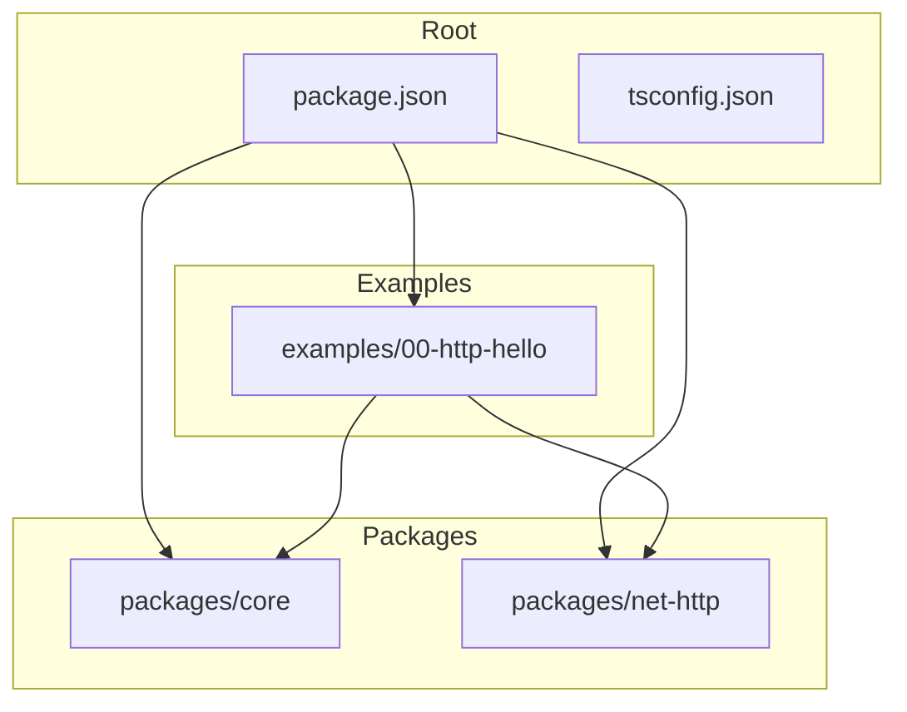
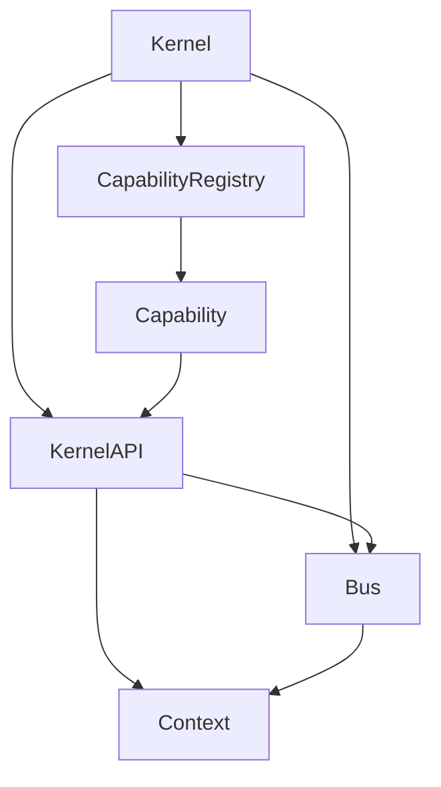
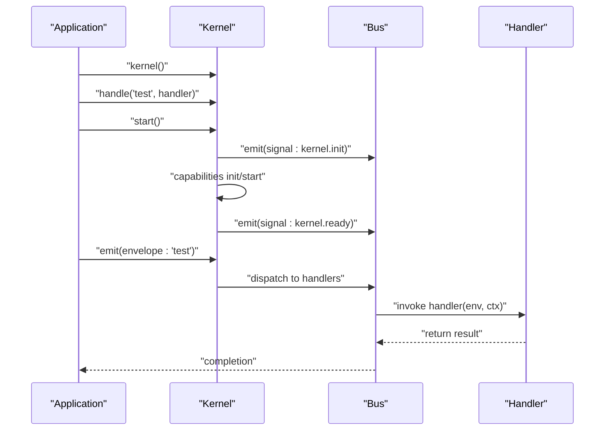
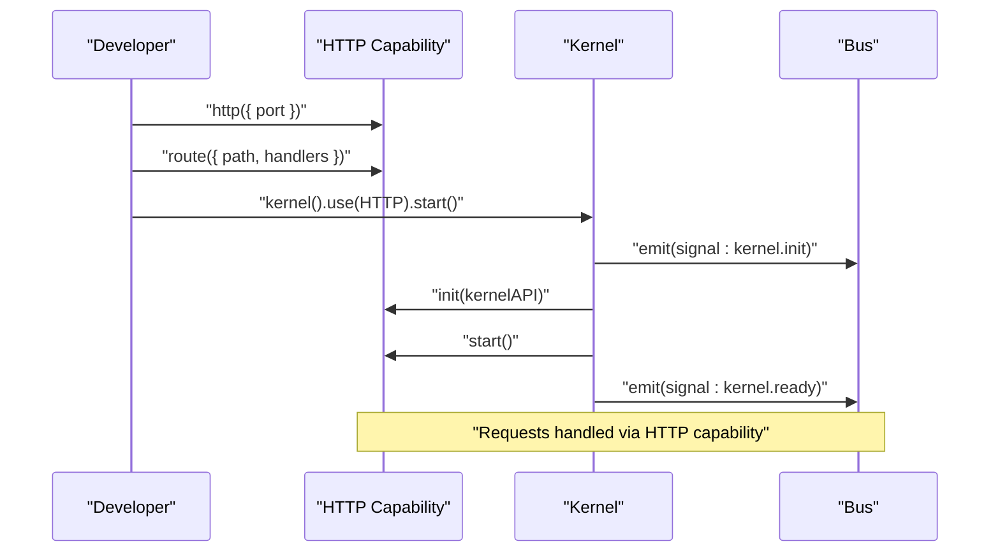
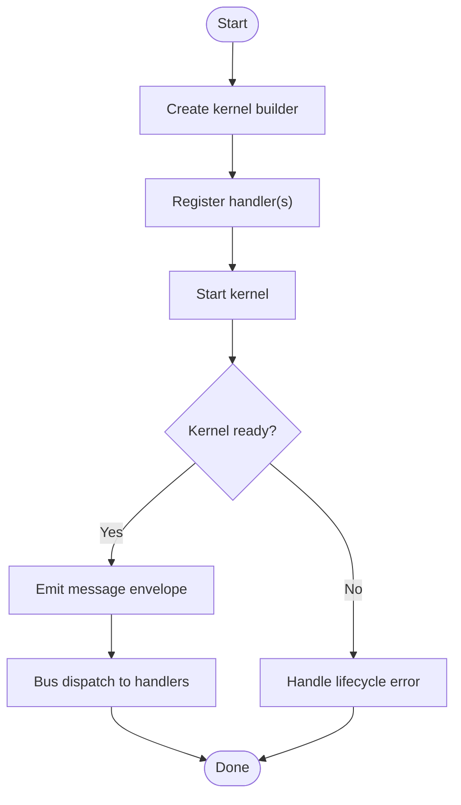
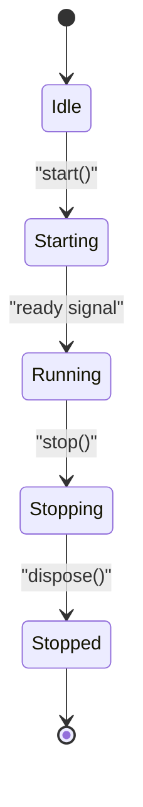
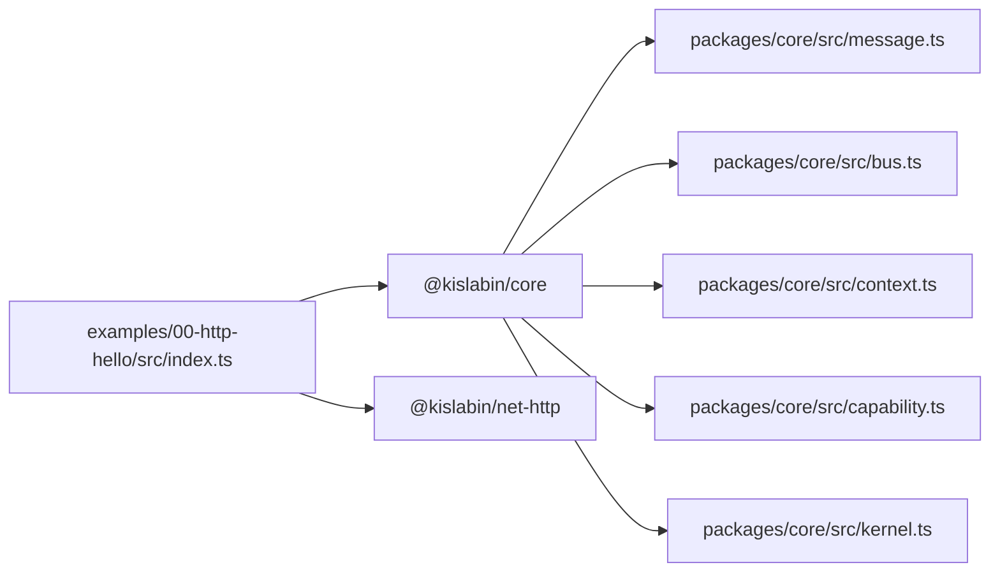

# Getting Started

<cite>
**Referenced Files in This Document**
- [README.md](file://README.md)
- [package.json](file://package.json)
- [packages/core/src/index.ts](file://packages/core/src/index.ts)
- [packages/core/src/kernel.ts](file://packages/core/src/kernel.ts)
- [packages/core/src/bus.ts](file://packages/core/src/bus.ts)
- [packages/core/src/context.ts](file://packages/core/src/context.ts)
- [packages/core/src/message.ts](file://packages/core/src/message.ts)
- [packages/core/src/capability.ts](file://packages/core/src/capability.ts)
- [examples/00-http-hello/src/index.ts](file://examples/00-http-hello/src/index.ts)
- [examples/00-http-hello/package.json](file://examples/00-http-hello/package.json)
- [examples/00-http-hello/benchmark.ts](file://examples/00-http-hello/benchmark.ts)
- [examples/00-http-hello/tsconfig.json](file://examples/00-http-hello/tsconfig.json)
</cite>

## Table of Contents
1. [Introduction](#introduction)
2. [Project Structure](#project-structure)
3. [Core Components](#core-components)
4. [Architecture Overview](#architecture-overview)
5. [Detailed Component Analysis](#detailed-component-analysis)
6. [Dependency Analysis](#dependency-analysis)
7. [Performance Considerations](#performance-considerations)
8. [Troubleshooting Guide](#troubleshooting-guide)
9. [Conclusion](#conclusion)
10. [Appendices](#appendices)

## Introduction
Kislabin is a computational model rather than a traditional framework. It centers on a minimal kernel that routes messages, manages lifecycle, and exposes a controlled API surface for capabilities to communicate via a message bus. The philosophy emphasizes:
- Everything is a message (HTTP, queues, cron, events)
- Capabilities are isolated subsystems communicating via the bus
- Explicit, ordered lifecycle management
- Optional dependency injection
- Portable mental model across languages

This guide helps you install prerequisites, set up your environment, and run the simplest “Hello World” example that demonstrates the core message-driven architecture.

**Section sources**
- [README.md:9-83](file://README.md#L9-L83)
- [README.md:224-236](file://README.md#L224-L236)

## Project Structure
At a high level, the repository is organized into:
- packages/core: The kernel and messaging primitives
- packages/net-http: An HTTP capability example
- examples/00-http-hello: A runnable HTTP “Hello World”
- Root configuration files for TypeScript and Bun

**Diagram sources**
- [package.json:1-29](file://package.json#L1-L29)
- [examples/00-http-hello/package.json:1-27](file://examples/00-http-hello/package.json#L1-L27)

**Section sources**
- [README.md:98-142](file://README.md#L98-L142)
- [package.json:24-27](file://package.json#L24-L27)
- [examples/00-http-hello/package.json:15-18](file://examples/00-http-hello/package.json#L15-L18)

## Core Components
This section introduces the building blocks you will use to build applications with Kislabin.

- Kernel: The entry point that orchestrates capabilities, manages configuration, and emits lifecycle signals.
- Message bus: Dispatches envelopes to handlers using exact match and wildcard patterns.
- Envelope: The universal message primitive with semantic kinds (command, event, query, signal).
- Context: Execution context shared across handlers in a dispatch chain.
- Capability: An isolated subsystem with its own lifecycle and optional dependencies.

Key exports and types are exposed from the core package.

**Section sources**
- [packages/core/src/index.ts:10-28](file://packages/core/src/index.ts#L10-L28)
- [packages/core/src/kernel.ts:36-134](file://packages/core/src/kernel.ts#L36-L134)
- [packages/core/src/bus.ts:24-107](file://packages/core/src/bus.ts#L24-L107)
- [packages/core/src/message.ts:22-86](file://packages/core/src/message.ts#L22-L86)
- [packages/core/src/context.ts:22-90](file://packages/core/src/context.ts#L22-L90)
- [packages/core/src/capability.ts:28-99](file://packages/core/src/capability.ts#L28-L99)

## Architecture Overview
The runtime architecture follows a strict separation of concerns:
- Kernel controls lifecycle and exposes a KernelAPI to capabilities
- Capabilities register handlers and produce/consume messages
- The bus routes envelopes to handlers using patterns and dispatch modes
- Context flows through handlers to share state and tracing metadata

**Diagram sources**
- [packages/core/src/kernel.ts:265-353](file://packages/core/src/kernel.ts#L265-L353)
- [packages/core/src/bus.ts:34-107](file://packages/core/src/bus.ts#L34-L107)
- [packages/core/src/context.ts:164-166](file://packages/core/src/context.ts#L164-L166)
- [packages/core/src/capability.ts:115-240](file://packages/core/src/capability.ts#L115-L240)

## Detailed Component Analysis

### Installation and Setup
Requirements:
- Bun >= 1.0
- TypeScript >= 5.0

Install Bun using the official installer, then clone or prepare the repository. The root and example projects include TypeScript configurations and peer dependency constraints.

Run the HTTP “Hello World” example:
- Navigate to the example directory
- Run the script with Bun

**Section sources**
- [README.md:224-236](file://README.md#L224-L236)
- [package.json:21-23](file://package.json#L21-L23)
- [examples/00-http-hello/package.json:23-25](file://examples/00-http-hello/package.json#L23-L25)
- [examples/00-http-hello/src/index.ts:1-12](file://examples/00-http-hello/src/index.ts#L1-L12)

### Hello World: Minimal Message-Driven Example
This example demonstrates the simplest possible program:
- Create a kernel
- Register a handler for a message type
- Emit a message using the kernel’s envelope factory
- The handler logs the payload and returns a result

**Diagram sources**
- [README.md:20-35](file://README.md#L20-L35)
- [packages/core/src/kernel.ts:314-349](file://packages/core/src/kernel.ts#L314-L349)
- [packages/core/src/bus.ts:91-107](file://packages/core/src/bus.ts#L91-L107)

**Section sources**
- [README.md:20-35](file://README.md#L20-L35)

### HTTP “Hello World” Example
This example shows how to compose a capability (HTTP) with the kernel:
- Import the HTTP capability
- Configure a route with handlers
- Wrap the capability with the kernel and start

**Diagram sources**
- [examples/00-http-hello/src/index.ts:1-12](file://examples/00-http-hello/src/index.ts#L1-L12)
- [packages/core/src/capability.ts:194-211](file://packages/core/src/capability.ts#L194-L211)
- [packages/core/src/kernel.ts:314-349](file://packages/core/src/kernel.ts#L314-L349)

**Section sources**
- [examples/00-http-hello/src/index.ts:1-12](file://examples/00-http-hello/src/index.ts#L1-L12)

### Creating a Kernel, Registering Handlers, and Emitting Messages
Step-by-step:
- Create a kernel builder
- Register a handler for a message type
- Start the kernel to initialize capabilities and emit lifecycle signals
- Emit a message envelope to trigger handlers

**Diagram sources**
- [packages/core/src/kernel.ts:265-353](file://packages/core/src/kernel.ts#L265-L353)
- [packages/core/src/bus.ts:91-107](file://packages/core/src/bus.ts#L91-L107)

**Section sources**
- [packages/core/src/kernel.ts:292-312](file://packages/core/src/kernel.ts#L292-L312)
- [packages/core/src/bus.ts:65-78](file://packages/core/src/bus.ts#L65-L78)

### Fundamental Concepts: Capabilities, Message Bus, and Lifecycle
- Capabilities are isolated subsystems with lifecycle hooks (init, start, stop, dispose). They register handlers and produce/consume messages via the kernel API.
- The message bus supports three dispatch modes:
  - emit/emitAsync: broadcast to exact match and wildcard handlers
  - request: point-to-point exact-match invocation returning the first handler’s result
- Lifecycle management is explicit and ordered:
  - init: validate configuration and register handlers
  - start: open connections and begin listening
  - stop: drain work gracefully
  - dispose: always release resources

**Diagram sources**
- [packages/core/src/kernel.ts:159-183](file://packages/core/src/kernel.ts#L159-L183)
- [packages/core/src/capability.ts:194-239](file://packages/core/src/capability.ts#L194-L239)

**Section sources**
- [README.md:61-83](file://README.md#L61-L83)
- [packages/core/src/bus.ts:80-170](file://packages/core/src/bus.ts#L80-L170)
- [packages/core/src/capability.ts:13-22](file://packages/core/src/capability.ts#L13-L22)

## Dependency Analysis
The example depends on the core and the HTTP capability. The core package defines the public API and internal types. The example reuses the core’s envelope factory and kernel builder.

**Diagram sources**
- [examples/00-http-hello/src/index.ts:1-12](file://examples/00-http-hello/src/index.ts#L1-L12)
- [examples/00-http-hello/package.json:15-18](file://examples/00-http-hello/package.json#L15-L18)
- [packages/core/src/index.ts:10-28](file://packages/core/src/index.ts#L10-L28)

**Section sources**
- [examples/00-http-hello/package.json:15-18](file://examples/00-http-hello/package.json#L15-L18)
- [packages/core/src/index.ts:10-28](file://packages/core/src/index.ts#L10-L28)

## Performance Considerations
- The bus performs O(1) exact match lookups and O(n) wildcard scans (where n is the number of wildcard patterns, not handlers).
- Handlers execute in order; emitAsync waits for all to complete, while emit ignores promises.
- Context is lazily allocated to minimize overhead for handlers that only read payloads.

[No sources needed since this section provides general guidance]

## Troubleshooting Guide
Common issues and remedies:
- Missing configuration: Accessing a required config without a fallback throws an error. Provide a fallback or set the config during startup.
- No handler registered: Using request() without any exact-match handler raises a specific error. Ensure a handler is registered for the requested type.
- Circular dependencies: Capability dependencies forming cycles cause a detailed error with the dependency chain. Review and flatten the dependency graph.
- Graceful shutdown: stop() swallows errors during stop(), but dispose() always runs. Verify cleanup in dispose() if stop() fails.

**Section sources**
- [packages/core/src/kernel.ts:283-287](file://packages/core/src/kernel.ts#L283-L287)
- [packages/core/src/bus.ts:210-214](file://packages/core/src/bus.ts#L210-L214)
- [packages/core/src/capability.ts:167-169](file://packages/core/src/capability.ts#L167-L169)
- [packages/core/src/capability.ts:217-239](file://packages/core/src/capability.ts#L217-L239)

## Conclusion
Kislabin offers a compact, message-first model for building backend systems. By focusing on the kernel, message bus, and capabilities, you can compose functionality in a testable, portable way. Start with the minimal “Hello World,” then explore the HTTP example to see capabilities in action.

[No sources needed since this section summarizes without analyzing specific files]

## Appendices

### Running the HTTP “Hello World” Example
- Install Bun and TypeScript per requirements
- Navigate to the example directory
- Run the script with Bun
- Optionally, use the benchmark script to validate performance targets

**Section sources**
- [README.md:224-236](file://README.md#L224-L236)
- [examples/00-http-hello/src/index.ts:1-12](file://examples/00-http-hello/src/index.ts#L1-L12)
- [examples/00-http-hello/benchmark.ts:1-20](file://examples/00-http-hello/benchmark.ts#L1-L20)