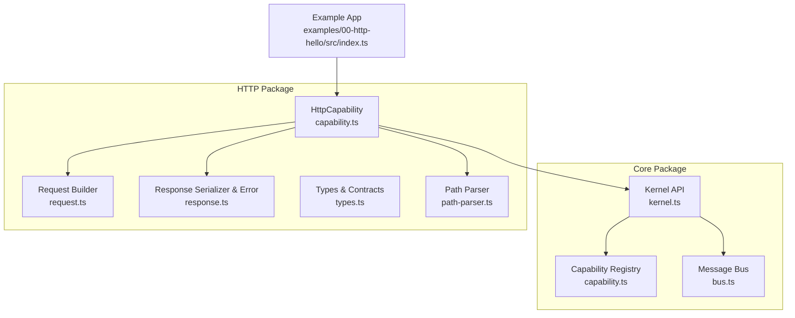
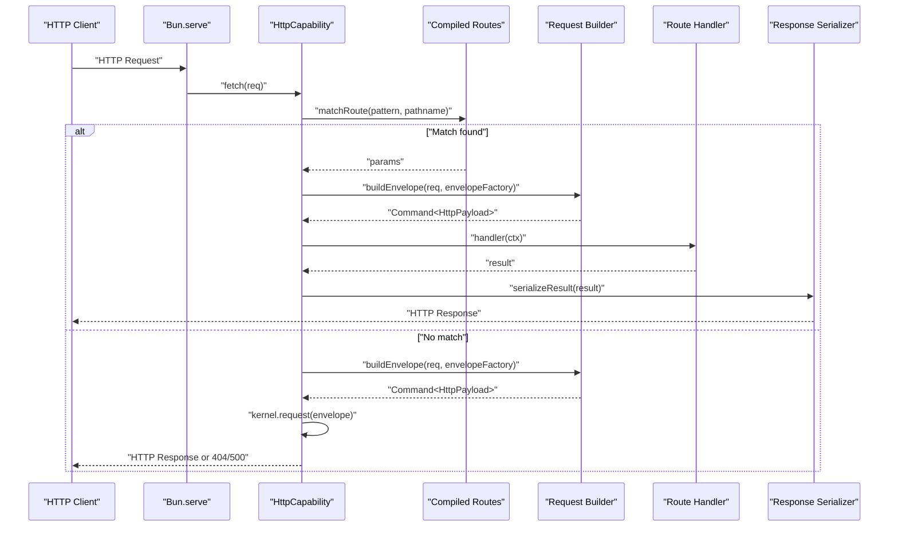
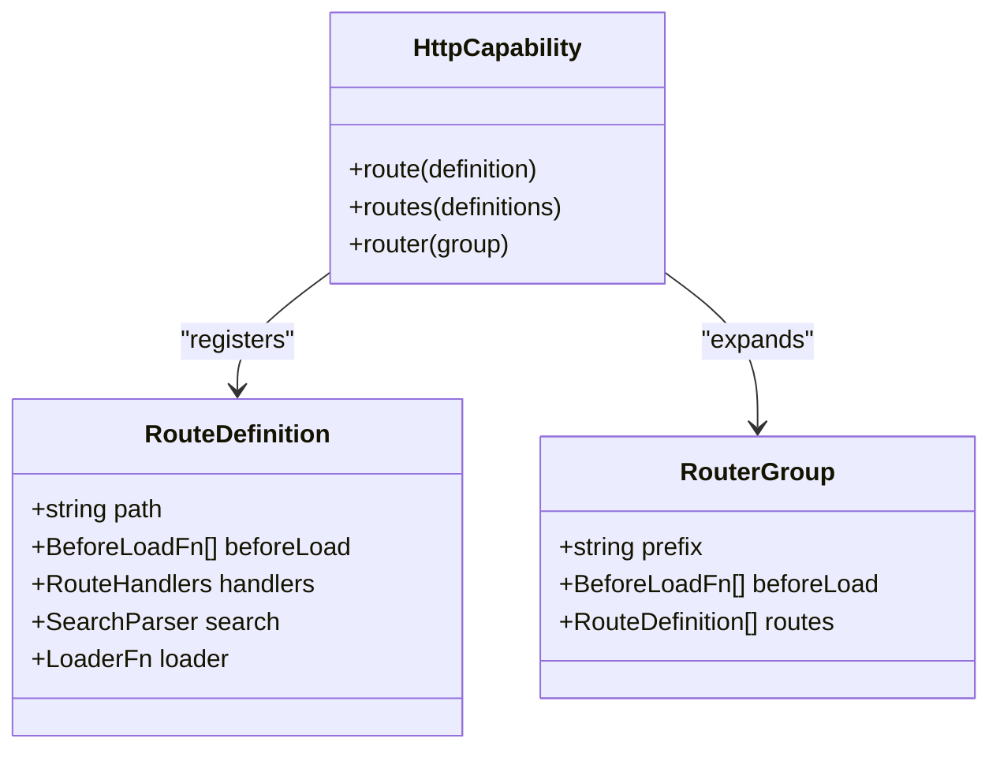
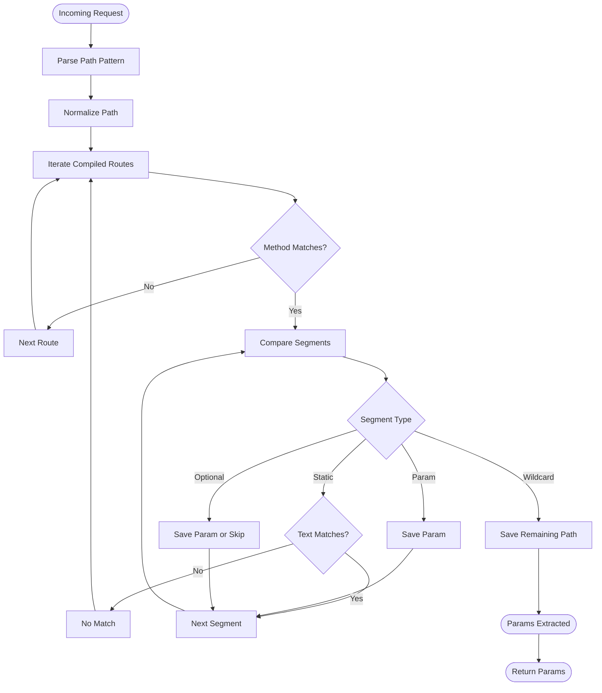
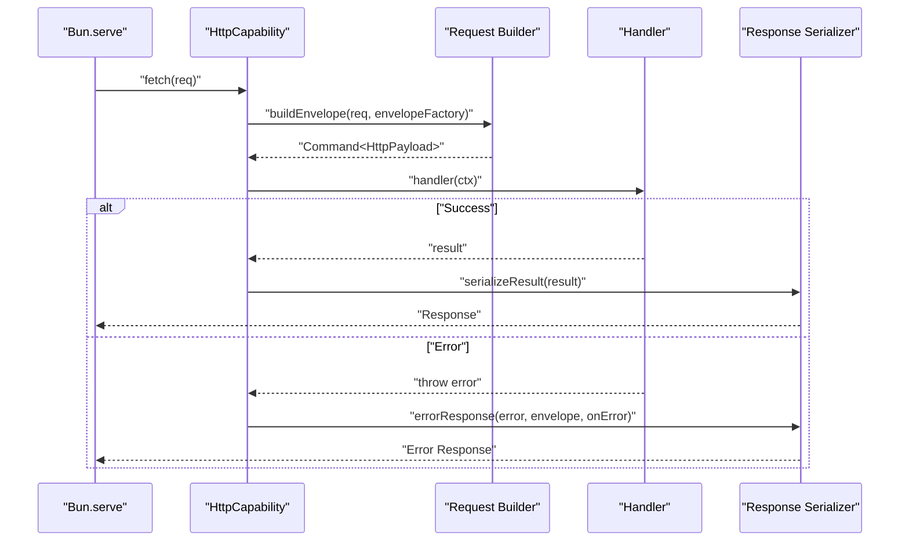
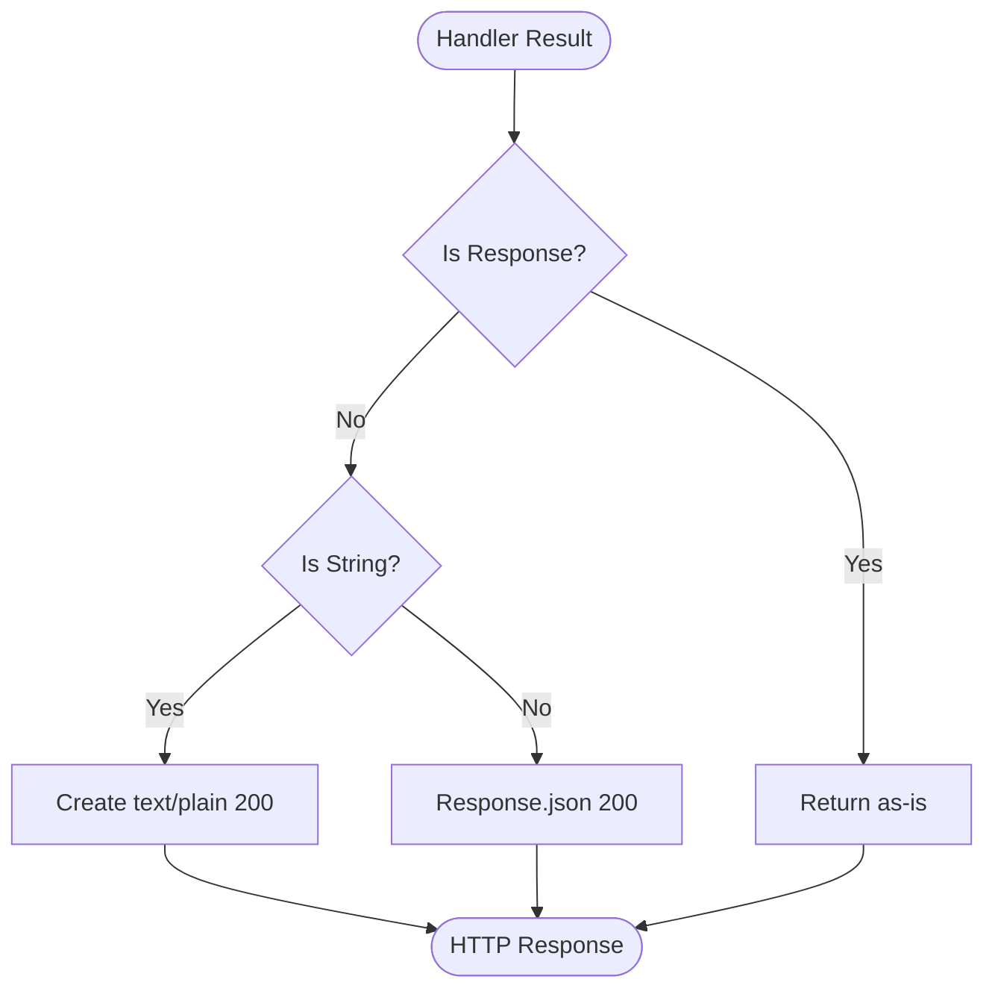
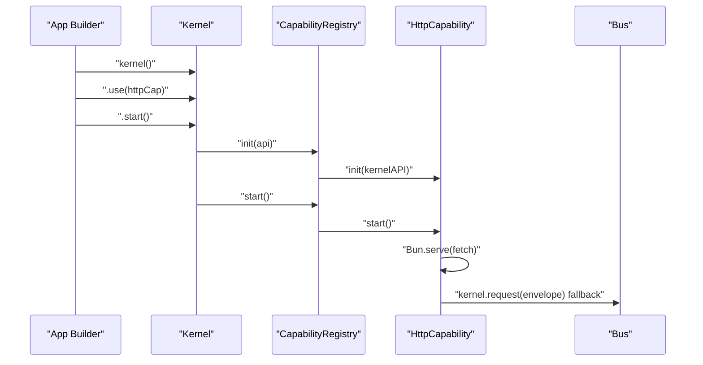
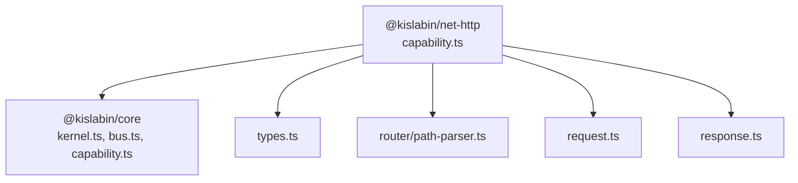

# HTTP Capability

<cite>
**Referenced Files in This Document**
- [README.md](file://README.md)
- [package.json](file://packages/net-http/package.json)
- [index.ts](file://packages/net-http/src/index.ts)
- [capability.ts](file://packages/net-http/src/capability.ts)
- [request.ts](file://packages/net-http/src/request.ts)
- [response.ts](file://packages/net-http/src/response.ts)
- [types.ts](file://packages/net-http/src/types.ts)
- [path-parser.ts](file://packages/net-http/src/router/path-parser.ts)
- [kernel.ts](file://packages/core/src/kernel.ts)
- [capability.ts](file://packages/core/src/capability.ts)
- [bus.ts](file://packages/core/src/bus.ts)
- [index.ts](file://examples/00-http-hello/src/index.ts)
</cite>

## Table of Contents
1. [Introduction](#introduction)
2. [Project Structure](#project-structure)
3. [Core Components](#core-components)
4. [Architecture Overview](#architecture-overview)
5. [Detailed Component Analysis](#detailed-component-analysis)
6. [Dependency Analysis](#dependency-analysis)
7. [Performance Considerations](#performance-considerations)
8. [Troubleshooting Guide](#troubleshooting-guide)
9. [Conclusion](#conclusion)
10. [Appendices](#appendices)

## Introduction
This document explains the HTTP capability implementation for the @kislabin system. It covers how HTTP requests are transformed into messages and routed through the kernel’s message bus, the fluent router interface for defining routes with path parameters and method handlers, the route grouping mechanism, the request processing pipeline, response serialization and error handling, and how the HTTP capability integrates with the core kernel and capability registration process. Practical examples demonstrate building HTTP APIs using the fluent router interface.

## Project Structure
The HTTP capability is implemented as a separate package that depends on the core kernel. The capability exposes a fluent API for registering routes and integrates with Bun.serve to handle incoming HTTP requests. The core kernel manages lifecycle, capability registration, and the message bus.

**Diagram sources**
- [kernel.ts:265-353](file://packages/core/src/kernel.ts#L265-L353)
- [capability.ts:115-240](file://packages/core/src/capability.ts#L115-L240)
- [bus.ts:34-206](file://packages/core/src/bus.ts#L34-L206)
- [capability.ts:92-222](file://packages/net-http/src/capability.ts#L92-L222)
- [request.ts:22-37](file://packages/net-http/src/request.ts#L22-L37)
- [response.ts:8-39](file://packages/net-http/src/response.ts#L8-L39)
- [types.ts:5-194](file://packages/net-http/src/types.ts#L5-L194)
- [path-parser.ts:80-83](file://packages/net-http/src/router/path-parser.ts#L80-L83)
- [index.ts:1-12](file://examples/00-http-hello/src/index.ts#L1-L12)

**Section sources**
- [README.md:100-142](file://README.md#L100-L142)
- [package.json:1-25](file://packages/net-http/package.json#L1-L25)
- [kernel.ts:265-353](file://packages/core/src/kernel.ts#L265-L353)
- [capability.ts:115-240](file://packages/core/src/capability.ts#L115-L240)
- [capability.ts:92-222](file://packages/net-http/src/capability.ts#L92-L222)
- [index.ts:1-12](file://examples/00-http-hello/src/index.ts#L1-L12)

## Core Components
- HttpCapability: A capability that registers routes, compiles them during initialization, and serves HTTP requests via Bun.serve. It translates HTTP requests into command envelopes and delegates to handlers or the kernel bus for processing.
- Request Builder: Converts a native Request into a typed command envelope with HTTP metadata (method, path, headers, body).
- Response Serializer: Serializes handler results into HTTP responses, supporting strings, JSON, and raw Response objects. Provides error handling with customizable error responses and default fallbacks.
- Types: Defines contracts for configuration, route definitions, handlers, loaders, beforeLoad guards, and router groups.
- Path Parser: Parses path patterns into typed segments and validates/normalizes them for efficient matching.

**Section sources**
- [capability.ts:19-32](file://packages/net-http/src/capability.ts#L19-L32)
- [capability.ts:92-222](file://packages/net-http/src/capability.ts#L92-L222)
- [request.ts:22-37](file://packages/net-http/src/request.ts#L22-L37)
- [response.ts:8-39](file://packages/net-http/src/response.ts#L8-L39)
- [types.ts:5-194](file://packages/net-http/src/types.ts#L5-L194)
- [path-parser.ts:80-83](file://packages/net-http/src/router/path-parser.ts#L80-L83)

## Architecture Overview
The HTTP capability participates in the kernel’s lifecycle. During init, it compiles declared routes into an internal structure. During start, it launches a Bun.serve server that:
- Matches the incoming HTTP request against compiled routes.
- Builds an envelope from the request.
- Executes the matched handler and serializes the result.
- Falls back to the kernel bus for request-style processing if no route matches.

**Diagram sources**
- [capability.ts:120-163](file://packages/net-http/src/capability.ts#L120-L163)
- [capability.ts:38-72](file://packages/net-http/src/capability.ts#L38-L72)
- [request.ts:22-37](file://packages/net-http/src/request.ts#L22-L37)
- [response.ts:8-19](file://packages/net-http/src/response.ts#L8-L19)

## Detailed Component Analysis

### Fluent Router Interface and Route Definition
The HTTP capability exposes a fluent API to register routes:
- route(definition): Adds a single route definition.
- routes(definitions): Bulk route registration.
- router(group): Registers a group of routes with a shared prefix and cascading beforeLoad guards.

RouteDefinition supports:
- path: Path pattern with static segments, parameters (:id), optional segments (:id?), and wildcard (*).
- handlers: Method-specific handlers (get, post, put, delete, patch).
- beforeLoad: Guards executed before the handler.
- search: Optional parser for query parameters.
- loader: Optional data-fetching function invoked before handlers.

RouterGroup allows prefixing routes and combining shared beforeLoad guards across multiple routes.

**Diagram sources**
- [capability.ts:19-23](file://packages/net-http/src/capability.ts#L19-L23)
- [capability.ts:190-220](file://packages/net-http/src/capability.ts#L190-L220)
- [types.ts:46-61](file://packages/net-http/src/types.ts#L46-L61)
- [types.ts:189-193](file://packages/net-http/src/types.ts#L189-L193)

**Section sources**
- [capability.ts:190-220](file://packages/net-http/src/capability.ts#L190-L220)
- [types.ts:46-61](file://packages/net-http/src/types.ts#L46-L61)
- [types.ts:189-193](file://packages/net-http/src/types.ts#L189-L193)

### Path Parameter Extraction and Route Matching
Routes are compiled by parsing path patterns into typed segments and matching incoming URLs at runtime. The matcher supports:
- Static segments
- Parameters (:id)
- Optional segments (:id?)
- Wildcards (*)

Matching ensures wildcard is last and enforces parameter naming rules and uniqueness.

**Diagram sources**
- [capability.ts:38-72](file://packages/net-http/src/capability.ts#L38-L72)
- [path-parser.ts:80-83](file://packages/net-http/src/router/path-parser.ts#L80-L83)
- [path-parser.ts:166-176](file://packages/net-http/src/router/path-parser.ts#L166-L176)
- [path-parser.ts:198-213](file://packages/net-http/src/router/path-parser.ts#L198-L213)

**Section sources**
- [capability.ts:38-72](file://packages/net-http/src/capability.ts#L38-L72)
- [path-parser.ts:80-83](file://packages/net-http/src/router/path-parser.ts#L80-L83)
- [path-parser.ts:166-176](file://packages/net-http/src/router/path-parser.ts#L166-L176)
- [path-parser.ts:198-213](file://packages/net-http/src/router/path-parser.ts#L198-L213)

### Request Processing Pipeline
The pipeline converts HTTP requests into envelopes and executes handlers:
1. Build envelope from Request (method, path, headers, body).
2. Match route by method and path.
3. Construct HandlerContext with params, query, request, context, and envelope.
4. Execute handler and serialize result.
5. On error, produce error response via errorResponse.

**Diagram sources**
- [capability.ts:128-163](file://packages/net-http/src/capability.ts#L128-L163)
- [request.ts:22-37](file://packages/net-http/src/request.ts#L22-L37)
- [response.ts:21-39](file://packages/net-http/src/response.ts#L21-L39)

**Section sources**
- [capability.ts:128-163](file://packages/net-http/src/capability.ts#L128-L163)
- [request.ts:22-37](file://packages/net-http/src/request.ts#L22-L37)
- [response.ts:21-39](file://packages/net-http/src/response.ts#L21-L39)

### Response Handling and Error Management
- serializeResult: Returns Response objects unchanged; strings become text/plain; others become JSON with 200 status.
- errorResponse: Uses a global onError callback if provided; otherwise returns 404 for NoHandlerError and 500 for other errors, with console logging for debugging.

**Diagram sources**
- [response.ts:8-19](file://packages/net-http/src/response.ts#L8-L19)

**Section sources**
- [response.ts:8-19](file://packages/net-http/src/response.ts#L8-L19)
- [response.ts:21-39](file://packages/net-http/src/response.ts#L21-L39)

### Integration with the Core Kernel and Capability Registration
- The HTTP capability implements the Capability interface with init/start/stop/dispose hooks.
- During init, it compiles routes and prepares the runtime.
- During start, it launches Bun.serve and registers the fetch handler.
- The kernel orchestrates capability lifecycle and exposes KernelAPI to capabilities.
- The kernel’s bus handles request-style messaging when routes do not match.

**Diagram sources**
- [kernel.ts:265-353](file://packages/core/src/kernel.ts#L265-L353)
- [capability.ts:194-240](file://packages/core/src/capability.ts#L194-L240)
- [capability.ts:102-179](file://packages/net-http/src/capability.ts#L102-L179)

**Section sources**
- [capability.ts:102-179](file://packages/net-http/src/capability.ts#L102-L179)
- [kernel.ts:265-353](file://packages/core/src/kernel.ts#L265-L353)
- [capability.ts:194-240](file://packages/core/src/capability.ts#L194-L240)
- [bus.ts:159-170](file://packages/core/src/bus.ts#L159-L170)

### Practical Examples: Building HTTP APIs with the Fluent Router
- Basic example: Declares a GET route with path parameter extraction and returns a structured result.
- Integration: Uses http() to configure port, route() to define endpoints, and kernel().use(app).start() to bootstrap the system.

**Section sources**
- [index.ts:1-12](file://examples/00-http-hello/src/index.ts#L1-L12)
- [capability.ts:74-91](file://packages/net-http/src/capability.ts#L74-L91)

## Dependency Analysis
- The HTTP capability depends on @kislabin/core for KernelAPI, envelope factories, and the message bus.
- It uses Bun.serve for HTTP transport and TypeScript types for type safety.
- The kernel manages capability lifecycle and message routing.

**Diagram sources**
- [capability.ts:8-12](file://packages/net-http/src/capability.ts#L8-L12)
- [package.json:16-18](file://packages/net-http/package.json#L16-L18)

**Section sources**
- [capability.ts:8-12](file://packages/net-http/src/capability.ts#L8-L12)
- [package.json:16-18](file://packages/net-http/package.json#L16-L18)

## Performance Considerations
- Route matching is linear over the number of compiled routes and per-route segments; keep route counts reasonable and avoid overly complex patterns.
- Body parsing is optimized for JSON and text; avoid unnecessary large payloads.
- Handlers should be lightweight; offload heavy work to background jobs or queues.
- Use loaders sparingly; cache frequently accessed data to reduce handler latency.
- Prefer exact matches for hot paths; wildcards incur additional checks.

## Troubleshooting Guide
Common issues and resolutions:
- No route matches: Expect a 404 Not Found; ensure method and path match exactly or register a fallback handler via the kernel bus.
- Handler errors: Errors are caught and mapped to 500 Internal Server Error; provide a global onError callback to customize responses and log details.
- Missing configuration: The kernel throws if required config is absent; set values via kernel().config() before start.
- Lifecycle errors: Dispose always runs after stop; verify cleanup logic in stop/dispose.

**Section sources**
- [capability.ts:155-162](file://packages/net-http/src/capability.ts#L155-L162)
- [response.ts:21-39](file://packages/net-http/src/response.ts#L21-L39)
- [kernel.ts:283-287](file://packages/core/src/kernel.ts#L283-L287)

## Conclusion
The HTTP capability cleanly integrates HTTP requests into the @kislabin message-driven architecture. It offers a fluent router interface for declaring routes with path parameters and method handlers, supports route grouping and beforeLoad guards, and provides robust request processing and response/error handling. By leveraging the kernel’s lifecycle and bus, it enables scalable, testable, and portable HTTP APIs.

## Appendices

### API Surface Summary
- Public exports: http, types for handlers, loaders, and router contracts.
- HttpConfig: port, hostname, global onError.
- RouteDefinition: path, beforeLoad, handlers, search, loader.
- RouterGroup: prefix, beforeLoad, routes.

**Section sources**
- [index.ts:5-19](file://packages/net-http/src/index.ts#L5-L19)
- [types.ts:5-194](file://packages/net-http/src/types.ts#L5-L194)