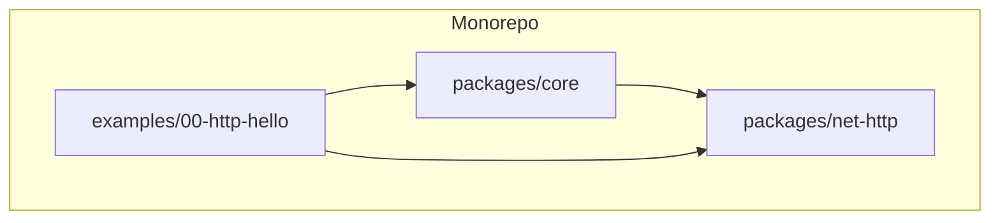
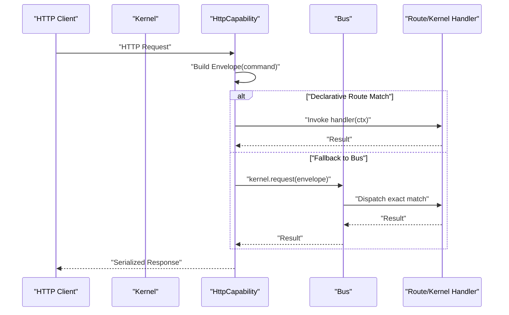
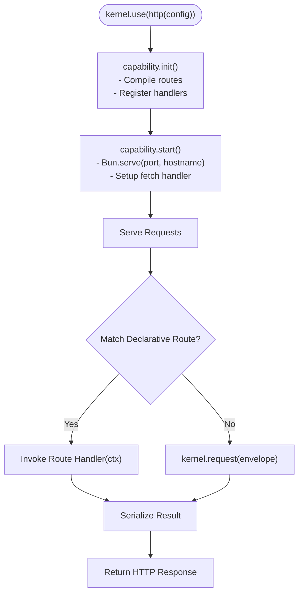
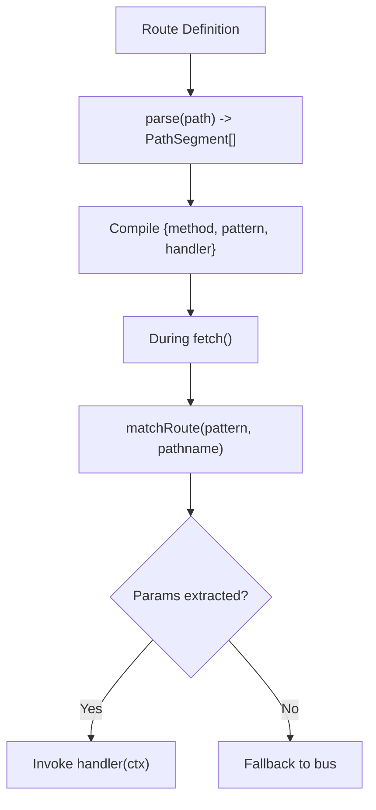
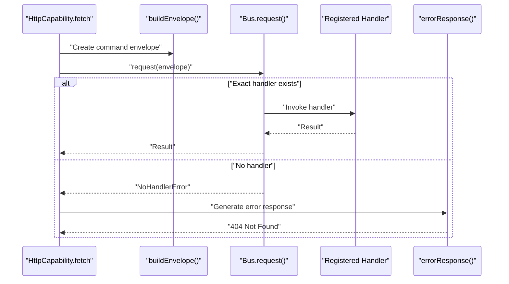
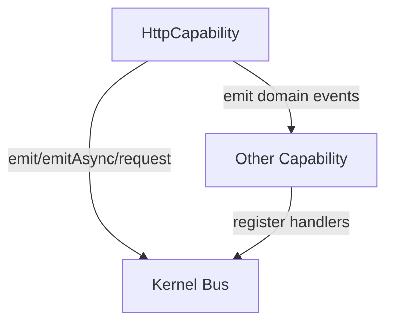
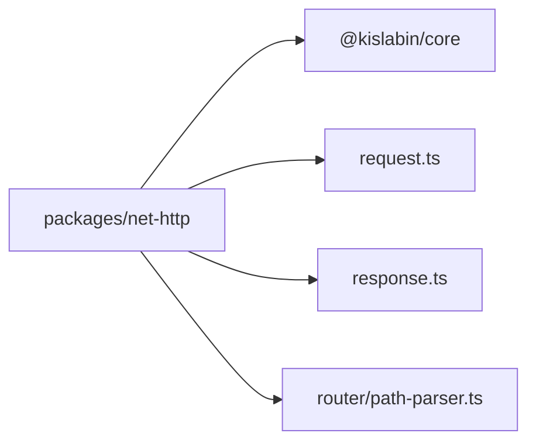

# Integration Patterns

<cite>
**Referenced Files in This Document**
- [README.md](file://README.md)
- [package.json](file://package.json)
- [packages/core/src/kernel.ts](file://packages/core/src/kernel.ts)
- [packages/core/src/capability.ts](file://packages/core/src/capability.ts)
- [packages/core/src/bus.ts](file://packages/core/src/bus.ts)
- [packages/core/src/message.ts](file://packages/core/src/message.ts)
- [packages/net-http/src/index.ts](file://packages/net-http/src/index.ts)
- [packages/net-http/src/capability.ts](file://packages/net-http/src/capability.ts)
- [packages/net-http/src/types.ts](file://packages/net-http/src/types.ts)
- [packages/net-http/src/request.ts](file://packages/net-http/src/request.ts)
- [packages/net-http/src/response.ts](file://packages/net-http/src/response.ts)
- [packages/net-http/src/router/path-parser.ts](file://packages/net-http/src/router/path-parser.ts)
- [examples/00-http-hello/src/index.ts](file://examples/00-http-hello/src/index.ts)
- [examples/00-http-hello/package.json](file://examples/00-http-hello/package.json)
</cite>

## Table of Contents
1. [Introduction](#introduction)
2. [Project Structure](#project-structure)
3. [Core Components](#core-components)
4. [Architecture Overview](#architecture-overview)
5. [Detailed Component Analysis](#detailed-component-analysis)
6. [Dependency Analysis](#dependency-analysis)
7. [Performance Considerations](#performance-considerations)
8. [Troubleshooting Guide](#troubleshooting-guide)
9. [Conclusion](#conclusion)
10. [Appendices](#appendices)

## Introduction
This document explains HTTP capability integration patterns and best practices for building applications with the @kislabin kernel. It covers how to register the HTTP capability using kernel.use(), the capability lifecycle, integration with bus-based message handling for routes not declared declaratively, configuration options (port, hostname, error handling callbacks), the relationship between HTTP routes and kernel message handlers, combining multiple capabilities in a single kernel, and production deployment considerations.

## Project Structure
The repository is organized as a monorepo with two primary packages:
- @kislabin/core: minimal kernel implementing messaging, lifecycle, and capability orchestration
- @kislabin/net-http: HTTP capability built on Bun.serve, translating HTTP requests to kernel messages and responses back to HTTP

Key areas:
- Core kernel and messaging primitives
- Capability lifecycle and registry
- HTTP capability with declarative routing and fallback to bus-based routing
- Example application demonstrating HTTP capability usage

**Diagram sources**
- [package.json:1-29](file://package.json#L1-L29)
- [examples/00-http-hello/package.json:1-27](file://examples/00-http-hello/package.json#L1-L27)

**Section sources**
- [README.md:100-142](file://README.md#L100-L142)
- [package.json:1-29](file://package.json#L1-L29)
- [examples/00-http-hello/package.json:1-27](file://examples/00-http-hello/package.json#L1-L27)

## Core Components
- Kernel and KernelAPI: entry point, configuration, lifecycle signals, and message bus access
- Capability and CapabilityRegistry: isolated subsystems with explicit lifecycle and dependency ordering
- Bus: message dispatcher supporting broadcast and point-to-point request patterns
- Message primitives: Envelope, kinds (command, event, query, signal), and EnvelopeFactory
- HTTP capability: Bun.serve-backed capability with declarative routing and fallback to kernel handlers

**Section sources**
- [packages/core/src/kernel.ts:136-184](file://packages/core/src/kernel.ts#L136-L184)
- [packages/core/src/capability.ts:28-99](file://packages/core/src/capability.ts#L28-L99)
- [packages/core/src/bus.ts:24-214](file://packages/core/src/bus.ts#L24-L214)
- [packages/core/src/message.ts:11-164](file://packages/core/src/message.ts#L11-L164)
- [packages/net-http/src/capability.ts:14-23](file://packages/net-http/src/capability.ts#L14-L23)

## Architecture Overview
The HTTP capability integrates with the kernel through a strict contract:
- Registration: kernel.use(httpCapability) registers the capability and its dependencies
- Initialization: capability.init receives KernelAPI, validates config, and registers handlers
- Startup: capability.start opens the HTTP server via Bun.serve
- Runtime: incoming HTTP requests are translated into Envelope commands and dispatched to either:
  - Declarative route handlers (compiled during init)
  - Kernel handlers via kernel.request (bus-based routing)
- Shutdown: capability.stop drains connections gracefully, capability.dispose releases resources

**Diagram sources**
- [packages/net-http/src/capability.ts:120-164](file://packages/net-http/src/capability.ts#L120-L164)
- [packages/net-http/src/request.ts:22-37](file://packages/net-http/src/request.ts#L22-L37)
- [packages/net-http/src/response.ts:8-39](file://packages/net-http/src/response.ts#L8-L39)
- [packages/core/src/bus.ts:159-170](file://packages/core/src/bus.ts#L159-L170)

## Detailed Component Analysis

### HTTP Capability Lifecycle and Registration
- Registration: Use kernel.use(http(config)) to register the HTTP capability. The capability is initialized in dependency order and started after kernel initialization completes.
- Configuration: The HTTP capability reads port and hostname from kernel.config and uses an optional global error handler callback.
- Declarative routing: The http() factory exposes route(), routes(), and router() APIs to declare routes before startup.
- Runtime behavior: During start(), Bun.serve is configured with fetch handler that:
  - Attempts to match declarative routes (compiled in init)
  - Falls back to kernel.request for bus-based routing
  - Serializes handler results or error responses

**Diagram sources**
- [packages/net-http/src/capability.ts:92-179](file://packages/net-http/src/capability.ts#L92-L179)
- [packages/net-http/src/types.ts:5-9](file://packages/net-http/src/types.ts#L5-L9)

**Section sources**
- [packages/net-http/src/capability.ts:92-179](file://packages/net-http/src/capability.ts#L92-L179)
- [packages/net-http/src/types.ts:5-9](file://packages/net-http/src/types.ts#L5-L9)
- [packages/core/src/kernel.ts:204-245](file://packages/core/src/kernel.ts#L204-L245)

### Declarative Routing and Path Matching
- Route definition: Each route declares a path pattern, optional beforeLoad guards, and per-method handlers.
- Path parsing: Paths are normalized and parsed into typed segments (static, param, optional, wildcard).
- Matching: matchRoute compares the request pathname against compiled patterns and extracts params.
- Router groups: Prefix and shared beforeLoad are expanded into individual routes.

**Diagram sources**
- [packages/net-http/src/capability.ts:27-72](file://packages/net-http/src/capability.ts#L27-L72)
- [packages/net-http/src/router/path-parser.ts:80-83](file://packages/net-http/src/router/path-parser.ts#L80-L83)
- [packages/net-http/src/router/path-parser.ts:126-176](file://packages/net-http/src/router/path-parser.ts#L126-L176)

**Section sources**
- [packages/net-http/src/types.ts:46-61](file://packages/net-http/src/types.ts#L46-L61)
- [packages/net-http/src/router/path-parser.ts:80-122](file://packages/net-http/src/router/path-parser.ts#L80-L122)
- [packages/net-http/src/capability.ts:27-72](file://packages/net-http/src/capability.ts#L27-L72)

### Bus-Based Message Handling for Undeclared Routes
- Envelope creation: buildEnvelope transforms HTTP requests into command envelopes with a type derived from method and pathname.
- Dispatch modes:
  - emit/emitAsync: broadcast to exact and wildcard subscribers
  - request: point-to-point to the first registered handler for the exact envelope type
- Error handling: errorResponse maps NoHandlerError to 404 and logs other errors, allowing a global onError callback to override defaults.

**Diagram sources**
- [packages/net-http/src/request.ts:22-37](file://packages/net-http/src/request.ts#L22-L37)
- [packages/core/src/bus.ts:159-170](file://packages/core/src/bus.ts#L159-L170)
- [packages/net-http/src/response.ts:21-39](file://packages/net-http/src/response.ts#L21-L39)

**Section sources**
- [packages/net-http/src/request.ts:22-37](file://packages/net-http/src/request.ts#L22-L37)
- [packages/core/src/bus.ts:159-170](file://packages/core/src/bus.ts#L159-L170)
- [packages/net-http/src/response.ts:21-39](file://packages/net-http/src/response.ts#L21-L39)

### Relationship Between HTTP Routes and Kernel Message Handlers
- Declarative routes produce handler invocations with a structured context (params, query, request, context).
- Undeclared routes are translated into command envelopes and routed via kernel.request to handlers registered globally or by other capabilities.
- Both pathways return serializable results; the HTTP capability converts them into HTTP responses.

**Section sources**
- [packages/net-http/src/types.ts:94-112](file://packages/net-http/src/types.ts#L94-L112)
- [packages/net-http/src/response.ts:8-19](file://packages/net-http/src/response.ts#L8-L19)
- [packages/core/src/bus.ts:159-170](file://packages/core/src/bus.ts#L159-L170)

### Configuration Options
- HttpConfig:
  - port: required number
  - hostname: optional string
  - onError: optional global error handler callback
- Accessing configuration: capabilities read via kernel.config(key) or kernel.config(key, fallback)

**Section sources**
- [packages/net-http/src/types.ts:5-9](file://packages/net-http/src/types.ts#L5-L9)
- [packages/core/src/kernel.ts:119-122](file://packages/core/src/kernel.ts#L119-L122)

### Combining HTTP Capability with Other Capabilities
- Dependencies: Declare dependencies in the Capability.dependencies array so the registry initializes them in topological order.
- Cross-capability communication: Use kernel.api.emit()/emitAsync()/request() to send messages between capabilities.
- Example pattern: HTTP capability emits domain events, another capability handles them and persists data; HTTP route handlers can request current state via kernel.request.

**Diagram sources**
- [packages/core/src/bus.ts:34-214](file://packages/core/src/bus.ts#L34-L214)
- [packages/core/src/capability.ts:101-241](file://packages/core/src/capability.ts#L101-L241)

**Section sources**
- [packages/core/src/capability.ts:101-241](file://packages/core/src/capability.ts#L101-L241)
- [packages/core/src/bus.ts:34-214](file://packages/core/src/bus.ts#L34-L214)

### Example: Minimal HTTP Application
- The example demonstrates registering an HTTP capability with a single route and starting the kernel.

**Section sources**
- [examples/00-http-hello/src/index.ts:1-12](file://examples/00-http-hello/src/index.ts#L1-L12)
- [examples/00-http-hello/package.json:15-17](file://examples/00-http-hello/package.json#L15-L17)

## Dependency Analysis
- Internal dependencies:
  - @kislabin/net-http depends on @kislabin/core for KernelAPI, Bus, EnvelopeFactory, and messaging primitives
  - HTTP capability depends on request.ts, response.ts, and router/path-parser.ts for request translation, response serialization, and path matching
- External dependencies:
  - Bun runtime for HTTP server (Bun.serve)
  - TypeScript for type safety

**Diagram sources**
- [packages/net-http/src/index.ts:5-19](file://packages/net-http/src/index.ts#L5-L19)
- [packages/net-http/src/capability.ts:8-12](file://packages/net-http/src/capability.ts#L8-L12)

**Section sources**
- [packages/net-http/src/index.ts:5-19](file://packages/net-http/src/index.ts#L5-L19)
- [packages/net-http/src/capability.ts:8-12](file://packages/net-http/src/capability.ts#L8-L12)

## Performance Considerations
- Declarative routes compile patterns once during init, enabling fast runtime matching
- Request handling executes synchronously for broadcast emissions; async handlers are awaited for emitAsync
- Use kernel.request for deterministic, single-handler responses to avoid wildcard fan-out overhead
- Keep beforeLoad and loader functions lightweight to minimize latency for hot paths

[No sources needed since this section provides general guidance]

## Troubleshooting Guide
Common issues and resolutions:
- No handler registered for envelope type:
  - Symptom: 404 Not Found
  - Cause: No kernel handler registered for the generated envelope type
  - Resolution: Register a handler via kernel.handle() or define a declarative route
- Global error handler override:
  - Use onError(HttpError, Envelope) to customize error responses
- Logging and diagnostics:
  - Bus logs handler errors for async handlers and synchronous throws
  - HTTP capability logs server lifecycle events

**Section sources**
- [packages/net-http/src/response.ts:21-39](file://packages/net-http/src/response.ts#L21-L39)
- [packages/core/src/bus.ts:91-107](file://packages/core/src/bus.ts#L91-L107)
- [packages/net-http/src/capability.ts:171-174](file://packages/net-http/src/capability.ts#L171-L174)

## Conclusion
The @kislabin HTTP capability integrates seamlessly with the kernel’s messaging-first architecture. By registering the capability via kernel.use(), leveraging declarative routing for predictable paths, and falling back to bus-based routing for dynamic or domain-specific endpoints, applications achieve clean separation of concerns. Capabilities communicate via the kernel bus, enabling scalable, testable systems. Production readiness requires careful configuration of ports and hostnames, robust error handling, and graceful lifecycle management.

[No sources needed since this section summarizes without analyzing specific files]

## Appendices

### Best Practices for Multi-Capability Applications
- Define clear boundaries: each capability encapsulates a cohesive responsibility
- Use kernel.request for cross-capability queries and kernel.emit for notifications
- Keep route definitions explicit for hot paths; use bus-based handlers for dynamic or cross-cutting concerns
- Centralize configuration via kernel.config and avoid hardcoding values inside capabilities

[No sources needed since this section provides general guidance]

### Deployment Considerations
- Environment variables: set port and hostname via kernel.config or process environment
- Health checks: expose a simple endpoint handled by a dedicated capability
- Observability: rely on kernel lifecycle signals and capability-specific logging
- Graceful shutdown: ensure stop() drains work and dispose() releases resources

[No sources needed since this section provides general guidance]