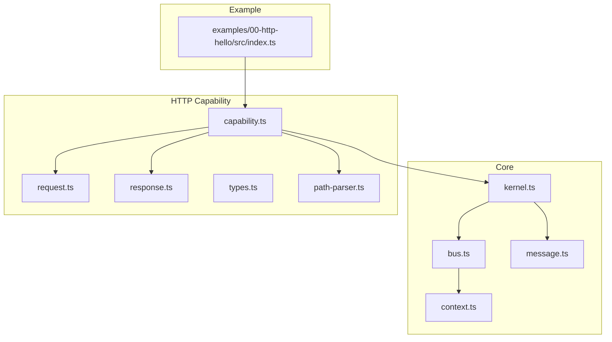
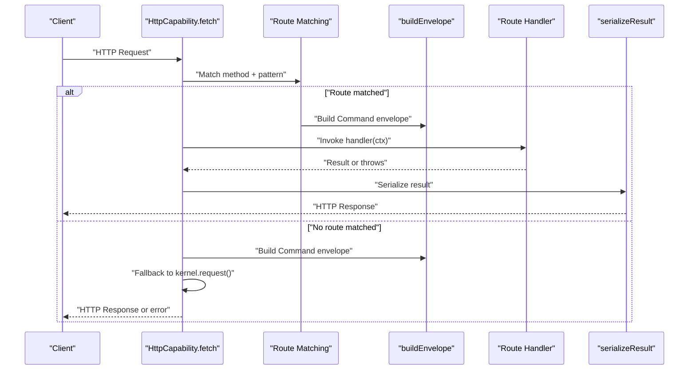
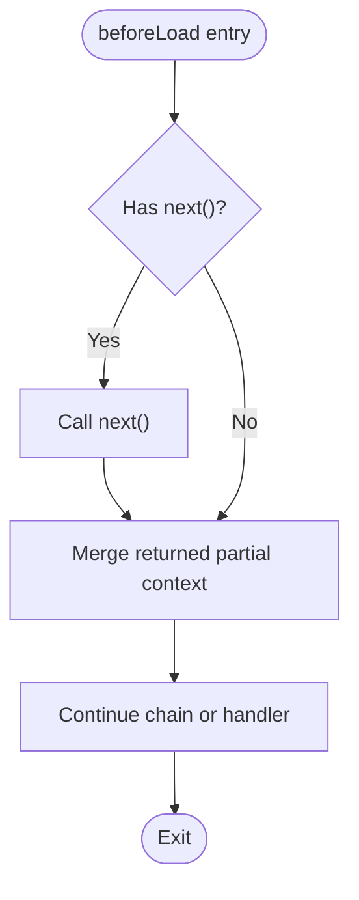
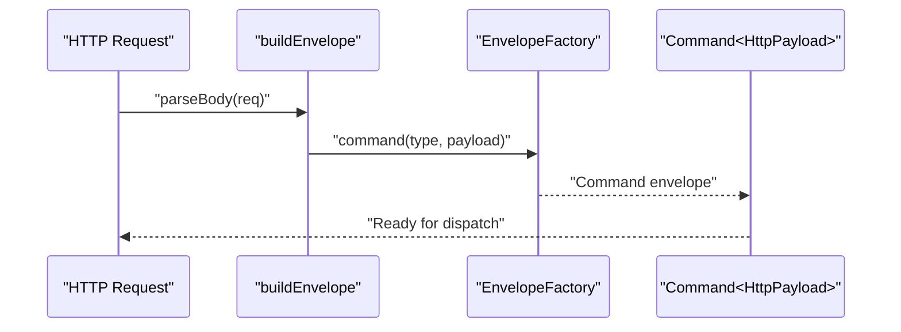
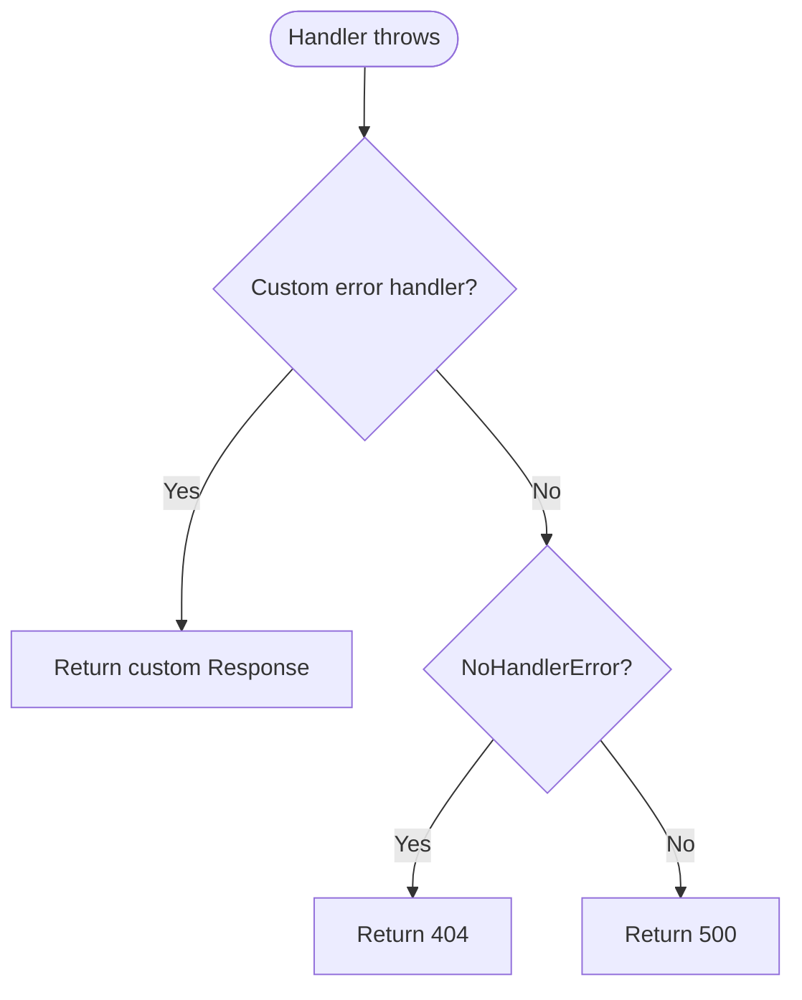
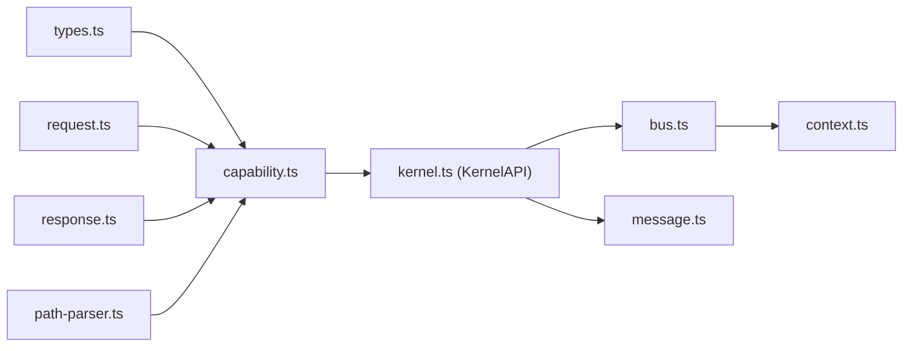

# Request Processing Pipeline

<cite>
**Referenced Files in This Document**
- [kernel.ts](file://packages/core/src/kernel.ts)
- [bus.ts](file://packages/core/src/bus.ts)
- [context.ts](file://packages/core/src/context.ts)
- [message.ts](file://packages/core/src/message.ts)
- [capability.ts](file://packages/net-http/src/capability.ts)
- [request.ts](file://packages/net-http/src/request.ts)
- [response.ts](file://packages/net-http/src/response.ts)
- [types.ts](file://packages/net-http/src/types.ts)
- [path-parser.ts](file://packages/net-http/src/router/path-parser.ts)
- [index.ts](file://examples/00-http-hello/src/index.ts)
</cite>

## Table of Contents
1. [Introduction](#introduction)
2. [Project Structure](#project-structure)
3. [Core Components](#core-components)
4. [Architecture Overview](#architecture-overview)
5. [Detailed Component Analysis](#detailed-component-analysis)
6. [Dependency Analysis](#dependency-analysis)
7. [Performance Considerations](#performance-considerations)
8. [Troubleshooting Guide](#troubleshooting-guide)
9. [Conclusion](#conclusion)

## Introduction
This document explains the HTTP request processing pipeline in the system. It covers the four-phase flow: route matching, envelope creation, handler execution, and response serialization. It also documents the beforeLoad guard system, the HandlerContext structure, and how HTTP requests are translated into kernel messages. Error handling and fallback mechanisms to bus-based routing are included, along with practical examples of middleware-like behavior using beforeLoad guards and loader functions.

## Project Structure
The HTTP capability is implemented as a separate package that integrates with the core kernel. The key files involved in the pipeline are:
- Core kernel and messaging primitives
- HTTP capability implementation
- Request parsing and response serialization
- Type definitions for routes, guards, loaders, and contexts



**Diagram sources**
- [kernel.ts:1-354](file://packages/core/src/kernel.ts#L1-L354)
- [bus.ts:1-214](file://packages/core/src/bus.ts#L1-L214)
- [context.ts:1-167](file://packages/core/src/context.ts#L1-L167)
- [message.ts:1-164](file://packages/core/src/message.ts#L1-L164)
- [capability.ts:1-223](file://packages/net-http/src/capability.ts#L1-L223)
- [request.ts:1-37](file://packages/net-http/src/request.ts#L1-L37)
- [response.ts:1-39](file://packages/net-http/src/response.ts#L1-L39)
- [types.ts:1-194](file://packages/net-http/src/types.ts#L1-L194)
- [path-parser.ts:1-213](file://packages/net-http/src/router/path-parser.ts#L1-L213)
- [index.ts:1-12](file://examples/00-http-hello/src/index.ts#L1-L12)

**Section sources**
- [kernel.ts:1-354](file://packages/core/src/kernel.ts#L1-L354)
- [capability.ts:1-223](file://packages/net-http/src/capability.ts#L1-L223)
- [request.ts:1-37](file://packages/net-http/src/request.ts#L1-L37)
- [response.ts:1-39](file://packages/net-http/src/response.ts#L1-L39)
- [types.ts:1-194](file://packages/net-http/src/types.ts#L1-L194)
- [path-parser.ts:1-213](file://packages/net-http/src/router/path-parser.ts#L1-L213)
- [index.ts:1-12](file://examples/00-http-hello/src/index.ts#L1-L12)

## Core Components
- Kernel and Bus: Central message routing and lifecycle management.
- EnvelopeFactory: Creates typed envelopes with automatic identifiers and timestamps.
- Context: Immutable execution context that flows through handlers, enabling state sharing and cancellation.
- HTTP Capability: Bridges HTTP requests to kernel messages and serializes handler results to HTTP responses.
- Request Builder: Converts HTTP Request into a Command envelope payload.
- Response Serializer: Translates handler results into HTTP responses and handles errors.

**Section sources**
- [kernel.ts:65-134](file://packages/core/src/kernel.ts#L65-L134)
- [bus.ts:34-206](file://packages/core/src/bus.ts#L34-L206)
- [context.ts:22-90](file://packages/core/src/context.ts#L22-L90)
- [message.ts:34-163](file://packages/core/src/message.ts#L34-L163)
- [capability.ts:92-222](file://packages/net-http/src/capability.ts#L92-L222)
- [request.ts:22-37](file://packages/net-http/src/request.ts#L22-L37)
- [response.ts:8-39](file://packages/net-http/src/response.ts#L8-L39)

## Architecture Overview
The HTTP pipeline transforms an incoming HTTP request into a kernel message, executes handlers, and returns an HTTP response. It supports:
- Declarative routes with path matching and method filtering
- beforeLoad guards for middleware-like behavior
- Loader functions for data fetching
- Fallback to bus-based routing when no route matches



**Diagram sources**
- [capability.ts:128-163](file://packages/net-http/src/capability.ts#L128-L163)
- [request.ts:22-37](file://packages/net-http/src/request.ts#L22-L37)
- [response.ts:8-19](file://packages/net-http/src/response.ts#L8-L19)

## Detailed Component Analysis

### Four-Phase Processing Flow
1. Route Matching
   - Methods and patterns are compiled during initialization.
   - Incoming requests are matched against method and path patterns.
   - Path parameters are extracted using a segment-based matcher.

2. Envelope Creation
   - HTTP request is transformed into a Command envelope with a type derived from method and path.
   - Payload includes method, path, URL, headers, parsed body, and the raw Request object.

3. Handler Execution
   - A HandlerContext is constructed with params, query, request, and an empty context bag.
   - Optional beforeLoad guards and loader are supported conceptually via the types contract.

4. Response Serialization
   - Results are serialized to Response objects.
   - Errors are handled with a customizable error handler and fallback to standard HTTP status codes.

**Section sources**
- [capability.ts:106-118](file://packages/net-http/src/capability.ts#L106-L118)
- [capability.ts:132-153](file://packages/net-http/src/capability.ts#L132-L153)
- [request.ts:22-37](file://packages/net-http/src/request.ts#L22-L37)
- [response.ts:8-39](file://packages/net-http/src/response.ts#L8-L39)

### beforeLoad Guard System and Middleware Behavior
The types define a beforeLoad mechanism that enables middleware-like behavior:
- beforeLoad functions receive a BeforeLoadContext with request, params, and accumulated context.
- They can return partial context to merge, throw to abort, or optionally call next() for wrapping middleware.
- Router groups support cascading beforeLoad arrays across nested routes.

Note: The current runtime implementation focuses on route matching and direct handler invocation. The beforeLoad and loader hooks are defined in types and can be integrated in future versions.



**Diagram sources**
- [types.ts:116-145](file://packages/net-http/src/types.ts#L116-L145)

**Section sources**
- [types.ts:46-83](file://packages/net-http/src/types.ts#L46-L83)
- [types.ts:116-145](file://packages/net-http/src/types.ts#L116-L145)
- [capability.ts:209-220](file://packages/net-http/src/capability.ts#L209-L220)

### HandlerContext Structure
HandlerContext carries all necessary information for handlers:
- params: extracted path parameters
- query: URL search parameters
- request: original HTTP request
- context: mutable bag for middleware to share state
- data: optional data from loader (conceptual)
- envelope: original envelope for accessing kernel bus

```mermaid
classDiagram
class HandlerContext {
+params : Record<string,string>
+query : URLSearchParams
+request : Request
+context : Record<string,unknown>
+data? : unknown
+envelope : {type : string,payload : HttpPayload}
}
```

**Diagram sources**
- [types.ts:94-112](file://packages/net-http/src/types.ts#L94-L112)

**Section sources**
- [types.ts:94-112](file://packages/net-http/src/types.ts#L94-L112)

### Request Envelope Construction
The request builder converts HTTP requests into kernel Command envelopes:
- Type is derived from HTTP method and path
- Payload includes method, path, URL, headers, and parsed body
- Body parsing respects method semantics and content type



**Diagram sources**
- [request.ts:10-20](file://packages/net-http/src/request.ts#L10-L20)
- [request.ts:22-37](file://packages/net-http/src/request.ts#L22-L37)
- [message.ts:137-163](file://packages/core/src/message.ts#L137-L163)

**Section sources**
- [request.ts:22-37](file://packages/net-http/src/request.ts#L22-L37)
- [message.ts:137-163](file://packages/core/src/message.ts#L137-L163)

### Error Handling and Fallback Mechanisms
- Route handlers can throw; errors are caught and mapped to HTTP responses.
- A global error handler can customize error responses.
- If no route matches, the pipeline falls back to kernel.request() for bus-based routing.
- No-handler errors are mapped to 404; other errors map to 500.



**Diagram sources**
- [response.ts:21-39](file://packages/net-http/src/response.ts#L21-L39)
- [bus.ts:159-170](file://packages/core/src/bus.ts#L159-L170)

**Section sources**
- [response.ts:21-39](file://packages/net-http/src/response.ts#L21-L39)
- [bus.ts:159-170](file://packages/core/src/bus.ts#L159-L170)

### Examples of Middleware-like Behavior
- Use beforeLoad guards to enforce authentication, validation, or to inject data into the context bag.
- Combine router groups to apply shared guards across multiple routes.
- Implement loaders to fetch data before handlers execute (conceptual; present in types).

These patterns enable flexible cross-cutting concerns similar to middleware stacks.

**Section sources**
- [types.ts:46-83](file://packages/net-http/src/types.ts#L46-L83)
- [types.ts:116-145](file://packages/net-http/src/types.ts#L116-L145)
- [capability.ts:209-220](file://packages/net-http/src/capability.ts#L209-L220)

## Dependency Analysis
The HTTP capability depends on core kernel APIs for envelope creation and bus-based fallback. The request builder and response serializer are tightly coupled to the HTTP capability’s lifecycle.



**Diagram sources**
- [capability.ts:8-12](file://packages/net-http/src/capability.ts#L8-L12)
- [request.ts:5-6](file://packages/net-http/src/request.ts#L5-L6)
- [response.ts:5](file://packages/net-http/src/response.ts#L5)
- [path-parser.ts:11-213](file://packages/net-http/src/router/path-parser.ts#L11-L213)
- [kernel.ts:65-134](file://packages/core/src/kernel.ts#L65-L134)
- [bus.ts:34-206](file://packages/core/src/bus.ts#L34-L206)
- [context.ts:22-90](file://packages/core/src/context.ts#L22-L90)
- [message.ts:34-163](file://packages/core/src/message.ts#L34-L163)

**Section sources**
- [capability.ts:8-12](file://packages/net-http/src/capability.ts#L8-L12)
- [kernel.ts:65-134](file://packages/core/src/kernel.ts#L65-L134)
- [bus.ts:34-206](file://packages/core/src/bus.ts#L34-L206)
- [context.ts:22-90](file://packages/core/src/context.ts#L22-L90)
- [message.ts:34-163](file://packages/core/src/message.ts#L34-L163)

## Performance Considerations
- Route compilation occurs once during capability initialization, minimizing runtime overhead.
- Path matching uses a segment-based algorithm optimized for static, param, optional, and wildcard segments.
- Body parsing avoids unnecessary work for methods without bodies and selects JSON/text parsing based on content type.
- Response serialization is lightweight, returning either the provided Response or JSON/text payloads.

[No sources needed since this section provides general guidance]

## Troubleshooting Guide
Common issues and resolutions:
- No route matched: Verify method and path pattern; ensure normalization and wildcard placement are correct.
- Handler throws: Implement a global error handler to return customized responses; otherwise, 500 is returned.
- No handler registered for envelope type: Falls back to bus-based routing; ensure handlers are registered via kernel.on() or route handlers.
- Body parsing failures: Non-JSON bodies are parsed as text; malformed JSON is handled gracefully.

**Section sources**
- [capability.ts:132-163](file://packages/net-http/src/capability.ts#L132-L163)
- [response.ts:21-39](file://packages/net-http/src/response.ts#L21-L39)
- [bus.ts:159-170](file://packages/core/src/bus.ts#L159-L170)

## Conclusion
The HTTP request processing pipeline cleanly translates HTTP requests into kernel messages, supports declarative routing with method and path matching, and provides a foundation for middleware-like behavior via beforeLoad guards. The design leverages the core kernel bus for observability and extensibility, while response serialization and error handling ensure robust HTTP outcomes. Future enhancements can integrate loader functions and expand the beforeLoad system to full middleware chains.