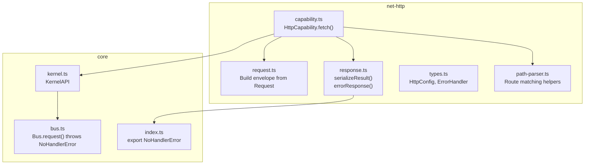
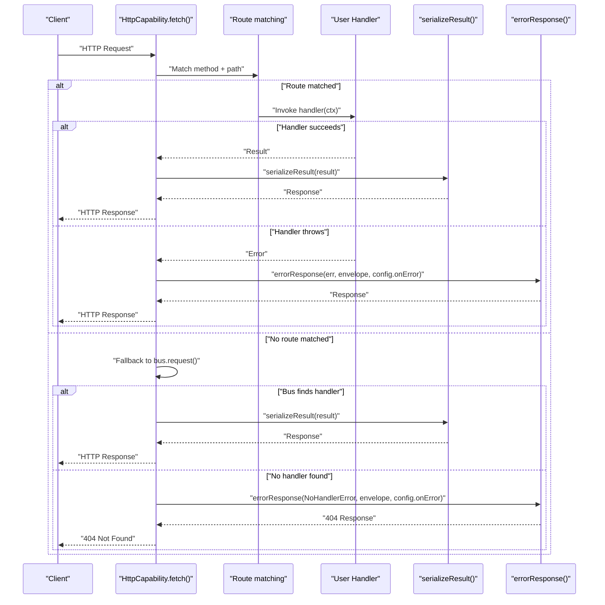
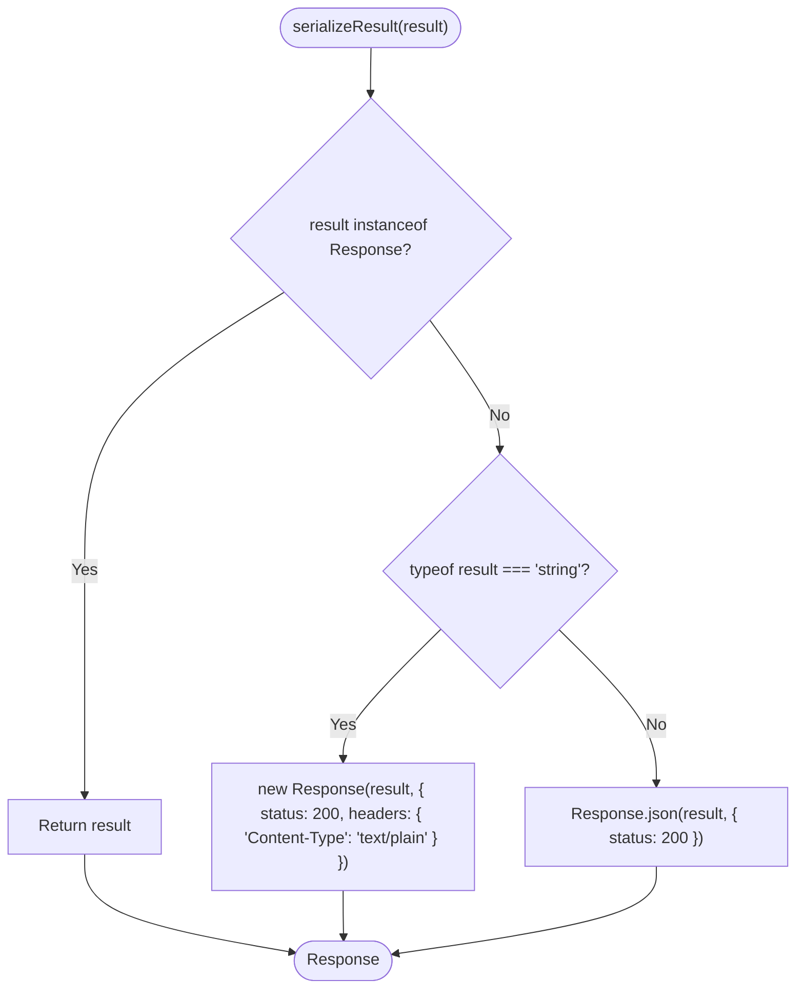
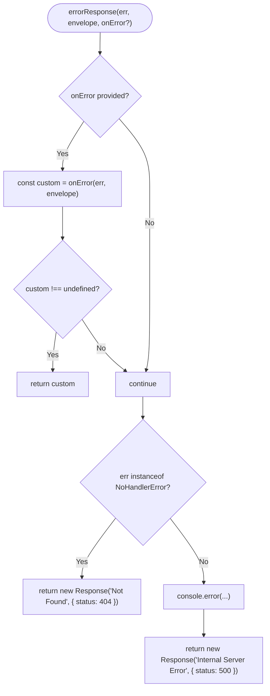
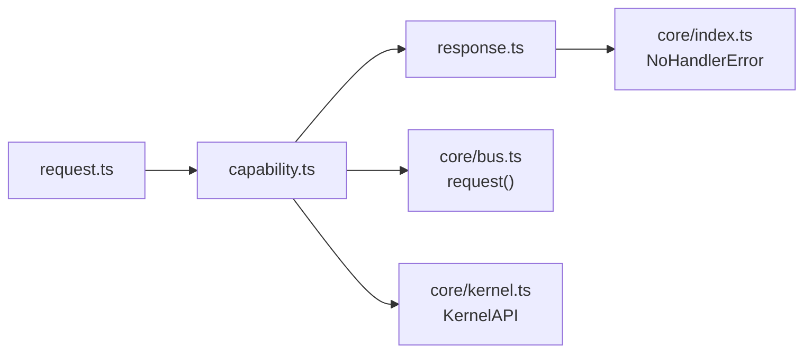

# Response Handling

<cite>
**Referenced Files in This Document**
- [response.ts](file://packages/net-http/src/response.ts)
- [capability.ts](file://packages/net-http/src/capability.ts)
- [request.ts](file://packages/net-http/src/request.ts)
- [types.ts](file://packages/net-http/src/types.ts)
- [kernel.ts](file://packages/core/src/kernel.ts)
- [bus.ts](file://packages/core/src/bus.ts)
- [index.ts](file://packages/core/src/index.ts)
- [path-parser.ts](file://packages/net-http/src/router/path-parser.ts)
- [index.ts](file://examples/00-http-hello/src/index.ts)
</cite>

## Table of Contents
1. [Introduction](#introduction)
2. [Project Structure](#project-structure)
3. [Core Components](#core-components)
4. [Architecture Overview](#architecture-overview)
5. [Detailed Component Analysis](#detailed-component-analysis)
6. [Dependency Analysis](#dependency-analysis)
7. [Performance Considerations](#performance-considerations)
8. [Troubleshooting Guide](#troubleshooting-guide)
9. [Conclusion](#conclusion)

## Introduction
This document explains HTTP response handling in the framework, focusing on how handler results are serialized into HTTP responses, how errors are generated and formatted, and how custom error handling integrates with the configuration. It covers supported return types (primitives, objects, promises, and special response objects), content-type detection, body serialization, header management, and response customization. It also documents performance considerations and provides examples of successful responses, error scenarios, and custom response objects.

## Project Structure
The HTTP response pipeline spans two packages:
- net-http: request parsing, route matching, handler invocation, and response serialization/error handling
- core: kernel, message bus, and error types used by net-http

**Diagram sources**
- [capability.ts:128-163](file://packages/net-http/src/capability.ts#L128-L163)
- [request.ts:22-37](file://packages/net-http/src/request.ts#L22-L37)
- [response.ts:8-38](file://packages/net-http/src/response.ts#L8-L38)
- [types.ts:5-14](file://packages/net-http/src/types.ts#L5-L14)
- [path-parser.ts:38-72](file://packages/net-http/src/router/path-parser.ts#L38-L72)
- [kernel.ts:272-290](file://packages/core/src/kernel.ts#L272-L290)
- [bus.ts:159-170](file://packages/core/src/bus.ts#L159-L170)
- [index.ts:10](file://packages/core/src/index.ts#L10)

**Section sources**
- [capability.ts:128-163](file://packages/net-http/src/capability.ts#L128-L163)
- [request.ts:22-37](file://packages/net-http/src/request.ts#L22-L37)
- [response.ts:8-38](file://packages/net-http/src/response.ts#L8-L38)
- [types.ts:5-14](file://packages/net-http/src/types.ts#L5-L14)
- [kernel.ts:272-290](file://packages/core/src/kernel.ts#L272-L290)
- [bus.ts:159-170](file://packages/core/src/bus.ts#L159-L170)
- [index.ts:10](file://packages/core/src/index.ts#L10)

## Core Components
- serializeResult(result): Converts handler return values into a Response
  - Returns the input if it is already a Response
  - Wraps strings as text/plain with status 200
  - Uses JSON serialization for all other values with status 200
- errorResponse(error, envelope, onError?): Generates HTTP error responses
  - Invokes a custom ErrorHandler if configured
  - Treats NoHandlerError as 404 Not Found
  - Logs unexpected errors and returns 500 Internal Server Error
- HttpConfig.onError: Optional global error handler override
- Route matching and handler invocation: net-http compiles routes and executes handlers, then serializes results or error responses

**Section sources**
- [response.ts:8-38](file://packages/net-http/src/response.ts#L8-L38)
- [types.ts:5-14](file://packages/net-http/src/types.ts#L5-L14)
- [capability.ts:128-163](file://packages/net-http/src/capability.ts#L128-L163)

## Architecture Overview
The HTTP request-to-response flow:

**Diagram sources**
- [capability.ts:128-163](file://packages/net-http/src/capability.ts#L128-L163)
- [response.ts:8-38](file://packages/net-http/src/response.ts#L8-L38)
- [bus.ts:159-170](file://packages/core/src/bus.ts#L159-L170)

## Detailed Component Analysis

### Result Serialization
serializeResult handles multiple return types:
- Response: returned unchanged
- string: wrapped as text/plain with status 200
- other values: serialized as JSON with status 200

**Diagram sources**
- [response.ts:8-19](file://packages/net-http/src/response.ts#L8-L19)

**Section sources**
- [response.ts:8-19](file://packages/net-http/src/response.ts#L8-L19)

### Error Response Generation
errorResponse follows a prioritized strategy:
- If a custom ErrorHandler is provided, call it and return its Response if non-empty
- If the error is NoHandlerError, return 404 Not Found
- Otherwise, log the error and return 500 Internal Server Error

**Diagram sources**
- [response.ts:21-38](file://packages/net-http/src/response.ts#L21-L38)
- [bus.ts:208-209](file://packages/core/src/bus.ts#L208-L209)

**Section sources**
- [response.ts:21-38](file://packages/net-http/src/response.ts#L21-L38)
- [bus.ts:159-170](file://packages/core/src/bus.ts#L159-L170)
- [index.ts:10](file://packages/core/src/index.ts#L10)

### Content-Type Detection and Body Serialization
- Text bodies: strings are sent as text/plain with status 200
- JSON bodies: all other values are serialized to JSON with status 200
- Headers: serializeResult sets Content-Type appropriately for each case; no additional headers are added by default

**Section sources**
- [response.ts:11-18](file://packages/net-http/src/response.ts#L11-L18)

### Header Management
- serializeResult does not add custom headers beyond Content-Type
- errorResponse returns generic messages with status codes only
- To set custom headers, return a Response object from your handler

**Section sources**
- [response.ts:11-18](file://packages/net-http/src/response.ts#L11-L18)
- [response.ts:32-37](file://packages/net-http/src/response.ts#L32-L37)

### Returning HTTP-Specific Responses
To customize status codes, headers, or body format, return a Response object directly from your handler. The serializer will pass it through unchanged.

**Section sources**
- [response.ts:9](file://packages/net-http/src/response.ts#L9)

### Route Matching and Handler Invocation
- Routes are compiled during init() and matched against incoming requests
- On match, the handler receives a context with params, query, request, and envelope
- Results are serialized; errors are handled via errorResponse

**Section sources**
- [capability.ts:106-118](file://packages/net-http/src/capability.ts#L106-L118)
- [capability.ts:128-163](file://packages/net-http/src/capability.ts#L128-L163)
- [path-parser.ts:38-72](file://packages/net-http/src/router/path-parser.ts#L38-L72)

### Example: Successful Response
- A handler returns an object
- serializeResult converts it to JSON with status 200

**Section sources**
- [response.ts:18](file://packages/net-http/src/response.ts#L18)
- [index.ts:8](file://examples/00-http-hello/src/index.ts#L8)

### Example: Error Scenario
- A handler throws an error
- errorResponse returns 500 Internal Server Error after logging

**Section sources**
- [response.ts:36-37](file://packages/net-http/src/response.ts#L36-L37)

### Example: Custom Error Handler
- Configure onError in HttpConfig
- errorResponse delegates to onError first; if it returns a Response, that is used

**Section sources**
- [types.ts:5-9](file://packages/net-http/src/types.ts#L5-L9)
- [response.ts:27-29](file://packages/net-http/src/response.ts#L27-L29)

## Dependency Analysis
- net-http depends on core for:
  - NoHandlerError type
  - KernelAPI and bus.request() behavior
- net-http builds an envelope from Request and invokes either:
  - A compiled route handler
  - A bus-based handler via kernel.request()

**Diagram sources**
- [capability.ts:128-163](file://packages/net-http/src/capability.ts#L128-L163)
- [request.ts:22-37](file://packages/net-http/src/request.ts#L22-L37)
- [response.ts:21-38](file://packages/net-http/src/response.ts#L21-L38)
- [index.ts:10](file://packages/core/src/index.ts#L10)
- [bus.ts:159-170](file://packages/core/src/bus.ts#L159-L170)
- [kernel.ts:272-290](file://packages/core/src/kernel.ts#L272-L290)

**Section sources**
- [capability.ts:128-163](file://packages/net-http/src/capability.ts#L128-L163)
- [request.ts:22-37](file://packages/net-http/src/request.ts#L22-L37)
- [response.ts:21-38](file://packages/net-http/src/response.ts#L21-L38)
- [bus.ts:159-170](file://packages/core/src/bus.ts#L159-L170)
- [kernel.ts:272-290](file://packages/core/src/kernel.ts#L272-L290)
- [index.ts:10](file://packages/core/src/index.ts#L10)

## Performance Considerations
- serializeResult is O(1) for all supported types
- JSON serialization occurs only for non-string, non-Response results
- Returning Response directly avoids extra serialization overhead
- errorResponse short-circuits on custom handler presence
- Keep handler logic efficient; avoid heavy synchronous work in request path

[No sources needed since this section provides general guidance]

## Troubleshooting Guide
- Unexpected 500 errors: check logs emitted by errorResponse and wrap return values in Response for custom status/header
- 404 Not Found: indicates NoHandlerError, typically because no route matched and no bus handler was registered for the envelope type
- Plain text responses: return Response with appropriate headers or return a string with a wrapper Response
- Custom error handling: implement onError to intercept and transform errors into desired Response formats

**Section sources**
- [response.ts:32-37](file://packages/net-http/src/response.ts#L32-L37)
- [bus.ts:159-170](file://packages/core/src/bus.ts#L159-L170)

## Conclusion
The framework’s HTTP response handling is intentionally minimal and predictable:
- serializeResult supports Response passthrough, string text/plain, and JSON responses
- errorResponse centralizes error handling with a configurable custom handler and sensible defaults
- Returning Response from handlers enables full control over status codes and headers
- Route-based and bus-based invocation patterns integrate seamlessly with the serialization and error handling logic

[No sources needed since this section summarizes without analyzing specific files]