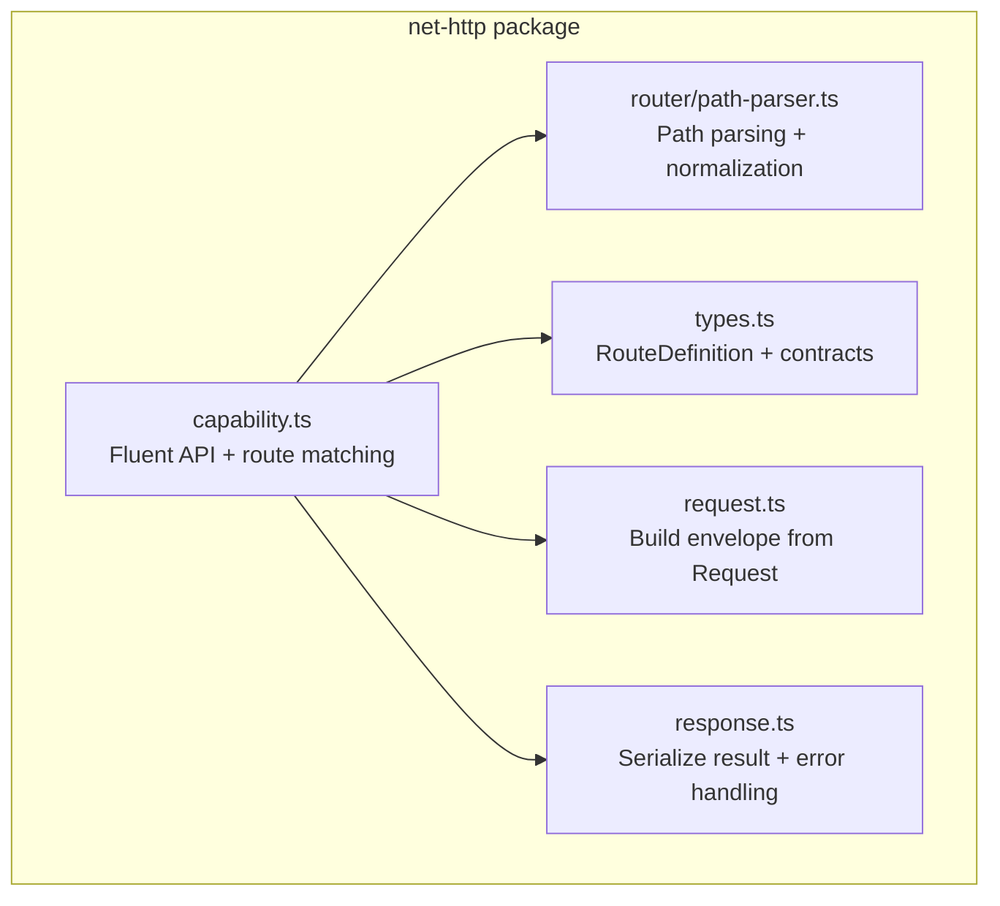
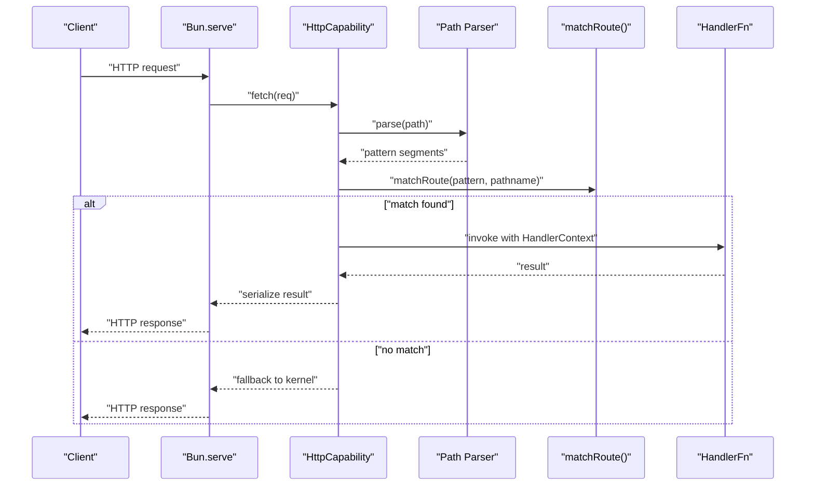
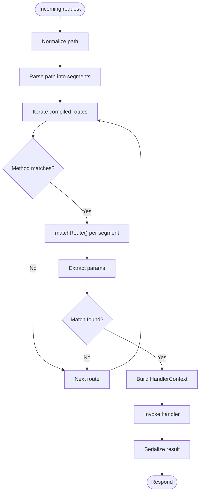
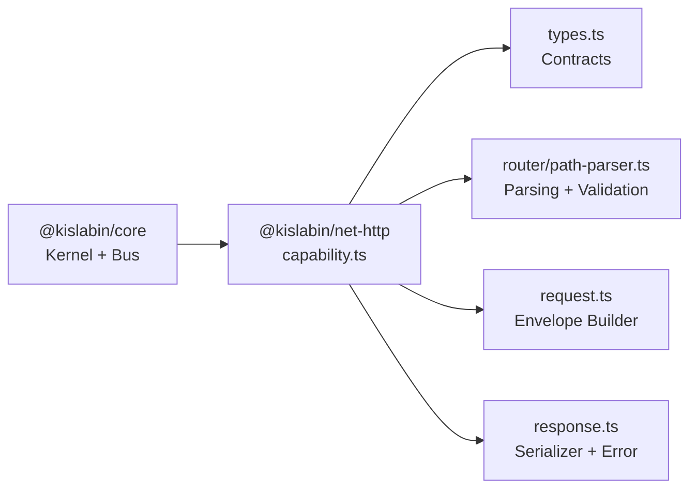

# Route Definition

<cite>
**Referenced Files in This Document**
- [capability.ts](file://packages/net-http/src/capability.ts)
- [path-parser.ts](file://packages/net-http/src/router/path-parser.ts)
- [types.ts](file://packages/net-http/src/types.ts)
- [index.ts](file://packages/net-http/src/index.ts)
- [request.ts](file://packages/net-http/src/request.ts)
- [response.ts](file://packages/net-http/src/response.ts)
- [README.md](file://README.md)
- [package.json](file://packages/net-http/package.json)
</cite>

## Table of Contents
1. [Introduction](#introduction)
2. [Project Structure](#project-structure)
3. [Core Components](#core-components)
4. [Architecture Overview](#architecture-overview)
5. [Detailed Component Analysis](#detailed-component-analysis)
6. [Dependency Analysis](#dependency-analysis)
7. [Performance Considerations](#performance-considerations)
8. [Troubleshooting Guide](#troubleshooting-guide)
9. [Conclusion](#conclusion)
10. [Appendices](#appendices)

## Introduction
This document explains the route definition system in the HTTP capability. It covers how to define routes using a fluent API with path patterns, HTTP methods, and handler functions. It documents supported path syntax (static paths, parameters, optional segments, wildcards), the RouteDefinition interface, and the route compilation and matching pipeline. Practical examples are provided via file references, and best practices for organizing and naming routes are included.

## Project Structure
The HTTP capability is implemented under the net-http package. The most relevant files for route definition and matching are:
- Route registration and matching: [capability.ts](file://packages/net-http/src/capability.ts)
- Path parsing and normalization: [path-parser.ts](file://packages/net-http/src/router/path-parser.ts)
- Type contracts and interfaces: [types.ts](file://packages/net-http/src/types.ts)
- Request envelope building: [request.ts](file://packages/net-http/src/request.ts)
- Response serialization and error handling: [response.ts](file://packages/net-http/src/response.ts)
- Package metadata: [package.json](file://packages/net-http/package.json)

**Diagram sources**
- [capability.ts](file://packages/net-http/src/capability.ts)
- [path-parser.ts](file://packages/net-http/src/router/path-parser.ts)
- [types.ts](file://packages/net-http/src/types.ts)
- [request.ts](file://packages/net-http/src/request.ts)
- [response.ts](file://packages/net-http/src/response.ts)

**Section sources**
- [capability.ts](file://packages/net-http/src/capability.ts)
- [path-parser.ts](file://packages/net-http/src/router/path-parser.ts)
- [types.ts](file://packages/net-http/src/types.ts)
- [request.ts](file://packages/net-http/src/request.ts)
- [response.ts](file://packages/net-http/src/response.ts)
- [package.json](file://packages/net-http/package.json)

## Core Components
- Fluent API surface: The HTTP capability exposes route(), routes(), and router() methods to register routes and groups.
- RouteDefinition contract: Defines path, handlers, optional beforeLoad guards, search parser, and loader.
- Path parsing: Converts path patterns into typed segments (static, param, optional, wildcard).
- Route compilation: During init(), each RouteDefinition is parsed and expanded into CompiledRoute entries per HTTP method.
- Matching: On incoming requests, compiled patterns are matched against the URL path; extracted params populate the handler context.

Key implementation references:
- Fluent API and router grouping: [capability.ts](file://packages/net-http/src/capability.ts)
- RouteDefinition interface and related types: [types.ts](file://packages/net-http/src/types.ts)
- Path parsing and normalization: [path-parser.ts](file://packages/net-http/src/router/path-parser.ts)
- Request envelope and response handling: [request.ts](file://packages/net-http/src/request.ts), [response.ts](file://packages/net-http/src/response.ts)

**Section sources**
- [capability.ts](file://packages/net-http/src/capability.ts)
- [types.ts](file://packages/net-http/src/types.ts)
- [path-parser.ts](file://packages/net-http/src/router/path-parser.ts)
- [request.ts](file://packages/net-http/src/request.ts)
- [response.ts](file://packages/net-http/src/response.ts)

## Architecture Overview
The HTTP capability integrates with the kernel’s message bus. Requests are transformed into envelopes and either handled by declared routes or fall back to kernel handlers.

**Diagram sources**
- [capability.ts](file://packages/net-http/src/capability.ts)
- [path-parser.ts](file://packages/net-http/src/router/path-parser.ts)

## Detailed Component Analysis

### RouteDefinition Interface
RouteDefinition describes a single route with:
- path: A path pattern supporting static segments, parameters (:param), optional segments (:param?), and wildcard (/*).
- beforeLoad: Optional guards executed before handlers.
- handlers: A map of HTTP method to handler function or object with method-specific beforeLoad.
- search: Optional parser for query parameters.
- loader: Optional data-fetching function invoked before handlers.

Supported path syntax:
- Static: /users
- Parameter: /users/:id
- Optional: /categories/:category?, /items/:itemId?
- Wildcard: /files/*

Validation rules enforced during path parsing:
- Wildcard must be the last segment.
- Parameter names must be valid identifiers.
- No duplicate parameter names.
- No empty segments after normalization.

References:
- RouteDefinition contract: [types.ts](file://packages/net-http/src/types.ts)
- Path parsing and validation: [path-parser.ts](file://packages/net-http/src/router/path-parser.ts)

**Section sources**
- [types.ts](file://packages/net-http/src/types.ts)
- [path-parser.ts](file://packages/net-http/src/router/path-parser.ts)

### Fluent API for Route Registration
The HTTP capability exposes:
- route(definition): Adds a single route definition.
- routes(definitions[]): Bulk route registration.
- router(group): Registers a group with shared prefix and beforeLoad guards.

Router groups cascade beforeLoad guards and concatenate prefixes to each route.

References:
- Fluent API and router grouping: [capability.ts](file://packages/net-http/src/capability.ts)

**Section sources**
- [capability.ts](file://packages/net-http/src/capability.ts)

### Route Compilation and Matching Pipeline
During capability initialization:
- Each RouteDefinition is parsed into PathSegment[].
- For each HTTP method present in handlers, a CompiledRoute entry is created.

On each request:
- The HTTP method is matched.
- matchRoute() iterates over compiled entries and segments:
  - Static segments require exact string equality.
  - Parameters capture non-empty segments.
  - Optional segments capture when present.
  - Wildcard captures the remainder of the path.
- Extracted params are passed to the handler via HandlerContext.

References:
- Compilation and matching: [capability.ts](file://packages/net-http/src/capability.ts)
- Pattern matching algorithm: [capability.ts](file://packages/net-http/src/capability.ts)
- Path segment classification: [path-parser.ts](file://packages/net-http/src/router/path-parser.ts)

**Diagram sources**
- [capability.ts](file://packages/net-http/src/capability.ts)
- [path-parser.ts](file://packages/net-http/src/router/path-parser.ts)

**Section sources**
- [capability.ts](file://packages/net-http/src/capability.ts)
- [path-parser.ts](file://packages/net-http/src/router/path-parser.ts)

### Practical Examples
Below are example references demonstrating route definitions and usage patterns. Replace the code snippets with the linked file locations to review the exact implementations.

- Basic parameterized route:
  - Example reference: [index.ts](file://examples/00-http-hello/src/index.ts)
- Declaring multiple handlers per route:
  - Contract reference: [types.ts](file://packages/net-http/src/types.ts)
- Using router groups with shared prefix and guards:
  - API reference: [capability.ts](file://packages/net-http/src/capability.ts)
- Path normalization and validation:
  - Reference: [path-parser.ts](file://packages/net-http/src/router/path-parser.ts)

**Section sources**
- [index.ts](file://examples/00-http-hello/src/index.ts)
- [types.ts](file://packages/net-http/src/types.ts)
- [capability.ts](file://packages/net-http/src/capability.ts)
- [path-parser.ts](file://packages/net-http/src/router/path-parser.ts)

### Best Practices for Route Organization and Naming
- Keep path patterns explicit and hierarchical to improve readability and maintainability.
- Prefer descriptive parameter names that clearly indicate intent (e.g., :userId over :id).
- Use optional segments sparingly; prefer separate routes when semantics differ.
- Place wildcard segments at the end of patterns to avoid ambiguity.
- Group related routes using router() with a shared prefix and common beforeLoad guards.
- Centralize handler logic and keep routes thin; delegate heavy work to domain services.
- Validate and transform query parameters using the search parser for predictable handler inputs.

[No sources needed since this section provides general guidance]

## Dependency Analysis
The HTTP capability depends on core types and integrates with Bun.serve. The route system relies on the path parser for correctness and performance.

**Diagram sources**
- [capability.ts](file://packages/net-http/src/capability.ts)
- [types.ts](file://packages/net-http/src/types.ts)
- [path-parser.ts](file://packages/net-http/src/router/path-parser.ts)
- [request.ts](file://packages/net-http/src/request.ts)
- [response.ts](file://packages/net-http/src/response.ts)
- [package.json](file://packages/net-http/package.json)

**Section sources**
- [capability.ts](file://packages/net-http/src/capability.ts)
- [types.ts](file://packages/net-http/src/types.ts)
- [path-parser.ts](file://packages/net-http/src/router/path-parser.ts)
- [request.ts](file://packages/net-http/src/request.ts)
- [response.ts](file://packages/net-http/src/response.ts)
- [package.json](file://packages/net-http/package.json)

## Performance Considerations
- Route compilation happens once at init(), minimizing runtime overhead.
- matchRoute() performs a linear scan over compiled entries; order routes by specificity and frequency to reduce average comparisons.
- Wildcards capture the rest of the path; use them judiciously to avoid ambiguous matches.
- Keep handler functions lightweight; offload heavy work to services or loaders.

[No sources needed since this section provides general guidance]

## Troubleshooting Guide
Common issues and resolutions:
- Not Found responses:
  - Ensure the HTTP method matches a registered handler.
  - Verify path normalization and segment alignment.
- Parameter extraction failures:
  - Confirm parameter names are valid identifiers and not duplicated.
  - Check that wildcard is the last segment if used.
- Unexpected query parameter behavior:
  - Implement a search parser to validate and transform query parameters.
- Error handling:
  - Provide a global error handler to customize responses.
  - Inspect logs for handler errors and fallback behavior.

References:
- Error handling and response serialization: [response.ts](file://packages/net-http/src/response.ts)
- Request envelope building: [request.ts](file://packages/net-http/src/request.ts)
- Route matching and context: [capability.ts](file://packages/net-http/src/capability.ts)

**Section sources**
- [response.ts](file://packages/net-http/src/response.ts)
- [request.ts](file://packages/net-http/src/request.ts)
- [capability.ts](file://packages/net-http/src/capability.ts)

## Conclusion
The HTTP capability offers a concise, fluent route definition system built on a clear contract and efficient matching pipeline. By leveraging path parsing, normalization, and a typed handler context, it enables expressive routing with parameters, optionals, and wildcards while remaining easy to organize and maintain.

[No sources needed since this section summarizes without analyzing specific files]

## Appendices

### Appendix A: RouteDefinition Field Reference
- path: Path pattern string supporting static, param (:param), optional (:param?), wildcard (/*).
- beforeLoad: Array of guards executed before handlers.
- handlers: Map of HTTP methods to handler functions or objects with method-specific beforeLoad.
- search: Optional parser for query parameters.
- loader: Optional data-fetching function invoked before handlers.

References:
- [types.ts](file://packages/net-http/src/types.ts)

**Section sources**
- [types.ts](file://packages/net-http/src/types.ts)

### Appendix B: Path Pattern Syntax Quick Reference
- Static: /users
- Parameter: /users/:id
- Optional: /categories/:category?
- Wildcard: /files/*

Normalization rules:
- Leading/trailing slashes are normalized consistently.
- Empty segments are removed.
- Root path remains "/".

References:
- [path-parser.ts](file://packages/net-http/src/router/path-parser.ts)

**Section sources**
- [path-parser.ts](file://packages/net-http/src/router/path-parser.ts)