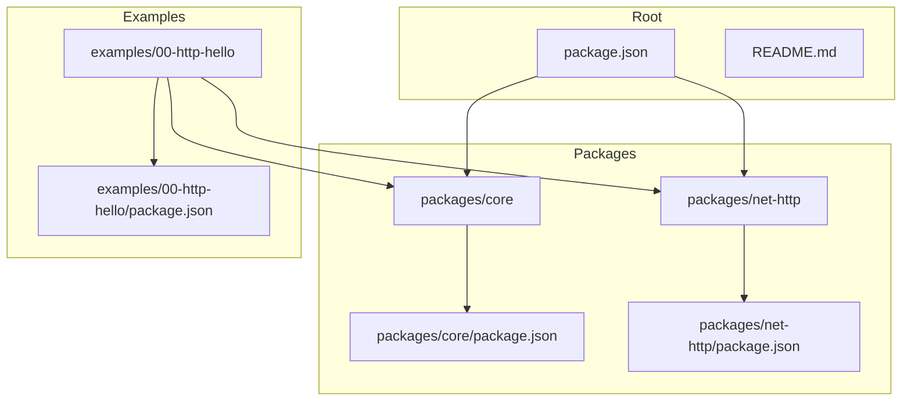
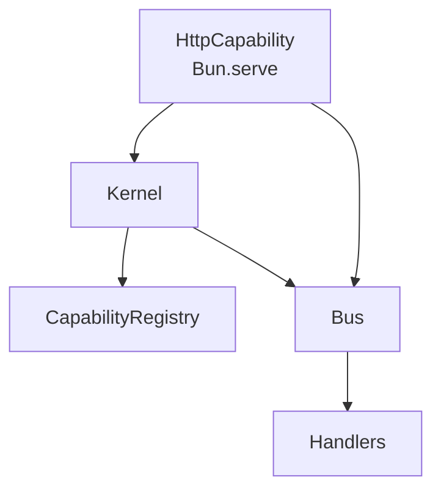
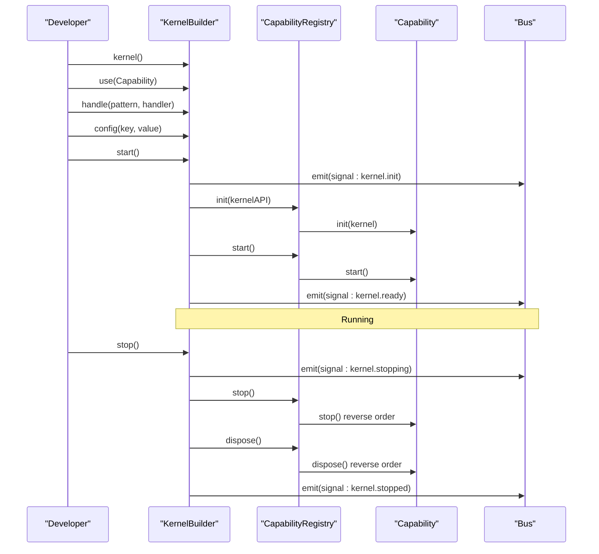
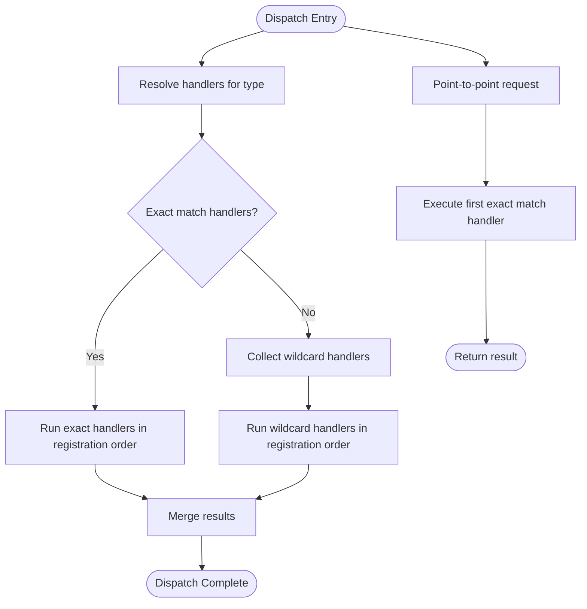
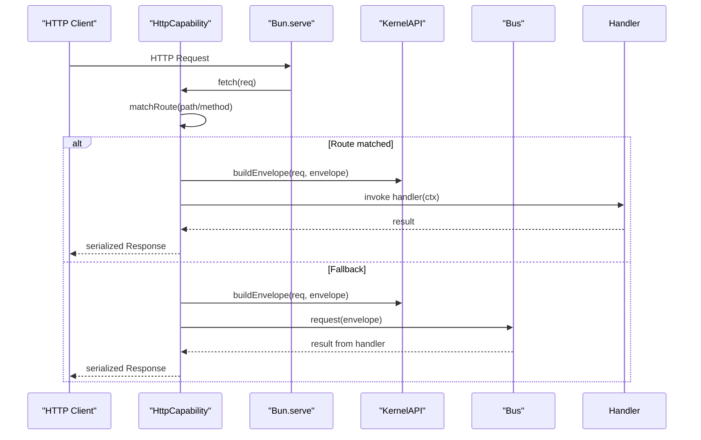
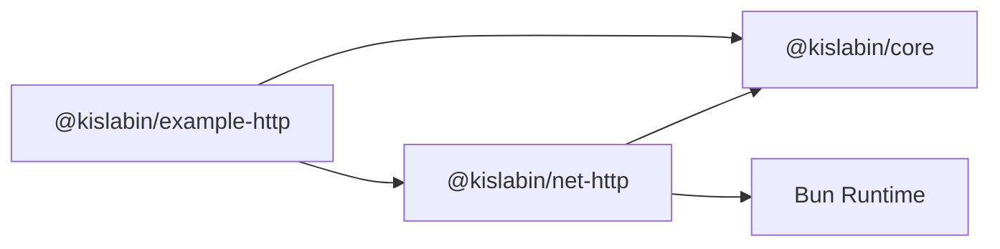

# Migration & Comparison

<cite>
**Referenced Files in This Document**
- [README.md](file://README.md)
- [package.json](file://package.json)
- [packages/core/README.md](file://packages/core/README.md)
- [packages/core/src/kernel.ts](file://packages/core/src/kernel.ts)
- [packages/core/src/capability.ts](file://packages/core/src/capability.ts)
- [packages/core/src/bus.ts](file://packages/core/src/bus.ts)
- [packages/core/src/context.ts](file://packages/core/src/context.ts)
- [packages/core/src/message.ts](file://packages/core/src/message.ts)
- [packages/net-http/src/capability.ts](file://packages/net-http/src/capability.ts)
- [packages/net-http/src/types.ts](file://packages/net-http/src/types.ts)
- [examples/00-http-hello/src/index.ts](file://examples/00-http-hello/src/index.ts)
- [examples/00-http-hello/package.json](file://examples/00-http-hello/package.json)
</cite>

## Table of Contents
1. [Introduction](#introduction)
2. [Project Structure](#project-structure)
3. [Core Components](#core-components)
4. [Architecture Overview](#architecture-overview)
5. [Detailed Component Analysis](#detailed-component-analysis)
6. [Dependency Analysis](#dependency-analysis)
7. [Performance Considerations](#performance-considerations)
8. [Migration Guides](#migration-guides)
9. [Comparison Matrix](#comparison-matrix)
10. [Decision Matrix](#decision-matrix)
11. [Troubleshooting Guide](#troubleshooting-guide)
12. [Conclusion](#conclusion)

## Introduction
This document provides comprehensive migration and comparison guidance for adopting the kislabin framework. It compares kislabin with popular backend frameworks (NestJS, Fastify, Moleculer), highlights architectural differences, and offers practical migration patterns for existing applications. It also documents kislabin’s advantages (small core, explicit lifecycle, optional dependency injection, portability) and provides decision matrices to help teams select the right framework for their needs.

Kislabin is a minimal kernel that treats everything as messages, supports isolated capabilities communicating via a message bus, and exposes a strict lifecycle. Its HTTP capability integrates with Bun.serve and follows the same message-first design.

**Section sources**
- [README.md:1-264](file://README.md#L1-L264)

## Project Structure
The repository is organized as a monorepo with:
- Core kernel and primitives under packages/core
- HTTP capability under packages/net-http
- Example applications under examples
- Root package configuration and documentation

**Diagram sources**
- [package.json:1-29](file://package.json#L1-L29)
- [packages/core/package.json:1-29](file://packages/core/package.json#L1-L29)
- [packages/net-http/package.json:1-25](file://packages/net-http/package.json#L1-L25)
- [examples/00-http-hello/package.json:1-27](file://examples/00-http-hello/package.json#L1-L27)

**Section sources**
- [README.md:98-142](file://README.md#L98-L142)
- [package.json:24-28](file://package.json#L24-L28)

## Core Components
Kislabin’s core consists of:
- Kernel: orchestrates lifecycle, capability registry, and emits lifecycle signals
- Capability: isolated subsystem with init/start/stop/dispose lifecycle
- Bus: message dispatcher supporting exact match and wildcard patterns
- Context: lightweight execution context for handlers
- Message primitives: Envelope, kinds (command/event/query/signal), and typed handlers

Key characteristics:
- Minimal core (~300 lines of kernel)
- Everything is a message (HTTP, queues, events, cron)
- Optional dependency injection (DI is a capability)
- Explicit lifecycle with ordered startup/shutdown
- Zero external dependencies (only TypeScript built-ins and Bun runtime)

**Section sources**
- [packages/core/src/kernel.ts:1-354](file://packages/core/src/kernel.ts#L1-L354)
- [packages/core/src/capability.ts:1-241](file://packages/core/src/capability.ts#L1-L241)
- [packages/core/src/bus.ts:1-214](file://packages/core/src/bus.ts#L1-L214)
- [packages/core/src/context.ts:1-167](file://packages/core/src/context.ts#L1-L167)
- [packages/core/src/message.ts:1-164](file://packages/core/src/message.ts#L1-L164)
- [packages/core/README.md:58-96](file://packages/core/README.md#L58-L96)

## Architecture Overview
Kislabin’s runtime model:
- Kernel manages capabilities and lifecycle
- Capabilities register handlers and produce/consume messages
- HTTP capability translates HTTP requests into envelopes and routes them via the bus
- Handlers receive envelopes and optional context; can share state via context bags

**Diagram sources**
- [packages/core/src/kernel.ts:265-354](file://packages/core/src/kernel.ts#L265-L354)
- [packages/core/src/capability.ts:115-241](file://packages/core/src/capability.ts#L115-L241)
- [packages/core/src/bus.ts:34-206](file://packages/core/src/bus.ts#L34-L206)
- [packages/net-http/src/capability.ts:102-179](file://packages/net-http/src/capability.ts#L102-L179)

## Detailed Component Analysis

### Kernel and Lifecycle
The kernel exposes a fluent builder to configure capabilities, handlers, and configuration, then starts the system. It emits lifecycle signals and coordinates graceful shutdown.

**Diagram sources**
- [packages/core/src/kernel.ts:314-350](file://packages/core/src/kernel.ts#L314-L350)
- [packages/core/src/capability.ts:194-240](file://packages/core/src/capability.ts#L194-L240)
- [packages/core/src/bus.ts:91-107](file://packages/core/src/bus.ts#L91-L107)

**Section sources**
- [packages/core/src/kernel.ts:136-245](file://packages/core/src/kernel.ts#L136-L245)
- [packages/core/src/capability.ts:101-114](file://packages/core/src/capability.ts#L101-L114)

### Message Bus and Patterns
The bus supports:
- Broadcast emit/emitAsync with exact match and wildcard patterns
- Point-to-point request returning the first handler’s result
- Subscription management with unsubscribe

**Diagram sources**
- [packages/core/src/bus.ts:183-205](file://packages/core/src/bus.ts#L183-L205)
- [packages/core/src/bus.ts:159-170](file://packages/core/src/bus.ts#L159-L170)

**Section sources**
- [packages/core/src/bus.ts:34-206](file://packages/core/src/bus.ts#L34-L206)
- [packages/core/src/message.ts:115-163](file://packages/core/src/message.ts#L115-L163)

### HTTP Capability Integration
The HTTP capability integrates with Bun.serve, compiles routes during init, and translates HTTP requests into envelopes. It supports declarative routes, beforeLoad guards, loaders, and a router group abstraction.

**Diagram sources**
- [packages/net-http/src/capability.ts:120-164](file://packages/net-http/src/capability.ts#L120-L164)
- [packages/net-http/src/capability.ts:38-72](file://packages/net-http/src/capability.ts#L38-L72)

**Section sources**
- [packages/net-http/src/capability.ts:74-223](file://packages/net-http/src/capability.ts#L74-L223)
- [packages/net-http/src/types.ts:28-112](file://packages/net-http/src/types.ts#L28-L112)

### Example: Minimal HTTP Application
A minimal HTTP example demonstrates registering a route and starting the kernel with the HTTP capability.

**Section sources**
- [examples/00-http-hello/src/index.ts:1-12](file://examples/00-http-hello/src/index.ts#L1-L12)
- [examples/00-http-hello/package.json:15-17](file://examples/00-http-hello/package.json#L15-L17)

## Dependency Analysis
Kislabin’s module dependencies:
- Core depends on message, context, bus, and capability primitives
- HTTP capability depends on core and Bun runtime APIs
- Examples depend on core and net-http

**Diagram sources**
- [packages/net-http/package.json:16-18](file://packages/net-http/package.json#L16-L18)
- [examples/00-http-hello/package.json:15-17](file://examples/00-http-hello/package.json#L15-L17)

**Section sources**
- [packages/core/src/kernel.ts:21-32](file://packages/core/src/kernel.ts#L21-L32)
- [packages/net-http/src/capability.ts:8](file://packages/net-http/src/capability.ts#L8)

## Performance Considerations
- Exact match dispatch is O(1); wildcard dispatch is O(n) where n is the number of wildcard patterns
- Context creation and handler invocation have minimal overhead
- Serial lifecycle avoids concurrency overhead but ensures predictable ordering

**Section sources**
- [packages/core/README.md:410-421](file://packages/core/README.md#L410-L421)

## Migration Guides

### From NestJS to Kislabin
NestJS strengths:
- Built-in HTTP routing, DI container, interceptors, guards, pipes
- Rich ecosystem and strong typing

Kislabin advantages:
- Minimal core, explicit lifecycle, optional DI
- Everything is a message; HTTP is a capability
- Portability across languages

Migration patterns:
- Replace Nest controllers with message handlers registered via kernel.handle or HTTP route handlers
- Move Nest providers to capabilities; initialize dependencies in capability.init and register handlers
- Replace Nest guards/interceptors with beforeLoad handlers in HTTP routes or global handlers via kernel.handle
- Replace Nest pipes/validation with search parsers and loaders in HTTP routes
- Replace Nest exception filters with onError handlers in HTTP capability configuration
- Replace Nest modules with capability composition; use dependencies array to enforce startup order

Architectural adjustments:
- Decompose Nest modules into independent capabilities
- Use kernel.api.request for service-to-service communication
- Use kernel.api.on for pub/sub-style event handling
- Use lifecycle signals for health checks and observability

Common pitfalls:
- Avoid coupling HTTP logic to business logic; move business logic into message handlers
- Ensure all dependencies are declared in capability.dependencies
- Use envelope kinds appropriately (command/event/query/signal)

**Section sources**
- [README.md:191-199](file://README.md#L191-L199)
- [packages/core/src/capability.ts:70-99](file://packages/core/src/capability.ts#L70-L99)
- [packages/net-http/src/types.ts:85-112](file://packages/net-http/src/types.ts#L85-L112)

### From Fastify to Kislabin
Fastify strengths:
- Plugin system, encapsulation, performance, minimal learning curve
- Strong ecosystem for plugins

Kislabin advantages:
- Strict lifecycle, explicit messaging, optional DI
- Portability across languages
- Zero external dependencies

Migration patterns:
- Replace Fastify routes with HTTP capability route definitions
- Replace Fastify hooks with beforeLoad handlers or global handlers via kernel.handle
- Replace Fastify plugins with capabilities; register via kernel.use
- Replace Fastify decorators with context bags (ctx.get/ctx.set)
- Replace Fastify serializers with serialization helpers in HTTP responses

Architectural adjustments:
- Convert Fastify plugins into capabilities with init/start/stop/dispose
- Use capability dependencies to manage plugin order
- Use kernel.api.request for internal RPC-like calls
- Use kernel.api.on for cross-plugin communication

Common pitfalls:
- Avoid Fastify-specific decorators inside handlers; use context bags instead
- Ensure graceful shutdown by implementing capability.stop/dispose

**Section sources**
- [README.md:191-199](file://README.md#L191-L199)
- [packages/net-http/src/capability.ts:182-222](file://packages/net-http/src/capability.ts#L182-L222)
- [packages/core/src/context.ts:44-90](file://packages/core/src/context.ts#L44-L90)

### From Moleculer to Kislabin
Moleculer strengths:
- Built-in service broker, actions, events, caching
- Microservices-friendly

Kislabin advantages:
- Minimal core, explicit lifecycle, optional DI
- Everything is a message; HTTP is a capability
- Portability across languages

Migration patterns:
- Replace Moleculer actions with message handlers
- Replace Moleculer events with bus.on registrations
- Replace Moleculer services with capabilities
- Replace Moleculer transporter with kernel bus
- Replace Moleculer middlewares with beforeLoad handlers

Architectural adjustments:
- Decompose Moleculer services into capabilities
- Use capability.dependencies to define service topology
- Use kernel.api.request for action-like calls
- Use kernel.api.on for event-like pub/sub

Common pitfalls:
- Ensure all service dependencies are declared
- Use lifecycle signals for health monitoring

**Section sources**
- [README.md:191-199](file://README.md#L191-L199)
- [packages/core/src/bus.ts:65-78](file://packages/core/src/bus.ts#L65-L78)

### General Migration Checklist
- Identify all HTTP routes and convert to HTTP capability routes
- Extract business logic into message handlers
- Convert middleware/guards to beforeLoad handlers
- Replace DI containers with capability.init initialization
- Replace serializers with response serialization helpers
- Add capability dependencies to enforce startup order
- Register global handlers for cross-cutting concerns
- Implement graceful shutdown via capability.stop/dispose
- Use lifecycle signals for observability

## Comparison Matrix
| Feature | NestJS | Fastify | Moleculer | @kislabin |
|---|---|---|---|---|
| Core Size | ~30k LOC | ~10k LOC | ~30k LOC | ~300 LOC |
| Message-First | ❌ | ❌ | ✅ | ✅ |
| Lifecycle | Partial | Partial | ❌ | ✅ |
| DI | Required | Optional | ❌ | Optional |
| Portability | ❌ | ❌ | ❌ | ✅ |

**Section sources**
- [README.md:191-199](file://README.md#L191-L199)

## Decision Matrix
Use @kislabin when:
- You want a minimal, portable kernel with explicit lifecycle
- You prefer message-first architecture and capability-based modularity
- You need optional DI and zero external dependencies
- You plan to port to Go or Rust later

Consider NestJS/Fastify/Moleculer when:
- You need a full-featured framework with rich ecosystems
- You require built-in DI, guards, interceptors, or service discovery
- You prefer familiar patterns and extensive documentation/community

## Troubleshooting Guide
Common issues and resolutions:
- Missing capability dependency: ensure capability.dependencies lists all required capabilities
- Circular dependency detected: review capability dependencies and remove cycles
- No handler registered for envelope type: register a handler via kernel.handle or HTTP route
- Configuration errors: use kernel.config with fallbacks or fail-fast mode
- Graceful shutdown not working: implement capability.stop/dispose and rely on kernel.stop

Operational tips:
- Subscribe to lifecycle signals for observability
- Use context bags for shared state across handlers
- Prefer exact match for performance-critical handlers

**Section sources**
- [packages/core/src/capability.ts:163-192](file://packages/core/src/capability.ts#L163-L192)
- [packages/core/src/bus.ts:209-214](file://packages/core/src/bus.ts#L209-L214)
- [packages/core/src/kernel.ts:335-348](file://packages/core/src/kernel.ts#L335-L348)

## Conclusion
Kislabin offers a minimalist, message-driven runtime with explicit lifecycle and optional DI. It is ideal for teams seeking portability, modularity, and a clear separation between HTTP and business logic. While NestJS, Fastify, and Moleculer provide richer ecosystems and features, kislabin’s small core and capability model make it a compelling choice for projects prioritizing simplicity, portability, and maintainability.